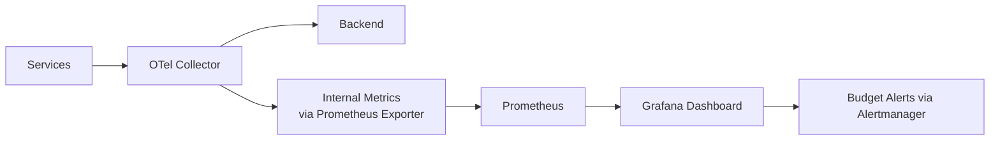

# How to Set Up Telemetry Budget Dashboards That Track Spend per Service and Team

Author: [nawazdhandala](https://www.github.com/nawazdhandala)

Tags: OpenTelemetry, Dashboards, Budget Tracking, Observability Cost

Description: Build Grafana dashboards that visualize telemetry spend per service and team using OpenTelemetry Collector metrics.

Budget visibility is the prerequisite for cost control. If teams cannot see how much telemetry they are producing - and what it costs - they have no basis for optimization decisions. A telemetry budget dashboard translates raw pipeline metrics into dollar amounts, broken down by service and team, with alerts when spending exceeds thresholds.

## Architecture Overview

The dashboard pulls data from internal metrics generated by the OpenTelemetry Collector itself. The Collector already tracks how many spans, log records, and metric data points flow through each pipeline. By enriching these metrics with resource attributes (service name, team) and applying unit costs, you get a real-time cost view.



## Step 1: Enable Collector Internal Metrics

The Collector exposes internal telemetry about its own operations. Enable the Prometheus exporter for these metrics:

```yaml
# Collector config that exposes internal metrics and per-pipeline
# throughput data via a Prometheus endpoint.
receivers:
  otlp:
    protocols:
      grpc:
        endpoint: 0.0.0.0:4317

processors:
  # Group by service and team so internal metrics carry
  # these dimensions for dashboard breakdowns.
  groupbyattrs:
    keys:
      - service.name
      - team.name

  batch:
    send_batch_size: 8192
    timeout: 5s

connectors:
  # Count connector generates per-attribute signal counts
  count:
    spans:
      telemetry.budget.spans:
        description: "Span count by service and team"
        attributes:
          - key: service.name
          - key: team.name
            default_value: unattributed
    logs:
      telemetry.budget.logs:
        description: "Log record count by service and team"
        attributes:
          - key: service.name
          - key: team.name
            default_value: unattributed
    metrics:
      telemetry.budget.datapoints:
        description: "Metric data points by service and team"
        attributes:
          - key: service.name
          - key: team.name
            default_value: unattributed

exporters:
  otlphttp/backend:
    endpoint: https://backend.internal:4318

  prometheus/budget:
    endpoint: 0.0.0.0:8889
    resource_to_telemetry_conversion:
      enabled: true

service:
  # Enable internal telemetry at the detailed level
  telemetry:
    metrics:
      level: detailed
      address: 0.0.0.0:8888

  pipelines:
    traces:
      receivers: [otlp]
      processors: [groupbyattrs, batch]
      exporters: [otlphttp/backend, count]
    logs:
      receivers: [otlp]
      processors: [groupbyattrs, batch]
      exporters: [otlphttp/backend, count]
    metrics/ingest:
      receivers: [otlp]
      processors: [groupbyattrs, batch]
      exporters: [otlphttp/backend, count]
    metrics/budget:
      receivers: [count]
      processors: [batch]
      exporters: [prometheus/budget]
```

## Step 2: Define Unit Cost Constants

Store your unit costs as Prometheus recording rules so dashboard queries stay clean:

```yaml
# Prometheus recording rules that define unit costs and
# calculate dollar amounts from raw signal counts.
groups:
  - name: telemetry_budget
    interval: 60s
    rules:
      # Unit cost constants (adjust to match your vendor pricing)
      # These are expressed as cost per signal per month.

      # Monthly span cost per team
      - record: telemetry:monthly_span_cost:by_team
        expr: |
          (
            sum by (team_name) (
              rate(telemetry_budget_spans_total[5m])
            ) * 60 * 60 * 24 * 30  # monthly volume
            / 1e9                    # convert to billions
            * 2.00                   # $2.00 per billion spans
          )

      # Monthly log cost per team
      - record: telemetry:monthly_log_cost:by_team
        expr: |
          (
            sum by (team_name) (
              rate(telemetry_budget_logs_total[5m])
            ) * 60 * 60 * 24 * 30
            / 1e9
            * 0.60                   # $0.60 per billion log records
          )

      # Total monthly cost per team
      - record: telemetry:monthly_total_cost:by_team
        expr: |
          telemetry:monthly_span_cost:by_team
          + telemetry:monthly_log_cost:by_team

      # Monthly cost per service
      - record: telemetry:monthly_total_cost:by_service
        expr: |
          (
            sum by (service_name) (
              rate(telemetry_budget_spans_total[5m])
            ) * 60 * 60 * 24 * 30 / 1e9 * 2.00
          )
          +
          (
            sum by (service_name) (
              rate(telemetry_budget_logs_total[5m])
            ) * 60 * 60 * 24 * 30 / 1e9 * 0.60
          )
```

## Step 3: Build the Grafana Dashboard

Create a dashboard with four key panels. Here is the JSON model for a team cost breakdown panel:

```json
{
  "title": "Monthly Telemetry Cost by Team",
  "type": "barchart",
  "datasource": "prometheus",
  "targets": [
    {
      "expr": "sort_desc(telemetry:monthly_total_cost:by_team)",
      "legendFormat": "{{team_name}}"
    }
  ],
  "fieldConfig": {
    "defaults": {
      "unit": "currencyUSD",
      "thresholds": {
        "steps": [
          { "value": 0, "color": "green" },
          { "value": 500, "color": "yellow" },
          { "value": 1000, "color": "red" }
        ]
      }
    }
  }
}
```

The four panels every budget dashboard needs:

1. **Total monthly projected cost** - single stat showing the organization-wide estimate
2. **Cost by team** - bar chart ranking teams by spend
3. **Cost by service** - table view with service name, team owner, signal type breakdown, and total
4. **Cost trend over time** - time series showing whether spending is increasing or decreasing week over week

## Step 4: Set Budget Alerts

Create Alertmanager rules that fire when a team exceeds its monthly budget:

```yaml
# Alert rules that fire when teams exceed telemetry budgets.
groups:
  - name: telemetry_budget_alerts
    rules:
      - alert: TelemetryBudgetExceeded
        expr: |
          telemetry:monthly_total_cost:by_team > 1000
        for: 30m
        labels:
          severity: warning
        annotations:
          summary: "Team {{ $labels.team_name }} projected to spend ${{ $value | humanize }} this month"
          description: "Telemetry budget threshold of $1,000/month exceeded. Review sampling and log levels."

      - alert: TelemetryCostSpike
        expr: |
          (
            telemetry:monthly_total_cost:by_team
            / telemetry:monthly_total_cost:by_team offset 7d
          ) > 2.0
        for: 1h
        labels:
          severity: warning
        annotations:
          summary: "Team {{ $labels.team_name }} telemetry cost doubled week-over-week"
```

## Making It Actionable

A dashboard that shows numbers without context is just decoration. For each team row, include:

- **Budget allocation**: What the team is budgeted for
- **Current projection**: What they are on track to spend
- **Top 3 services by cost**: Where the money is going
- **Recommended actions**: Auto-generated suggestions like "Service X emits 80% DEBUG logs in production - enable log level filtering"

The teams that benefit most from budget dashboards are the ones that check them weekly and use the data to prioritize optimization work. Treat telemetry spending like cloud compute spending: visible, attributed, and subject to review.
