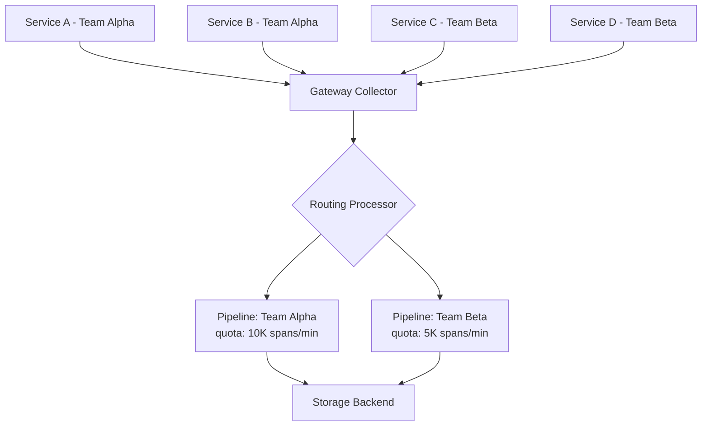

# How to Implement Telemetry Budgets and Quotas per Team Using OpenTelemetry Collector Routing

Author: [nawazdhandala](https://www.github.com/nawazdhandala)

Tags: OpenTelemetry, Collector, Cost Management, Platform Engineering

Description: Implement per-team telemetry budgets and quotas using OpenTelemetry Collector routing processors to control observability costs at scale.

Telemetry costs scale with data volume, and without guardrails, a single team can generate more spans in a day than the rest of the organization combined. This usually happens by accident - a retry loop that creates a span per attempt, a debug-level log statement left in production, or a batch job that traces every row in a million-row table.

The OpenTelemetry Collector sits in the right position to enforce per-team quotas. It receives all telemetry data before it reaches your backend, which makes it the natural control point for rate limiting, sampling adjustments, and routing based on team ownership.

## Architecture Overview

The approach uses a tiered Collector deployment where a gateway layer handles routing and quota enforcement before forwarding to backend-specific exporters.



## Defining Team Budgets

Start by defining budgets in a configuration file that your platform tooling manages. Each team gets a span-per-minute allocation based on their service tier and the number of services they operate.

```yaml
# telemetry-budgets.yaml
# Managed by the platform team, consumed by Collector config generation
teams:
  alpha:
    spans_per_minute: 10000
    logs_per_minute: 50000
    metrics_series_limit: 5000
    tier: critical
    overage_policy: sample  # sample, drop, or alert

  beta:
    spans_per_minute: 5000
    logs_per_minute: 20000
    metrics_series_limit: 2000
    tier: standard
    overage_policy: sample

  gamma:
    spans_per_minute: 2000
    logs_per_minute: 10000
    metrics_series_limit: 1000
    tier: experimental
    overage_policy: drop
```

## Collector Configuration with Routing

The gateway Collector uses the routing processor to split incoming telemetry into per-team pipelines. Each pipeline has its own sampling and rate-limiting processors configured according to that team's budget.

```yaml
# otel-collector-gateway.yaml
receivers:
  otlp:
    protocols:
      grpc:
        endpoint: 0.0.0.0:4317
      http:
        endpoint: 0.0.0.0:4318

processors:
  # Extract team name from resource attributes for routing
  routing:
    from_attribute: team.name
    table:
      - value: alpha
        pipelines: [traces/alpha, logs/alpha, metrics/alpha]
      - value: beta
        pipelines: [traces/beta, logs/beta, metrics/beta]
      - value: gamma
        pipelines: [traces/gamma, logs/gamma, metrics/gamma]
    default_pipelines: [traces/unassigned]

  # Team Alpha - critical tier, higher budget
  tail_sampling/alpha:
    decision_wait: 10s
    policies:
      - name: always-sample-errors
        type: status_code
        status_code: {status_codes: [ERROR]}
      - name: high-latency
        type: latency
        latency: {threshold_ms: 200}
      - name: rate-limit
        type: probabilistic
        probabilistic: {sampling_percentage: 50}

  # Team Beta - standard tier
  tail_sampling/beta:
    decision_wait: 10s
    policies:
      - name: always-sample-errors
        type: status_code
        status_code: {status_codes: [ERROR]}
      - name: high-latency
        type: latency
        latency: {threshold_ms: 500}
      - name: rate-limit
        type: probabilistic
        probabilistic: {sampling_percentage: 20}

  # Team Gamma - experimental tier, aggressive sampling
  tail_sampling/gamma:
    decision_wait: 5s
    policies:
      - name: errors-only-plus-sample
        type: status_code
        status_code: {status_codes: [ERROR]}
      - name: rate-limit
        type: probabilistic
        probabilistic: {sampling_percentage: 5}

exporters:
  otlphttp/backend:
    endpoint: https://telemetry-backend.internal:443

service:
  pipelines:
    traces/alpha:
      receivers: [otlp]
      processors: [tail_sampling/alpha]
      exporters: [otlphttp/backend]
    traces/beta:
      receivers: [otlp]
      processors: [tail_sampling/beta]
      exporters: [otlphttp/backend]
    traces/gamma:
      receivers: [otlp]
      processors: [tail_sampling/gamma]
      exporters: [otlphttp/backend]
    traces/unassigned:
      receivers: [otlp]
      processors: [tail_sampling/gamma]
      exporters: [otlphttp/backend]
```

## Tracking Usage Against Budgets

Expose Collector-level metrics that track how much each team is sending versus their allocation. The Collector's internal telemetry can be extended with custom metrics using the spanmetrics connector.

```yaml
# Add to the gateway collector config
connectors:
  spanmetrics:
    dimensions:
      - name: team.name
    histogram:
      explicit:
        buckets: [10ms, 50ms, 100ms, 500ms, 1s, 5s]

exporters:
  # Send usage metrics to your metrics backend
  prometheusremotewrite/usage:
    endpoint: https://metrics.internal/api/v1/write
    resource_to_telemetry_conversion:
      enabled: true
```

Then build a simple usage tracking service that compares actual volume to budgets:

```python
# quota_tracker/check_budgets.py
import requests

def check_team_usage(team_name: str, budget_spans_per_min: int) -> dict:
    """
    Query the metrics backend for a team's actual span rate
    and compare against their budget.
    """
    query = (
        f'sum(rate(spans_total{{team_name="{team_name}"}}[5m])) * 60'
    )
    result = requests.get(
        "https://metrics.internal/api/v1/query",
        params={"query": query},
    )
    actual_rate = float(result.json()["data"]["result"][0]["value"][1])

    usage_pct = (actual_rate / budget_spans_per_min) * 100

    return {
        "team": team_name,
        "budget_spans_per_min": budget_spans_per_min,
        "actual_spans_per_min": round(actual_rate),
        "usage_percent": round(usage_pct, 1),
        "over_budget": usage_pct > 100,
    }
```

## Alerting on Budget Overages

Set up alerts that fire when a team approaches or exceeds their quota. This gives teams time to investigate before their data gets sampled more aggressively.

```yaml
# alert-rules/telemetry-budgets.yaml
groups:
  - name: telemetry-budgets
    rules:
      - alert: TelemetryBudgetWarning
        expr: |
          (sum by (team_name) (rate(spans_total[5m])) * 60)
          /
          (team_telemetry_budget_spans_per_minute)
          > 0.8
        for: 10m
        labels:
          severity: warning
        annotations:
          summary: "Team {{ $labels.team_name }} is at {{ $value | humanizePercentage }} of span budget"

      - alert: TelemetryBudgetExceeded
        expr: |
          (sum by (team_name) (rate(spans_total[5m])) * 60)
          /
          (team_telemetry_budget_spans_per_minute)
          > 1.0
        for: 5m
        labels:
          severity: critical
        annotations:
          summary: "Team {{ $labels.team_name }} has exceeded their span budget - sampling will increase"
```

## Gradual Enforcement

Roll out quotas gradually. Start in audit mode where you track usage but do not enforce limits. This gives teams visibility into their consumption before any data gets dropped. After a few weeks of reporting, switch to enforcement. Teams that consistently exceed their budgets can request increases through the platform team, backed by a justification for why they need higher volume.

The key insight is that most teams do not intentionally generate excessive telemetry. They just never had visibility into how much they were producing. Showing a team that their service generates 500K spans per minute when their peers average 5K is usually enough to trigger a cleanup without any enforcement at all.
