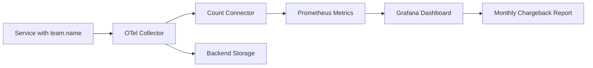

# How to Implement Telemetry Cost Allocation and Chargeback per Team with OpenTelemetry

Author: [nawazdhandala](https://www.github.com/nawazdhandala)

Tags: OpenTelemetry, Cost Allocation, Chargeback, FinOps

Description: Learn how to attribute observability costs to individual teams using OpenTelemetry resource attributes and Collector pipelines.

Observability costs tend to grow silently until someone on the finance team asks a pointed question: "Which team is responsible for 70% of our telemetry bill?" Without a cost allocation strategy, answering that question requires weeks of investigation. With OpenTelemetry, you can build chargeback into your pipeline from day one.

## Why Telemetry Chargeback Matters

Most organizations treat observability as a shared cost center. The problem is that a single service emitting verbose debug traces can consume more storage than an entire business unit's production telemetry. When teams have no visibility into their own telemetry spending, there is no incentive to optimize. Chargeback changes that dynamic by making costs visible and attributable.

## Step 1: Standardize Team Ownership via Resource Attributes

The foundation of cost allocation is consistent metadata. Every piece of telemetry - logs, metrics, and traces - needs a `team.name` resource attribute. The OpenTelemetry SDK lets you set this at initialization time.

Here is how to configure the resource attribute in a Python service:

```python
# Set team ownership as a resource attribute so every signal
# emitted by this service carries the team identifier.
from opentelemetry.sdk.resources import Resource
from opentelemetry.sdk.trace import TracerProvider

resource = Resource.create({
    "service.name": "checkout-api",
    "team.name": "payments",
    "team.cost-center": "CC-4401",
    "deployment.environment": "production"
})

provider = TracerProvider(resource=resource)
```

For Kubernetes-based deployments, you can inject these attributes via the OpenTelemetry Operator's `Instrumentation` CRD rather than modifying application code:

```yaml
# This Instrumentation resource automatically injects team metadata
# into all pods matching the namespace selector.
apiVersion: opentelemetry.io/v1alpha1
kind: Instrumentation
metadata:
  name: payments-team-instrumentation
  namespace: payments
spec:
  resource:
    addK8sUIDAttributes: true
    resourceAttributes:
      team.name: payments
      team.cost-center: CC-4401
  python:
    image: ghcr.io/open-telemetry/opentelemetry-operator/autoinstrumentation-python:latest
```

## Step 2: Route Telemetry Through a Metering Collector

Once every signal carries a team identifier, you need a Collector that meters data volume per team. The `routing` connector paired with a `count` connector can split traffic and measure bytes per team.

A more practical approach uses the `transform` processor to compute estimated sizes and export them as internal metrics:

```yaml
# Collector config that extracts team.name from resource attributes
# and records per-team data volume as a metric.
receivers:
  otlp:
    protocols:
      grpc:
        endpoint: 0.0.0.0:4317

processors:
  # Group telemetry by team to enable per-team routing
  groupbyattrs:
    keys:
      - team.name
      - team.cost-center

  # Add a batch processor per team pipeline for efficiency
  batch:
    send_batch_size: 8192
    timeout: 5s

exporters:
  # Primary backend for all telemetry
  otlphttp/backend:
    endpoint: https://otel-backend.internal:4318

  # Prometheus exporter that exposes per-team volume metrics
  prometheus:
    endpoint: 0.0.0.0:8889
    resource_to_telemetry_conversion:
      enabled: true

connectors:
  # The count connector generates metrics about the number of
  # spans, metrics, and log records flowing through the pipeline.
  count:
    spans:
      otel.chargeback.span.count:
        description: "Number of spans per team"
        conditions:
          - resource.attributes["team.name"] != nil
        attributes:
          - key: team.name
            default_value: unattributed
    logs:
      otel.chargeback.log.count:
        description: "Number of log records per team"
        attributes:
          - key: team.name
            default_value: unattributed

service:
  pipelines:
    traces/ingest:
      receivers: [otlp]
      processors: [groupbyattrs, batch]
      exporters: [otlphttp/backend, count]
    logs/ingest:
      receivers: [otlp]
      processors: [groupbyattrs, batch]
      exporters: [otlphttp/backend, count]
    metrics/chargeback:
      receivers: [count]
      exporters: [prometheus]
```

## Step 3: Build a Chargeback Report

The Prometheus metrics from the count connector give you raw signal counts per team. To convert those into dollar amounts, you need your vendor's per-unit pricing. Here is a simple PromQL query that estimates monthly cost per team assuming $0.30 per million spans:

```promql
# Calculate estimated monthly span cost per team.
# rate() gives per-second throughput, multiplied out to monthly volume.
(
  rate(otel_chargeback_span_count_total[1h])
  * 60 * 60 * 24 * 30  # extrapolate to monthly
  / 1e6                  # convert to millions
  * 0.30                 # cost per million spans
)
```

## The Chargeback Flow

Here is how the full pipeline looks from service to invoice:



## Handling Unattributed Telemetry

Not every signal will have a team attribute - especially during migration. Set a `default_value` of `unattributed` in the count connector (shown in the config above) so you can track how much telemetry lacks ownership. Create an alert when unattributed telemetry exceeds 10% of total volume, and assign an engineer to close those gaps.

## Practical Considerations

- **Granularity**: Start with team-level attribution. Service-level and endpoint-level breakdowns are useful but add complexity.
- **Attribution accuracy**: Resource attributes are more reliable than span attributes because they are set once per SDK initialization, not per request.
- **Shared services**: For infrastructure shared across teams (API gateways, message brokers), split costs proportionally based on request volume or use a flat overhead allocation.
- **Frequency**: Generate chargeback reports monthly. Weekly reports create noise without giving teams enough time to act on the data.

Teams that can see their own telemetry costs consistently find ways to reduce them - dropping unnecessary attributes, lowering sampling rates for health checks, or switching verbose logs from INFO to WARN. The chargeback model pays for itself within the first quarter.
