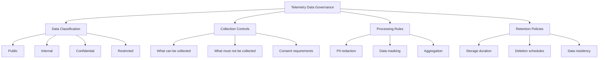

# How to Build a Telemetry Data Governance Framework with OpenTelemetry

Author: [nawazdhandala](https://www.github.com/nawazdhandala)

Tags: OpenTelemetry, Data Governance, Compliance, Privacy, PII, Security, Framework

Description: Learn how to build a comprehensive data governance framework for OpenTelemetry telemetry data covering PII protection, retention policies, and compliance requirements.

---

Telemetry data is not just technical diagnostics. It often contains user identifiers, request parameters, IP addresses, geographic locations, and sometimes sensitive business data. Without governance, this data flows freely through your observability pipeline and may end up violating privacy regulations like GDPR, HIPAA, or CCPA. A data governance framework defines the rules for what telemetry data can be collected, how it must be handled, where it can be stored, and when it must be deleted.

OpenTelemetry provides the tools to implement governance at every level of the telemetry pipeline: at the SDK level where data is generated, at the collector level where data is processed, and at the export level where data reaches its destination. This post covers how to design and implement a telemetry data governance framework.

## Governance Framework Components

A telemetry data governance framework has four pillars:



## Data Classification

Classify the types of data that appear in telemetry:

```yaml
# data-classification.yaml
# Classification of telemetry data types and their handling requirements.
classifications:
  public:
    description: "Data that can be freely shared"
    examples:
      - HTTP method (GET, POST)
      - HTTP status code
      - Service name
      - Span duration
    handling: "No restrictions"

  internal:
    description: "Data for internal use only"
    examples:
      - Internal service URLs
      - Database table names
      - Queue names
      - Error messages (without user data)
    handling: "Do not expose to external parties"

  confidential:
    description: "Data that requires protection"
    examples:
      - User IDs
      - Session IDs
      - IP addresses
      - Request paths with IDs
    handling: "Hash or pseudonymize before storage"

  restricted:
    description: "Data that must not appear in telemetry"
    examples:
      - Passwords
      - API keys and tokens
      - Credit card numbers
      - Social security numbers
      - Email addresses
      - Physical addresses
    handling: "Must be stripped before collection"
```

## SDK-Level Controls

The first line of defense is preventing sensitive data from entering the telemetry pipeline at all. Configure SDK-level filtering:

```python
# Custom span processor that strips restricted data before export.
# This runs in the application process, before data leaves the service.
from opentelemetry.sdk.trace import SpanProcessor
import re

# Patterns that match restricted data
RESTRICTED_PATTERNS = {
    "credit_card": re.compile(r'\b\d{4}[\s-]?\d{4}[\s-]?\d{4}[\s-]?\d{4}\b'),
    "ssn": re.compile(r'\b\d{3}-\d{2}-\d{4}\b'),
    "email": re.compile(r'\b[A-Za-z0-9._%+-]+@[A-Za-z0-9.-]+\.[A-Z|a-z]{2,}\b'),
    "api_key": re.compile(r'\b(sk|pk|api)[-_][A-Za-z0-9]{20,}\b'),
}

# Attribute keys that must never contain values
FORBIDDEN_KEYS = {
    "password", "secret", "token", "authorization",
    "credit_card", "ssn", "api_key", "private_key",
}

class DataGovernanceProcessor(SpanProcessor):
    """Span processor that enforces data governance rules by redacting
    restricted data from span attributes and events."""

    def on_start(self, span, parent_context=None):
        pass

    def on_end(self, span):
        # This processor works on the read-only span copy
        # For write access, use on_start instead
        pass

    def _should_redact_key(self, key):
        """Check if an attribute key suggests restricted data."""
        key_lower = key.lower()
        return any(forbidden in key_lower for forbidden in FORBIDDEN_KEYS)

    def _redact_value(self, value):
        """Redact restricted patterns from a string value."""
        if not isinstance(value, str):
            return value

        redacted = value
        for name, pattern in RESTRICTED_PATTERNS.items():
            redacted = pattern.sub(f"[REDACTED:{name}]", redacted)
        return redacted

    def shutdown(self):
        pass

    def force_flush(self, timeout_millis=None):
        pass
```

A better approach is to use a wrapping span processor that modifies attributes before they are finalized:

```python
# Wrapper that redacts attributes at span creation time.
# This ensures restricted data never reaches the exporter.
from opentelemetry import trace
from opentelemetry.sdk.trace import TracerProvider

class RedactingTracerProvider(TracerProvider):
    """TracerProvider wrapper that automatically redacts sensitive attributes."""

    def get_tracer(self, *args, **kwargs):
        tracer = super().get_tracer(*args, **kwargs)
        return RedactingTracer(tracer)

class RedactingTracer:
    def __init__(self, wrapped_tracer):
        self._tracer = wrapped_tracer

    def start_span(self, name, **kwargs):
        # Redact attributes before creating the span
        if "attributes" in kwargs and kwargs["attributes"]:
            kwargs["attributes"] = self._redact_attributes(kwargs["attributes"])
        return self._tracer.start_span(name, **kwargs)

    def _redact_attributes(self, attributes):
        redacted = {}
        for key, value in attributes.items():
            if self._is_forbidden_key(key):
                redacted[key] = "[REDACTED]"
            elif isinstance(value, str):
                redacted[key] = self._redact_patterns(value)
            else:
                redacted[key] = value
        return redacted
```

## Collector-Level Governance

The collector provides a centralized enforcement point. Even if an application accidentally includes sensitive data, the collector can strip it:

```yaml
# Collector configuration for data governance enforcement.
# This acts as a safety net for data that bypasses SDK-level controls.
processors:
  # Remove attributes that should never be in telemetry
  attributes/strip-restricted:
    actions:
      # Remove any attribute with these keys
      - key: user.password
        action: delete
      - key: http.request.header.authorization
        action: delete
      - key: http.request.header.cookie
        action: delete
      - key: db.statement
        # Truncate SQL queries to prevent leaking parameter values
        action: update
        value: "[REDACTED]"

  # Hash confidential attributes for pseudonymization
  transform/pseudonymize:
    trace_statements:
      - context: span
        statements:
          # Hash user IDs so they can be correlated but not reversed
          - set(attributes["user.id"],
              SHA256(attributes["user.id"]))
            where attributes["user.id"] != nil

          # Hash IP addresses
          - set(attributes["client.address"],
              SHA256(attributes["client.address"]))
            where attributes["client.address"] != nil

  # Redact patterns from all string attributes
  redaction:
    # Block list of attribute keys that must be removed entirely
    blocked_keys:
      - password
      - secret
      - token
      - authorization
      - cookie
    # Patterns to redact from attribute values
    blocked_values:
      # Credit card numbers
      - "\\b\\d{4}[\\s-]?\\d{4}[\\s-]?\\d{4}[\\s-]?\\d{4}\\b"
      # Email addresses
      - "\\b[A-Za-z0-9._%+-]+@[A-Za-z0-9.-]+\\.[A-Z|a-z]{2,}\\b"

service:
  pipelines:
    traces:
      receivers: [otlp]
      processors:
        - attributes/strip-restricted
        - transform/pseudonymize
        - redaction
        - batch
      exporters: [otlphttp]
```

## Consent and Collection Policies

For applications that serve end users in jurisdictions with consent requirements, implement consent-aware collection:

```javascript
// Browser SDK configuration that respects user consent preferences.
// Only initialize telemetry if the user has consented to analytics.
function initTelemetry() {
  const consent = getConsentPreferences();

  if (!consent.analytics) {
    // User has not consented. Use a no-op provider.
    return;
  }

  // User has consented. Initialize with appropriate data controls.
  const provider = new WebTracerProvider({
    resource: new Resource({
      [ATTR_SERVICE_NAME]: 'frontend-web',
    }),
  });

  // Configure attribute limits based on consent level
  if (consent.level === 'minimal') {
    // Only collect technical data, no user identifiers
    provider.addSpanProcessor(new MinimalDataProcessor());
  } else if (consent.level === 'full') {
    // Collect full telemetry including user interactions
    provider.addSpanProcessor(new BatchSpanProcessor(exporter));
  }

  provider.register();
}
```

## Retention and Deletion

Define retention policies for different data classifications:

```yaml
# retention-policies.yaml
# How long each type of telemetry data should be retained.
retention:
  traces:
    default: 30d
    error_traces: 90d      # Keep error traces longer for analysis
    high_cardinality: 7d   # Short retention for detailed traces

  metrics:
    raw: 15d               # Raw metric data points
    aggregated_1h: 90d     # Hourly aggregations
    aggregated_1d: 365d    # Daily aggregations

  logs:
    default: 30d
    security_logs: 365d    # Security-relevant logs kept for audit
    debug_logs: 7d         # Debug logs have short retention
```

Implement retention at the collector level by routing data to different backends based on retention requirements:

```yaml
# Route data to different storage tiers based on retention needs.
connectors:
  routing:
    table:
      - statement: route() where attributes["data.classification"] == "restricted"
        pipelines: [traces/short-retention]
      - statement: route() where IsMatch(name, ".*error.*")
        pipelines: [traces/long-retention]
      - statement: route()
        pipelines: [traces/default-retention]

exporters:
  otlphttp/short:
    endpoint: https://backend.com/otlp
    headers:
      X-Retention-Days: "7"

  otlphttp/default:
    endpoint: https://backend.com/otlp
    headers:
      X-Retention-Days: "30"

  otlphttp/long:
    endpoint: https://backend.com/otlp
    headers:
      X-Retention-Days: "90"
```

## Compliance Auditing

Build audit mechanisms to verify that governance rules are being followed:

```python
# compliance_audit.py
# Periodically samples telemetry data and checks for governance violations.
# Generates a compliance report for review.

def audit_recent_traces(backend_client, sample_size=1000):
    """Sample recent traces and check for governance violations."""
    traces = backend_client.query_recent_traces(limit=sample_size)
    violations = []

    for trace_data in traces:
        for span in trace_data.spans:
            # Check for PII in attributes
            for key, value in span.attributes.items():
                if contains_email(str(value)):
                    violations.append({
                        "type": "PII_EMAIL",
                        "service": span.resource.get("service.name"),
                        "attribute": key,
                        "trace_id": trace_data.trace_id,
                    })

                if contains_credit_card(str(value)):
                    violations.append({
                        "type": "PII_CREDIT_CARD",
                        "service": span.resource.get("service.name"),
                        "attribute": key,
                        "trace_id": trace_data.trace_id,
                    })

                if key.lower() in FORBIDDEN_KEYS:
                    violations.append({
                        "type": "FORBIDDEN_ATTRIBUTE",
                        "service": span.resource.get("service.name"),
                        "attribute": key,
                        "trace_id": trace_data.trace_id,
                    })

    return {
        "total_traces_audited": sample_size,
        "violations_found": len(violations),
        "violation_details": violations,
        "compliance_rate": f"{100 * (1 - len(violations) / sample_size):.2f}%",
    }
```

## Conclusion

Telemetry data governance is not optional for organizations that handle user data. By classifying your telemetry data, implementing controls at the SDK level and the collector level, defining clear retention policies, and auditing for compliance, you build a framework that lets you get full value from observability without creating privacy or security risks. OpenTelemetry's layered architecture makes this practical: you can enforce rules at every stage of the telemetry pipeline, from the moment data is generated in your application code to the moment it reaches your storage backend.
