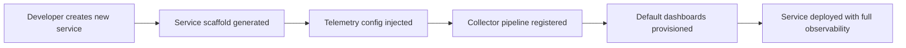

# How to Build a Telemetry Onboarding Workflow That Auto-Instruments New Services

Author: [nawazdhandala](https://www.github.com/nawazdhandala)

Tags: OpenTelemetry, Auto-Instrumentation, Platform Engineering, Onboarding

Description: Build an automated telemetry onboarding workflow that instruments new services from day one without requiring manual setup from developers.

Every new service that launches without observability is a gap in your understanding of the system. The typical pattern is that a team deploys something, it runs fine for weeks, then an incident happens and everyone scrambles to add instrumentation after the fact. By that point, the traces and metrics that would have explained the failure do not exist.

A better approach is making telemetry part of the service creation process itself. When a team spins up a new service, observability is already configured before the first line of business logic ships.

## The Onboarding Pipeline

The workflow connects your service creation process (whether that is a CLI tool, an internal developer portal, or a Git template) to OpenTelemetry configuration that gets applied automatically.



## Step 1: Service Registration

When a new service is created, capture the metadata that OpenTelemetry needs. This typically happens in your internal developer portal or service catalog API.

```python
# platform_api/service_registry.py
from dataclasses import dataclass
from typing import Optional
import json
import requests

@dataclass
class ServiceRegistration:
    """Metadata collected when a new service is registered."""
    service_name: str
    team_name: str
    language: str          # python, go, java, node
    framework: str         # flask, gin, spring, express
    tier: str              # critical, standard, experimental
    owner_email: str
    repository_url: str

def register_service(reg: ServiceRegistration) -> dict:
    """
    Register a new service and trigger telemetry onboarding.
    Returns the generated telemetry configuration.
    """
    # Store in service catalog
    catalog_response = requests.post(
        "http://service-catalog.internal/api/v1/services",
        json={
            "name": reg.service_name,
            "team": reg.team_name,
            "tier": reg.tier,
            "owner": reg.owner_email,
        }
    )

    # Generate telemetry config based on language and framework
    telemetry_config = generate_telemetry_config(reg)

    # Register the service's pipeline in the collector
    register_collector_pipeline(reg.service_name, reg.team_name, reg.tier)

    return telemetry_config
```

## Step 2: Generate Language-Specific Configuration

Based on the language and framework the team selected, generate the appropriate OpenTelemetry configuration files. These get committed into the service's repository automatically.

```python
# platform_api/telemetry_generator.py

PYTHON_FLASK_CONFIG = """
# auto-generated by platform telemetry onboarding
# modify sampling rates in telemetry-config.yaml, not here

from internal_telemetry.setup import init_telemetry
from opentelemetry.instrumentation.flask import FlaskInstrumentor
from opentelemetry.instrumentation.requests import RequestsInstrumentor

def configure_telemetry(app):
    tracer = init_telemetry(
        service_name="{service_name}",
        team_name="{team_name}",
    )

    # Auto-instrument Flask routes and outbound HTTP calls
    FlaskInstrumentor().instrument_app(app)
    RequestsInstrumentor().instrument()

    return tracer
"""

NODE_EXPRESS_CONFIG = """
// auto-generated by platform telemetry onboarding
// this file should be required before any other imports

const {{ initTelemetry }} = require('@internal/telemetry');

initTelemetry({{
  serviceName: '{service_name}',
  teamName: '{team_name}',
  instrumentations: ['express', 'http', 'pg'],
}});
"""

def generate_telemetry_config(reg):
    """Pick the right template and fill in service-specific values."""
    templates = {
        ("python", "flask"): PYTHON_FLASK_CONFIG,
        ("node", "express"): NODE_EXPRESS_CONFIG,
    }

    key = (reg.language, reg.framework)
    template = templates.get(key)

    if not template:
        raise ValueError(f"No telemetry template for {reg.language}/{reg.framework}")

    return template.format(
        service_name=reg.service_name,
        team_name=reg.team_name,
    )
```

## Step 3: Configure the Collector Pipeline

Each new service needs a routing entry in your OpenTelemetry Collector so its telemetry flows to the right backend with the right processing rules. Use the Collector's routing processor to direct traffic based on service tier.

```yaml
# collector-config/generated/order-service.yaml
# Auto-generated pipeline for order-service (team: commerce, tier: critical)

processors:
  attributes/order-service:
    actions:
      - key: service.tier
        value: critical
        action: upsert
      - key: onboarded_at
        value: "2026-02-06"
        action: upsert

  # Critical services get lower sampling thresholds
  tail_sampling/order-service:
    policies:
      - name: error-policy
        type: status_code
        status_code: {status_codes: [ERROR]}
      - name: latency-policy
        type: latency
        latency: {threshold_ms: 500}
      - name: default-rate
        type: probabilistic
        probabilistic: {sampling_percentage: 25}
```

## Step 4: Provision Default Dashboards

Do not make teams build dashboards from scratch. When a service is onboarded, generate a baseline dashboard that covers the RED metrics (Rate, Errors, Duration) using the standard attributes your wrapper produces.

```python
# platform_api/dashboard_provisioner.py

def provision_default_dashboard(service_name: str, team_name: str) -> str:
    """
    Create a default observability dashboard for the newly registered service.
    Returns the dashboard URL.
    """
    dashboard_spec = {
        "title": f"{service_name} - Service Overview",
        "team": team_name,
        "panels": [
            {
                "title": "Request Rate",
                "query": f'sum(rate(http_server_request_duration_seconds_count{{service_name="{service_name}"}}[5m]))',
                "type": "timeseries",
            },
            {
                "title": "Error Rate",
                "query": f'sum(rate(http_server_request_duration_seconds_count{{service_name="{service_name}",http_status_code=~"5.."}}[5m]))',
                "type": "timeseries",
            },
            {
                "title": "p99 Latency",
                "query": f'histogram_quantile(0.99, rate(http_server_request_duration_seconds_bucket{{service_name="{service_name}"}}[5m]))',
                "type": "timeseries",
            },
            {
                "title": "Active Traces",
                "type": "trace-explorer",
                "filter": f'service.name = "{service_name}"',
            },
        ],
    }

    # POST to your dashboarding backend
    response = requests.post(
        "http://dashboards.internal/api/v1/dashboards",
        json=dashboard_spec,
    )
    return response.json()["url"]
```

## Step 5: Kubernetes Auto-Injection

For teams running on Kubernetes, skip the code-level setup entirely by using the OpenTelemetry Operator. Add an annotation to the pod spec during onboarding, and the operator injects the instrumentation sidecar automatically.

```yaml
# k8s/base/deployment-template.yaml
# The onboarding system adds these annotations to new service deployments
apiVersion: apps/v1
kind: Deployment
metadata:
  name: "{{ service_name }}"
  labels:
    team: "{{ team_name }}"
spec:
  template:
    metadata:
      annotations:
        # Triggers the OTel Operator to inject instrumentation
        instrumentation.opentelemetry.io/inject-{{ language }}: "true"
        # Custom annotation for internal tracking
        platform.internal/telemetry-onboarded: "2026-02-06"
        platform.internal/telemetry-tier: "{{ tier }}"
    spec:
      containers:
        - name: "{{ service_name }}"
          env:
            - name: OTEL_SERVICE_NAME
              value: "{{ service_name }}"
            - name: OTEL_RESOURCE_ATTRIBUTES
              value: "team.name={{ team_name }},service.tier={{ tier }}"
```

## Measuring Onboarding Success

Track how effectively the onboarding pipeline works by querying your telemetry backend. Services that were onboarded through the automated workflow should be producing traces within minutes of their first deployment.

The key metric is time-to-first-span: the duration between service registration and the first trace appearing in your backend. Automated onboarding should bring this to under 10 minutes. If teams are still spending hours configuring telemetry manually, the onboarding workflow has gaps that need closing.
