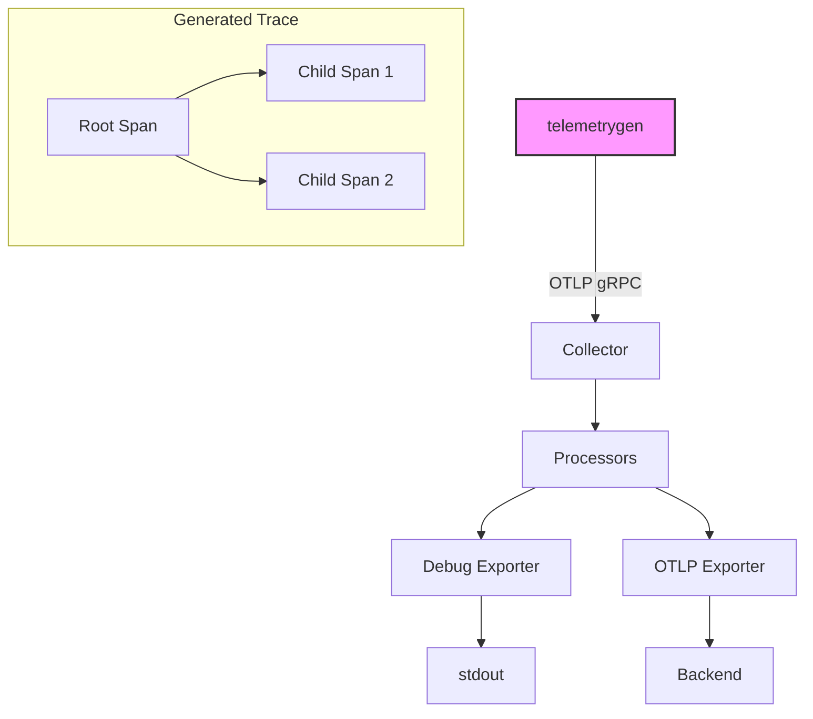

# How to Generate Test Traces with telemetrygen for Pipeline Validation

Author: [nawazdhandala](https://www.github.com/nawazdhandala)

Tags: OpenTelemetry, telemetrygen, Pipeline Validation, Testing, Collector, Traces

Description: Learn how to use the telemetrygen tool to generate synthetic test traces for validating and load-testing your OpenTelemetry Collector pipelines.

---

You have built an OpenTelemetry Collector pipeline with receivers, processors, and exporters. It looks correct on paper. But how do you know it actually works before real application traffic hits it? You need test data, and you need it on demand.

telemetrygen is a command-line tool from the OpenTelemetry project that generates synthetic traces, metrics, and logs. It sends OTLP data to your collector just like a real application would, letting you validate pipeline behavior, test configuration changes, and run load tests without deploying or modifying any application code.

## Installing telemetrygen

telemetrygen is distributed as a standalone binary and as a container image. You can install it in several ways.

```bash
# Install using go install (requires Go 1.21+)
go install github.com/open-telemetry/opentelemetry-collector-contrib/cmd/telemetrygen@latest
```

```bash
# Or pull the container image
docker pull ghcr.io/open-telemetry/opentelemetry-collector-contrib/telemetrygen:latest
```

```bash
# Verify the installation
telemetrygen --help
```

The tool supports three subcommands: `traces`, `metrics`, and `logs`. Each subcommand generates the corresponding telemetry type with configurable parameters.

## Generating Your First Test Traces

The simplest way to use telemetrygen is to point it at a running collector and let it generate traces with default settings.

```bash
# Generate 10 traces, each containing 2 spans, sent to localhost:4317
telemetrygen traces \
    --otlp-endpoint localhost:4317 \
    --otlp-insecure \
    --traces 10 \
    --child-spans 2
```

Let's break down what each flag does:

- `--otlp-endpoint`: The gRPC endpoint of your collector's OTLP receiver
- `--otlp-insecure`: Disables TLS (appropriate for local development)
- `--traces`: Number of traces to generate
- `--child-spans`: Number of child spans per trace (in addition to the root span)

Each generated trace will have a root span and the specified number of child spans, all linked together with proper parent-child relationships.



## Customizing Generated Traces

Default traces are fine for basic connectivity tests, but real validation requires data that looks like your actual application traffic. telemetrygen provides several flags for customizing the generated data.

### Setting Service Name and Attributes

```bash
# Generate traces that mimic your payment service
telemetrygen traces \
    --otlp-endpoint localhost:4317 \
    --otlp-insecure \
    --traces 50 \
    --child-spans 3 \
    --service "payment-service" \
    --span-duration 150ms \
    --status-code 0
```

The `--service` flag sets the `service.name` resource attribute, which is critical for identifying the source of traces in your backend. The `--span-duration` flag controls how long each span appears to take, and `--status-code` sets the span status (0 for OK, 1 for Error).

### Adding Custom Attributes

You can add custom attributes to generated spans to test attribute-based processors like filters or routers.

```bash
# Generate traces with custom attributes
telemetrygen traces \
    --otlp-endpoint localhost:4317 \
    --otlp-insecure \
    --traces 20 \
    --service "order-service" \
    --otlp-attributes 'environment="staging"' \
    --otlp-attributes 'region="us-east-1"' \
    --otlp-attributes 'team="checkout"'
```

These resource-level attributes will appear on every span in the generated traces. This is particularly useful when testing routing rules that direct traces to different backends based on attributes.

### Generating Error Traces

To test error handling in your pipeline, generate traces with error status.

```bash
# Generate a mix of successful and error traces
# First, send successful traces
telemetrygen traces \
    --otlp-endpoint localhost:4317 \
    --otlp-insecure \
    --traces 80 \
    --service "api-gateway" \
    --status-code 0

# Then, send error traces
telemetrygen traces \
    --otlp-endpoint localhost:4317 \
    --otlp-insecure \
    --traces 20 \
    --service "api-gateway" \
    --status-code 2
```

Status code 2 represents ERROR in the OpenTelemetry specification. This split gives you an 80/20 ratio of successful to error traces, which is useful for testing sampling policies that prioritize error traces.

## Validating Pipeline Configurations

Now let's look at practical scenarios where telemetrygen helps you validate specific collector configurations.

### Testing a Filter Processor

Suppose you have a filter processor that drops traces from health check endpoints.

```yaml
# collector-config.yaml
processors:
  filter:
    traces:
      span:
        - 'attributes["http.route"] == "/health"'

exporters:
  debug:
    verbosity: normal

service:
  pipelines:
    traces:
      receivers: [otlp]
      processors: [filter]
      exporters: [debug]
```

You can test this by generating traces with and without the filtered attribute:

```bash
# These traces should be dropped by the filter
telemetrygen traces \
    --otlp-endpoint localhost:4317 \
    --otlp-insecure \
    --traces 10 \
    --service "web-app" \
    --otlp-attributes 'http.route="/health"'

# These traces should pass through
telemetrygen traces \
    --otlp-endpoint localhost:4317 \
    --otlp-insecure \
    --traces 10 \
    --service "web-app" \
    --otlp-attributes 'http.route="/api/orders"'
```

Check the debug exporter output. You should only see spans with the `/api/orders` route, confirming that the filter is working correctly.

### Testing Tail-Based Sampling

Tail-based sampling decisions depend on seeing complete traces. telemetrygen is ideal for this because it generates complete traces with proper parent-child relationships.

```yaml
processors:
  tail_sampling:
    decision_wait: 5s
    policies:
      - name: keep-errors
        type: status_code
        status_code:
          status_codes: [ERROR]
      - name: sample-10-percent
        type: probabilistic
        probabilistic:
          sampling_percentage: 10
```

```bash
# Generate 1000 traces to get statistically meaningful results
# 100 error traces (should all be kept)
telemetrygen traces \
    --otlp-endpoint localhost:4317 \
    --otlp-insecure \
    --traces 100 \
    --child-spans 2 \
    --service "test-app" \
    --status-code 2

# 900 successful traces (approximately 10% should be kept)
telemetrygen traces \
    --otlp-endpoint localhost:4317 \
    --otlp-insecure \
    --traces 900 \
    --child-spans 2 \
    --service "test-app" \
    --status-code 0
```

After the sampling decision wait period, count the spans in your debug output. You should see all 100 error traces (300 spans) plus roughly 90 of the successful traces (about 270 spans, give or take due to probabilistic sampling).

## Load Testing Your Pipeline

Beyond functional validation, telemetrygen can stress-test your collector to find performance bottlenecks and resource limits.

```bash
# Generate a sustained load of traces
telemetrygen traces \
    --otlp-endpoint localhost:4317 \
    --otlp-insecure \
    --traces 0 \
    --rate 1000 \
    --child-spans 5 \
    --service "load-test" \
    --duration 60s
```

The key flags for load testing are:

- `--traces 0`: Generate traces indefinitely (until duration expires)
- `--rate 1000`: Generate 1000 traces per second
- `--duration 60s`: Run the load test for 60 seconds
- `--child-spans 5`: Each trace has 6 spans total (1 root + 5 children)

This configuration produces 6000 spans per second for one minute, which is a meaningful load for testing batch processor tuning, memory limits, and exporter throughput.

### Monitoring the Collector Under Load

While telemetrygen is running, monitor the collector's internal metrics to identify bottlenecks.

```bash
# Check collector metrics (if Prometheus metrics are enabled)
curl -s http://localhost:8888/metrics | grep otelcol

# Key metrics to watch:
# otelcol_exporter_sent_spans - successfully exported spans
# otelcol_exporter_send_failed_spans - failed exports
# otelcol_processor_batch_timeout_trigger_send - batch flushes due to timeout
# otelcol_processor_batch_batch_size_trigger_send - batch flushes due to size
```

If `otelcol_exporter_send_failed_spans` starts climbing, your exporter cannot keep up with the incoming rate. If the collector's memory usage grows continuously, your batch processor buffers are filling faster than they can drain.

## Using telemetrygen in CI/CD

telemetrygen fits naturally into automated testing pipelines. Here is a GitHub Actions workflow that validates a collector configuration change.

```yaml
# .github/workflows/validate-collector-config.yaml
name: Validate Collector Config

on:
  pull_request:
    paths:
      - "collector-config/**"

jobs:
  validate:
    runs-on: ubuntu-latest
    steps:
      - uses: actions/checkout@v4

      - name: Start collector with new config
        run: |
          docker run -d --name collector \
            -v $(pwd)/collector-config:/etc/otelcol \
            -p 4317:4317 \
            otel/opentelemetry-collector-contrib:latest \
            --config /etc/otelcol/config.yaml

      - name: Wait for collector to start
        run: sleep 5

      - name: Send test traces
        run: |
          docker run --network host \
            ghcr.io/open-telemetry/opentelemetry-collector-contrib/telemetrygen:latest \
            traces \
            --otlp-endpoint localhost:4317 \
            --otlp-insecure \
            --traces 100 \
            --child-spans 3 \
            --service "validation-test"

      - name: Check collector health
        run: |
          # Verify no errors in collector logs
          docker logs collector 2>&1 | grep -i "error" && exit 1 || true

      - name: Verify spans were processed
        run: |
          # Check that the collector successfully processed spans
          docker logs collector 2>&1 | grep "TracesExporter" | tail -5

      - name: Cleanup
        if: always()
        run: docker rm -f collector
```

This workflow catches configuration errors, missing processor definitions, and other issues that would otherwise only surface in production.

## Combining telemetrygen with the Debug Exporter

The most effective local validation setup combines telemetrygen as the data source with the debug exporter as the output. This gives you a complete, self-contained feedback loop.

```bash
# Terminal 1: Start the collector with debug output
otelcol-contrib --config collector-config.yaml

# Terminal 2: Generate specific test scenarios
# Test 1: Basic connectivity
telemetrygen traces --otlp-endpoint localhost:4317 --otlp-insecure --traces 5

# Test 2: Custom attributes for processor testing
telemetrygen traces --otlp-endpoint localhost:4317 --otlp-insecure --traces 5 \
    --otlp-attributes 'environment="production"'

# Test 3: Error traces for sampling validation
telemetrygen traces --otlp-endpoint localhost:4317 --otlp-insecure --traces 5 \
    --status-code 2
```

Watch the debug output in Terminal 1 after each command. You get immediate, visual confirmation that your pipeline handles each scenario correctly.

## Wrapping Up

telemetrygen removes the dependency on running applications when testing collector pipelines. It generates realistic OTLP data with configurable attributes, status codes, and volume, letting you validate filter rules, sampling policies, routing configurations, and performance characteristics. Whether you are developing locally, running CI checks, or load testing a staging environment, telemetrygen gives you on-demand synthetic telemetry that exercises your pipeline exactly the way you need it to.
