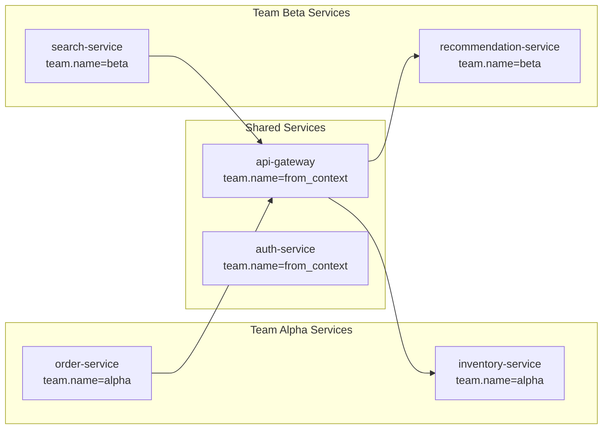

# How to Implement Tenant-Aware Observability in a Multi-Team Platform with OpenTelemetry

Author: [nawazdhandala](https://www.github.com/nawazdhandala)

Tags: OpenTelemetry, Multi-Tenancy, Platform Engineering, Observability

Description: Implement tenant-aware observability in a multi-team platform so each team sees only their own telemetry while platform teams get a full view.

When multiple teams share a platform, observability gets complicated. The payment team should not have to sift through traces from the search team's services. Platform engineers need to see everything. And when a shared service like an API gateway handles requests for all teams, the telemetry from that service needs to be attributed correctly so each team sees their own slice.

OpenTelemetry supports this through resource attributes, context propagation, and careful Collector configuration. The key is encoding tenant identity at the telemetry level so downstream tools can filter, route, and control access based on team ownership.

## Tenant Identity in Telemetry

Every span, metric, and log record needs a `team.name` (or `tenant.id`) resource attribute. Services owned by a specific team set this statically. Shared services need to extract tenant identity from the request context.



## Setting Tenant Identity on Team-Owned Services

For services that belong to a single team, the tenant attribute is a static resource attribute configured at deployment time.

```yaml
# kubernetes/deployment.yaml for a team-owned service
apiVersion: apps/v1
kind: Deployment
metadata:
  name: order-service
  labels:
    team: alpha
spec:
  template:
    spec:
      containers:
        - name: order-service
          env:
            - name: OTEL_SERVICE_NAME
              value: "order-service"
            - name: OTEL_RESOURCE_ATTRIBUTES
              value: "team.name=alpha,service.tier=critical"
```

## Propagating Tenant Context Through Shared Services

Shared services receive requests from multiple teams. The tenant identity must travel with the request through baggage propagation so spans from shared services are attributed to the originating team.

Set baggage at the entry point where the team is known:

```python
# In the team's service, before calling a shared service
from opentelemetry import baggage, context
from opentelemetry.propagate import set_global_textmap
from opentelemetry.propagators.composite import CompositePropagator
from opentelemetry.propagators.b3 import B3MultiFormat
from opentelemetry.baggage.propagation import W3CBaggagePropagator

# Configure propagators to include baggage
set_global_textmap(CompositePropagator([
    B3MultiFormat(),
    W3CBaggagePropagator(),
]))

def make_downstream_call(endpoint: str, team_name: str):
    """
    Make an HTTP call with tenant identity in baggage.
    The downstream shared service can read this to attribute telemetry.
    """
    ctx = baggage.set_baggage("team.name", team_name)

    # The propagator automatically injects baggage into HTTP headers
    with context.attach(ctx):
        response = requests.get(endpoint)
    return response
```

In the shared service, extract the baggage and set it as a span attribute:

```python
# In the shared API gateway service
from opentelemetry import baggage, trace

def handle_request(request):
    """
    Extract tenant identity from baggage and apply it to the current span.
    This ensures traces from the gateway are attributed to the calling team.
    """
    team_name = baggage.get_baggage("team.name") or "unknown"

    span = trace.get_current_span()
    span.set_attribute("team.name", team_name)
    span.set_attribute("request.source_team", team_name)

    # Process the request normally
    return process(request)
```

## Collector-Level Tenant Routing

The OpenTelemetry Collector routes telemetry to team-specific storage partitions or applies team-specific processing based on the tenant attribute.

```yaml
# otel-collector-config.yaml
receivers:
  otlp:
    protocols:
      grpc:
        endpoint: 0.0.0.0:4317

processors:
  # Route telemetry based on the team.name resource attribute
  routing:
    from_attribute: team.name
    attribute_source: resource
    table:
      - value: alpha
        pipelines: [traces/alpha]
      - value: beta
        pipelines: [traces/beta]
    default_pipelines: [traces/platform]

  # Add tenant isolation metadata
  attributes/alpha:
    actions:
      - key: storage.partition
        value: "tenant-alpha"
        action: upsert

  attributes/beta:
    actions:
      - key: storage.partition
        value: "tenant-beta"
        action: upsert

exporters:
  otlphttp/alpha:
    endpoint: https://backend.internal/v1/traces
    headers:
      X-Tenant-ID: alpha

  otlphttp/beta:
    endpoint: https://backend.internal/v1/traces
    headers:
      X-Tenant-ID: beta

  otlphttp/platform:
    endpoint: https://backend.internal/v1/traces
    headers:
      X-Tenant-ID: platform-wide

service:
  pipelines:
    traces/alpha:
      receivers: [otlp]
      processors: [attributes/alpha]
      exporters: [otlphttp/alpha]
    traces/beta:
      receivers: [otlp]
      processors: [attributes/beta]
      exporters: [otlphttp/beta]
    traces/platform:
      receivers: [otlp]
      processors: []
      exporters: [otlphttp/platform]
```

## Access Control at the Query Layer

Even if all telemetry lands in the same backend, you can enforce tenant isolation at query time. Build a proxy that injects tenant filters into every query based on the authenticated user's team membership.

```python
# query_proxy/middleware.py
from flask import Flask, request, jsonify
import requests

app = Flask(__name__)

BACKEND_URL = "https://trace-backend.internal"

@app.route("/api/v1/traces")
def proxy_traces():
    """
    Proxy trace queries with mandatory tenant filtering.
    Platform team members see all data; others see only their team's data.
    """
    user_teams = get_user_teams(request.headers.get("Authorization"))
    is_platform = "platform-engineering" in user_teams

    # Build the query with tenant filter injected
    original_query = request.args.get("query", "")

    if not is_platform:
        # Force a team filter for non-platform users
        team_filter = " AND ".join(
            [f'resource.team.name = "{t}"' for t in user_teams]
        )
        filtered_query = f"({original_query}) AND ({team_filter})"
    else:
        filtered_query = original_query

    # Forward to the actual backend
    result = requests.get(
        f"{BACKEND_URL}/api/v1/traces",
        params={"query": filtered_query},
        headers={"Authorization": request.headers.get("Authorization")},
    )
    return jsonify(result.json())
```

## Cross-Team Trace Correlation

The benefit of tenant-aware observability is that it enables cross-team tracing while maintaining isolation. When a request flows from Team Alpha's order-service through the shared gateway to Team Beta's inventory check, the trace is complete and visible to both teams (each seeing the spans relevant to their services) and to the platform team (seeing the full picture).

This requires that trace context propagation (W3C TraceContext) is always enabled alongside baggage propagation. The trace ID stays the same across team boundaries, but each team's view is filtered to their own spans plus the shared service spans that handled their request.

Tenant-aware observability is not about building walls between teams. It is about reducing noise so each team can focus on their own services while the platform team retains the ability to see how everything connects.
