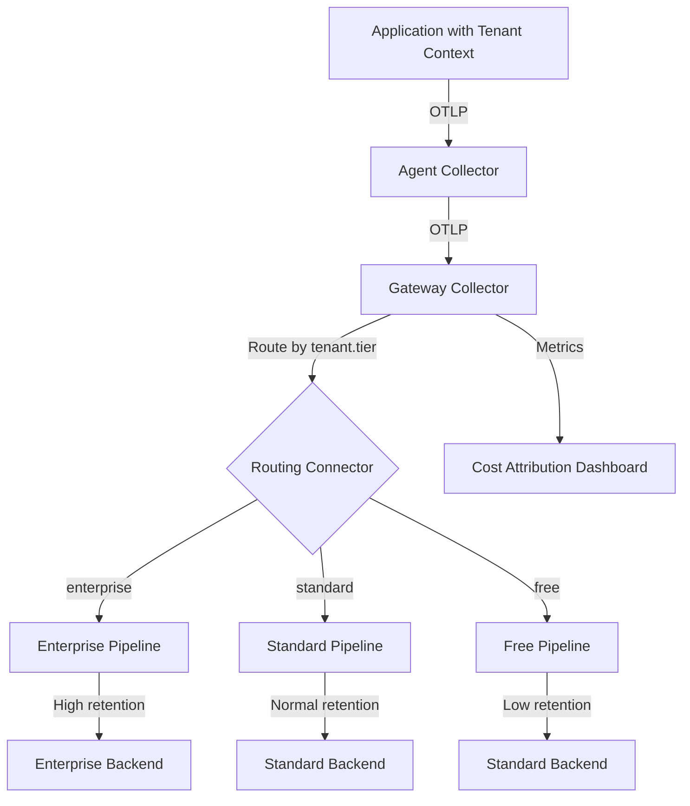

# How to Implement Tenant-Aware Telemetry Routing in Multi-Tenant SaaS

Author: [nawazdhandala](https://www.github.com/nawazdhandala)

Tags: OpenTelemetry, Multi-Tenant, SaaS, Routing, Collector, Telemetry

Description: Learn how to route OpenTelemetry telemetry data based on tenant identity in multi-tenant SaaS applications for isolation, compliance, and cost attribution.

---

Multi-tenant SaaS applications serve many customers from the same infrastructure. Every request, every database query, and every background job serves a specific tenant. When it comes to observability, this creates unique requirements. You need to know which tenant a trace belongs to. You may need to route high-value tenants to a dedicated observability backend for better retention. Compliance requirements may demand that certain tenants' data stays in specific regions. And for cost attribution, you need to know how much telemetry each tenant generates.

OpenTelemetry does not have built-in multi-tenancy, but it provides all the building blocks you need. By combining resource attributes, context propagation, and collector routing, you can build a tenant-aware telemetry pipeline that handles all of these requirements.

## Adding Tenant Context to Telemetry

The first step is ensuring every piece of telemetry carries the tenant identifier. There are several ways to do this depending on your application architecture.

### Using Resource Attributes

If your services are dedicated to a single tenant (single-tenant deployment model), set the tenant ID as a resource attribute:

```python
# For single-tenant deployments, set tenant.id as a resource attribute.
# This applies to all telemetry from this service instance.
from opentelemetry.sdk.resources import Resource
from opentelemetry.sdk.trace import TracerProvider

resource = Resource.create({
    "service.name": "order-service",
    "tenant.id": os.getenv("TENANT_ID"),
    "tenant.tier": os.getenv("TENANT_TIER", "standard"),
})

provider = TracerProvider(resource=resource)
```

### Using Span Attributes

For shared multi-tenant services, set the tenant ID on individual spans:

```python
# For shared multi-tenant services, extract the tenant ID from the
# request context and add it to each span as an attribute.
from opentelemetry import trace

tracer = trace.get_tracer("order-service")

def process_order(request):
    # Extract tenant ID from the request (JWT, header, path, etc.)
    tenant_id = extract_tenant_id(request)

    with tracer.start_as_current_span("process-order") as span:
        span.set_attribute("tenant.id", tenant_id)
        span.set_attribute("tenant.tier", get_tenant_tier(tenant_id))
        # Process the order
        return create_order(request)
```

### Using Baggage for Propagation

When the tenant ID needs to flow across service boundaries automatically, use OpenTelemetry baggage:

```javascript
// Use baggage to propagate tenant ID across all downstream services.
// Baggage entries are automatically included in HTTP headers.
const { propagation, context, baggage } = require('@opentelemetry/api');

function tenantMiddleware(req, res, next) {
  const tenantId = req.headers['x-tenant-id'] || extractFromJWT(req);

  // Create a baggage entry for the tenant ID
  const bag = propagation.createBaggage({
    'tenant.id': { value: tenantId },
    'tenant.tier': { value: getTenantTier(tenantId) },
  });

  // Set the baggage in the current context
  const ctx = propagation.setBaggage(context.active(), bag);

  // Run the rest of the request in this context
  context.with(ctx, () => next());
}
```

On the receiving side, downstream services extract the baggage and add it to their spans:

```javascript
// Middleware that extracts tenant baggage and adds it to the current span.
// This ensures every span in the trace carries the tenant identifier.
function extractTenantBaggage(req, res, next) {
  const bag = propagation.getBaggage(context.active());
  if (bag) {
    const tenantId = bag.getEntry('tenant.id');
    const span = trace.getActiveSpan();
    if (span && tenantId) {
      span.setAttribute('tenant.id', tenantId.value);
    }
  }
  next();
}
```

## Collector Routing by Tenant

Once telemetry carries the tenant identifier, configure the collector to route data based on tenant attributes. The routing connector in the OpenTelemetry Collector enables this:

```yaml
# Collector configuration with tenant-aware routing.
# Different tenants can be sent to different backends or pipelines.
receivers:
  otlp:
    protocols:
      grpc:
        endpoint: 0.0.0.0:4317
      http:
        endpoint: 0.0.0.0:4318

# Use connectors to route based on tenant attributes
connectors:
  routing:
    table:
      # Enterprise tenants get dedicated high-retention pipeline
      - statement: route() where attributes["tenant.tier"] == "enterprise"
        pipelines: [traces/enterprise]
      # Standard tenants use the default pipeline
      - statement: route() where attributes["tenant.tier"] == "standard"
        pipelines: [traces/standard]
      # Default route for anything without a tier
      - statement: route()
        pipelines: [traces/default]

processors:
  batch/enterprise:
    timeout: 2s
    send_batch_size: 256

  batch/standard:
    timeout: 5s
    send_batch_size: 1024

exporters:
  otlphttp/enterprise:
    endpoint: https://enterprise-backend.yourdomain.com/otlp
    headers:
      X-Retention-Days: "90"

  otlphttp/standard:
    endpoint: https://standard-backend.yourdomain.com/otlp
    headers:
      X-Retention-Days: "30"

  otlphttp/default:
    endpoint: https://default-backend.yourdomain.com/otlp

service:
  pipelines:
    traces/input:
      receivers: [otlp]
      exporters: [routing]

    traces/enterprise:
      receivers: [routing]
      processors: [batch/enterprise]
      exporters: [otlphttp/enterprise]

    traces/standard:
      receivers: [routing]
      processors: [batch/standard]
      exporters: [otlphttp/standard]

    traces/default:
      receivers: [routing]
      processors: [batch/standard]
      exporters: [otlphttp/default]
```

## Tenant-Based Sampling

Different tenants may warrant different sampling rates. Enterprise customers paying for premium observability should get higher sampling, while free-tier tenants can be sampled more aggressively:

```yaml
# Tail-based sampling with tenant-aware policies.
# Enterprise tenants keep more traces than standard tenants.
processors:
  tail_sampling:
    decision_wait: 30s
    num_traces: 50000
    policies:
      # Keep all error traces regardless of tenant
      - name: all-errors
        type: status_code
        status_code:
          status_codes: [ERROR]

      # Enterprise tenants: keep 50% of traces
      - name: enterprise-sampling
        type: and
        and:
          and_sub_policy:
            - name: enterprise-filter
              type: string_attribute
              string_attribute:
                key: tenant.tier
                values: [enterprise]
            - name: enterprise-rate
              type: probabilistic
              probabilistic:
                sampling_percentage: 50

      # Standard tenants: keep 10% of traces
      - name: standard-sampling
        type: and
        and:
          and_sub_policy:
            - name: standard-filter
              type: string_attribute
              string_attribute:
                key: tenant.tier
                values: [standard]
            - name: standard-rate
              type: probabilistic
              probabilistic:
                sampling_percentage: 10

      # Free tenants: keep 1% of traces
      - name: free-sampling
        type: and
        and:
          and_sub_policy:
            - name: free-filter
              type: string_attribute
              string_attribute:
                key: tenant.tier
                values: [free]
            - name: free-rate
              type: probabilistic
              probabilistic:
                sampling_percentage: 1
```

## Cost Attribution

Track telemetry volume per tenant by using the collector's metrics:

```yaml
# Count spans per tenant using the count connector.
# This produces a metric that tracks how many spans each tenant generates.
connectors:
  count:
    spans:
      tenant.span.count:
        description: "Number of spans per tenant"
        conditions:
          - attributes["tenant.id"] != nil
        attributes:
          - key: tenant.id
          - key: tenant.tier

service:
  pipelines:
    traces:
      receivers: [otlp]
      processors: [batch]
      exporters: [otlphttp, count]

    metrics/tenant:
      receivers: [count]
      processors: [batch]
      exporters: [otlphttp/metrics]
```

This gives you a metric called `tenant.span.count` that you can use to build dashboards showing telemetry volume per tenant and calculate cost attribution.

## Data Flow Architecture

The complete tenant-aware architecture looks like this:



## Tenant Isolation Considerations

For strict tenant isolation, consider running separate collector pipelines or even separate collector instances per tenant. This prevents a noisy tenant from impacting others:

```yaml
# Per-tenant resource limits in the collector.
# The memory limiter can be configured per pipeline to prevent
# one tenant's traffic spike from affecting others.
processors:
  memory_limiter/enterprise:
    check_interval: 1s
    limit_mib: 2048

  memory_limiter/standard:
    check_interval: 1s
    limit_mib: 1024
```

## Conclusion

Tenant-aware telemetry routing transforms your observability from a flat system into one that respects the boundaries and requirements of each customer. By embedding tenant identity into spans through attributes and baggage, and using the collector's routing capabilities, you can implement differentiated sampling, retention, and even regional compliance per tenant. The cost attribution metrics let you understand and bill for observability costs accurately. This is not just a technical nicety. For SaaS operators, it is a business requirement.
