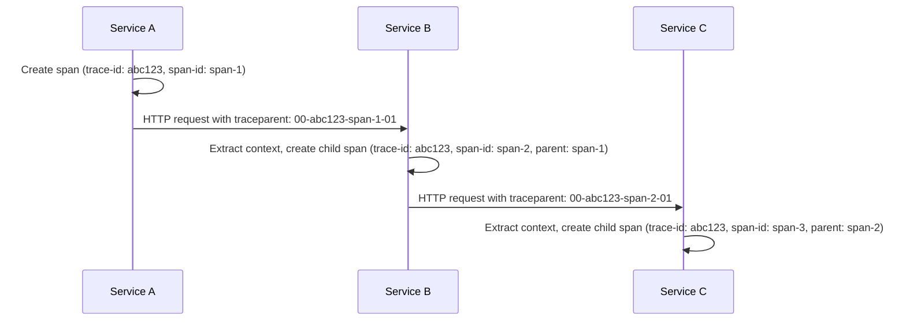
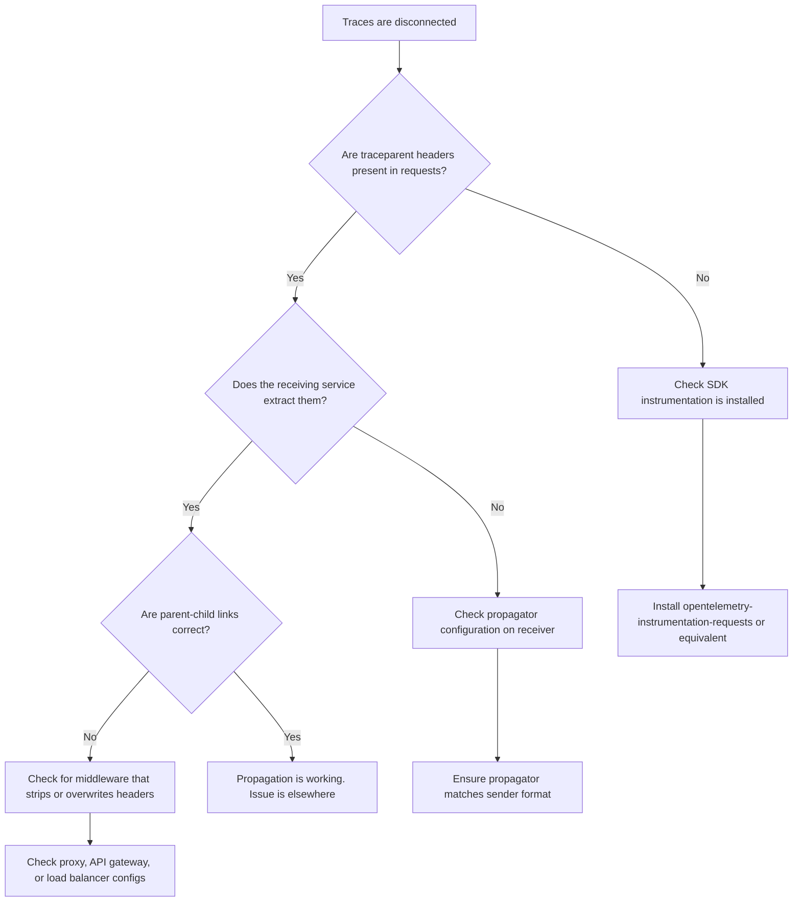

# How to Test Context Propagation Across Service Boundaries

Author: [nawazdhandala](https://www.github.com/nawazdhandala)

Tags: OpenTelemetry, Context Propagation, Distributed Tracing, Testing, Microservices, W3C Trace Context

Description: Learn how to test and verify that OpenTelemetry context propagation works correctly across service boundaries in distributed systems.

---

Context propagation is the mechanism that ties spans from different services into a single distributed trace. When it works, you see a complete request flow from the API gateway through every downstream service. When it breaks, you see disconnected fragments: orphan spans with no parent, traces that end abruptly at a service boundary, and dashboards that show incomplete pictures.

The tricky part is that broken propagation is silent. Nothing crashes. No errors get logged. You just get traces that are shorter than they should be. Testing context propagation explicitly is the only way to be sure it works.

## How Context Propagation Works

Before testing propagation, it helps to understand what is actually being propagated. When Service A calls Service B over HTTP, the OpenTelemetry SDK in Service A injects trace context headers into the outgoing request. Service B extracts those headers and uses them to create a child span that links back to Service A's span.

The W3C Trace Context standard defines two headers for this:

```
traceparent: 00-<trace-id>-<span-id>-<trace-flags>
tracestate: <vendor-specific-data>
```

The `traceparent` header carries the trace ID (which stays the same across all services), the parent span ID (which points to the calling span), and trace flags (which indicate whether the trace is sampled).



All three spans share the same trace ID (`abc123`), forming a complete trace. If any link in this chain breaks, the downstream service starts a new trace with a different trace ID.

## Unit Testing: Verifying Header Injection

The first level of testing checks that your HTTP client correctly injects trace context headers. You do not need to call a real service for this. Mock the HTTP layer and inspect the outgoing headers.

```python
# test_propagation_injection.py
import unittest
from unittest.mock import patch, MagicMock
from opentelemetry import trace, context
from opentelemetry.sdk.trace import TracerProvider
from opentelemetry.sdk.trace.export import SimpleSpanProcessor
from opentelemetry.sdk.trace.export.in_memory import InMemorySpanExporter
from opentelemetry.propagate import set_global_textmap
from opentelemetry.trace.propagation.tracecontext import (
    TraceContextTextMapPropagator,
)
import requests


class TestContextInjection(unittest.TestCase):
    def setUp(self):
        """Set up a tracer with in-memory exporter for testing."""
        self.exporter = InMemorySpanExporter()
        self.provider = TracerProvider()
        self.provider.add_span_processor(
            SimpleSpanProcessor(self.exporter)
        )
        trace.set_tracer_provider(self.provider)

        # Use W3C Trace Context propagation
        set_global_textmap(TraceContextTextMapPropagator())
        self.tracer = trace.get_tracer("test-tracer")

    def test_traceparent_header_is_injected(self):
        """Verify that outgoing HTTP requests include traceparent."""
        with self.tracer.start_as_current_span("parent-span") as span:
            # Get the expected trace ID from the current span
            expected_trace_id = format(
                span.get_span_context().trace_id, "032x"
            )

            # Mock the requests library to capture headers
            with patch("requests.Session.send") as mock_send:
                mock_response = MagicMock()
                mock_response.status_code = 200
                mock_send.return_value = mock_response

                # Make an HTTP request (this should inject headers)
                requests.get("http://service-b:8080/api/data")

                # Inspect the headers that were sent
                sent_request = mock_send.call_args[0][0]
                traceparent = sent_request.headers.get("traceparent")

                # Verify the traceparent header exists
                self.assertIsNotNone(
                    traceparent,
                    "traceparent header was not injected"
                )

                # Verify it contains the correct trace ID
                self.assertIn(
                    expected_trace_id,
                    traceparent,
                    "traceparent does not contain the expected trace ID"
                )

    def test_tracestate_header_is_injected(self):
        """Verify tracestate header is present when set."""
        with self.tracer.start_as_current_span("parent-span"):
            with patch("requests.Session.send") as mock_send:
                mock_response = MagicMock()
                mock_response.status_code = 200
                mock_send.return_value = mock_response

                requests.get("http://service-b:8080/api/data")

                sent_request = mock_send.call_args[0][0]
                # tracestate may or may not be present depending on config
                # but traceparent must always be there
                traceparent = sent_request.headers.get("traceparent")
                self.assertIsNotNone(traceparent)

    def tearDown(self):
        self.provider.shutdown()
```

These tests verify that the OpenTelemetry instrumentation library for `requests` is correctly injecting headers. If these tests fail, it usually means the instrumentation library is not installed or the propagator is not configured.

## Unit Testing: Verifying Header Extraction

The other side of propagation is extraction. When your service receives a request with trace context headers, it should create a span that is a child of the calling span.

```python
# test_propagation_extraction.py
import unittest
from opentelemetry import trace
from opentelemetry.sdk.trace import TracerProvider
from opentelemetry.sdk.trace.export import SimpleSpanProcessor
from opentelemetry.sdk.trace.export.in_memory import InMemorySpanExporter
from opentelemetry.propagate import extract, set_global_textmap
from opentelemetry.trace.propagation.tracecontext import (
    TraceContextTextMapPropagator,
)


class TestContextExtraction(unittest.TestCase):
    def setUp(self):
        self.exporter = InMemorySpanExporter()
        self.provider = TracerProvider()
        self.provider.add_span_processor(
            SimpleSpanProcessor(self.exporter)
        )
        trace.set_tracer_provider(self.provider)
        set_global_textmap(TraceContextTextMapPropagator())
        self.tracer = trace.get_tracer("test-tracer")

    def test_child_span_has_correct_parent(self):
        """Verify that extracted context creates proper parent-child link."""
        # Simulate an incoming request with trace context headers
        incoming_headers = {
            "traceparent": "00-0af7651916cd43dd8448eb211c80319c-b7ad6b7169203331-01"
        }

        # Extract the context from the headers
        extracted_context = extract(carrier=incoming_headers)

        # Create a span using the extracted context as parent
        with trace.use_span(
            self.tracer.start_span(
                "handle-request",
                context=extracted_context,
            ),
            end_on_exit=True,
        ):
            pass  # Span is created and ended

        # Get the exported span
        spans = self.exporter.get_finished_spans()
        self.assertEqual(len(spans), 1)

        span = spans[0]
        span_context = span.get_span_context()

        # The trace ID should match the one from the incoming headers
        expected_trace_id = int("0af7651916cd43dd8448eb211c80319c", 16)
        self.assertEqual(span_context.trace_id, expected_trace_id)

        # The parent span ID should match the span-id from the headers
        expected_parent_id = int("b7ad6b7169203331", 16)
        self.assertEqual(
            span.parent.span_id,
            expected_parent_id,
            "Span parent does not match the incoming traceparent"
        )

    def test_missing_headers_create_root_span(self):
        """Verify that missing headers result in a new root span."""
        # No trace context headers
        incoming_headers = {}
        extracted_context = extract(carrier=incoming_headers)

        with trace.use_span(
            self.tracer.start_span(
                "handle-request",
                context=extracted_context,
            ),
            end_on_exit=True,
        ):
            pass

        spans = self.exporter.get_finished_spans()
        self.assertEqual(len(spans), 1)

        # With no incoming context, this should be a root span (no parent)
        self.assertIsNone(
            spans[0].parent,
            "Span should be a root span when no context is provided"
        )

    def tearDown(self):
        self.provider.shutdown()
```

The first test verifies that a valid `traceparent` header creates a child span with the correct parent. The second test confirms that missing headers result in a root span, which is the correct behavior when there is no upstream context.

## Integration Testing: End-to-End Propagation

Unit tests verify the mechanics. Integration tests verify that propagation works across actual service boundaries with real HTTP calls. The approach is to run two services locally, send a request through them, and check that all resulting spans share the same trace ID.

```python
# test_e2e_propagation.py
"""
End-to-end propagation test.
Requires both services to be running locally with an
in-memory or file exporter for span collection.
"""
import time
import json
import requests
import unittest


class TestEndToEndPropagation(unittest.TestCase):
    """
    This test assumes:
    - Service A is running on localhost:8080
    - Service B is running on localhost:8081
    - Both services export spans to a Collector
    - The Collector writes spans to /tmp/otel-output.json
    """

    def test_trace_propagates_through_services(self):
        """Verify a single trace ID spans both services."""
        # Clear the output file before the test
        with open("/tmp/otel-output.json", "w") as f:
            f.write("")

        # Send a request to Service A, which calls Service B
        response = requests.get("http://localhost:8080/api/process")
        self.assertEqual(response.status_code, 200)

        # Wait for spans to be exported
        time.sleep(2)

        # Read the exported spans
        trace_ids = set()
        with open("/tmp/otel-output.json") as f:
            for line in f:
                if line.strip():
                    data = json.loads(line)
                    # Extract trace IDs from all spans
                    for resource_span in data.get("resourceSpans", []):
                        for scope_span in resource_span.get("scopeSpans", []):
                            for span in scope_span.get("spans", []):
                                trace_ids.add(span["traceId"])

        # All spans should share the same trace ID
        self.assertEqual(
            len(trace_ids), 1,
            f"Expected 1 trace ID but found {len(trace_ids)}: {trace_ids}. "
            f"This means context propagation is broken between services."
        )

    def test_parent_child_relationships(self):
        """Verify span parent-child links are correct."""
        with open("/tmp/otel-output.json", "w") as f:
            f.write("")

        response = requests.get("http://localhost:8080/api/process")
        self.assertEqual(response.status_code, 200)

        time.sleep(2)

        spans = []
        with open("/tmp/otel-output.json") as f:
            for line in f:
                if line.strip():
                    data = json.loads(line)
                    for resource_span in data.get("resourceSpans", []):
                        for scope_span in resource_span.get("scopeSpans", []):
                            for span in scope_span.get("spans", []):
                                spans.append(span)

        # Build a map of span IDs to verify parent relationships
        span_ids = {s["spanId"] for s in spans}
        for span in spans:
            parent_id = span.get("parentSpanId", "")
            if parent_id:
                # Every non-root span's parent should exist in our spans
                # (or be from an external service we did not collect from)
                self.assertIn(
                    parent_id, span_ids,
                    f"Span '{span['name']}' has parent {parent_id} "
                    f"which was not found in collected spans"
                )
```

These integration tests are slower and require running services, but they catch real-world issues that unit tests miss: misconfigured middleware, missing instrumentation libraries, or framework-specific quirks that interfere with header propagation.

## Testing Propagation with Different Formats

Not every service uses W3C Trace Context. Legacy services might use B3 headers (from Zipkin) or Jaeger's proprietary format. You should test that your services handle the propagation format you expect.

```python
# test_b3_propagation.py
from opentelemetry.propagate import extract
from opentelemetry.propagators.b3 import B3MultiFormat


def test_b3_multi_header_extraction():
    """Verify that B3 multi-header format is correctly extracted."""
    propagator = B3MultiFormat()

    # B3 uses separate headers for each field
    incoming_headers = {
        "X-B3-TraceId": "463ac35c9f6413ad48485a3953bb6124",
        "X-B3-SpanId": "0020000000000001",
        "X-B3-Sampled": "1",
        "X-B3-ParentSpanId": "0000000000000000",
    }

    # Extract using the B3 propagator
    ctx = propagator.extract(carrier=incoming_headers)

    # Verify the context was extracted successfully
    span_context = trace.get_current_span(ctx).get_span_context()
    assert span_context.trace_id == int(
        "463ac35c9f6413ad48485a3953bb6124", 16
    )
    assert span_context.is_valid
```

If your architecture includes a mix of propagation formats, configure the composite propagator and test each format individually.

## Debugging Broken Propagation

When your tests reveal that propagation is broken, here is a systematic approach to finding the problem.



The most common causes are: the instrumentation library for your HTTP client is not installed, the propagator format does not match between services (one uses W3C, the other expects B3), or a proxy or API gateway in between is stripping the trace context headers.

## Automated Propagation Checks in CI

You can run propagation tests as part of your CI pipeline using Docker Compose to spin up the services.

```yaml
# docker-compose.test.yaml
version: "3.8"

services:
  collector:
    image: otel/opentelemetry-collector-contrib:latest
    volumes:
      - ./test-config.yaml:/etc/otelcol/config.yaml:ro
      - otel-output:/tmp/otel-output

  service-a:
    build: ./service-a
    environment:
      - OTEL_EXPORTER_OTLP_ENDPOINT=http://collector:4317
      - OTEL_SERVICE_NAME=service-a
    depends_on: [collector]

  service-b:
    build: ./service-b
    environment:
      - OTEL_EXPORTER_OTLP_ENDPOINT=http://collector:4317
      - OTEL_SERVICE_NAME=service-b
    depends_on: [collector]

  # Test runner that validates propagation
  test-runner:
    build: ./tests
    environment:
      - SERVICE_A_URL=http://service-a:8080
    depends_on: [service-a, service-b]
    volumes:
      - otel-output:/tmp/otel-output

volumes:
  otel-output:
```

The test runner service starts after both application services are up, sends requests through the chain, and verifies that the resulting spans form a connected trace. This gives you confidence that propagation works every time you push code.

## Wrapping Up

Context propagation is the backbone of distributed tracing, and it is one of those things that is easy to break without noticing. By testing injection and extraction at the unit level and verifying end-to-end trace connectivity at the integration level, you can catch propagation issues before they make your traces useless.

Start with the unit tests for header injection and extraction. They are fast, do not require running services, and catch the most common configuration mistakes. Add integration tests when you need confidence that propagation works across real service boundaries with real HTTP calls. And automate everything in CI so you catch regressions the moment they are introduced.
