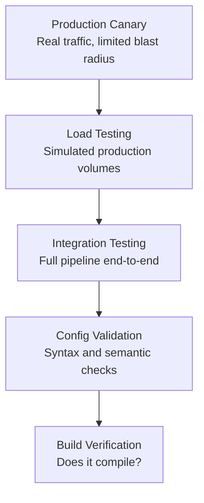
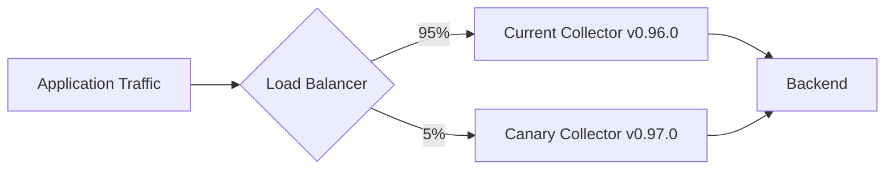

# How to Test Custom Collector Distributions Before Production Deployment

Author: [nawazdhandala](https://www.github.com/nawazdhandala)

Tags: OpenTelemetry, Collector, Testing, CI/CD, Quality Assurance

Description: A comprehensive testing strategy for custom OpenTelemetry Collector distributions covering unit tests, integration tests, load tests, and canary deployments.

---

Deploying an untested collector to production is a fast way to lose telemetry data when you need it most. Since the collector sits on the critical path of your observability pipeline, a bad config or a broken component can create blind spots across your entire system. This post covers a layered testing approach that catches problems before they reach production.

## The Testing Pyramid for Collectors

Just like application code, collector testing follows a pyramid. Cheap, fast tests at the bottom. Expensive, slow tests at the top.



## Level 1: Build Verification

The most basic check. Does your custom distribution actually compile?

```bash
#!/bin/bash
# build-test.sh
# Verify that the custom distribution compiles without errors

set -euo pipefail

echo "Step 1: Building custom collector..."
builder --config manifest.yaml

if [ -f "./dist/otelcol-custom" ]; then
  echo "Build successful."
else
  echo "Build failed: binary not found."
  exit 1
fi

# Check that the binary runs and reports its version
echo "Step 2: Checking binary version..."
./dist/otelcol-custom --version

echo "Step 3: Listing available components..."
./dist/otelcol-custom components

echo "All build verification checks passed."
```

The `components` subcommand is especially useful. It lists every receiver, processor, exporter, and extension compiled into the binary. Verify your expected components are present:

```bash
# Check that specific components are included in the build
COMPONENTS=$(./dist/otelcol-custom components 2>&1)

for EXPECTED in "otlp" "batch" "memory_limiter" "otlphttp"; do
  if echo "${COMPONENTS}" | grep -q "${EXPECTED}"; then
    echo "Found: ${EXPECTED}"
  else
    echo "MISSING: ${EXPECTED}"
    exit 1
  fi
done
```

## Level 2: Configuration Validation

The collector has a built-in validation command that checks your config file against the available components:

```bash
# Validate the config without starting the collector
./dist/otelcol-custom validate --config config.yaml
```

This catches several types of errors:

- References to components not compiled into the binary
- Invalid YAML syntax
- Missing required configuration fields
- Type mismatches in configuration values

Create multiple test configs for different scenarios:

```yaml
# config-test-minimal.yaml
# Tests the minimal viable pipeline
receivers:
  otlp:
    protocols:
      grpc:
        endpoint: "0.0.0.0:4317"

processors:
  batch:
    timeout: 1s

exporters:
  debug:
    verbosity: detailed

service:
  pipelines:
    traces:
      receivers: [otlp]
      processors: [batch]
      exporters: [debug]
```

```yaml
# config-test-full.yaml
# Tests all components in a realistic pipeline configuration
receivers:
  otlp:
    protocols:
      grpc:
        endpoint: "0.0.0.0:4317"
      http:
        endpoint: "0.0.0.0:4318"

  hostmetrics:
    collection_interval: 10s
    scrapers:
      cpu: {}
      memory: {}

processors:
  batch:
    timeout: 2s
    send_batch_size: 1000

  memory_limiter:
    check_interval: 1s
    limit_percentage: 75
    spike_limit_percentage: 25

  attributes:
    actions:
      - key: test.attribute
        value: "integration-test"
        action: upsert

exporters:
  debug:
    verbosity: detailed

  otlp:
    endpoint: "localhost:4317"
    tls:
      insecure: true

extensions:
  health_check:
    endpoint: "0.0.0.0:13133"

service:
  extensions: [health_check]
  pipelines:
    traces:
      receivers: [otlp]
      processors: [memory_limiter, attributes, batch]
      exporters: [debug]
    metrics:
      receivers: [otlp, hostmetrics]
      processors: [memory_limiter, batch]
      exporters: [debug]
    logs:
      receivers: [otlp]
      processors: [memory_limiter, batch]
      exporters: [debug]
```

Validate all configs in one sweep:

```bash
#!/bin/bash
# validate-all-configs.sh
# Validates every config file in the test directory

BINARY="./dist/otelcol-custom"
FAILED=0

for CONFIG in configs/config-test-*.yaml; do
  echo "Validating ${CONFIG}..."
  if ${BINARY} validate --config "${CONFIG}"; then
    echo "  OK"
  else
    echo "  FAILED"
    FAILED=$((FAILED + 1))
  fi
done

if [ ${FAILED} -gt 0 ]; then
  echo "${FAILED} config(s) failed validation."
  exit 1
fi

echo "All configs passed validation."
```

## Level 3: Integration Testing

Integration tests verify that data actually flows through the pipeline. Use Docker Compose to set up a complete test environment:

```yaml
# docker-compose-test.yaml
# Spins up the collector and a mock backend for integration testing

services:
  # The collector under test
  collector:
    build:
      context: .
      dockerfile: Dockerfile
    ports:
      - "4317:4317"
      - "4318:4318"
      - "13133:13133"
    volumes:
      - ./configs/config-integration.yaml:/etc/otel/config.yaml
    command: ["--config", "/etc/otel/config.yaml"]
    depends_on:
      - mock-backend
    healthcheck:
      test: ["CMD", "curl", "-f", "http://localhost:13133/health"]
      interval: 5s
      timeout: 3s
      retries: 10

  # Mock OTLP backend that receives and stores telemetry for verification
  mock-backend:
    image: ghcr.io/open-telemetry/opentelemetry-collector-contrib/telemetrygen:latest
    entrypoint: []
    command: ["sleep", "infinity"]
    ports:
      - "4319:4317"
```

Write a test script that sends telemetry and verifies it arrives:

```bash
#!/bin/bash
# integration-test.sh
# Sends test telemetry through the collector and verifies the output

set -euo pipefail

echo "Starting test environment..."
docker compose -f docker-compose-test.yaml up -d

echo "Waiting for collector to be healthy..."
for i in $(seq 1 30); do
  if curl -sf http://localhost:13133/health > /dev/null 2>&1; then
    echo "Collector is healthy."
    break
  fi
  if [ $i -eq 30 ]; then
    echo "Collector did not become healthy in time."
    docker compose -f docker-compose-test.yaml logs collector
    docker compose -f docker-compose-test.yaml down
    exit 1
  fi
  sleep 1
done

echo "Sending test traces..."
# Use telemetrygen to send test data
docker run --rm --network host \
  ghcr.io/open-telemetry/opentelemetry-collector-contrib/telemetrygen:latest \
  traces --otlp-insecure --traces 10 --otlp-endpoint localhost:4317

echo "Sending test metrics..."
docker run --rm --network host \
  ghcr.io/open-telemetry/opentelemetry-collector-contrib/telemetrygen:latest \
  metrics --otlp-insecure --metrics 10 --otlp-endpoint localhost:4317

echo "Sending test logs..."
docker run --rm --network host \
  ghcr.io/open-telemetry/opentelemetry-collector-contrib/telemetrygen:latest \
  logs --otlp-insecure --logs 10 --otlp-endpoint localhost:4317

echo "Checking collector logs for exported data..."
sleep 5

# Verify the collector processed the data by checking its logs
LOGS=$(docker compose -f docker-compose-test.yaml logs collector 2>&1)

if echo "${LOGS}" | grep -q "TracesExporter"; then
  echo "Traces: PASSED"
else
  echo "Traces: FAILED - no trace export detected"
  FAILED=1
fi

if echo "${LOGS}" | grep -q "MetricsExporter"; then
  echo "Metrics: PASSED"
else
  echo "Metrics: FAILED - no metrics export detected"
  FAILED=1
fi

if echo "${LOGS}" | grep -q "LogsExporter"; then
  echo "Logs: PASSED"
else
  echo "Logs: FAILED - no logs export detected"
  FAILED=1
fi

echo "Cleaning up..."
docker compose -f docker-compose-test.yaml down

if [ "${FAILED:-0}" -eq 1 ]; then
  echo "Integration tests FAILED."
  exit 1
fi

echo "All integration tests passed."
```

## Level 4: Load Testing

Verify that your collector handles production-level traffic without dropping data or running out of memory:

```bash
#!/bin/bash
# load-test.sh
# Generates high-volume traffic to test collector stability

COLLECTOR_ENDPOINT="localhost:4317"
DURATION="300"  # 5 minutes
RATE="1000"     # Spans per second

echo "Running load test: ${RATE} spans/sec for ${DURATION}s..."

# Generate high-volume trace traffic
docker run --rm --network host \
  ghcr.io/open-telemetry/opentelemetry-collector-contrib/telemetrygen:latest \
  traces \
  --otlp-insecure \
  --otlp-endpoint "${COLLECTOR_ENDPOINT}" \
  --rate "${RATE}" \
  --duration "${DURATION}s" \
  --workers 10 &

TELEMETRYGEN_PID=$!

echo "Monitoring collector health during load test..."

# Monitor memory and health every 10 seconds during the test
for i in $(seq 1 $((DURATION / 10))); do
  sleep 10

  # Check health endpoint
  if ! curl -sf http://localhost:13133/health > /dev/null; then
    echo "FAIL: Collector health check failed at ${i}0 seconds"
    kill $TELEMETRYGEN_PID 2>/dev/null
    exit 1
  fi

  # Check memory usage via docker stats
  MEM=$(docker stats --no-stream --format "{{.MemUsage}}" otel-collector 2>/dev/null | head -1)
  echo "  [${i}0s] Health: OK | Memory: ${MEM}"
done

wait $TELEMETRYGEN_PID
echo "Load test complete."
```

## Level 5: Canary Deployment

Before rolling out to all collectors, deploy the new version to a small percentage of traffic:



A Kubernetes deployment for canary testing:

```yaml
# canary-deployment.yaml
# Deploys the new collector version alongside the current one

apiVersion: apps/v1
kind: Deployment
metadata:
  name: otel-collector-canary
  labels:
    app: otel-collector
    version: canary
spec:
  replicas: 1
  selector:
    matchLabels:
      app: otel-collector
      version: canary
  template:
    metadata:
      labels:
        app: otel-collector
        version: canary
    spec:
      containers:
        - name: collector
          image: ghcr.io/myorg/custom-collector:v0.97.0-rc1
          ports:
            - containerPort: 4317
              name: otlp-grpc
            - containerPort: 13133
              name: health
          livenessProbe:
            httpGet:
              path: /health
              port: 13133
            initialDelaySeconds: 5
            periodSeconds: 10
          readinessProbe:
            httpGet:
              path: /health
              port: 13133
            initialDelaySeconds: 5
            periodSeconds: 5
          resources:
            requests:
              cpu: 200m
              memory: 256Mi
            limits:
              cpu: 1000m
              memory: 512Mi
          volumeMounts:
            - name: config
              mountPath: /etc/otel
      volumes:
        - name: config
          configMap:
            name: otel-collector-config
```

## CI Pipeline Putting It All Together

Here is a GitHub Actions workflow that runs all test levels:

```yaml
# .github/workflows/test-collector.yaml
name: Test Custom Collector

on:
  pull_request:
    paths:
      - 'manifest.yaml'
      - 'configs/**'
      - 'custom-processor/**'
  push:
    branches: [main]

jobs:
  build-and-test:
    runs-on: ubuntu-latest
    steps:
      - uses: actions/checkout@v4

      - name: Set up Go
        uses: actions/setup-go@v5
        with:
          go-version: '1.22'

      - name: Install OCB
        run: go install go.opentelemetry.io/collector/cmd/builder@latest

      # Level 1: Build verification
      - name: Build collector
        run: |
          builder --config manifest.yaml
          ./dist/otelcol-custom --version
          ./dist/otelcol-custom components

      # Level 2: Config validation
      - name: Validate configs
        run: |
          for config in configs/config-*.yaml; do
            echo "Validating ${config}..."
            ./dist/otelcol-custom validate --config "${config}"
          done

      # Level 3: Integration testing
      - name: Integration tests
        run: |
          docker compose -f docker-compose-test.yaml up -d
          sleep 10
          ./scripts/integration-test.sh
          docker compose -f docker-compose-test.yaml down

      # Level 4: Smoke load test (shorter duration for CI)
      - name: Smoke load test
        run: |
          ./dist/otelcol-custom --config configs/config-test-full.yaml &
          sleep 5
          docker run --rm --network host \
            ghcr.io/open-telemetry/opentelemetry-collector-contrib/telemetrygen:latest \
            traces --otlp-insecure --rate 500 --duration 30s --otlp-endpoint localhost:4317
          curl -f http://localhost:13133/health
          kill %1
```

## Testing Custom Components

If you have written custom processors, receivers, or exporters, write Go unit tests for them:

```go
// processor_test.go
// Unit tests for the custom timestamp processor.
package customprocessor

import (
	"context"
	"testing"
	"time"

	"github.com/stretchr/testify/assert"
	"github.com/stretchr/testify/require"
	"go.opentelemetry.io/collector/consumer/consumertest"
	"go.opentelemetry.io/collector/pdata/ptrace"
	"go.uber.org/zap"
)

// TestProcessorAddsTimestamp verifies that the processor
// adds a timestamp attribute to every span.
func TestProcessorAddsTimestamp(t *testing.T) {
	// Create a mock consumer that captures the output
	sink := &consumertest.TracesSink{}

	// Create the processor with test configuration
	cfg := &Config{
		AttributeName: "test.timestamp",
		Format:        time.RFC3339,
	}
	proc := newTimestampProcessor(zap.NewNop(), cfg, sink)

	// Build a test trace with one span
	td := ptrace.NewTraces()
	rs := td.ResourceSpans().AppendEmpty()
	ss := rs.ScopeSpans().AppendEmpty()
	span := ss.Spans().AppendEmpty()
	span.SetName("test-span")

	// Process the trace
	err := proc.ConsumeTraces(context.Background(), td)
	require.NoError(t, err)

	// Verify the output
	require.Equal(t, 1, sink.SpanCount())
	outputSpan := sink.AllTraces()[0].ResourceSpans().At(0).ScopeSpans().At(0).Spans().At(0)

	// Check that the timestamp attribute was added
	val, exists := outputSpan.Attributes().Get("test.timestamp")
	assert.True(t, exists, "timestamp attribute should exist")
	assert.NotEmpty(t, val.Str(), "timestamp should not be empty")

	// Verify it parses as a valid RFC3339 timestamp
	_, parseErr := time.Parse(time.RFC3339, val.Str())
	assert.NoError(t, parseErr, "timestamp should be valid RFC3339")
}

// TestProcessorDefaultConfig verifies the default configuration values.
func TestProcessorDefaultConfig(t *testing.T) {
	cfg := createDefaultConfig().(*Config)
	assert.Equal(t, "processing.timestamp", cfg.AttributeName)
	assert.Equal(t, "2006-01-02T15:04:05Z07:00", cfg.Format)
}
```

Run the tests:

```bash
# Run unit tests for the custom processor
cd custom-processor
go test -v -race ./...
```

## Wrapping Up

Testing a collector distribution involves multiple layers, from basic build verification to production canary deployments. The investment pays off when you can upgrade with confidence, knowing that your telemetry pipeline will not break. Start with config validation and integration tests. Add load tests when you are handling production volumes. Use canary deployments for major version upgrades. The goal is simple: never lose telemetry data because of an untested change.
