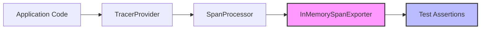

# How to Test Your OpenTelemetry Instrumentation with In-Memory Exporters

Author: [nawazdhandala](https://www.github.com/nawazdhandala)

Tags: OpenTelemetry, Testing, In-Memory Exporter, Instrumentation, Observability, Tracing

Description: Learn how to use in-memory exporters to test your OpenTelemetry instrumentation and verify that spans, attributes, and trace context are correctly generated.

---

When you add OpenTelemetry instrumentation to your application, you are making a promise to yourself and your team: that trace data will be accurate, complete, and useful when production issues arise. But how do you verify that promise before shipping to production? You write tests for it, just like you write tests for any other critical feature.

In-memory exporters are the foundation of testable OpenTelemetry instrumentation. Instead of sending telemetry data to an external backend during test runs, you capture it in memory where your test assertions can inspect every span, attribute, and link. This guide walks through the practical details of setting up in-memory exporters for testing in multiple languages.

## Why In-Memory Exporters Matter

Sending telemetry to a real backend during unit tests creates a handful of problems. Tests become slow because they wait on network calls. They become flaky because the backend might be unavailable. And they become hard to assert against because you would need to query an external system to verify what was exported.

In-memory exporters solve all of this. They implement the same exporter interface that production exporters use, but they store spans in a local list or array. Your test code can then pull spans out of that list and check their names, attributes, status codes, events, and parent-child relationships.



The diagram above shows the flow during testing. Your application code creates spans through the TracerProvider as usual. The only difference is that the SpanProcessor hands finished spans to an InMemorySpanExporter instead of an OTLP exporter, and your test code reads directly from that exporter.

## Setting Up In-Memory Exporters in Python

The Python OpenTelemetry SDK ships with an in-memory exporter out of the box. You do not need to install any additional packages beyond the standard SDK.

```python
# test_instrumentation.py
from opentelemetry import trace
from opentelemetry.sdk.trace import TracerProvider
from opentelemetry.sdk.trace.export.in_memory_span_exporter import InMemorySpanExporter
from opentelemetry.sdk.trace.export import SimpleSpanProcessor

# Create the in-memory exporter that will hold finished spans
exporter = InMemorySpanExporter()

# Wire up a TracerProvider with a SimpleSpanProcessor
# SimpleSpanProcessor exports spans immediately (no batching delay)
provider = TracerProvider()
provider.add_span_processor(SimpleSpanProcessor(exporter))

# Set this provider as the global default
trace.set_tracer_provider(provider)
```

A few things to note here. We use `SimpleSpanProcessor` instead of `BatchSpanProcessor` for testing. The batch processor buffers spans and exports them on a timer, which introduces timing issues in tests. The simple processor exports each span the moment it ends, so your assertions run against a complete and predictable set of data.

Now let's write a function and test it:

```python
# service.py
from opentelemetry import trace

def process_order(order_id: str, total: float) -> str:
    """Process an order and return a confirmation ID."""
    tracer = trace.get_tracer("order-service")

    # Start a span for the order processing operation
    with tracer.start_as_current_span("process_order") as span:
        # Record important business attributes on the span
        span.set_attribute("order.id", order_id)
        span.set_attribute("order.total", total)
        span.set_attribute("order.currency", "USD")

        confirmation_id = f"CONF-{order_id}"

        # Add an event to mark a meaningful point in processing
        span.add_event("order.confirmed", {"confirmation_id": confirmation_id})

        return confirmation_id
```

```python
# test_service.py
import pytest
from opentelemetry import trace
from opentelemetry.sdk.trace import TracerProvider
from opentelemetry.sdk.trace.export.in_memory_span_exporter import InMemorySpanExporter
from opentelemetry.sdk.trace.export import SimpleSpanProcessor
from service import process_order

@pytest.fixture(autouse=True)
def setup_telemetry():
    """Set up a fresh in-memory exporter before each test."""
    exporter = InMemorySpanExporter()
    provider = TracerProvider()
    provider.add_span_processor(SimpleSpanProcessor(exporter))
    trace.set_tracer_provider(provider)

    # Yield the exporter so tests can inspect captured spans
    yield exporter

    # Clean up after each test to prevent span leakage
    exporter.clear()
    provider.shutdown()

def test_process_order_creates_span(setup_telemetry):
    exporter = setup_telemetry

    # Call the function under test
    result = process_order("ORD-123", 49.99)

    # Retrieve all finished spans from the exporter
    spans = exporter.get_finished_spans()

    # Verify exactly one span was created
    assert len(spans) == 1

    span = spans[0]

    # Check the span name matches what we expect
    assert span.name == "process_order"

    # Verify business-critical attributes are present and correct
    assert span.attributes["order.id"] == "ORD-123"
    assert span.attributes["order.total"] == 49.99
    assert span.attributes["order.currency"] == "USD"

def test_process_order_records_confirmation_event(setup_telemetry):
    exporter = setup_telemetry

    result = process_order("ORD-456", 120.00)

    spans = exporter.get_finished_spans()
    span = spans[0]

    # Check that the confirmation event was recorded
    events = span.events
    assert len(events) == 1
    assert events[0].name == "order.confirmed"
    assert events[0].attributes["confirmation_id"] == "CONF-ORD-456"
```

The `autouse=True` fixture ensures every test starts with a clean exporter. This is important because leftover spans from a previous test can cause confusing false positives or negatives.

## Setting Up In-Memory Exporters in Go

Go's OpenTelemetry SDK includes the `tracetest` package, which provides an in-memory exporter for testing.

```go
// order_test.go
package order

import (
    "context"
    "testing"

    "go.opentelemetry.io/otel"
    sdktrace "go.opentelemetry.io/otel/sdk/trace"
    "go.opentelemetry.io/otel/sdk/trace/tracetest"
)

func setupTestTracer(t *testing.T) *tracetest.InMemoryExporter {
    // Create the in-memory exporter
    exporter := tracetest.NewInMemoryExporter()

    // Use a SimpleSpanProcessor for synchronous export during tests
    processor := sdktrace.NewSimpleSpanProcessor(exporter)

    // Build a TracerProvider with the test processor
    provider := sdktrace.NewTracerProvider(
        sdktrace.WithSpanProcessor(processor),
    )

    // Register it globally so instrumented code picks it up
    otel.SetTracerProvider(provider)

    // Clean up when the test finishes
    t.Cleanup(func() {
        provider.Shutdown(context.Background())
        exporter.Reset()
    })

    return exporter
}

func TestProcessOrder(t *testing.T) {
    exporter := setupTestTracer(t)

    // Call the function under test
    ProcessOrder(context.Background(), "ORD-789", 75.50)

    // Get all exported span snapshots
    spans := exporter.GetSpans()

    if len(spans) != 1 {
        t.Fatalf("expected 1 span, got %d", len(spans))
    }

    // Verify the span name
    if spans[0].Name != "ProcessOrder" {
        t.Errorf("expected span name ProcessOrder, got %s", spans[0].Name)
    }

    // Check attributes by iterating over the attribute set
    attrs := spans[0].Attributes
    found := false
    for _, attr := range attrs {
        if string(attr.Key) == "order.id" && attr.Value.AsString() == "ORD-789" {
            found = true
        }
    }
    if !found {
        t.Error("expected order.id attribute with value ORD-789")
    }
}
```

The `tracetest.InMemoryExporter` in Go returns `SpanStubs`, which are snapshot copies of the finished spans. This means you can safely inspect them without worrying about concurrent modification.

## Testing Parent-Child Relationships

One of the most valuable things to test is whether your spans form the correct parent-child hierarchy. Broken context propagation is a common bug that silently degrades your trace data.

```python
# test_trace_hierarchy.py
def test_nested_spans_have_correct_parent(setup_telemetry):
    exporter = setup_telemetry
    tracer = trace.get_tracer("test")

    # Create a parent span and a child span within it
    with tracer.start_as_current_span("parent_operation") as parent:
        with tracer.start_as_current_span("child_operation") as child:
            pass  # The child span is nested inside the parent

    spans = exporter.get_finished_spans()

    # Spans are exported in the order they finish (child first, then parent)
    child_span = spans[0]
    parent_span = spans[1]

    # Verify the child's parent span ID matches the parent's span ID
    assert child_span.parent.span_id == parent_span.context.span_id

    # Verify both spans share the same trace ID
    assert child_span.context.trace_id == parent_span.context.trace_id

    # Verify the parent span has no parent (it is the root)
    assert parent_span.parent is None
```

This test catches a surprisingly common class of bugs where context is not properly passed between function calls, resulting in orphaned spans that do not connect to the broader trace.

## Testing Error Recording

You should also verify that your instrumentation correctly records errors and sets span status.

```python
# test_error_handling.py
from opentelemetry.trace import StatusCode

def test_span_records_error_on_exception(setup_telemetry):
    exporter = setup_telemetry
    tracer = trace.get_tracer("test")

    # Simulate an operation that raises an exception
    try:
        with tracer.start_as_current_span("failing_operation") as span:
            raise ValueError("Something went wrong")
    except ValueError:
        pass

    spans = exporter.get_finished_spans()
    span = spans[0]

    # Verify the span status indicates an error
    assert span.status.status_code == StatusCode.ERROR

    # Verify the exception event was recorded
    error_events = [e for e in span.events if e.name == "exception"]
    assert len(error_events) == 1
    assert "ValueError" in error_events[0].attributes["exception.type"]
```

## Best Practices for In-Memory Exporter Tests

There are a few patterns that make tests more reliable over time.

Always clear the exporter between tests. Leftover spans from a previous test will cause misleading failures. Use test fixtures or setup/teardown hooks to reset state.

Use `SimpleSpanProcessor` instead of `BatchSpanProcessor`. Batch processors introduce timing dependencies that make tests nondeterministic. The simple processor ensures spans are available immediately after the instrumented code runs.

Test the attributes that matter to your business logic, not every single attribute. Instrumentation libraries add many automatic attributes (like HTTP method, URL path, and status code). Focus your test assertions on the custom attributes your team relies on for debugging and alerting.

Keep instrumentation tests separate from unit tests of business logic. You do not want a change to span naming conventions to break tests that verify order processing correctness. Separation of concerns applies to tests too.

Name your test spans descriptively. When a test fails, the span name in the error message should tell you exactly which operation was being tested.

## Wrapping Up

In-memory exporters turn OpenTelemetry instrumentation from something you hope works into something you know works. They are lightweight, fast, and built into the official SDKs for Python, Go, Java, and JavaScript. By writing tests against captured spans, you catch broken context propagation, missing attributes, and incorrect error handling before they reach production. The investment in test coverage for instrumentation pays off the first time you need accurate trace data to debug a live incident.
