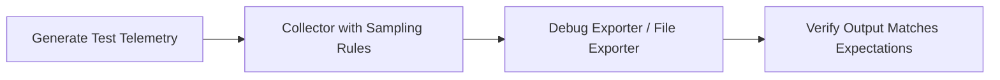

# How to Test Sampling Rules and Filter Logic Before Production

Author: [nawazdhandala](https://www.github.com/nawazdhandala)

Tags: OpenTelemetry, Sampling, Testing, Collector, Tail Sampling, Filtering, Configuration

Description: Learn how to thoroughly test OpenTelemetry sampling rules and filter logic locally before deploying them to production environments.

---

Sampling rules and filter logic determine which telemetry data reaches your backend and which gets dropped. Getting these wrong in production can be expensive in two ways: too little sampling means you drown in data and blow your storage budget, while too much sampling means you lose the traces you need most during an incident. Testing these rules before they hit production is not optional. It is a core part of any reliable observability pipeline.

This guide shows you how to validate sampling configurations, tail-sampling policies, and filter processors locally using the OpenTelemetry Collector and targeted test data.

## Why Sampling Rules Need Testing

Sampling rules interact with your telemetry in ways that are hard to predict from reading YAML alone. A tail-sampling policy that looks correct on paper might accidentally drop all error traces because of a subtle attribute mismatch. A filter processor meant to exclude health checks might inadvertently filter out legitimate API traffic.

The only way to know your rules work correctly is to send representative telemetry through them and verify the output. Think of it like writing tests for your code, but for your pipeline configuration.



## Setting Up a Local Testing Environment

Start with a Docker-based Collector that exports to both a debug output and a file. The file output lets you programmatically verify results:

```yaml
# test-sampling-config.yaml
# Collector configuration for testing sampling rules

receivers:
  otlp:
    protocols:
      grpc:
        endpoint: 0.0.0.0:4317
      http:
        endpoint: 0.0.0.0:4318

processors:
  # The tail sampling processor makes decisions based on complete traces
  tail_sampling:
    # Wait up to 10 seconds for all spans in a trace to arrive
    decision_wait: 10s
    num_traces: 1000
    policies:
      # Always keep traces that contain errors
      - name: errors-policy
        type: status_code
        status_code:
          status_codes: [ERROR]

      # Always keep traces slower than 2 seconds
      - name: latency-policy
        type: latency
        latency:
          threshold_ms: 2000

      # Sample 10% of successful, fast traces
      - name: probabilistic-policy
        type: probabilistic
        probabilistic:
          sampling_percentage: 10

exporters:
  # Debug exporter for visual inspection
  debug:
    verbosity: detailed

  # File exporter for programmatic verification
  file:
    path: /tmp/otel-output/traces.json
    rotation:
      max_megabytes: 10

service:
  pipelines:
    traces:
      receivers: [otlp]
      processors: [tail_sampling]
      exporters: [debug, file]
```

Run this configuration locally:

```bash
# Create the output directory and start the Collector
mkdir -p /tmp/otel-output

docker run --rm \
  -p 4317:4317 \
  -p 4318:4318 \
  -v $(pwd)/test-sampling-config.yaml:/etc/otelcol-contrib/config.yaml \
  -v /tmp/otel-output:/tmp/otel-output \
  otel/opentelemetry-collector-contrib:latest
```

## Generating Test Traces with Known Characteristics

To test sampling rules effectively, you need to send traces with specific properties. Write a script that generates traces with controlled attributes:

```python
# generate_test_traces.py
# Generates test traces with known characteristics for sampling validation

from opentelemetry import trace
from opentelemetry.sdk.trace import TracerProvider
from opentelemetry.sdk.trace.export import BatchSpanProcessor
from opentelemetry.exporter.otlp.proto.grpc.trace_exporter import OTLPSpanExporter
from opentelemetry.trace import StatusCode
import time
import uuid

# Configure the exporter to send to our local Collector
exporter = OTLPSpanExporter(endpoint="localhost:4317", insecure=True)
provider = TracerProvider()
provider.add_span_processor(BatchSpanProcessor(exporter))
trace.set_tracer_provider(provider)

tracer = trace.get_tracer("sampling-test-generator")


def generate_error_trace():
    """Create a trace that should always be kept by the errors-policy."""
    with tracer.start_as_current_span("error-operation") as span:
        span.set_attribute("test.case", "error-trace")
        span.set_attribute("test.trace_id", str(uuid.uuid4()))
        span.set_status(StatusCode.ERROR, "Simulated error for testing")
        span.record_exception(Exception("Test exception"))
        time.sleep(0.01)


def generate_slow_trace():
    """Create a trace that should be kept by the latency-policy."""
    with tracer.start_as_current_span("slow-operation") as span:
        span.set_attribute("test.case", "slow-trace")
        span.set_attribute("test.trace_id", str(uuid.uuid4()))
        # Sleep for 3 seconds to exceed the 2-second threshold
        time.sleep(3)


def generate_normal_trace():
    """Create a normal trace that should be probabilistically sampled at 10%."""
    with tracer.start_as_current_span("normal-operation") as span:
        span.set_attribute("test.case", "normal-trace")
        span.set_attribute("test.trace_id", str(uuid.uuid4()))
        time.sleep(0.05)


# Generate a known distribution of traces
print("Generating error traces (should all be kept)...")
for i in range(20):
    generate_error_trace()

print("Generating slow traces (should all be kept)...")
for i in range(20):
    generate_slow_trace()

print("Generating normal traces (10% should be kept)...")
for i in range(200):
    generate_normal_trace()

# Flush to ensure all spans are sent
provider.shutdown()
print("Done. Wait 15 seconds for tail sampling decisions, then check output.")
```

This script generates three categories of traces with known properties. After the tail sampling decision window passes, you can verify the results.

## Verifying Sampling Results

After generating test traces and waiting for the sampling decisions, inspect the output file:

```python
# verify_sampling.py
# Reads the Collector file output and verifies sampling decisions

import json
import sys


def load_traces(file_path):
    """Parse the JSONL output from the file exporter."""
    traces = []
    with open(file_path, 'r') as f:
        for line in f:
            if line.strip():
                traces.append(json.loads(line))
    return traces


def count_by_test_case(traces):
    """Count traces grouped by the test.case attribute."""
    counts = {}
    for trace_data in traces:
        for resource_span in trace_data.get("resourceSpans", []):
            for scope_span in resource_span.get("scopeSpans", []):
                for span in scope_span.get("spans", []):
                    for attr in span.get("attributes", []):
                        if attr["key"] == "test.case":
                            case = attr["value"]["stringValue"]
                            counts[case] = counts.get(case, 0) + 1
    return counts


# Load and analyze the output
traces = load_traces("/tmp/otel-output/traces.json")
counts = count_by_test_case(traces)

print("Sampling results:")
print(f"  Error traces kept:  {counts.get('error-trace', 0)} / 20 expected")
print(f"  Slow traces kept:   {counts.get('slow-trace', 0)} / 20 expected")
print(f"  Normal traces kept: {counts.get('normal-trace', 0)} / ~20 expected (10% of 200)")

# Validate expectations
error_count = counts.get('error-trace', 0)
slow_count = counts.get('slow-trace', 0)
normal_count = counts.get('normal-trace', 0)

# All error traces should be kept
assert error_count == 20, f"Expected 20 error traces, got {error_count}"

# All slow traces should be kept
assert slow_count == 20, f"Expected 20 slow traces, got {slow_count}"

# Normal traces should be approximately 10% (allow some variance)
assert 10 <= normal_count <= 40, f"Expected ~20 normal traces, got {normal_count}"

print("\nAll sampling assertions passed!")
```

Running this verification script against the Collector output confirms that your sampling rules are working as intended.

## Testing Filter Processor Logic

The filter processor drops telemetry that matches specific conditions. Testing it follows a similar pattern:

```yaml
# test-filter-config.yaml
# Configuration for testing filter processor rules

receivers:
  otlp:
    protocols:
      grpc:
        endpoint: 0.0.0.0:4317

processors:
  # Filter processor to exclude unwanted telemetry
  filter/traces:
    error_mode: ignore
    traces:
      span:
        # Drop spans from health check endpoints
        - 'attributes["http.route"] == "/health"'
        - 'attributes["http.route"] == "/ready"'
        - 'attributes["http.route"] == "/metrics"'
      # Drop traces from internal service accounts
      spanevent:
        - 'attributes["user.type"] == "service-account"'

exporters:
  debug:
    verbosity: detailed
  file:
    path: /tmp/otel-output/filtered-traces.json

service:
  pipelines:
    traces:
      receivers: [otlp]
      processors: [filter/traces]
      exporters: [debug, file]
```

Generate traces with different route attributes to test:

```python
# test_filter_rules.py
# Generate traces to validate filter processor behavior

from opentelemetry import trace
from opentelemetry.sdk.trace import TracerProvider
from opentelemetry.sdk.trace.export import BatchSpanProcessor
from opentelemetry.exporter.otlp.proto.grpc.trace_exporter import OTLPSpanExporter

exporter = OTLPSpanExporter(endpoint="localhost:4317", insecure=True)
provider = TracerProvider()
provider.add_span_processor(BatchSpanProcessor(exporter))
trace.set_tracer_provider(provider)

tracer = trace.get_tracer("filter-test-generator")

# These routes should be FILTERED OUT
filtered_routes = ["/health", "/ready", "/metrics"]

# These routes should PASS THROUGH the filter
kept_routes = ["/api/orders", "/api/users", "/api/products"]

for route in filtered_routes:
    with tracer.start_as_current_span(f"GET {route}") as span:
        span.set_attribute("http.route", route)
        span.set_attribute("http.method", "GET")
        span.set_attribute("test.expect", "filtered")

for route in kept_routes:
    with tracer.start_as_current_span(f"GET {route}") as span:
        span.set_attribute("http.route", route)
        span.set_attribute("http.method", "GET")
        span.set_attribute("test.expect", "kept")

provider.shutdown()
print("Test traces sent. Check output for filtering results.")
```

After running this, verify that only the API routes appear in the output and the health check routes are absent.

## Testing Composite Sampling Policies

Real-world sampling configurations often combine multiple policies using the `and` and `composite` policy types. These are especially important to test because the interactions between policies can produce unexpected results:

```yaml
# Composite sampling policy that combines multiple criteria
processors:
  tail_sampling:
    decision_wait: 10s
    policies:
      # Policy group 1: Always keep errors regardless of service
      - name: keep-all-errors
        type: status_code
        status_code:
          status_codes: [ERROR]

      # Policy group 2: For the payment service, keep 100% of traces
      - name: payment-service-all
        type: and
        and:
          and_sub_policy:
            - name: payment-service-filter
              type: string_attribute
              string_attribute:
                key: service.name
                values: [payment-service]
            - name: keep-all
              type: always_sample

      # Policy group 3: For everything else, sample 5%
      - name: default-sampling
        type: probabilistic
        probabilistic:
          sampling_percentage: 5
```

For this configuration, your test script should generate traces from multiple services and verify that payment service traces are always kept while other services are sampled at 5%.

## Automating Sampling Tests in CI

Once you have working test scripts, integrate them into your CI pipeline so that every configuration change is validated:

```yaml
# .github/workflows/test-sampling.yaml
name: Test Sampling Configuration

on:
  pull_request:
    paths:
      - 'collector-config/**'

jobs:
  test-sampling:
    runs-on: ubuntu-latest
    steps:
      - uses: actions/checkout@v4

      - name: Start Collector with test config
        run: |
          mkdir -p /tmp/otel-output
          docker run -d --name collector \
            -p 4317:4317 \
            -v $(pwd)/collector-config/sampling.yaml:/etc/otelcol-contrib/config.yaml \
            -v /tmp/otel-output:/tmp/otel-output \
            otel/opentelemetry-collector-contrib:latest

      - name: Wait for Collector to start
        run: sleep 5

      - name: Generate test traces
        run: python tests/generate_test_traces.py

      - name: Wait for tail sampling decisions
        run: sleep 15

      - name: Verify sampling results
        run: python tests/verify_sampling.py
```

This ensures that nobody can push a broken sampling configuration to production without the CI pipeline catching it first.

## Common Pitfalls to Watch For

When testing sampling rules, keep these issues in mind.

Tail sampling requires complete traces. If your test generates spans across multiple services, all spans must arrive within the `decision_wait` window for the policy to evaluate correctly. In local testing, this is usually fine, but be aware of it.

The order of policies in composite configurations matters. The tail sampling processor evaluates policies in order and uses the first matching policy's decision. Test your policies with traces that could match multiple rules to verify priority works as expected.

Probabilistic sampling is, by definition, probabilistic. Do not expect exactly 10% of 100 traces to be sampled. Run enough test traces (500 or more) to get statistically meaningful results, and use a tolerance range in your assertions.

Filter processors and sampling processors serve different purposes. Filters drop individual spans unconditionally. Tail sampling makes decisions on entire traces based on their content. Mixing them up is a common configuration mistake that testing will catch.

## Wrapping Up

Testing sampling rules and filter logic before production is one of the highest-value practices in any observability workflow. The approach is straightforward: run a local Collector with your configuration, send it controlled test data with known properties, and verify the output matches your expectations. By automating these tests in CI, you protect your observability pipeline from configuration errors that could cost you visibility during the incidents where you need it most.
