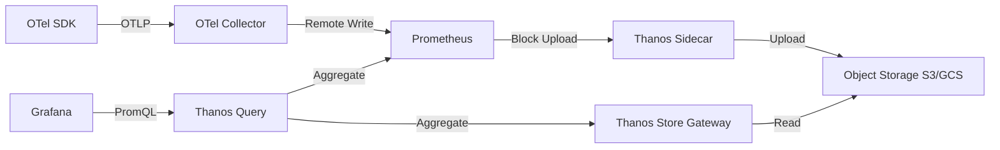

# How to Configure Thanos for Long-Term OpenTelemetry Metrics Storage

Author: [nawazdhandala](https://www.github.com/nawazdhandala)

Tags: OpenTelemetry, Thanos, Prometheus, Metrics, Long-Term Storage, Object Storage

Description: Step-by-step guide to setting up Thanos for durable long-term storage of OpenTelemetry metrics with object storage backends and global querying.

---

Prometheus works great for short-term metrics storage, but keeping months or years of OpenTelemetry metrics data in Prometheus alone is not practical. The storage costs grow quickly, retention management is limited, and you lose data when clusters fail. Thanos solves these problems by extending Prometheus with object storage for long-term retention, global querying across multiple Prometheus instances, and downsampling for efficient historical queries.

This guide walks through configuring Thanos as a long-term storage layer for OpenTelemetry metrics, from the initial Prometheus remote write setup through Thanos component deployment to query configuration.

## How Thanos Fits into the OpenTelemetry Pipeline

The typical flow starts with OpenTelemetry SDKs sending metrics via OTLP to the OpenTelemetry Collector. The collector then remote-writes these metrics to Prometheus. Thanos extends Prometheus by uploading its blocks to object storage and providing a unified query layer.



Thanos has several components, but for long-term OpenTelemetry metrics storage, you primarily need four: the Sidecar, the Store Gateway, the Compactor, and the Query frontend.

## Setting Up Prometheus with Remote Write

First, configure your OpenTelemetry Collector to export metrics via Prometheus remote write. This is the bridge between the OpenTelemetry world and the Prometheus ecosystem.

```yaml
# otel-collector-config.yaml
# Collector configured to remote write metrics to Prometheus
receivers:
  otlp:
    protocols:
      grpc:
        endpoint: 0.0.0.0:4317

processors:
  batch:
    timeout: 15s
    send_batch_size: 1000

exporters:
  # Prometheus remote write exporter sends metrics to Prometheus
  prometheusremotewrite:
    endpoint: "http://prometheus:9090/api/v1/write"
    # Resource to telemetry conversion maps OTel resource attributes
    resource_to_telemetry_conversion:
      enabled: true
    # Retry on failure to avoid data loss
    retry_on_failure:
      enabled: true
      initial_interval: 5s
      max_interval: 30s

service:
  pipelines:
    metrics:
      receivers: [otlp]
      processors: [batch]
      exporters: [prometheusremotewrite]
```

On the Prometheus side, you need to enable certain flags for Thanos compatibility. The key settings are enabling the admin API, setting external labels (required by Thanos for deduplication), and configuring appropriate retention.

```yaml
# prometheus.yml
# Prometheus configuration optimized for Thanos sidecar integration
global:
  scrape_interval: 15s
  # External labels are required by Thanos for block identification
  # Each Prometheus instance must have unique external labels
  external_labels:
    cluster: "production"
    region: "us-east-1"
    replica: "prometheus-0"

# Remote write receiver to accept data from OTel Collector
# This enables Prometheus to receive metrics via remote write API
remote_write: []

# Keep local retention short since Thanos handles long-term storage
# 2 hours is the minimum block duration Prometheus uses
storage:
  tsdb:
    retention.time: 48h
    min-block-duration: 2h
    max-block-duration: 2h
```

Launch Prometheus with the flags that Thanos needs.

```bash
# Start Prometheus with Thanos-compatible settings
# --storage.tsdb.min-block-duration and max-block-duration must match
# This ensures consistent block sizes for Thanos upload
prometheus \
  --config.file=/etc/prometheus/prometheus.yml \
  --storage.tsdb.path=/prometheus \
  --storage.tsdb.min-block-duration=2h \
  --storage.tsdb.max-block-duration=2h \
  --web.enable-lifecycle \
  --web.enable-admin-api \
  --web.enable-remote-write-receiver
```

Setting both min and max block duration to 2 hours is critical. Thanos expects consistent block sizes so it can upload and compact them reliably.

## Deploying the Thanos Sidecar

The Thanos Sidecar runs alongside each Prometheus instance. It watches for new blocks and uploads them to object storage. It also serves as a StoreAPI endpoint for the Thanos Query component.

First, create the object storage configuration.

```yaml
# thanos-storage.yaml
# Object storage configuration for Thanos block uploads
# Using S3 as the backend, but GCS and Azure Blob are also supported
type: S3
config:
  bucket: "otel-metrics-longterm"
  endpoint: "s3.us-east-1.amazonaws.com"
  region: "us-east-1"
  access_key: "${AWS_ACCESS_KEY_ID}"
  secret_key: "${AWS_SECRET_ACCESS_KEY}"
  # Use server-side encryption for data at rest
  sse_config:
    type: "SSE-S3"
```

Now deploy the sidecar.

```bash
# Run Thanos Sidecar alongside Prometheus
# It monitors the Prometheus data directory and uploads completed blocks
thanos sidecar \
  --tsdb.path=/prometheus \
  --prometheus.url=http://localhost:9090 \
  --objstore.config-file=/etc/thanos/thanos-storage.yaml \
  --grpc-address=0.0.0.0:10901 \
  --http-address=0.0.0.0:10902
```

The sidecar will start uploading completed 2-hour blocks to S3. You can verify this by checking the bucket contents after a couple of hours.

## Setting Up the Store Gateway

The Store Gateway is what makes long-term queries possible. It reads blocks from object storage and serves them through the Thanos StoreAPI. This is the component that lets you query months-old data without keeping it in Prometheus.

```bash
# Run Thanos Store Gateway for serving historical data from object storage
# It caches block metadata and index data locally for performance
thanos store \
  --data-dir=/var/thanos/store \
  --objstore.config-file=/etc/thanos/thanos-storage.yaml \
  --grpc-address=0.0.0.0:10901 \
  --http-address=0.0.0.0:10902 \
  --index-cache-size=500MB \
  --chunk-pool-size=2GB
```

The index cache and chunk pool sizes matter for query performance. For a production setup with hundreds of millions of series across months of data, increase these values based on available memory.

## Deploying the Compactor

The Compactor handles two essential tasks: compacting small blocks into larger ones and downsampling historical data. Downsampling is what makes querying long time ranges fast. Instead of scanning every raw sample over 6 months, the query can use 5-minute or 1-hour resolution data.

```bash
# Run Thanos Compactor for block compaction and downsampling
# Only one instance should run at a time to avoid conflicts
thanos compact \
  --data-dir=/var/thanos/compact \
  --objstore.config-file=/etc/thanos/thanos-storage.yaml \
  --http-address=0.0.0.0:10902 \
  --retention.resolution-raw=30d \
  --retention.resolution-5m=180d \
  --retention.resolution-1h=365d \
  --compact.concurrency=4 \
  --downsample.concurrency=4 \
  --wait
```

This retention policy keeps raw data for 30 days, 5-minute downsampled data for 180 days, and 1-hour downsampled data for a full year. The storage savings are significant. Raw OpenTelemetry metrics at 15-second intervals generate roughly 6x more data than the 5-minute downsampled equivalent.

## Configuring the Thanos Query Frontend

The Query component fans out queries to both the sidecar (for recent data) and the Store Gateway (for historical data), then merges the results. It deduplicates data from replicated Prometheus instances using the external labels.

```bash
# Run Thanos Query to provide unified PromQL interface
# It connects to all StoreAPI endpoints (sidecars and store gateways)
thanos query \
  --grpc-address=0.0.0.0:10901 \
  --http-address=0.0.0.0:9090 \
  --store=prometheus-sidecar-0:10901 \
  --store=prometheus-sidecar-1:10901 \
  --store=thanos-store-gateway:10901 \
  --query.replica-label=replica \
  --query.auto-downsampling
```

The `--query.auto-downsampling` flag is important. It automatically selects the appropriate resolution based on the query time range. Short queries use raw data for precision, while long-range queries use downsampled data for speed.

## Connecting Grafana

Point Grafana at the Thanos Query endpoint as a Prometheus data source.

```yaml
# grafana-datasource.yaml
# Grafana datasource pointing to Thanos Query for unified metrics access
apiVersion: 1
datasources:
  - name: Thanos
    type: prometheus
    access: proxy
    # Thanos Query exposes a Prometheus-compatible API
    url: http://thanos-query:9090
    isDefault: true
    jsonData:
      # Enable exemplar support for trace correlation
      exemplarTraceIdDestinations:
        - name: traceID
          datasourceUid: tempo
      # Increase timeout for long-range historical queries
      timeout: 120
```

Now your Grafana dashboards can query across the full retention period. Recent metrics come from Prometheus through the sidecar, and historical metrics come from object storage through the Store Gateway. The transition is seamless from the user's perspective.

## Monitoring the Thanos Stack

Thanos components expose their own Prometheus metrics. You should monitor a few critical signals to keep the pipeline healthy.

```promql
# Check sidecar upload success rate
# Failed uploads mean blocks are stuck in Prometheus and may be lost
rate(thanos_shipper_upload_failures_total[5m])

# Monitor Store Gateway cache hit ratio
# Low hit ratio means more object storage reads and slower queries
thanos_store_index_cache_hits_total / (thanos_store_index_cache_hits_total + thanos_store_index_cache_misses_total)

# Track compaction progress
# Compaction lag means queries over raw data take longer
thanos_compact_group_compactions_total
```

## Wrapping Up

Thanos transforms Prometheus from a short-term metrics store into a scalable long-term solution for OpenTelemetry metrics. The object storage backend keeps costs low, downsampling keeps historical queries fast, and the unified query layer makes the retention boundary invisible to users. Start with the sidecar and Store Gateway, add the Compactor once you have a few days of data in object storage, and scale by adding more Prometheus instances with sidecars as your OpenTelemetry metrics volume grows.
