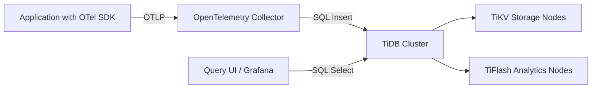

# How to Set Up TiDB for OpenTelemetry Trace Storage

Author: [nawazdhandala](https://www.github.com/nawazdhandala)

Tags: OpenTelemetry, TiDB, Trace Storage, Distributed Database, Observability

Description: A practical guide to configuring TiDB as a scalable SQL-compatible backend for storing OpenTelemetry trace data in production environments.

---

Choosing the right storage backend for your OpenTelemetry traces matters a lot. You need something that handles high write throughput, scales horizontally, and still lets you run analytical queries when you are investigating incidents. TiDB checks all of these boxes. It is a distributed SQL database that is MySQL-compatible, horizontally scalable, and well suited for the kind of time-series-like workloads that trace storage demands.

In this guide, we will walk through setting up TiDB as a trace storage backend for OpenTelemetry, from schema design to collector configuration to query patterns.

## Why TiDB for Trace Storage

Most teams default to Jaeger with Cassandra or Elasticsearch for trace storage. These work fine at moderate scale, but they come with operational complexity. TiDB offers a different set of tradeoffs that are worth considering.

TiDB supports standard SQL, so your team does not need to learn a new query language. It scales horizontally by adding more TiKV nodes, so you can grow storage and throughput without re-architecting. It also supports secondary indexes, which makes trace queries by service name, operation, or custom attributes fast without building separate indexing layers.

The MySQL wire protocol compatibility means you can use existing MySQL client libraries and tools. This reduces the integration burden significantly.

## Architecture Overview

The setup involves three main components: the OpenTelemetry Collector that receives and processes traces, TiDB that stores the trace data, and your query layer that reads traces back for visualization and analysis.



TiDB separates its compute layer (TiDB servers) from its storage layer (TiKV for row storage, TiFlash for columnar analytics). This separation is useful for trace workloads because you can scale write throughput and read performance independently.

## Setting Up the TiDB Cluster

For a production trace storage setup, you will want at least a three-node TiKV cluster. Here is a minimal TiUP topology configuration to get started.

```yaml
# tidb-topology.yaml
# TiDB cluster topology for trace storage workload
global:
  user: "tidb"
  deploy_dir: "/tidb-deploy"
  data_dir: "/tidb-data"

# TiDB SQL layer servers handle query parsing and execution
tidb_servers:
  - host: 10.0.1.1
    port: 4000
  - host: 10.0.1.2
    port: 4000

# TiKV storage nodes hold the actual trace data
tikv_servers:
  - host: 10.0.2.1
    port: 20160
  - host: 10.0.2.2
    port: 20160
  - host: 10.0.2.3
    port: 20160

# PD servers manage cluster metadata and scheduling
pd_servers:
  - host: 10.0.3.1
    port: 2379
  - host: 10.0.3.2
    port: 2379
  - host: 10.0.3.3
    port: 2379
```

Deploy the cluster using TiUP.

```bash
# Install TiUP if not already installed
curl --proto '=https' --tlsv1.2 -sSf https://tiup-mirrors.pingcap.com/install.sh | sh

# Deploy the cluster with the topology file
tiup cluster deploy otel-traces v7.5.0 tidb-topology.yaml --user root -p

# Start the cluster
tiup cluster start otel-traces
```

## Designing the Trace Schema

The schema needs to handle high-volume inserts while supporting common trace queries. Here is a schema that balances write performance with query flexibility.

```sql
-- Core spans table partitioned by time for efficient retention management
-- Partitioning allows fast drops of old data without expensive DELETE operations
CREATE TABLE spans (
    trace_id VARCHAR(32) NOT NULL,
    span_id VARCHAR(16) NOT NULL,
    parent_span_id VARCHAR(16),
    service_name VARCHAR(256) NOT NULL,
    operation_name VARCHAR(512) NOT NULL,
    start_time BIGINT NOT NULL,
    end_time BIGINT NOT NULL,
    duration_ns BIGINT NOT NULL,
    status_code TINYINT DEFAULT 0,
    status_message TEXT,
    span_kind TINYINT DEFAULT 0,
    created_at TIMESTAMP DEFAULT CURRENT_TIMESTAMP,
    PRIMARY KEY (trace_id, span_id, start_time)
) PARTITION BY RANGE (start_time) (
    PARTITION p_current VALUES LESS THAN (UNIX_TIMESTAMP('2026-03-01') * 1000000000),
    PARTITION p_future VALUES LESS THAN MAXVALUE
);

-- Separate table for span attributes to keep the main table lean
-- This avoids wide rows and allows flexible attribute queries
CREATE TABLE span_attributes (
    trace_id VARCHAR(32) NOT NULL,
    span_id VARCHAR(16) NOT NULL,
    attr_key VARCHAR(256) NOT NULL,
    attr_value TEXT,
    attr_type TINYINT DEFAULT 0,
    PRIMARY KEY (trace_id, span_id, attr_key)
);

-- Indexes for common query patterns
-- Service name lookups are the most frequent query type
CREATE INDEX idx_service_time ON spans (service_name, start_time);
CREATE INDEX idx_duration ON spans (service_name, duration_ns);
```

The partitioning strategy is important. By partitioning on `start_time`, you can drop old partitions instead of running expensive DELETE queries. This keeps write performance stable over time.

## Configuring the OpenTelemetry Collector

The OpenTelemetry Collector does not ship with a native TiDB exporter, but since TiDB speaks the MySQL protocol, you can use a custom exporter or the SQL-based exporter. Here is a collector configuration that uses the SQL exporter to write traces into TiDB.

```yaml
# otel-collector-config.yaml
# Collector configuration for TiDB trace export
receivers:
  otlp:
    protocols:
      # gRPC receiver for SDK connections
      grpc:
        endpoint: 0.0.0.0:4317
      # HTTP receiver for browser and lightweight clients
      http:
        endpoint: 0.0.0.0:4318

processors:
  # Batch spans to reduce insert frequency and improve throughput
  batch:
    timeout: 5s
    send_batch_size: 500
    send_batch_max_size: 1000

  # Add resource detection for automatic metadata
  resourcedetection:
    detectors: [env, system]
    timeout: 5s

exporters:
  # Use the contrib SQL exporter targeting TiDB via MySQL protocol
  sql:
    driver: mysql
    datasource: "otel_user:secure_password@tcp(10.0.1.1:4000)/otel_traces"
    # Table and column mapping for spans
    traces:
      table_name: spans
      attribute_table_name: span_attributes

service:
  pipelines:
    traces:
      receivers: [otlp]
      processors: [resourcedetection, batch]
      exporters: [sql]
```

If the SQL exporter does not fit your needs, another approach is to export traces via OTLP to a small bridge service that uses a MySQL client library to batch-insert into TiDB. This gives you more control over the insert logic and lets you handle backpressure more gracefully.

## Tuning Write Performance

TiDB performs best when you batch your writes. The collector's batch processor helps, but you should also tune TiDB itself.

```sql
-- Increase the transaction size limit for batch inserts
-- Default is 100MB which is usually sufficient for trace batches
SET GLOBAL tidb_mem_quota_query = 2147483648;

-- Enable prepared plan cache to speed up repeated insert patterns
-- The collector will issue the same INSERT structure repeatedly
SET GLOBAL tidb_enable_prepared_plan_cache = ON;

-- Tune the number of concurrent regions for write-heavy workloads
-- More regions means better write distribution across TiKV nodes
SET GLOBAL tidb_scatter_region = ON;
```

You should also monitor the TiKV write stall metrics. If TiKV starts stalling on writes, it usually means you need more nodes or faster disks. NVMe SSDs make a big difference for trace workloads.

## Querying Traces

One of the advantages of using TiDB is that your queries are just SQL. Here are some common trace query patterns.

```sql
-- Find traces by service name within a time window
-- The index on (service_name, start_time) makes this efficient
SELECT trace_id, operation_name, duration_ns, start_time
FROM spans
WHERE service_name = 'payment-service'
  AND start_time > UNIX_TIMESTAMP(NOW() - INTERVAL 1 HOUR) * 1000000000
ORDER BY start_time DESC
LIMIT 100;

-- Find slow traces above a duration threshold
-- Useful for identifying performance regressions
SELECT trace_id, service_name, operation_name, duration_ns / 1000000 AS duration_ms
FROM spans
WHERE duration_ns > 5000000000
  AND start_time > UNIX_TIMESTAMP(NOW() - INTERVAL 6 HOUR) * 1000000000
ORDER BY duration_ns DESC
LIMIT 50;

-- Reconstruct a full trace by collecting all its spans
-- Join with attributes to get the complete picture
SELECT s.span_id, s.parent_span_id, s.service_name, s.operation_name,
       s.duration_ns / 1000000 AS duration_ms, s.status_code,
       a.attr_key, a.attr_value
FROM spans s
LEFT JOIN span_attributes a ON s.trace_id = a.trace_id AND s.span_id = a.span_id
WHERE s.trace_id = 'abc123def456'
ORDER BY s.start_time;
```

## Managing Retention

For retention, use partition management. Create a scheduled job that drops old partitions and adds new ones.

```sql
-- Drop partitions older than 30 days
-- This is nearly instant regardless of data volume
ALTER TABLE spans DROP PARTITION p_old;

-- Add a new partition for the next month
ALTER TABLE spans ADD PARTITION (
    PARTITION p_2026_04 VALUES LESS THAN (UNIX_TIMESTAMP('2026-04-01') * 1000000000)
);
```

Automating this with a cron job or TiDB's built-in event scheduler keeps your storage usage predictable.

## Wrapping Up

TiDB is a solid choice for OpenTelemetry trace storage when you need horizontal scalability without giving up SQL. The MySQL compatibility means your existing tooling and knowledge transfer directly. The distributed architecture handles the high write throughput that trace collection demands, and the SQL query interface makes ad-hoc investigation straightforward.

Start with a small cluster, benchmark with your actual trace volume, and scale out TiKV nodes as your traffic grows. The partitioning strategy will keep your storage manageable, and the secondary indexes will keep your queries fast.
