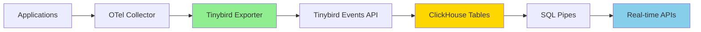

# How to Configure the Tinybird Exporter in the OpenTelemetry Collector

Author: [nawazdhandala](https://www.github.com/nawazdhandala)

Tags: OpenTelemetry, Collector, Exporters, Tinybird, Real-time Analytics, ClickHouse, Logs, Metrics, Traces

Description: Configure the Tinybird exporter in OpenTelemetry Collector to send telemetry data to Tinybird's real-time data platform for instant analytics and API generation.

Tinybird is a real-time data platform built on ClickHouse that enables instant analytics over streaming data. The Tinybird exporter for OpenTelemetry Collector allows you to send traces, metrics, and logs directly to Tinybird, where you can build real-time APIs and analytics dashboards with SQL queries. This integration is particularly powerful for organizations that need to analyze telemetry data in real-time or build customer-facing analytics.

## Understanding the Tinybird Exporter

The Tinybird exporter sends OpenTelemetry data to Tinybird's Events API, which ingests data into ClickHouse tables optimized for analytical queries. Unlike traditional observability backends focused on dashboards and alerting, Tinybird excels at powering data products and APIs that need to query telemetry data with sub-second latency.

Key capabilities include:

- **Real-time Ingestion**: Data is available for querying within seconds of ingestion
- **SQL-based Analytics**: Query telemetry data using familiar SQL syntax
- **API Generation**: Transform queries into production-ready APIs automatically
- **Cost-effective Storage**: ClickHouse's columnar storage reduces costs for high-volume data

## Architecture Overview

Here's how the Tinybird exporter integrates into your data pipeline:



## Prerequisites

Before configuring the Tinybird exporter, you need:

1. A Tinybird account (sign up at tinybird.co)
2. A Tinybird workspace with an authentication token
3. Data Sources created in Tinybird for your telemetry types
4. OpenTelemetry Collector with the Tinybird exporter component

## Setting Up Tinybird Data Sources

First, create Data Sources in Tinybird to receive your telemetry data. Here's an example schema for traces:

```sql
-- Tinybird Data Source schema for traces
SCHEMA >
    `trace_id` String,
    `span_id` String,
    `parent_span_id` String,
    `trace_state` String,
    `name` String,
    `kind` String,
    `start_time` DateTime64(9),
    `end_time` DateTime64(9),
    `duration_ns` UInt64,
    `status_code` String,
    `status_message` String,
    `service_name` String,
    `resource_attributes` String,
    `span_attributes` String

ENGINE "MergeTree"
ENGINE_PARTITION_KEY "toYYYYMM(start_time)"
ENGINE_SORTING_KEY "service_name, name, start_time"
```

## Basic Configuration

Here's a basic configuration to send data to Tinybird:

```yaml
# Basic Tinybird exporter configuration
exporters:
  tinybird:
    # Tinybird API endpoint (regional endpoint)
    endpoint: https://api.tinybird.co

    # Your Tinybird authentication token
    # Store this securely in environment variables
    token: ${env:TINYBIRD_TOKEN}

    # Data Source name for traces in Tinybird
    datasource: otel_traces

    # Timeout for HTTP requests
    timeout: 30s

receivers:
  otlp:
    protocols:
      grpc:
        endpoint: 0.0.0.0:4317
      http:
        endpoint: 0.0.0.0:4318

processors:
  batch:
    # Batch data for efficient ingestion
    timeout: 10s
    send_batch_size: 1000

service:
  pipelines:
    traces:
      receivers: [otlp]
      processors: [batch]
      exporters: [tinybird]
```

## Advanced Traces Configuration

For production deployments, configure the exporter with retry logic and resource attributes:

```yaml
exporters:
  tinybird/traces:
    # Tinybird regional endpoint
    # Options: api.tinybird.co (US), api.eu-central-1.tinybird.co (EU)
    endpoint: https://api.tinybird.co

    # Authentication token with write permissions
    token: ${env:TINYBIRD_TRACES_TOKEN}

    # Data Source name in Tinybird
    datasource: production_traces

    # HTTP client configuration
    timeout: 45s

    # Headers for additional metadata
    headers:
      x-environment: production
      x-team: platform

    # Retry configuration for failed requests
    retry_on_failure:
      enabled: true
      initial_interval: 5s
      max_interval: 30s
      max_elapsed_time: 300s

    # Queue settings for handling backpressure
    sending_queue:
      enabled: true
      num_consumers: 10
      queue_size: 5000
      storage_type: file_storage

    # Compression for data transfer
    compression: gzip

receivers:
  otlp:
    protocols:
      grpc:
        endpoint: 0.0.0.0:4317
        max_recv_msg_size_mib: 32

processors:
  # Batch processor optimized for Tinybird
  batch:
    timeout: 10s
    send_batch_size: 2000
    send_batch_max_size: 5000

  # Add resource attributes
  resource:
    attributes:
      - key: deployment.environment
        value: production
        action: upsert
      - key: service.namespace
        value: ecommerce
        action: upsert

  # Transform span data for Tinybird schema
  transform:
    trace_statements:
      - context: span
        statements:
          # Extract duration in nanoseconds
          - set(attributes["duration_ns"], (end_time_unix_nano() - start_time_unix_nano()))
          # Flatten resource attributes to JSON string
          - set(attributes["resource_attributes"], ConvertAttributesToString(resource.attributes))

service:
  pipelines:
    traces:
      receivers: [otlp]
      processors: [resource, transform, batch]
      exporters: [tinybird/traces]
```

## Configuring Metrics Export

Send metrics to Tinybird for real-time analytics and aggregations:

```yaml
exporters:
  tinybird/metrics:
    endpoint: https://api.tinybird.co
    token: ${env:TINYBIRD_METRICS_TOKEN}
    datasource: production_metrics

    # Configuration for metrics-specific handling
    timeout: 30s

    retry_on_failure:
      enabled: true
      initial_interval: 5s
      max_interval: 30s
      max_elapsed_time: 300s

    sending_queue:
      enabled: true
      num_consumers: 8
      queue_size: 10000

    compression: gzip

receivers:
  otlp:
    protocols:
      grpc:
        endpoint: 0.0.0.0:4317

  # Collect host metrics
  hostmetrics:
    collection_interval: 30s
    scrapers:
      cpu:
      memory:
      disk:
      network:
      load:

  # Scrape Prometheus metrics
  prometheus:
    config:
      scrape_configs:
        - job_name: 'application'
          scrape_interval: 30s
          static_configs:
            - targets: ['localhost:8080']

processors:
  batch:
    timeout: 10s
    send_batch_size: 1000

  # Transform metrics for Tinybird
  metricstransform:
    transforms:
      - include: .*
        match_type: regexp
        action: update
        operations:
          # Add environment label to all metrics
          - action: add_label
            new_label: environment
            new_value: production

  resource:
    attributes:
      - key: service.name
        value: my-service
        action: upsert

service:
  pipelines:
    metrics:
      receivers: [otlp, hostmetrics, prometheus]
      processors: [resource, metricstransform, batch]
      exporters: [tinybird/metrics]
```

## Configuring Logs Export

Configure the exporter to send structured logs to Tinybird:

```yaml
exporters:
  tinybird/logs:
    endpoint: https://api.tinybird.co
    token: ${env:TINYBIRD_LOGS_TOKEN}
    datasource: application_logs

    timeout: 30s

    retry_on_failure:
      enabled: true
      initial_interval: 5s
      max_interval: 60s
      max_elapsed_time: 600s

    sending_queue:
      enabled: true
      num_consumers: 5
      queue_size: 20000

    compression: gzip

receivers:
  otlp:
    protocols:
      grpc:
        endpoint: 0.0.0.0:4317

  # File log collection
  filelog:
    include:
      - /var/log/app/*.log
      - /var/log/app/**/*.log
    exclude:
      - /var/log/app/*.gz

    # Parse JSON logs
    operators:
      - type: json_parser
        parse_from: body
        timestamp:
          parse_from: attributes.timestamp
          layout: '%Y-%m-%dT%H:%M:%S.%LZ'

      # Add severity level parsing
      - type: severity_parser
        parse_from: attributes.level
        mapping:
          debug: debug
          info: info
          warn: warn
          error: error
          fatal: fatal

processors:
  batch:
    timeout: 5s
    send_batch_size: 500

  # Filter out noisy logs
  filter:
    logs:
      exclude:
        match_type: regexp
        record_attributes:
          - key: message
            value: ".*health check.*"

  resource:
    attributes:
      - key: service.name
        value: web-application
        action: upsert
      - key: host.name
        value: ${env:HOSTNAME}
        action: upsert

service:
  pipelines:
    logs:
      receivers: [otlp, filelog]
      processors: [filter, resource, batch]
      exporters: [tinybird/logs]
```

## Complete Multi-Signal Configuration

Here's a comprehensive configuration handling all three signal types:

```yaml
receivers:
  # OTLP receivers for all signal types
  otlp:
    protocols:
      grpc:
        endpoint: 0.0.0.0:4317
      http:
        endpoint: 0.0.0.0:4318

  # Host metrics collection
  hostmetrics:
    collection_interval: 30s
    scrapers:
      cpu:
      memory:
      disk:
      network:

  # Application logs
  filelog:
    include:
      - /var/log/app/*.log

processors:
  # Separate batch processors for different signal types
  batch/traces:
    timeout: 10s
    send_batch_size: 2000

  batch/metrics:
    timeout: 10s
    send_batch_size: 1000

  batch/logs:
    timeout: 5s
    send_batch_size: 500

  # Resource processor for common attributes
  resource:
    attributes:
      - key: deployment.environment
        value: production
        action: upsert
      - key: service.namespace
        value: platform
        action: upsert

  # Memory limiter to prevent OOM
  memory_limiter:
    check_interval: 1s
    limit_mib: 2048
    spike_limit_mib: 512

exporters:
  # Traces exporter to Tinybird
  tinybird/traces:
    endpoint: https://api.tinybird.co
    token: ${env:TINYBIRD_TRACES_TOKEN}
    datasource: prod_traces
    timeout: 45s
    compression: gzip
    retry_on_failure:
      enabled: true
      initial_interval: 5s
      max_interval: 30s
    sending_queue:
      enabled: true
      num_consumers: 10
      queue_size: 5000

  # Metrics exporter to Tinybird
  tinybird/metrics:
    endpoint: https://api.tinybird.co
    token: ${env:TINYBIRD_METRICS_TOKEN}
    datasource: prod_metrics
    timeout: 30s
    compression: gzip
    retry_on_failure:
      enabled: true
      initial_interval: 5s
      max_interval: 30s
    sending_queue:
      enabled: true
      num_consumers: 8
      queue_size: 10000

  # Logs exporter to Tinybird
  tinybird/logs:
    endpoint: https://api.tinybird.co
    token: ${env:TINYBIRD_LOGS_TOKEN}
    datasource: prod_logs
    timeout: 30s
    compression: gzip
    retry_on_failure:
      enabled: true
      initial_interval: 5s
      max_interval: 60s
    sending_queue:
      enabled: true
      num_consumers: 5
      queue_size: 20000

service:
  pipelines:
    traces:
      receivers: [otlp]
      processors: [memory_limiter, resource, batch/traces]
      exporters: [tinybird/traces]

    metrics:
      receivers: [otlp, hostmetrics]
      processors: [memory_limiter, resource, batch/metrics]
      exporters: [tinybird/metrics]

    logs:
      receivers: [otlp, filelog]
      processors: [memory_limiter, resource, batch/logs]
      exporters: [tinybird/logs]
```

## Data Transformation Pipeline

Use Tinybird's SQL Pipes to transform raw telemetry data into analytics:

```sql
-- Tinybird Pipe: Calculate request latency by endpoint
NODE request_latencies
SQL >
    SELECT
        name as endpoint,
        service_name,
        quantile(0.50)(duration_ns / 1000000) as p50_ms,
        quantile(0.95)(duration_ns / 1000000) as p95_ms,
        quantile(0.99)(duration_ns / 1000000) as p99_ms,
        count() as request_count,
        toStartOfMinute(start_time) as minute
    FROM otel_traces
    WHERE start_time >= now() - INTERVAL 1 HOUR
    AND kind = 'server'
    GROUP BY endpoint, service_name, minute
    ORDER BY minute DESC

-- Publish as an API endpoint
TYPE materialized
DATASOURCE request_latencies_mv
```

## Real-time Analytics Example

Create a real-time error rate API using Tinybird:

```sql
-- Tinybird Pipe: Real-time error rate by service
NODE error_rates
SQL >
    SELECT
        service_name,
        countIf(status_code = 'ERROR') as error_count,
        count() as total_count,
        (error_count / total_count) * 100 as error_rate_pct,
        toStartOfMinute(start_time) as time_bucket
    FROM otel_traces
    WHERE start_time >= now() - INTERVAL 5 MINUTE
    GROUP BY service_name, time_bucket
    ORDER BY time_bucket DESC, error_rate_pct DESC

-- Expose as REST API
TYPE endpoint
```

## Security Best Practices

When deploying the Tinybird exporter in production:

1. **Token Management**: Store Tinybird tokens in secure secret management systems like HashiCorp Vault or Kubernetes Secrets.

2. **Separate Tokens**: Use separate tokens for different data sources to limit blast radius if a token is compromised.

3. **Network Security**: Ensure collectors can only access Tinybird API endpoints and restrict ingress to necessary ports.

4. **Data Sanitization**: Remove sensitive data from telemetry before sending to Tinybird using processors.

5. **Regional Endpoints**: Use the appropriate regional endpoint to ensure data residency compliance.

## Performance Optimization

Optimize Tinybird ingestion performance with these settings:

```yaml
exporters:
  tinybird:
    endpoint: https://api.tinybird.co
    token: ${env:TINYBIRD_TOKEN}
    datasource: high_volume_traces

    # Optimize for high throughput
    timeout: 60s
    compression: gzip

    # Increase batch sizes for better throughput
    sending_queue:
      enabled: true
      num_consumers: 20
      queue_size: 10000

processors:
  batch:
    # Larger batches reduce API calls
    timeout: 15s
    send_batch_size: 5000
    send_batch_max_size: 10000
```

## Monitoring and Troubleshooting

Common issues and solutions:

**Authentication Errors**: Verify your Tinybird token has write permissions for the specified data source.

**Schema Mismatches**: Ensure your OpenTelemetry data structure matches the Tinybird Data Source schema.

**Rate Limiting**: If you hit rate limits, increase batch sizes and reduce the number of concurrent consumers.

**Data Not Appearing**: Check the Tinybird Data Source statistics to verify data is being ingested. Query the Data Source directly to debug.

**Performance Issues**: Monitor queue sizes and adjust batch settings based on your data volume.

## Best Practices

1. **Design Schemas First**: Plan your Tinybird Data Source schemas to match your analytics requirements before configuring the exporter.

2. **Use Materialized Views**: Create Materialized Views in Tinybird for frequently accessed aggregations to improve query performance.

3. **Implement Sampling**: For high-volume traces, use sampling to reduce costs while maintaining visibility.

4. **Monitor Ingestion**: Track ingestion rates and latencies using Tinybird's built-in statistics.

5. **Optimize Sorting Keys**: Design your Tinybird table sorting keys based on your query patterns for optimal performance.

## Related Resources

Learn more about OpenTelemetry and real-time analytics:

- [OpenTelemetry Data Model Explained](https://oneuptime.com/blog/post/2026-02-06-opentelemetry-data-model-beginners/view)
- [Building Real-time Observability Dashboards](https://oneuptime.com/blog/post/2026-01-25-build-realtime-dashboards-fastapi/view)

## Conclusion

The Tinybird exporter enables powerful real-time analytics capabilities over your OpenTelemetry data. By combining OpenTelemetry's comprehensive telemetry collection with Tinybird's SQL-based analytics and API generation, you can build sophisticated data products and internal tools that provide instant insights into your system's behavior. Start with basic configuration and gradually add more sophisticated transformations and analytics as your needs evolve.
