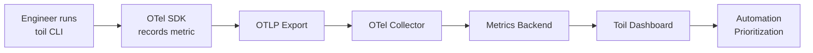

# How to Implement Toil Measurement and Tracking with OpenTelemetry Custom Metrics

Author: [nawazdhandala](https://www.github.com/nawazdhandala)

Tags: OpenTelemetry, SRE, Toil, Custom Metrics

Description: Learn how to define, instrument, and track operational toil using OpenTelemetry custom metrics to quantify manual work and drive automation priorities.

Toil is the kind of work tied to running a production service that tends to be manual, repetitive, automatable, tactical, and devoid of enduring value. Google's SRE book defines it clearly, but measuring it remains a challenge for most teams. Without concrete numbers, toil discussions become subjective, and automation investments lack justification.

OpenTelemetry custom metrics give you a structured way to capture toil data right where it happens - in your operational workflows, runbooks, and tooling scripts. This post walks through building a toil measurement system using OpenTelemetry's metrics API.

## Defining Toil Categories

Before instrumenting anything, you need a taxonomy. A practical starting point includes these categories:

- **Manual remediation** - human actions taken to fix alerts
- **Deployment babysitting** - watching deploys instead of trusting automation
- **Ticket grooming** - repetitive triage of recurring issues
- **Configuration changes** - hand-editing configs that should be templated
- **Data cleanup** - manual database or cache interventions

Each category becomes a label on your metrics, letting you slice and filter later.

## Setting Up the OpenTelemetry Metrics SDK

Here is the basic Python setup for creating a meter provider and exporting metrics via OTLP.

```python
# toil_metrics.py - Initialize OpenTelemetry metrics for toil tracking
from opentelemetry import metrics
from opentelemetry.sdk.metrics import MeterProvider
from opentelemetry.sdk.metrics.export import PeriodicExportingMetricReader
from opentelemetry.exporter.otlp.proto.grpc.metric_exporter import OTLPMetricExporter

# Configure the OTLP exporter pointing at your collector
exporter = OTLPMetricExporter(endpoint="http://otel-collector:4317", insecure=True)

# Export metrics every 60 seconds
reader = PeriodicExportingMetricReader(exporter, export_interval_millis=60000)

# Set up the meter provider globally
provider = MeterProvider(metric_readers=[reader])
metrics.set_meter_provider(provider)

# Create a meter scoped to toil tracking
meter = metrics.get_meter("toil.tracker", version="1.0.0")
```

## Creating Toil-Specific Instruments

OpenTelemetry offers several instrument types. For toil tracking, counters and histograms work best. Counters track how many toil events occur, while histograms capture duration.

```python
# Define instruments for tracking toil occurrences and duration
toil_event_counter = meter.create_counter(
    name="toil.events.total",
    description="Total number of toil events recorded",
    unit="1",
)

toil_duration_histogram = meter.create_histogram(
    name="toil.duration.seconds",
    description="Time spent on toil activities in seconds",
    unit="s",
)

toil_automation_gauge = meter.create_up_down_counter(
    name="toil.automation.backlog",
    description="Number of toil items pending automation",
    unit="1",
)
```

## Recording Toil Events in Practice

Wrap your operational scripts and runbooks with toil recording calls. Here is an example of a script that performs manual cache clearing - a common toil activity.

```python
import time

def clear_stale_cache(service_name: str, region: str):
    """Manual cache clear - tracked as toil."""
    start_time = time.time()

    # Record that this toil event happened
    toil_event_counter.add(1, attributes={
        "toil.category": "manual_remediation",
        "toil.task": "cache_clear",
        "service.name": service_name,
        "deployment.region": region,
        "toil.automatable": True,  # Flag for automation candidates
    })

    # ... actual cache clearing logic here ...
    perform_cache_clear(service_name, region)

    # Record how long it took
    elapsed = time.time() - start_time
    toil_duration_histogram.record(elapsed, attributes={
        "toil.category": "manual_remediation",
        "toil.task": "cache_clear",
        "service.name": service_name,
    })
```

## Building a Toil Recording CLI

Teams are more likely to track toil if it is easy to log. A simple CLI wrapper makes it frictionless.

```python
# toil_cli.py - Quick CLI for logging toil from the terminal
import argparse
import time

def main():
    parser = argparse.ArgumentParser(description="Record a toil event")
    parser.add_argument("--category", required=True,
                        choices=["manual_remediation", "deployment_babysitting",
                                 "ticket_grooming", "config_change", "data_cleanup"])
    parser.add_argument("--task", required=True, help="Short description of the task")
    parser.add_argument("--service", required=True, help="Affected service name")
    parser.add_argument("--duration-minutes", type=float, required=True,
                        help="How long the task took in minutes")
    parser.add_argument("--automatable", action="store_true", default=False)

    args = parser.parse_args()

    # Record the event
    toil_event_counter.add(1, attributes={
        "toil.category": args.category,
        "toil.task": args.task,
        "service.name": args.service,
        "toil.automatable": args.automatable,
    })

    # Record duration (convert minutes to seconds)
    toil_duration_histogram.record(args.duration_minutes * 60, attributes={
        "toil.category": args.category,
        "toil.task": args.task,
        "service.name": args.service,
    })

    print(f"Recorded {args.duration_minutes}m of toil: {args.task}")

if __name__ == "__main__":
    main()
```

Usage is straightforward:

```bash
# Log a 15-minute manual cache clear
python toil_cli.py \
  --category manual_remediation \
  --task "clear-user-session-cache" \
  --service auth-service \
  --duration-minutes 15 \
  --automatable
```

## OpenTelemetry Collector Pipeline for Toil Metrics

Configure your collector to receive toil metrics and route them to your backend. This config adds a filter to separate toil metrics from application metrics.

```yaml
# otel-collector-config.yaml
receivers:
  otlp:
    protocols:
      grpc:
        endpoint: 0.0.0.0:4317

processors:
  # Batch toil metrics for efficient export
  batch:
    send_batch_size: 100
    timeout: 10s

  # Add team ownership metadata
  attributes:
    actions:
      - key: team
        value: "platform-sre"
        action: upsert

exporters:
  # Send to your metrics backend (Prometheus, OneUptime, etc.)
  otlp/backend:
    endpoint: "https://otel.oneuptime.com:4317"

service:
  pipelines:
    metrics/toil:
      receivers: [otlp]
      processors: [attributes, batch]
      exporters: [otlp/backend]
```

## Tracking Flow

This diagram shows how toil data flows from engineers through the system.



## Querying and Acting on Toil Data

Once metrics flow into your backend, build queries to surface the most impactful automation targets. Key queries to create:

- **Top toil categories by total time** - shows where engineers spend the most manual effort
- **Toil events per service** - identifies which services generate the most operational burden
- **Automatable toil ratio** - percentage of toil flagged as automatable vs. total toil
- **Toil trend over time** - confirms whether automation investments are reducing burden

A useful target: Google recommends keeping toil below 50% of an SRE team's time. With these metrics, you can measure exactly where you stand and track progress as you automate tasks away.

## Key Takeaways

Toil measurement works best when it is embedded in the tools engineers already use. By exposing toil as OpenTelemetry custom metrics, you get the same pipeline, querying, and alerting capabilities you already have for application metrics. The data becomes concrete evidence for prioritizing automation work, and the trend lines show whether your investment is paying off.

Start with one or two toil categories, instrument the scripts involved, and expand from there. The goal is not perfect measurement on day one - it is building the habit of making toil visible.
