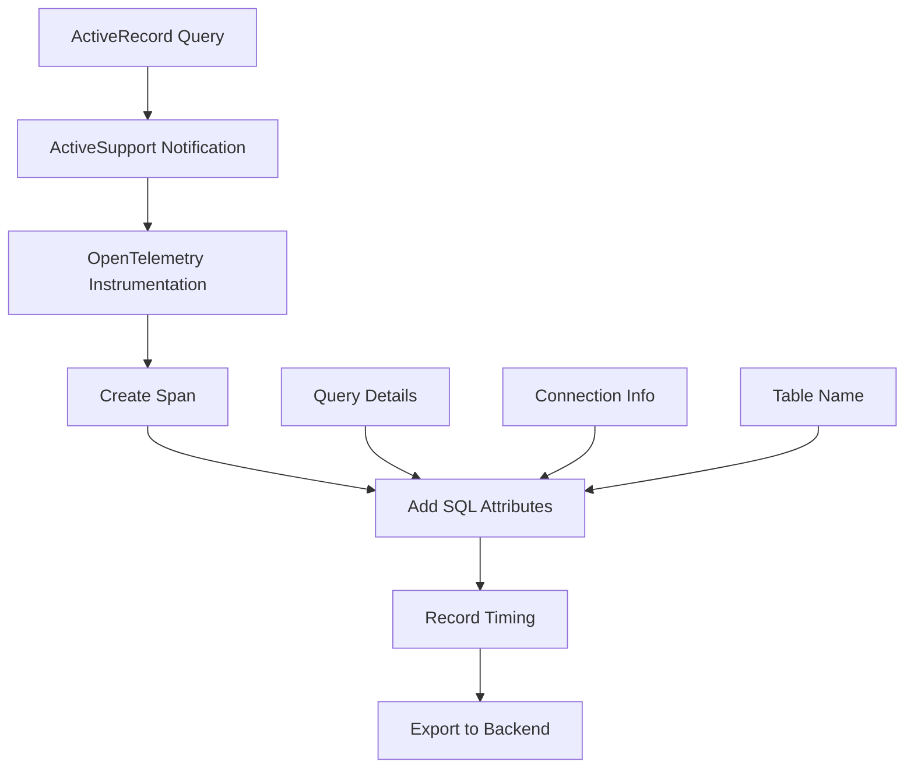

# How to Trace ActiveRecord Database Queries with OpenTelemetry in Rails

Author: [nawazdhandala](https://www.github.com/nawazdhandala)

Tags: OpenTelemetry, Ruby, Rails, ActiveRecord, Database, SQL Tracing

Description: Comprehensive guide to instrumenting ActiveRecord database queries with OpenTelemetry in Rails for detailed SQL performance monitoring and optimization insights.

Database queries often account for the largest portion of response time in Rails applications. OpenTelemetry's ActiveRecord instrumentation automatically captures SQL queries, execution times, and connection pool metrics, giving you the visibility needed to identify and fix performance bottlenecks.

## Understanding ActiveRecord Instrumentation

The OpenTelemetry ActiveRecord instrumentation hooks into Rails' ActiveSupport::Notifications system to capture database operations. Every query generates a span with detailed information about the SQL statement, database connection, and timing.



This automatic instrumentation requires no code changes in your models or controllers. Simply configure the instrumentation and every database query becomes visible in your traces.

## Installing ActiveRecord Instrumentation

Add the OpenTelemetry ActiveRecord instrumentation gem to your Gemfile:

```ruby
# Gemfile
gem 'opentelemetry-sdk'
gem 'opentelemetry-exporter-otlp'
gem 'opentelemetry-instrumentation-active_record'
```

Install the gems:

```bash
bundle install
```

The `opentelemetry-instrumentation-active_record` gem specifically targets ActiveRecord, providing focused instrumentation without pulling in dependencies for other frameworks.

## Basic Configuration

Configure ActiveRecord instrumentation in your Rails initializer with default settings:

```ruby
# config/initializers/opentelemetry.rb

require 'opentelemetry/sdk'
require 'opentelemetry/exporter/otlp'
require 'opentelemetry/instrumentation/active_record'

OpenTelemetry::SDK.configure do |c|
  c.service_name = 'rails-app'

  # Enable ActiveRecord instrumentation with defaults
  c.use 'OpenTelemetry::Instrumentation::ActiveRecord'
end
```

This basic configuration creates a span for every database query, capturing the SQL statement and execution time.

## Enabling SQL Obfuscation

Production applications must protect sensitive data in SQL queries. Enable SQL obfuscation to replace parameter values with placeholders:

```ruby
# config/initializers/opentelemetry.rb

require 'opentelemetry/sdk'
require 'opentelemetry/exporter/otlp'
require 'opentelemetry/instrumentation/active_record'

OpenTelemetry::SDK.configure do |c|
  c.service_name = 'rails-app'

  # Enable ActiveRecord instrumentation with SQL obfuscation
  c.use 'OpenTelemetry::Instrumentation::ActiveRecord', {
    enable_sql_obfuscation: true,
    db_statement: :include
  }
end
```

With obfuscation enabled, a query like:

```sql
SELECT * FROM users WHERE email = 'user@example.com' AND age > 25
```

Becomes:

```sql
SELECT * FROM users WHERE email = ? AND age > ?
```

This protects personally identifiable information (PII) and credentials while still showing query structure for debugging.

## Capturing Detailed Query Information

Configure the instrumentation to capture comprehensive query details:

```ruby
# config/initializers/opentelemetry.rb

require 'opentelemetry/sdk'
require 'opentelemetry/exporter/otlp'
require 'opentelemetry/instrumentation/active_record'

OpenTelemetry::SDK.configure do |c|
  c.service_name = 'rails-app'

  c.use 'OpenTelemetry::Instrumentation::ActiveRecord', {
    # Include SQL statements in spans (obfuscated)
    db_statement: :include,

    # Enable SQL obfuscation for security
    enable_sql_obfuscation: true,

    # Include database connection pool information
    enable_connection_pool_metrics: true
  }

  c.resource = OpenTelemetry::SDK::Resources::Resource.create({
    'service.name' => 'rails-app',
    'db.system' => 'postgresql',  # or 'mysql', 'sqlite3'
    'db.name' => ENV['DATABASE_NAME']
  })
end
```

This configuration captures SQL statements, connection pool metrics, and database system information, providing a complete picture of database interactions.

## Understanding Span Attributes

ActiveRecord instrumentation adds these attributes to each database span:

```ruby
# Example span attributes created by ActiveRecord instrumentation:
{
  'db.system' => 'postgresql',
  'db.name' => 'production_db',
  'db.statement' => 'SELECT * FROM users WHERE id = ?',
  'db.operation' => 'SELECT',
  'db.sql.table' => 'users',
  'db.connection_id' => 70339925226840,
  'net.peer.name' => 'localhost',
  'net.peer.port' => 5432
}
```

These attributes enable powerful filtering and analysis in your observability platform. You can query for slow queries on specific tables, analyze connection pool usage, or identify queries to particular database hosts.

## Tracing Complex Queries

ActiveRecord instrumentation automatically captures all query types, including complex joins and subqueries:

```ruby
# app/models/user.rb
class User < ApplicationRecord
  has_many :orders
  has_many :reviews
end

# app/controllers/users_controller.rb
class UsersController < ApplicationController
  def show
    # This eager loading generates multiple SQL queries
    # OpenTelemetry captures each one as a separate span
    @user = User
      .includes(:orders, :reviews)
      .where(id: params[:id])
      .first

    # Each query becomes a span:
    # 1. SELECT * FROM users WHERE id = ?
    # 2. SELECT * FROM orders WHERE user_id IN (?)
    # 3. SELECT * FROM reviews WHERE user_id IN (?)
  end
end
```

The trace shows all three queries as child spans under the controller action span, revealing the N+1 query pattern or validating that eager loading works correctly.

## Monitoring N+1 Queries

N+1 queries are a common performance problem in Rails applications. OpenTelemetry traces make them obvious:

```ruby
# app/controllers/posts_controller.rb
class PostsController < ApplicationController
  def index
    # This code triggers N+1 queries
    @posts = Post.all

    # In the view, this generates one query per post
    # @posts.each do |post|
    #   post.author.name  # Triggers: SELECT * FROM users WHERE id = ?
    # end
  end
end
```

The trace reveals dozens of individual `SELECT * FROM users WHERE id = ?` spans, making the N+1 problem immediately visible.

Fix it with eager loading:

```ruby
class PostsController < ApplicationController
  def index
    # Eager load authors to prevent N+1
    @posts = Post.includes(:author).all

    # Now the trace shows only two queries:
    # 1. SELECT * FROM posts
    # 2. SELECT * FROM users WHERE id IN (...)
  end
end
```

The improved trace shows just two database spans instead of N+1, confirming the optimization worked.

## Tracking Connection Pool Usage

Database connection pools are critical for performance. Monitor pool usage with custom spans:

```ruby
# app/models/concerns/connection_pool_tracking.rb
module ConnectionPoolTracking
  extend ActiveSupport::Concern

  class_methods do
    def with_pool_tracking(&block)
      tracer = OpenTelemetry.tracer_provider.tracer('activerecord')

      tracer.in_span('activerecord.connection_pool') do |span|
        pool = ActiveRecord::Base.connection_pool

        # Add connection pool metrics as span attributes
        span.set_attribute('db.connection_pool.size', pool.size)
        span.set_attribute('db.connection_pool.connections', pool.connections.size)
        span.set_attribute('db.connection_pool.available', pool.available_connection_count)
        span.set_attribute('db.connection_pool.waiting', pool.num_waiting_in_queue)

        block.call
      end
    end
  end
end
```

Use this tracking in high-traffic endpoints:

```ruby
class ReportsController < ApplicationController
  def generate
    User.with_pool_tracking do
      # Complex database operations
      @report = generate_complex_report
    end
  end
end
```

The trace shows connection pool state before and after the operation, helping identify connection exhaustion problems.

## Filtering Noisy Queries

Some queries generate excessive spans that clutter traces. Filter them out with a custom span processor:

```ruby
# config/initializers/opentelemetry.rb

require 'opentelemetry/sdk'
require 'opentelemetry/exporter/otlp'
require 'opentelemetry/instrumentation/active_record'

# Custom processor to filter out noisy queries
class QueryFilterProcessor < OpenTelemetry::SDK::Trace::SpanProcessor
  FILTERED_QUERIES = [
    /SELECT 1/,  # Health checks
    /SHOW TABLES/,
    /schema_migrations/
  ].freeze

  def initialize(wrapped_processor)
    @wrapped_processor = wrapped_processor
  end

  def on_start(span, parent_context)
    @wrapped_processor.on_start(span, parent_context)
  end

  def on_finish(span)
    # Check if this is a database span with a filtered query
    statement = span.attributes['db.statement']

    if statement && FILTERED_QUERIES.any? { |pattern| statement =~ pattern }
      # Don't export this span
      return
    end

    @wrapped_processor.on_finish(span)
  end

  def force_flush(timeout: nil)
    @wrapped_processor.force_flush(timeout: timeout)
  end

  def shutdown(timeout: nil)
    @wrapped_processor.shutdown(timeout: timeout)
  end
end

OpenTelemetry::SDK.configure do |c|
  c.service_name = 'rails-app'
  c.use 'OpenTelemetry::Instrumentation::ActiveRecord', {
    enable_sql_obfuscation: true
  }

  # Wrap the batch processor with query filtering
  exporter = OpenTelemetry::Exporter::OTLP::Exporter.new
  batch_processor = OpenTelemetry::SDK::Trace::Export::BatchSpanProcessor.new(exporter)
  filter_processor = QueryFilterProcessor.new(batch_processor)

  c.add_span_processor(filter_processor)
end
```

This processor drops spans for health check queries and schema migrations, reducing noise in your traces.

## Correlating Queries with Business Operations

Link database queries to business operations by adding custom attributes:

```ruby
# app/services/order_processor.rb
class OrderProcessor
  def self.process(order)
    tracer = OpenTelemetry.tracer_provider.tracer('app')

    tracer.in_span('order.process', attributes: {
      'order.id' => order.id,
      'order.total' => order.total,
      'customer.id' => order.customer_id
    }) do |span|
      # All database queries within this block are child spans
      # They automatically link to the order processing operation

      order.mark_as_processing!
      payment = process_payment(order)
      order.mark_as_paid! if payment.successful?
      notify_customer(order)

      span.set_attribute('order.status', order.status)
      span.set_attribute('payment.status', payment.status)
    end
  end

  def self.process_payment(order)
    # Database queries here become child spans
    Payment.create!(
      order: order,
      amount: order.total,
      status: 'processing'
    )
  end

  def self.notify_customer(order)
    # More database queries as child spans
    Notification.create!(
      user_id: order.customer_id,
      message: "Order #{order.id} confirmed"
    )
  end
end
```

The trace shows a hierarchy: the order processing span contains all database query spans, making it easy to see which queries contribute to the overall operation time.

## Analyzing Query Performance

Use trace data to identify slow queries and optimization opportunities:

```ruby
# Example trace analysis in your observability platform:

# Find queries taking longer than 100ms
db.statement EXISTS AND span.duration > 100ms

# Find queries on specific tables
db.sql.table = "users" AND span.duration > 50ms

# Find N+1 query patterns
db.operation = "SELECT" AND span.count > 10 AND parent.name = "UsersController#index"

# Find connection pool exhaustion
db.connection_pool.available = 0
```

These queries help you systematically identify and fix performance problems in production.

## Testing Database Instrumentation

Verify ActiveRecord instrumentation works correctly in your test suite:

```ruby
# spec/instrumentation/active_record_spec.rb
require 'rails_helper'

RSpec.describe 'ActiveRecord Instrumentation' do
  let(:exporter) { OpenTelemetry::SDK::Trace::Export::InMemorySpanExporter.new }
  let(:span_processor) { OpenTelemetry::SDK::Trace::Export::SimpleSpanProcessor.new(exporter) }

  before do
    OpenTelemetry.tracer_provider.add_span_processor(span_processor)
  end

  after do
    exporter.reset
  end

  it 'creates spans for database queries' do
    User.create!(name: 'Test User', email: 'test@example.com')

    spans = exporter.finished_spans
    db_spans = spans.select { |s| s.name.start_with?('INSERT') }

    expect(db_spans).not_to be_empty
    expect(db_spans.first.attributes['db.statement']).to include('INSERT INTO users')
  end

  it 'obfuscates SQL parameters' do
    User.where(email: 'test@example.com').first

    spans = exporter.finished_spans
    select_span = spans.find { |s| s.name.start_with?('SELECT') }

    expect(select_span.attributes['db.statement']).to include('?')
    expect(select_span.attributes['db.statement']).not_to include('test@example.com')
  end

  it 'captures table names' do
    Post.all.to_a

    spans = exporter.finished_spans
    select_span = spans.find { |s| s.name.start_with?('SELECT') }

    expect(select_span.attributes['db.sql.table']).to eq('posts')
  end
end
```

These tests confirm that instrumentation creates the expected spans with proper obfuscation and attributes.

ActiveRecord instrumentation gives you unprecedented visibility into database performance. With automatic query tracing, SQL obfuscation, and detailed span attributes, you can identify N+1 queries, optimize slow queries, and monitor connection pool health without modifying your application code. The traces provide the data needed to make informed optimization decisions and maintain database performance as your application scales.

