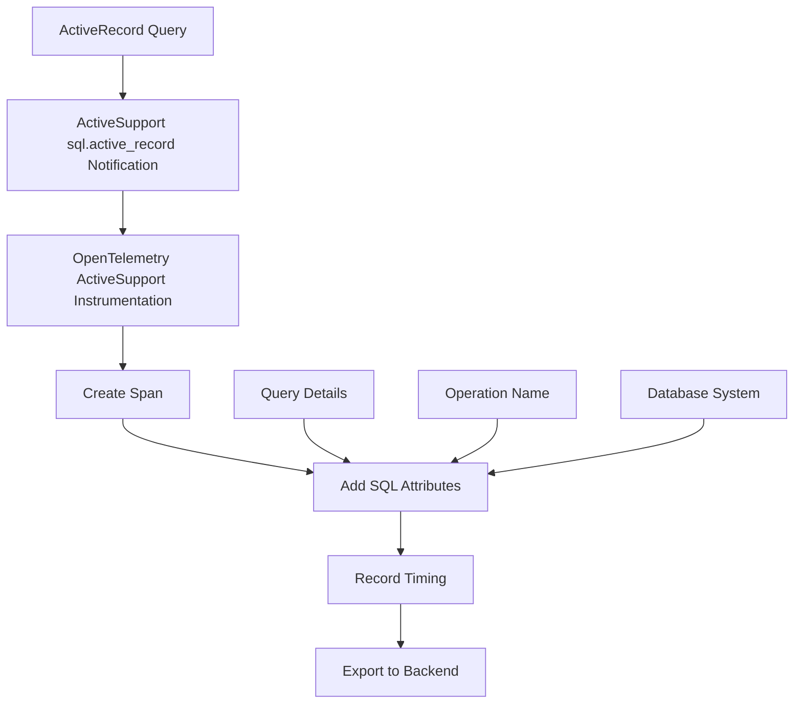

# How to Trace ActiveRecord Database Queries with OpenTelemetry in Rails

Author: [nawazdhandala](https://www.github.com/nawazdhandala)

Tags: OpenTelemetry, Ruby, Rails, ActiveRecord, Database, SQL Tracing

Description: Comprehensive guide to instrumenting ActiveRecord database queries with OpenTelemetry in Rails for detailed SQL performance monitoring and optimization insights.

Database queries often account for the largest portion of response time in Rails applications. OpenTelemetry's ActiveRecord instrumentation captures ActiveRecord model operations, and the ActiveSupport instrumentation can subscribe to Rails' `sql.active_record` notifications to capture SQL statements, execution times, and query payload details. Together, they give you the visibility needed to identify and fix performance bottlenecks.

## Understanding ActiveRecord Instrumentation

The OpenTelemetry ActiveRecord instrumentation patches ActiveRecord methods to create spans around model operations. Rails also emits an `sql.active_record` ActiveSupport notification every time ActiveRecord uses SQL, and OpenTelemetry's ActiveSupport instrumentation can turn those notifications into spans with SQL attributes.


```mermaid
graph TD
    A[ActiveRecord Query] --> B[ActiveSupport sql.active_record Notification]
    B --> C[OpenTelemetry ActiveSupport Instrumentation]
    C --> D[Create Span]
    D --> E[Add SQL Attributes]
    E --> F[Record Timing]
    F --> G[Export to Backend]

    H[Query Details] --> E
    I[Operation Name] --> E
    J[Database System] --> E
```

This automatic instrumentation requires no code changes in your models or controllers. Configure the instrumentation once, and database activity becomes visible in your traces.

## Installing ActiveRecord Instrumentation

Add the OpenTelemetry ActiveRecord and ActiveSupport instrumentation gems to your Gemfile:

```ruby
# Gemfile

gem 'opentelemetry-sdk'
gem 'opentelemetry-exporter-otlp'
gem 'opentelemetry-instrumentation-active_record'
gem 'opentelemetry-instrumentation-active_support'
```

Install the gems:

```bash
bundle install
```

The `opentelemetry-instrumentation-active_record` gem specifically targets ActiveRecord model operations. Current releases require modern Ruby and ActiveRecord versions, so check the gem version constraints if your app is on an older Rails release. The `opentelemetry-instrumentation-active_support` gem lets you subscribe to Rails notifications such as `sql.active_record` for SQL-level spans.

## Basic Configuration

Configure ActiveRecord and SQL notification instrumentation in your Rails initializer:

```ruby
# config/initializers/opentelemetry.rb

require 'opentelemetry/sdk'
require 'opentelemetry/exporter/otlp'
require 'opentelemetry/instrumentation/active_record'
require 'opentelemetry/instrumentation/active_support'

module SqlTraceAttributes
  module_function

  def call(payload)
    sql = payload[:sql].to_s

    {
      'db.system.name' => adapter_name,
      'db.query.text' => sql,
      'db.operation.name' => sql.split.first.to_s.upcase,
      'db.query.name' => payload[:name].to_s
    }.compact
  end

  def adapter_name
    case ActiveRecord::Base.connection.adapter_name.downcase
    when /postgres/
      'postgresql'
    when /mysql/
      'mysql'
    when /sqlite/
      'sqlite'
    else
      'other_sql'
    end
  end
end

OpenTelemetry::SDK.configure do |c|
  c.service_name = 'rails-app'

  # Enable ActiveRecord model-operation instrumentation
  c.use 'OpenTelemetry::Instrumentation::ActiveRecord'

  # Enable ActiveSupport notification instrumentation
  c.use 'OpenTelemetry::Instrumentation::ActiveSupport'
end

tracer = OpenTelemetry.tracer_provider.tracer('rails.sql')

OpenTelemetry::Instrumentation::ActiveSupport.subscribe(
  tracer,
  'sql.active_record',
  SqlTraceAttributes,
  kind: :client,
  span_name_formatter: ->(_name) { 'active_record.sql' }
)
```

This configuration creates a span for each `sql.active_record` notification, capturing the SQL statement and execution time.

## Enabling SQL Obfuscation

Production applications must protect sensitive data in SQL queries. OpenTelemetry Ruby's ActiveRecord instrumentation does not provide an `enable_sql_obfuscation` option, so sanitize query text before storing it in span attributes or remove the query text attribute entirely.

```ruby
# config/initializers/opentelemetry.rb

module SqlTraceAttributes
  module_function

  STRING_LITERAL = /'(?:''|[^'])*'/.freeze
  NUMBER_LITERAL = /(?<!\$)\b\d+(?:\.\d+)?\b/.freeze

  def call(payload)
    sql = sanitize_sql(payload[:sql].to_s)

    {
      'db.system.name' => adapter_name,
      'db.query.text' => sql,
      'db.operation.name' => sql.split.first.to_s.upcase,
      'db.query.name' => payload[:name].to_s
    }.compact
  end

  def adapter_name
    case ActiveRecord::Base.connection.adapter_name.downcase
    when /postgres/
      'postgresql'
    when /mysql/
      'mysql'
    when /sqlite/
      'sqlite'
    else
      'other_sql'
    end
  end

  def sanitize_sql(sql)
    sql
      .gsub(STRING_LITERAL, '?')
      .gsub(NUMBER_LITERAL, '?')
  end
end
```

With obfuscation enabled, a query like:

```sql
SELECT * FROM users WHERE email = 'user@example.com' AND age > 25
```

Becomes:

```sql
SELECT * FROM users WHERE email = ? AND age > ?
```

This protects personally identifiable information (PII) and credentials while still showing query structure for debugging. Rails parameterized queries often already report placeholders in the SQL text, but sanitizing is still useful for raw SQL or literal values.

## Capturing Detailed Query Information

Configure the SQL notification subscriber to capture useful query details:

```ruby
# config/initializers/opentelemetry.rb

require 'opentelemetry/sdk'
require 'opentelemetry/exporter/otlp'
require 'opentelemetry/instrumentation/active_record'
require 'opentelemetry/instrumentation/active_support'

module SqlTraceAttributes
  module_function

  def call(payload)
    sql = sanitize_sql(payload[:sql].to_s)

    attributes = {
      'db.system.name' => adapter_name,
      'db.namespace' => ActiveRecord::Base.connection_db_config.database,
      'db.query.text' => sql,
      'db.operation.name' => sql.split.first.to_s.upcase,
      'db.query.name' => payload[:name].to_s,
      'db.response.returned_rows' => payload[:row_count]
    }

    attributes.compact
  end

  def adapter_name
    case ActiveRecord::Base.connection.adapter_name.downcase
    when /postgres/
      'postgresql'
    when /mysql/
      'mysql'
    when /sqlite/
      'sqlite'
    else
      'other_sql'
    end
  end

  def sanitize_sql(sql)
    sql
      .gsub(/'(?:''|[^'])*'/, '?')
      .gsub(/(?<!\$)\b\d+(?:\.\d+)?\b/, '?')
  end
end

OpenTelemetry::SDK.configure do |c|
  c.service_name = 'rails-app'
  c.use 'OpenTelemetry::Instrumentation::ActiveRecord'
  c.use 'OpenTelemetry::Instrumentation::ActiveSupport'
end

tracer = OpenTelemetry.tracer_provider.tracer('rails.sql')

OpenTelemetry::Instrumentation::ActiveSupport.subscribe(
  tracer,
  'sql.active_record',
  SqlTraceAttributes,
  kind: :client,
  span_name_formatter: ->(_name) { 'active_record.sql' }
)
```

This configuration captures sanitized SQL statements, operation names, database namespace, and row counts when Rails includes them in the notification payload.

## Understanding Span Attributes

SQL notification instrumentation can add these attributes to each database span:

```ruby
# Example span attributes created from a sql.active_record notification:
{
  'db.system.name' => 'postgresql',
  'db.namespace' => 'production_db',
  'db.query.text' => 'SELECT * FROM users WHERE id = ?',
  'db.operation.name' => 'SELECT',
  'db.query.name' => 'User Load',
  'db.response.returned_rows' => 1
}
```

These attributes enable powerful filtering and analysis in your observability platform. You can query for slow operations, analyze returned row counts, or identify repeated SQL shapes.

## Tracing Complex Queries

SQL notification instrumentation automatically captures queries emitted by ActiveRecord, including complex joins and subqueries:

```ruby
# app/models/user.rb
class User < ApplicationRecord
  has_many :orders
  has_many :reviews
end

# app/controllers/users_controller.rb
class UsersController < ApplicationController
  def show
    # This eager loading generates multiple SQL queries
    # OpenTelemetry captures each sql.active_record notification as a span
    @user = User
      .includes(:orders, :reviews)
      .where(id: params[:id])
      .first

    # Each query becomes a span:
    # 1. SELECT * FROM users WHERE id = ?
    # 2. SELECT * FROM orders WHERE user_id IN (?)
    # 3. SELECT * FROM reviews WHERE user_id IN (?)
  end
end
```

The trace shows the queries under the current controller action span when Rails request instrumentation is also enabled, revealing the N+1 query pattern or validating that eager loading works correctly.

## Monitoring N+1 Queries

N+1 queries are a common performance problem in Rails applications. OpenTelemetry traces make them obvious:

```ruby
# app/controllers/posts_controller.rb
class PostsController < ApplicationController
  def index
    # This code triggers N+1 queries
    @posts = Post.all

    # In the view, this generates one query per post
    # @posts.each do |post|
    #   post.author.name  # Triggers: SELECT * FROM users WHERE id = ?
    # end
  end
end
```

The trace reveals dozens of individual `active_record.sql` spans with the same `db.query.text` shape, making the N+1 problem immediately visible.

Fix it with eager loading:

```ruby
class PostsController < ApplicationController
  def index
    # Eager load authors to prevent N+1
    @posts = Post.includes(:author).all

    # Now the trace shows only two queries:
    # 1. SELECT * FROM posts
    # 2. SELECT * FROM users WHERE id IN (...)
  end
end
```

The improved trace shows just two database spans instead of N+1, confirming the optimization worked.

## Tracking Connection Pool Usage

Database connection pools are critical for performance. Monitor pool usage with custom spans:

```ruby
# app/models/concerns/connection_pool_tracking.rb
module ConnectionPoolTracking
  extend ActiveSupport::Concern

  class_methods do
    def with_pool_tracking(&block)
      tracer = OpenTelemetry.tracer_provider.tracer('activerecord')

      tracer.in_span('activerecord.connection_pool') do |span|
        pool_stats = ActiveRecord::Base.connection_pool.stat

        # Add connection pool metrics as span attributes
        span.set_attribute('rails.connection_pool.size', pool_stats[:size])
        span.set_attribute('rails.connection_pool.connections', pool_stats[:connections])
        span.set_attribute('rails.connection_pool.idle', pool_stats[:idle])
        span.set_attribute('rails.connection_pool.waiting', pool_stats[:waiting])

        block.call
      end
    end
  end
end
```

Use this tracking in high-traffic endpoints:

```ruby
class ReportsController < ApplicationController
  def generate
    User.with_pool_tracking do
      # Complex database operations
      @report = generate_complex_report
    end
  end
end
```

The trace shows connection pool state at the start of the operation, helping identify connection exhaustion problems.

## Filtering Noisy Queries

Some queries generate excessive spans that clutter traces. Filter them out with a custom span processor:

```ruby
# config/initializers/opentelemetry.rb

require 'opentelemetry/sdk'
require 'opentelemetry/exporter/otlp'
require 'opentelemetry/instrumentation/active_record'
require 'opentelemetry/instrumentation/active_support'

# Custom processor to filter out noisy queries
class QueryFilterProcessor < OpenTelemetry::SDK::Trace::SpanProcessor
  FILTERED_QUERIES = [
    /SELECT 1/,
    /SHOW TABLES/,
    /schema_migrations/
  ].freeze

  def initialize(wrapped_processor)
    @wrapped_processor = wrapped_processor
  end

  def on_start(span, parent_context)
    @wrapped_processor.on_start(span, parent_context)
  end

  def on_finish(span)
    # Check if this is a database span with a filtered query
    attributes = span.attributes || {}
    statement = attributes['db.query.text']

    if statement && FILTERED_QUERIES.any? { |pattern| statement =~ pattern }
      # Don't export this span
      return
    end

    @wrapped_processor.on_finish(span)
  end

  def force_flush(timeout: nil)
    @wrapped_processor.force_flush(timeout: timeout)
  end

  def shutdown(timeout: nil)
    @wrapped_processor.shutdown(timeout: timeout)
  end
end

OpenTelemetry::SDK.configure do |c|
  c.service_name = 'rails-app'
  c.use 'OpenTelemetry::Instrumentation::ActiveRecord'
  c.use 'OpenTelemetry::Instrumentation::ActiveSupport'

  # Wrap the batch processor with query filtering
  exporter = OpenTelemetry::Exporter::OTLP::Exporter.new
  batch_processor = OpenTelemetry::SDK::Trace::Export::BatchSpanProcessor.new(exporter)
  filter_processor = QueryFilterProcessor.new(batch_processor)

  c.add_span_processor(filter_processor)
end
```

This processor drops spans for health check queries and schema migrations, reducing noise in your traces.

## Correlating Queries with Business Operations

Link database queries to business operations by adding custom attributes:

```ruby
# app/services/order_processor.rb
class OrderProcessor
  def self.process(order)
    tracer = OpenTelemetry.tracer_provider.tracer('app')

    tracer.in_span('order.process', attributes: {
      'order.id' => order.id,
      'order.total' => order.total,
      'customer.id' => order.customer_id
    }) do |span|
      # All database queries within this block are child spans
      # They automatically link to the order processing operation

      order.mark_as_processing!
      payment = process_payment(order)
      order.mark_as_paid! if payment.successful?
      notify_customer(order)

      span.set_attribute('order.status', order.status)
      span.set_attribute('payment.status', payment.status)
    end
  end

  def self.process_payment(order)
    # Database queries here become child spans
    Payment.create!(
      order: order,
      amount: order.total,
      status: 'processing'
    )
  end

  def self.notify_customer(order)
    # More database queries as child spans
    Notification.create!(
      user_id: order.customer_id,
      message: "Order #{order.id} confirmed"
    )
  end
end
```

The trace shows a hierarchy: the order processing span contains all database query spans, making it easy to see which queries contribute to the overall operation time.

## Analyzing Query Performance

Use trace data to identify slow queries and optimization opportunities:

```ruby
# Example trace analysis in your observability platform:

# Find queries taking longer than 100ms
db.query.text EXISTS AND span.duration > 100ms

# Find specific SQL operations
db.operation.name = "SELECT" AND span.duration > 50ms

# Find repeated query patterns
span.name = "active_record.sql" AND db.operation.name = "SELECT"

# Find connection pool exhaustion
rails.connection_pool.waiting > 0
```

These queries help you systematically identify and fix performance problems in production.

## Testing Database Instrumentation

Verify SQL notification instrumentation works correctly in your test suite:

```ruby
# spec/instrumentation/active_record_spec.rb
require 'rails_helper'

RSpec.describe 'ActiveRecord Instrumentation' do
  let(:exporter) { OpenTelemetry::SDK::Trace::Export::InMemorySpanExporter.new }
  let(:span_processor) { OpenTelemetry::SDK::Trace::Export::SimpleSpanProcessor.new(exporter) }

  before do
    OpenTelemetry.tracer_provider.add_span_processor(span_processor)
  end

  after do
    exporter.reset
  end

  it 'creates spans for database queries' do
    User.create!(name: 'Test User', email: 'test@example.com')
    OpenTelemetry.tracer_provider.force_flush

    spans = exporter.finished_spans
    db_spans = spans.select { |s| s.name == 'active_record.sql' }

    expect(db_spans).not_to be_empty
    expect(db_spans.first.attributes['db.query.text']).to include('INSERT')
  end

  it 'obfuscates SQL parameters' do
    User.where(email: 'test@example.com').first
    OpenTelemetry.tracer_provider.force_flush

    spans = exporter.finished_spans
    select_span = spans.find do |s|
      s.name == 'active_record.sql' &&
        s.attributes['db.operation.name'] == 'SELECT'
    end

    expect(select_span.attributes['db.query.text']).to include('?')
    expect(select_span.attributes['db.query.text']).not_to include('test@example.com')
  end

  it 'captures operation names' do
    Post.all.to_a
    OpenTelemetry.tracer_provider.force_flush

    spans = exporter.finished_spans
    select_span = spans.find do |s|
      s.name == 'active_record.sql' &&
        s.attributes['db.operation.name'] == 'SELECT'
    end

    expect(select_span).not_to be_nil
  end
end
```

These tests confirm that instrumentation creates the expected spans with proper obfuscation and attributes.

ActiveRecord and ActiveSupport instrumentation give you strong visibility into database performance. With automatic query tracing, SQL sanitization, and detailed span attributes, you can identify N+1 queries, optimize slow queries, and monitor connection pool health without modifying your application code. The traces provide the data needed to make informed optimization decisions and maintain database performance as your application scales.
