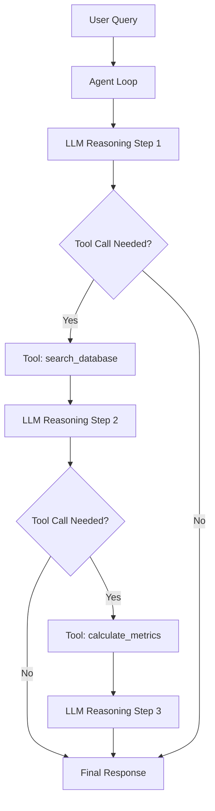

# How to Trace AI Agent Execution Flows Using OpenTelemetry

Author: [nawazdhandala](https://www.github.com/nawazdhandala)

Tags: OpenTelemetry, AI Agents, Tracing, Observability, LLM, Python, Distributed Tracing

Description: A practical guide to tracing AI agent execution flows with OpenTelemetry, covering tool calls, reasoning steps, multi-step chains, and agent loops with real Python examples.

---

AI agents are more than simple request-response LLM calls. They reason, plan, call tools, evaluate results, and loop until they reach a conclusion. A single user query can trigger dozens of internal steps: multiple LLM invocations, tool executions, retrieval calls, and branching logic. When something goes wrong, or just runs slowly, you need to understand exactly what happened and in what order.

OpenTelemetry's distributed tracing model is a natural fit for this. Each agent step becomes a span. The parent-child relationships between spans capture the execution hierarchy. And the trace as a whole tells you the full story of how the agent processed a request.

This guide shows you how to instrument AI agent execution flows using OpenTelemetry, with practical Python code you can adapt to your own agent framework.

---

## The Structure of an Agent Trace

A typical AI agent execution looks something like this:



In OpenTelemetry terms, the entire agent loop is the root span. Each LLM call and tool execution is a child span. This hierarchy lets you see at a glance how long the agent took, how many steps it needed, and where time was spent.

---

## Setting Up the Tracer

Start with the standard OpenTelemetry setup. Nothing special is required for agent tracing beyond the normal SDK configuration.

```python
from opentelemetry import trace
from opentelemetry.sdk.trace import TracerProvider
from opentelemetry.sdk.trace.export import BatchSpanProcessor
from opentelemetry.exporter.otlp.proto.grpc.trace_exporter import OTLPSpanExporter
from opentelemetry.sdk.resources import Resource

# Configure the tracer with your service name
resource = Resource.create({
    "service.name": "ai-agent-service",
    "service.version": "2.0.0",
})

provider = TracerProvider(resource=resource)
exporter = OTLPSpanExporter(endpoint="https://oneuptime.com/otlp")
provider.add_span_processor(BatchSpanProcessor(exporter))
trace.set_tracer_provider(provider)

tracer = trace.get_tracer("ai-agent-service")
```

---

## Instrumenting the Agent Loop

The agent loop is the core of any agentic system. It repeatedly calls the LLM, checks if tools need to be invoked, runs those tools, and feeds results back. Here's how to instrument this pattern.

```python
import json
import openai
from opentelemetry import trace

tracer = trace.get_tracer("ai-agent-service")

# Define the tools the agent can use
TOOLS = [
    {
        "type": "function",
        "function": {
            "name": "search_database",
            "description": "Search the product database",
            "parameters": {
                "type": "object",
                "properties": {
                    "query": {"type": "string", "description": "Search query"}
                },
                "required": ["query"]
            }
        }
    },
    {
        "type": "function",
        "function": {
            "name": "get_pricing",
            "description": "Get pricing for a product",
            "parameters": {
                "type": "object",
                "properties": {
                    "product_id": {"type": "string"}
                },
                "required": ["product_id"]
            }
        }
    }
]

def run_agent(user_query: str) -> str:
    """Main agent loop that processes a user query through multiple reasoning steps."""

    # The root span covers the entire agent execution
    with tracer.start_as_current_span("agent.execute") as root_span:
        root_span.set_attribute("agent.input", user_query)
        root_span.set_attribute("agent.max_iterations", 10)

        messages = [
            {"role": "system", "content": "You are a helpful product assistant."},
            {"role": "user", "content": user_query},
        ]

        iteration = 0
        client = openai.OpenAI()

        while iteration < 10:
            iteration += 1

            # Each LLM reasoning step gets its own span
            with tracer.start_as_current_span(f"agent.llm_step") as llm_span:
                llm_span.set_attribute("agent.iteration", iteration)
                llm_span.set_attribute("gen_ai.system", "openai")
                llm_span.set_attribute("gen_ai.request.model", "gpt-4o")

                response = client.chat.completions.create(
                    model="gpt-4o",
                    messages=messages,
                    tools=TOOLS,
                )

                choice = response.choices[0]
                llm_span.set_attribute("gen_ai.usage.input_tokens", response.usage.prompt_tokens)
                llm_span.set_attribute("gen_ai.usage.output_tokens", response.usage.completion_tokens)
                llm_span.set_attribute("gen_ai.response.finish_reasons", [choice.finish_reason])

            # If the model is done (no tool calls), return the final answer
            if choice.finish_reason == "stop":
                final_response = choice.message.content
                root_span.set_attribute("agent.iterations_used", iteration)
                root_span.set_attribute("agent.output", final_response[:500])
                return final_response

            # Process any tool calls the model requested
            if choice.message.tool_calls:
                messages.append(choice.message)

                for tool_call in choice.message.tool_calls:
                    tool_result = execute_tool(tool_call)
                    messages.append({
                        "role": "tool",
                        "tool_call_id": tool_call.id,
                        "content": json.dumps(tool_result),
                    })

        root_span.set_attribute("agent.iterations_used", iteration)
        root_span.set_attribute("agent.status", "max_iterations_reached")
        return "I wasn't able to complete the request within the allowed steps."
```

---

## Instrumenting Tool Execution

Each tool call deserves its own span. This lets you see how long each tool takes and what arguments were passed.

```python
def execute_tool(tool_call) -> dict:
    """Execute a tool call and trace it as a child span."""
    tool_name = tool_call.function.name
    arguments = json.loads(tool_call.function.arguments)

    # Create a span specifically for this tool execution
    with tracer.start_as_current_span(f"agent.tool.{tool_name}") as tool_span:
        tool_span.set_attribute("agent.tool.name", tool_name)
        tool_span.set_attribute("agent.tool.call_id", tool_call.id)
        tool_span.set_attribute("agent.tool.arguments", json.dumps(arguments))

        try:
            # Route to the appropriate tool handler
            if tool_name == "search_database":
                result = search_database(arguments["query"])
            elif tool_name == "get_pricing":
                result = get_pricing(arguments["product_id"])
            else:
                result = {"error": f"Unknown tool: {tool_name}"}

            tool_span.set_attribute("agent.tool.status", "success")
            tool_span.set_attribute("agent.tool.result_size", len(json.dumps(result)))
            return result

        except Exception as e:
            tool_span.set_status(trace.StatusCode.ERROR, str(e))
            tool_span.record_exception(e)
            return {"error": str(e)}


def search_database(query: str) -> dict:
    """Simulated database search - replace with your actual implementation."""
    # In a real app, this would query your database or search index
    return {"results": [{"id": "prod-123", "name": "Widget Pro", "score": 0.95}]}


def get_pricing(product_id: str) -> dict:
    """Simulated pricing lookup - replace with your actual implementation."""
    return {"product_id": product_id, "price": 29.99, "currency": "USD"}
```

---

## Tracing RAG Retrieval Steps

Many agents use retrieval-augmented generation (RAG) as part of their execution. The retrieval step is particularly important to trace because it directly affects response quality.

```python
def retrieve_context(query: str, top_k: int = 5) -> list:
    """Retrieve relevant documents and trace the retrieval step."""

    with tracer.start_as_current_span("agent.retrieval") as span:
        span.set_attribute("agent.retrieval.query", query)
        span.set_attribute("agent.retrieval.top_k", top_k)

        # Step 1: Generate embedding for the query
        with tracer.start_as_current_span("agent.retrieval.embed") as embed_span:
            client = openai.OpenAI()
            embed_response = client.embeddings.create(
                model="text-embedding-3-small",
                input=query,
            )
            embedding = embed_response.data[0].embedding
            embed_span.set_attribute("gen_ai.system", "openai")
            embed_span.set_attribute("gen_ai.request.model", "text-embedding-3-small")
            embed_span.set_attribute("gen_ai.usage.input_tokens", embed_response.usage.prompt_tokens)

        # Step 2: Search the vector store
        with tracer.start_as_current_span("agent.retrieval.vector_search") as search_span:
            # Replace with your actual vector store query
            results = vector_store_search(embedding, top_k)
            search_span.set_attribute("agent.retrieval.results_count", len(results))
            search_span.set_attribute("agent.retrieval.top_score", results[0]["score"] if results else 0)

        span.set_attribute("agent.retrieval.results_count", len(results))
        return results


def vector_store_search(embedding: list, top_k: int) -> list:
    """Placeholder for your vector store search implementation."""
    return [
        {"id": "doc-1", "content": "Relevant document content...", "score": 0.92},
        {"id": "doc-2", "content": "Another relevant document...", "score": 0.87},
    ]
```

---

## Adding Span Links for Multi-Agent Systems

When you have multiple agents collaborating, span links let you connect related traces without implying a parent-child relationship. For example, if a coordinator agent delegates work to specialist agents, you can link their traces together.

```python
from opentelemetry.trace import Link

def coordinator_agent(user_query: str) -> str:
    """A coordinator that delegates to specialist agents and links their traces."""

    with tracer.start_as_current_span("agent.coordinator") as coord_span:
        coord_span.set_attribute("agent.type", "coordinator")

        # Run the research agent and capture its span context
        research_ctx = None
        with tracer.start_as_current_span("agent.research") as research_span:
            research_span.set_attribute("agent.type", "research")
            research_ctx = research_span.get_span_context()
            research_result = run_research(user_query)

        # Run the analysis agent, linking it to the research agent's span
        with tracer.start_as_current_span(
            "agent.analysis",
            links=[Link(research_ctx)]  # Link to the research span
        ) as analysis_span:
            analysis_span.set_attribute("agent.type", "analysis")
            analysis_result = run_analysis(research_result)

        return analysis_result
```

---

## Capturing Agent Decision Metadata

To really understand what your agent is doing, record its reasoning at each step. This doesn't mean logging the full LLM output (that might be too verbose for production), but capturing key decision points.

```python
def instrumented_decision_step(messages: list, iteration: int) -> dict:
    """Make an LLM call and record the decision metadata."""

    with tracer.start_as_current_span("agent.decision") as span:
        span.set_attribute("agent.iteration", iteration)
        span.set_attribute("agent.message_count", len(messages))

        client = openai.OpenAI()
        response = client.chat.completions.create(
            model="gpt-4o",
            messages=messages,
            tools=TOOLS,
        )

        choice = response.choices[0]

        # Record what the agent decided to do
        if choice.message.tool_calls:
            tool_names = [tc.function.name for tc in choice.message.tool_calls]
            span.set_attribute("agent.decision", "tool_call")
            span.set_attribute("agent.tools_called", tool_names)
            span.set_attribute("agent.tool_call_count", len(tool_names))
        else:
            span.set_attribute("agent.decision", "final_answer")

        # Add a span event with a summary of the decision
        span.add_event("agent.decision_made", attributes={
            "decision_type": "tool_call" if choice.message.tool_calls else "final_answer",
            "finish_reason": choice.finish_reason,
        })

        return {
            "response": response,
            "choice": choice,
        }
```

---

## What a Complete Agent Trace Looks Like

When you view a trace from a fully instrumented agent in your observability backend, the span hierarchy looks like this:

```mermaid
gantt
    title Agent Execution Trace
    dateFormat X
    axisFormat %s

    section Agent Loop
    agent.execute           :0, 8000

    section Iteration 1
    agent.llm_step          :0, 1500
    agent.tool.search_db    :1500, 2500

    section Iteration 2
    agent.llm_step          :2500, 4000
    agent.tool.get_pricing  :4000, 4500

    section Iteration 3
    agent.llm_step          :4500, 6000

    section Final
    Final Response          :6000, 6100
```



Each span has its own duration, attributes, and status. You can quickly see that the agent took three iterations, called two tools, and where the time was spent.

---

## Key Attributes to Track

Here's a summary of the most useful attributes for agent tracing:

| Attribute | Description |
|---|---|
| `agent.iteration` | Current iteration number in the agent loop |
| `agent.decision` | What the agent decided (tool_call, final_answer) |
| `agent.tool.name` | Name of the tool being executed |
| `agent.tool.arguments` | Arguments passed to the tool |
| `agent.retrieval.results_count` | Number of documents retrieved |
| `gen_ai.usage.input_tokens` | Tokens consumed by each LLM call |
| `gen_ai.usage.output_tokens` | Tokens generated by each LLM call |

---

## Wrapping Up

Tracing AI agents with OpenTelemetry gives you something you can't get any other way: a clear picture of the agent's decision-making process. You see every LLM call, every tool invocation, every retrieval step, and how they all connect.

The patterns shown here work regardless of which agent framework you use. Whether you're building with LangChain, CrewAI, AutoGen, or a custom agent loop, the instrumentation approach is the same: wrap each step in a span, record the relevant attributes, and let the parent-child relationships tell the story.

Start with the agent loop and tool execution spans. Those alone will give you enough visibility to debug most production issues. Then add retrieval tracing and decision metadata as you need deeper insight.
