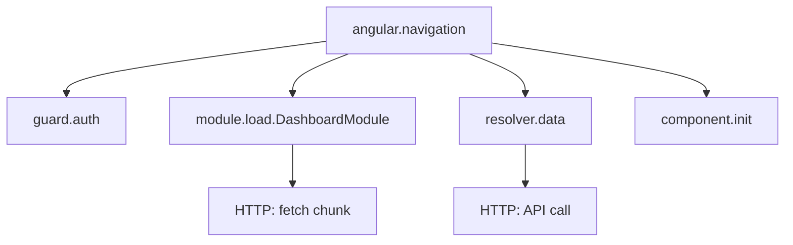

# How to Trace Angular Route Navigation and Lazy Loading with OpenTelemetry

Author: [nawazdhandala](https://www.github.com/nawazdhandala)

Tags: OpenTelemetry, Angular, Routing, Lazy Loading, Performance, Tracing

Description: Learn how to instrument Angular route navigation and lazy-loaded modules with OpenTelemetry to monitor navigation performance and identify bottlenecks in your single-page application.

Angular applications often suffer from performance issues during route transitions, especially when lazy loading modules. Without proper observability, you're flying blind trying to optimize navigation timing and module loading. OpenTelemetry provides the instrumentation you need to trace every navigation event and lazy load operation.

## Why Trace Angular Navigation

Angular's router is powerful but complex. Each navigation involves multiple phases: guards execution, resolvers, component initialization, and change detection. When you add lazy loading into the mix, you're also dealing with chunk downloads and module compilation. All of these can introduce latency that degrades user experience.

By tracing navigation with OpenTelemetry, you get visibility into:

- How long each navigation takes from start to finish
- Time spent downloading lazy-loaded chunks
- Guard and resolver execution duration
- Component initialization overhead
- Which routes are slowest and need optimization

## Setting Up OpenTelemetry in Angular

First, install the required packages. You'll need the OpenTelemetry Web SDK and instrumentation libraries.

```bash
npm install @opentelemetry/api \
  @opentelemetry/sdk-trace-web \
  @opentelemetry/instrumentation-document-load \
  @opentelemetry/instrumentation-fetch \
  @opentelemetry/instrumentation-xml-http-request \
  @opentelemetry/context-zone \
  @opentelemetry/exporter-trace-otlp-http
```

Create a tracing service that initializes OpenTelemetry. This service will set up the tracer provider, register instrumentations, and handle span creation.

```typescript
// src/app/services/tracing.service.ts
import { Injectable } from '@angular/core';
import { WebTracerProvider } from '@opentelemetry/sdk-trace-web';
import { BatchSpanProcessor } from '@opentelemetry/sdk-trace-base';
import { OTLPTraceExporter } from '@opentelemetry/exporter-trace-otlp-http';
import { ZoneContextManager } from '@opentelemetry/context-zone';
import { registerInstrumentations } from '@opentelemetry/instrumentation';
import { DocumentLoadInstrumentation } from '@opentelemetry/instrumentation-document-load';
import { FetchInstrumentation } from '@opentelemetry/instrumentation-fetch';
import { Resource } from '@opentelemetry/resources';
import { SemanticResourceAttributes } from '@opentelemetry/semantic-conventions';
import { trace, Span, SpanStatusCode, context } from '@opentelemetry/api';

@Injectable({
  providedIn: 'root'
})
export class TracingService {
  private tracer: any;
  private provider: WebTracerProvider;

  constructor() {
    this.initTracing();
  }

  private initTracing(): void {
    // Configure the tracer provider with service information
    this.provider = new WebTracerProvider({
      resource: new Resource({
        [SemanticResourceAttributes.SERVICE_NAME]: 'angular-app',
        [SemanticResourceAttributes.SERVICE_VERSION]: '1.0.0',
      }),
    });

    // Set up OTLP exporter to send traces to your backend
    const exporter = new OTLPTraceExporter({
      url: 'http://localhost:4318/v1/traces',
    });

    // Use batch processor to batch spans before sending
    this.provider.addSpanProcessor(new BatchSpanProcessor(exporter));

    // Zone.js context manager is critical for Angular
    // It ensures context propagation across async operations
    this.provider.register({
      contextManager: new ZoneContextManager(),
    });

    // Register automatic instrumentations for document load and fetch
    registerInstrumentations({
      instrumentations: [
        new DocumentLoadInstrumentation(),
        new FetchInstrumentation({
          propagateTraceHeaderCorsUrls: [/.+/],
          clearTimingResources: true,
        }),
      ],
    });

    this.tracer = trace.getTracer('angular-router-tracer');
  }

  getTracer() {
    return this.tracer;
  }

  // Helper method to create and manage spans
  createSpan(name: string, fn: (span: Span) => Promise<any>): Promise<any> {
    const span = this.tracer.startSpan(name);
    return context.with(trace.setSpan(context.active(), span), async () => {
      try {
        const result = await fn(span);
        span.setStatus({ code: SpanStatusCode.OK });
        return result;
      } catch (error: any) {
        span.setStatus({
          code: SpanStatusCode.ERROR,
          message: error.message,
        });
        span.recordException(error);
        throw error;
      } finally {
        span.end();
      }
    });
  }
}
```

## Instrumenting Route Navigation

Angular's router emits events throughout the navigation lifecycle. Hook into these events to create spans that track navigation timing.

```typescript
// src/app/services/router-tracing.service.ts
import { Injectable } from '@angular/core';
import { Router, NavigationStart, NavigationEnd, NavigationCancel, NavigationError } from '@angular/router';
import { TracingService } from './tracing.service';
import { Span, SpanStatusCode } from '@opentelemetry/api';
import { filter } from 'rxjs/operators';

@Injectable({
  providedIn: 'root'
})
export class RouterTracingService {
  private navigationSpans: Map<number, Span> = new Map();

  constructor(
    private router: Router,
    private tracingService: TracingService
  ) {
    this.initializeRouterTracing();
  }

  private initializeRouterTracing(): void {
    const tracer = this.tracingService.getTracer();

    // Start span on navigation start
    this.router.events.pipe(
      filter(event => event instanceof NavigationStart)
    ).subscribe((event: NavigationStart) => {
      const span = tracer.startSpan('angular.navigation', {
        attributes: {
          'navigation.id': event.id,
          'navigation.url': event.url,
          'navigation.trigger': event.navigationTrigger,
          'navigation.restoredState': !!event.restoredState,
        }
      });
      this.navigationSpans.set(event.id, span);
    });

    // End span on successful navigation
    this.router.events.pipe(
      filter(event => event instanceof NavigationEnd)
    ).subscribe((event: NavigationEnd) => {
      const span = this.navigationSpans.get(event.id);
      if (span) {
        span.setAttribute('navigation.final_url', event.urlAfterRedirects);
        span.setStatus({ code: SpanStatusCode.OK });
        span.end();
        this.navigationSpans.delete(event.id);
      }
    });

    // Handle navigation cancellation
    this.router.events.pipe(
      filter(event => event instanceof NavigationCancel)
    ).subscribe((event: NavigationCancel) => {
      const span = this.navigationSpans.get(event.id);
      if (span) {
        span.setAttribute('navigation.cancelled', true);
        span.setAttribute('navigation.reason', event.reason);
        span.setStatus({ code: SpanStatusCode.ERROR, message: 'Navigation cancelled' });
        span.end();
        this.navigationSpans.delete(event.id);
      }
    });

    // Handle navigation errors
    this.router.events.pipe(
      filter(event => event instanceof NavigationError)
    ).subscribe((event: NavigationError) => {
      const span = this.navigationSpans.get(event.id);
      if (span) {
        span.recordException(event.error);
        span.setStatus({ code: SpanStatusCode.ERROR, message: event.error.message });
        span.end();
        this.navigationSpans.delete(event.id);
      }
    });
  }
}
```

## Tracing Lazy Loading

Lazy loading is where things get interesting. Angular loads module chunks on demand, and this download time can be significant. Create a custom decorator to instrument lazy-loaded modules.

```typescript
// src/app/decorators/trace-module-load.decorator.ts
import { trace, context, SpanStatusCode } from '@opentelemetry/api';

// Decorator to trace module loading
export function TraceModuleLoad(moduleName: string) {
  return function (target: any) {
    const tracer = trace.getTracer('angular-router-tracer');

    // Wrap the original constructor
    const original = target;

    function construct(constructor: any, args: any[]) {
      const span = tracer.startSpan(`module.load.${moduleName}`, {
        attributes: {
          'module.name': moduleName,
          'module.type': 'lazy',
        }
      });

      return context.with(trace.setSpan(context.active(), span), () => {
        try {
          const instance = new constructor(...args);
          span.setStatus({ code: SpanStatusCode.OK });
          span.end();
          return instance;
        } catch (error: any) {
          span.recordException(error);
          span.setStatus({ code: SpanStatusCode.ERROR, message: error.message });
          span.end();
          throw error;
        }
      });
    }

    const newConstructor: any = function (...args: any[]) {
      return construct(original, args);
    };

    newConstructor.prototype = original.prototype;
    return newConstructor;
  };
}
```

Apply the decorator to your lazy-loaded modules:

```typescript
// src/app/features/dashboard/dashboard.module.ts
import { NgModule } from '@angular/core';
import { CommonModule } from '@angular/common';
import { DashboardRoutingModule } from './dashboard-routing.module';
import { DashboardComponent } from './dashboard.component';
import { TraceModuleLoad } from '../../decorators/trace-module-load.decorator';

@NgModule({
  declarations: [DashboardComponent],
  imports: [
    CommonModule,
    DashboardRoutingModule
  ]
})
@TraceModuleLoad('DashboardModule')
export class DashboardModule { }
```

## Tracing Route Guards and Resolvers

Guards and resolvers can add significant latency to navigation. Instrument them to identify bottlenecks.

```typescript
// src/app/guards/auth.guard.ts
import { Injectable } from '@angular/core';
import { CanActivate, ActivatedRouteSnapshot, RouterStateSnapshot } from '@angular/router';
import { Observable } from 'rxjs';
import { TracingService } from '../services/tracing.service';

@Injectable({
  providedIn: 'root'
})
export class AuthGuard implements CanActivate {
  constructor(private tracingService: TracingService) {}

  canActivate(
    route: ActivatedRouteSnapshot,
    state: RouterStateSnapshot
  ): Observable<boolean> | Promise<boolean> | boolean {
    const tracer = this.tracingService.getTracer();
    const span = tracer.startSpan('guard.auth', {
      attributes: {
        'route.path': state.url,
      }
    });

    try {
      // Your auth logic here
      const isAuthenticated = this.checkAuthentication();

      span.setAttribute('auth.result', isAuthenticated);
      span.setStatus({ code: SpanStatusCode.OK });
      span.end();

      return isAuthenticated;
    } catch (error: any) {
      span.recordException(error);
      span.setStatus({ code: SpanStatusCode.ERROR });
      span.end();
      throw error;
    }
  }

  private checkAuthentication(): boolean {
    // Implementation details
    return true;
  }
}
```

For resolvers, the pattern is similar:

```typescript
// src/app/resolvers/data.resolver.ts
import { Injectable } from '@angular/core';
import { Resolve, ActivatedRouteSnapshot, RouterStateSnapshot } from '@angular/router';
import { Observable } from 'rxjs';
import { TracingService } from '../services/tracing.service';

@Injectable({
  providedIn: 'root'
})
export class DataResolver implements Resolve<any> {
  constructor(private tracingService: TracingService) {}

  resolve(
    route: ActivatedRouteSnapshot,
    state: RouterStateSnapshot
  ): Observable<any> | Promise<any> | any {
    return this.tracingService.createSpan('resolver.data', async (span) => {
      span.setAttribute('route.path', state.url);

      // Fetch your data
      const data = await this.fetchData();

      span.setAttribute('data.items_count', data.length);
      return data;
    });
  }

  private async fetchData(): Promise<any[]> {
    // Implementation details
    return [];
  }
}
```

## Visualizing Navigation Flow

Here's how the trace hierarchy looks for a typical lazy-loaded route navigation:



## Monitoring Module Load Performance

Create a service to track and report on lazy loading performance metrics:

```typescript
// src/app/services/module-load-monitor.service.ts
import { Injectable } from '@angular/core';
import { TracingService } from './tracing.service';

interface ModuleLoadMetrics {
  moduleName: string;
  loadTime: number;
  timestamp: number;
}

@Injectable({
  providedIn: 'root'
})
export class ModuleLoadMonitorService {
  private metrics: ModuleLoadMetrics[] = [];

  constructor(private tracingService: TracingService) {}

  // Track lazy module load with performance timing
  trackModuleLoad(moduleName: string, loadFn: () => Promise<any>): Promise<any> {
    const startTime = performance.now();
    const tracer = this.tracingService.getTracer();

    const span = tracer.startSpan(`lazy.module.${moduleName}`, {
      attributes: {
        'module.name': moduleName,
        'module.load_strategy': 'lazy',
      }
    });

    return loadFn()
      .then(result => {
        const loadTime = performance.now() - startTime;

        span.setAttribute('module.load_time_ms', loadTime);
        span.setStatus({ code: SpanStatusCode.OK });

        this.metrics.push({
          moduleName,
          loadTime,
          timestamp: Date.now(),
        });

        // Alert if module takes too long to load
        if (loadTime > 2000) {
          span.addEvent('slow_module_load', {
            'module.name': moduleName,
            'threshold_ms': 2000,
          });
        }

        span.end();
        return result;
      })
      .catch(error => {
        span.recordException(error);
        span.setStatus({ code: SpanStatusCode.ERROR });
        span.end();
        throw error;
      });
  }

  getMetrics(): ModuleLoadMetrics[] {
    return this.metrics;
  }

  getAverageLoadTime(moduleName: string): number {
    const moduleMetrics = this.metrics.filter(m => m.moduleName === moduleName);
    if (moduleMetrics.length === 0) return 0;

    const sum = moduleMetrics.reduce((acc, m) => acc + m.loadTime, 0);
    return sum / moduleMetrics.length;
  }
}
```

## Initializing Tracing in Your App

Wire everything together in your app module and ensure tracing starts before Angular initializes:

```typescript
// src/app/app.module.ts
import { NgModule, APP_INITIALIZER } from '@angular/core';
import { BrowserModule } from '@angular/platform-browser';
import { AppRoutingModule } from './app-routing.module';
import { AppComponent } from './app.component';
import { TracingService } from './services/tracing.service';
import { RouterTracingService } from './services/router-tracing.service';

// Initialize tracing before app starts
export function initTracing(
  tracingService: TracingService,
  routerTracingService: RouterTracingService
) {
  return () => {
    // Services are injected and initialized
    // Router tracing is set up via constructor
    return Promise.resolve();
  };
}

@NgModule({
  declarations: [AppComponent],
  imports: [
    BrowserModule,
    AppRoutingModule
  ],
  providers: [
    TracingService,
    RouterTracingService,
    {
      provide: APP_INITIALIZER,
      useFactory: initTracing,
      deps: [TracingService, RouterTracingService],
      multi: true,
    }
  ],
  bootstrap: [AppComponent]
})
export class AppModule { }
```

## Route Configuration with Tracing

Configure your routes with lazy loading and tracing metadata:

```typescript
// src/app/app-routing.module.ts
import { NgModule } from '@angular/core';
import { RouterModule, Routes } from '@angular/router';
import { AuthGuard } from './guards/auth.guard';
import { DataResolver } from './resolvers/data.resolver';

const routes: Routes = [
  {
    path: 'dashboard',
    loadChildren: () => import('./features/dashboard/dashboard.module')
      .then(m => m.DashboardModule),
    canActivate: [AuthGuard],
    resolve: {
      data: DataResolver
    },
    data: {
      trace: true, // Custom metadata for tracing
      moduleName: 'DashboardModule'
    }
  },
  {
    path: 'admin',
    loadChildren: () => import('./features/admin/admin.module')
      .then(m => m.AdminModule),
    canActivate: [AuthGuard],
    data: {
      trace: true,
      moduleName: 'AdminModule'
    }
  }
];

@NgModule({
  imports: [RouterModule.forRoot(routes)],
  exports: [RouterModule]
})
export class AppRoutingModule { }
```

## Best Practices

Keep these guidelines in mind when implementing route tracing:

**Use Context Propagation**: The ZoneContextManager is critical for Angular. Zone.js wraps all async operations, and the context manager ensures trace context flows through these zones correctly.

**Batch Span Exports**: Use BatchSpanProcessor instead of SimpleSpanProcessor in production. Batching reduces network overhead and improves performance.

**Add Meaningful Attributes**: Include route parameters, query strings, and custom data in span attributes. This context is invaluable when debugging issues.

**Monitor Bundle Sizes**: Large lazy-loaded chunks take longer to download. Use your traces to correlate load times with chunk sizes and optimize accordingly.

**Set Sampling Rates**: In high-traffic applications, trace every navigation in development but sample in production to reduce overhead and backend load.

**Handle Navigation Cancellations**: Users often navigate away before the previous navigation completes. Track these cancellations to understand user behavior patterns.

## Performance Overhead

OpenTelemetry adds minimal overhead to your application. The instrumentation itself is lightweight, typically adding less than 5ms per navigation. The ZoneContextManager hooks into Angular's existing Zone.js implementation without additional performance cost.

The main consideration is network bandwidth for sending traces. Batch processing and sampling help minimize this impact. In production, consider sampling rates between 10-50% depending on your traffic volume.

## Analyzing Traces

Once you're collecting traces, analyze them to find optimization opportunities:

- Sort navigations by duration to find the slowest routes
- Compare lazy load times across different network conditions
- Identify guards or resolvers that consistently cause delays
- Track navigation cancellation rates to understand user flow
- Correlate slow navigations with specific module chunks

Your traces will reveal patterns you couldn't see otherwise. Maybe your admin module is 2MB and takes 5 seconds to load on 3G. Perhaps a resolver is making unnecessary API calls. This visibility drives optimization decisions based on real data rather than assumptions.

OpenTelemetry gives you the observability foundation to build performant Angular applications that deliver excellent user experiences. Start tracing your routes today and watch those loading spinners disappear.
