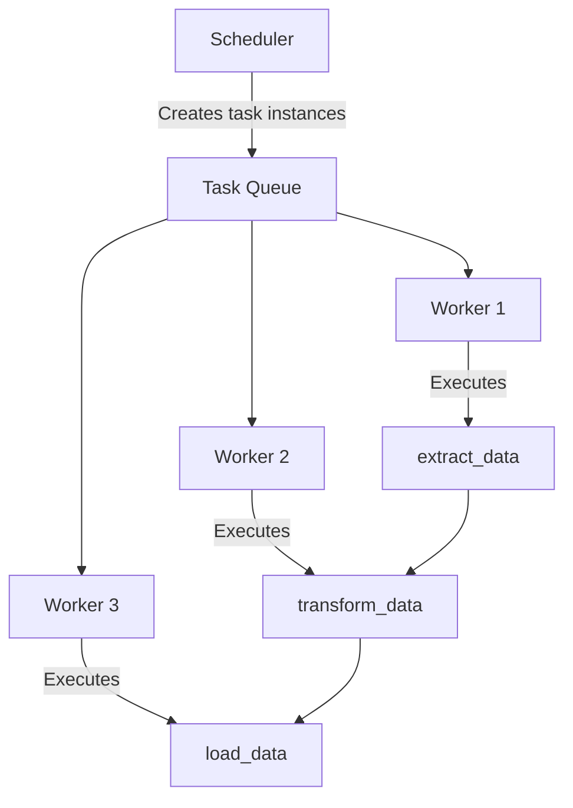
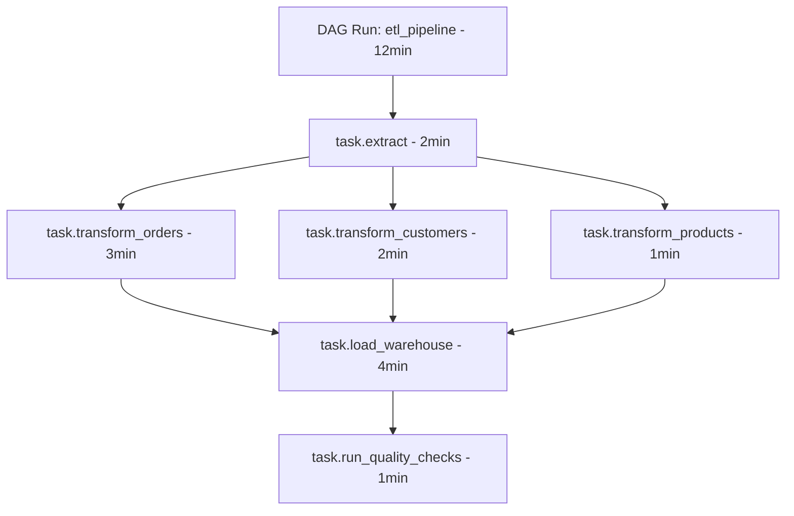

# How to Trace Apache Airflow DAGs with OpenTelemetry

Author: [nawazdhandala](https://www.github.com/nawazdhandala)

Tags: OpenTelemetry, Apache Airflow, Tracing, Observability, Data Pipelines, DAGs

Description: Learn how to instrument Apache Airflow DAGs with OpenTelemetry to get end-to-end tracing across your data pipeline tasks and operators.

---

Apache Airflow is the go-to orchestrator for data pipelines, but debugging a failed DAG run can be painful. You've got tasks running on different workers, dependencies between tasks, retries happening silently, and logs scattered across multiple systems. Airflow's built-in UI shows task status and logs, but it doesn't give you the kind of trace-level visibility that helps you understand why a particular task was slow or what downstream effect a failure had.

OpenTelemetry can fill that gap. By instrumenting your Airflow DAGs, you can get distributed traces that connect every task in a DAG run, show you exactly where time was spent, and link Airflow execution to downstream systems like databases and APIs.

## How Airflow Executes Tasks

Before setting up tracing, it helps to understand Airflow's execution model. When a DAG runs, the scheduler creates task instances for each task in the DAG. These task instances get picked up by workers (via Celery, Kubernetes, or the local executor) and executed independently.



Each task runs in its own process (and potentially on a different machine), so trace context needs to be propagated explicitly between tasks.

## Airflow's Native OpenTelemetry Support

Starting with Airflow 2.7, there's built-in support for OpenTelemetry traces. You can enable it through the Airflow configuration. This is the simplest way to get started.

```ini
# airflow.cfg - Enable OpenTelemetry tracing
[traces]
otel_on = True
otel_host = localhost
otel_port = 4318
otel_ssl_active = False
otel_debugging_on = False

# Set the exporter protocol (http/protobuf or grpc)
otel_task_log_event = True
```

You can also configure it through environment variables, which is often easier in containerized deployments.

```bash
# Environment variables for Airflow OpenTelemetry configuration
export AIRFLOW__TRACES__OTEL_ON=True
export AIRFLOW__TRACES__OTEL_HOST=otel-collector.monitoring.svc.cluster.local
export AIRFLOW__TRACES__OTEL_PORT=4318
export AIRFLOW__TRACES__OTEL_SSL_ACTIVE=False

# Set the service name for your Airflow instance
export OTEL_SERVICE_NAME=airflow-production
```

With this enabled, Airflow automatically creates spans for DAG runs and task executions. Each DAG run gets a parent span, and each task instance gets a child span under it.

## Adding Custom Instrumentation to Tasks

The built-in tracing gives you task-level visibility, but it doesn't trace what happens inside your tasks. If a PythonOperator calls an API and then writes to a database, you'll just see one "task" span. Let's add instrumentation inside the tasks themselves.

```python
# dags/etl_pipeline.py - ETL DAG with OpenTelemetry instrumentation
from airflow import DAG
from airflow.operators.python import PythonOperator
from opentelemetry import trace
from opentelemetry.sdk.trace import TracerProvider
from opentelemetry.sdk.trace.export import BatchSpanProcessor
from opentelemetry.exporter.otlp.proto.http.trace_exporter import OTLPSpanExporter
from opentelemetry.sdk.resources import Resource
from datetime import datetime

# Set up the tracer for custom spans inside tasks
resource = Resource.create({"service.name": "airflow-etl-pipeline"})
provider = TracerProvider(resource=resource)
exporter = OTLPSpanExporter(endpoint="http://localhost:4318/v1/traces")
provider.add_span_processor(BatchSpanProcessor(exporter))
trace.set_tracer_provider(provider)

tracer = trace.get_tracer("airflow-etl")


def extract_data(**context):
    """Extract data from multiple sources with detailed tracing."""
    with tracer.start_as_current_span("extract_data") as span:
        dag_run_id = context["dag_run"].run_id
        span.set_attribute("airflow.dag_id", context["dag"].dag_id)
        span.set_attribute("airflow.run_id", dag_run_id)
        span.set_attribute("airflow.task_id", context["task"].task_id)

        # Trace the API extraction separately
        with tracer.start_as_current_span("extract_from_api") as api_span:
            api_span.set_attribute("source.type", "rest_api")
            api_span.set_attribute("source.url", "https://api.example.com/orders")
            api_data = fetch_orders_from_api()
            api_span.set_attribute("extract.record_count", len(api_data))

        # Trace the database extraction separately
        with tracer.start_as_current_span("extract_from_database") as db_span:
            db_span.set_attribute("source.type", "postgresql")
            db_span.set_attribute("db.system", "postgresql")
            db_span.set_attribute("db.name", "warehouse")
            db_data = fetch_from_database()
            db_span.set_attribute("extract.record_count", len(db_data))

        # Push results to XCom for downstream tasks
        combined = api_data + db_data
        context["ti"].xcom_push(key="raw_data_count", value=len(combined))
        span.set_attribute("extract.total_records", len(combined))

        return combined
```

## Propagating Context Between Tasks

The trickiest part of Airflow tracing is connecting spans across tasks. Each task runs in its own process, so you need to serialize the trace context and pass it through Airflow's XCom mechanism.

```python
from opentelemetry import trace, context
from opentelemetry.propagate import inject, extract

def extract_data(**airflow_context):
    """First task - extracts data and passes trace context to next task."""
    with tracer.start_as_current_span("extract_data") as span:
        span.set_attribute("airflow.dag_id", airflow_context["dag"].dag_id)

        # Do the extraction work
        data = fetch_data_from_source()

        # Serialize the current trace context into a dict
        trace_carrier = {}
        inject(trace_carrier)

        # Push the trace context through XCom so downstream tasks can pick it up
        airflow_context["ti"].xcom_push(key="trace_context", value=trace_carrier)

        return data


def transform_data(**airflow_context):
    """Second task - picks up trace context from the previous task."""
    # Pull the trace context from the upstream task via XCom
    trace_carrier = airflow_context["ti"].xcom_pull(
        task_ids="extract_data",
        key="trace_context"
    )

    # Restore the parent context from the serialized carrier
    parent_context = extract(trace_carrier) if trace_carrier else context.active()

    with tracer.start_as_current_span(
        "transform_data",
        context=parent_context
    ) as span:
        span.set_attribute("airflow.dag_id", airflow_context["dag"].dag_id)
        span.set_attribute("airflow.task_id", "transform_data")

        # Pull the raw data and transform it
        raw_data = airflow_context["ti"].xcom_pull(task_ids="extract_data")
        transformed = apply_transformations(raw_data)
        span.set_attribute("transform.input_records", len(raw_data))
        span.set_attribute("transform.output_records", len(transformed))

        # Pass context forward to the next task
        trace_carrier = {}
        inject(trace_carrier)
        airflow_context["ti"].xcom_push(key="trace_context", value=trace_carrier)

        return transformed
```

## Creating a Reusable Tracing Decorator

Manually handling context propagation in every task gets tedious. Here's a decorator that automates it.

```python
import functools
from opentelemetry import trace, context as otel_context
from opentelemetry.propagate import inject, extract

tracer = trace.get_tracer("airflow-etl")

def traced_task(upstream_task_id=None):
    """Decorator that handles OpenTelemetry context propagation for Airflow tasks."""
    def decorator(func):
        @functools.wraps(func)
        def wrapper(**airflow_context):
            ti = airflow_context["ti"]

            # If there's an upstream task, try to restore its trace context
            parent_ctx = otel_context.active()
            if upstream_task_id:
                carrier = ti.xcom_pull(task_ids=upstream_task_id, key="trace_context")
                if carrier:
                    parent_ctx = extract(carrier)

            # Create a span for this task execution
            with tracer.start_as_current_span(
                f"task.{func.__name__}",
                context=parent_ctx,
                attributes={
                    "airflow.dag_id": airflow_context["dag"].dag_id,
                    "airflow.task_id": airflow_context["task"].task_id,
                    "airflow.run_id": airflow_context["dag_run"].run_id,
                    "airflow.try_number": airflow_context["ti"].try_number,
                },
            ) as span:
                try:
                    result = func(**airflow_context)

                    # Propagate context to downstream tasks
                    carrier = {}
                    inject(carrier)
                    ti.xcom_push(key="trace_context", value=carrier)

                    return result
                except Exception as e:
                    span.record_exception(e)
                    span.set_status(trace.StatusCode.ERROR, str(e))
                    raise

        return wrapper
    return decorator
```

Now you can use it cleanly in your DAG definition.

```python
# dags/etl_traced.py - Clean DAG definition using the tracing decorator
from airflow import DAG
from airflow.operators.python import PythonOperator
from datetime import datetime

# First task in the pipeline - no upstream context to restore
@traced_task()
def extract(**context):
    """Pull data from the source system."""
    records = fetch_records_from_api(limit=10000)
    context["ti"].xcom_push(key="record_count", value=len(records))
    return records

# Second task - restores context from extract
@traced_task(upstream_task_id="extract_task")
def transform(**context):
    """Clean and transform the raw data."""
    raw = context["ti"].xcom_pull(task_ids="extract_task")
    cleaned = [clean_record(r) for r in raw]
    return cleaned

# Third task - restores context from transform
@traced_task(upstream_task_id="transform_task")
def load(**context):
    """Load transformed data into the warehouse."""
    data = context["ti"].xcom_pull(task_ids="transform_task")
    rows_inserted = bulk_insert(data, table="processed_orders")

    span = trace.get_current_span()
    span.set_attribute("load.rows_inserted", rows_inserted)

# Define the DAG
with DAG(
    "etl_pipeline_traced",
    start_date=datetime(2026, 1, 1),
    schedule="@daily",
    catchup=False,
) as dag:

    extract_task = PythonOperator(
        task_id="extract_task",
        python_callable=extract,
    )

    transform_task = PythonOperator(
        task_id="transform_task",
        python_callable=transform,
    )

    load_task = PythonOperator(
        task_id="load_task",
        python_callable=load,
    )

    # Define task dependencies
    extract_task >> transform_task >> load_task
```

## Tracing Complex DAG Patterns

Real-world DAGs often have parallel tasks, branching, and dynamic task generation. Here's how the trace looks for a DAG with parallel branches.



For parallel tasks that share the same upstream, you pass the same `upstream_task_id` and each branch gets its own child span under the common parent.

## Instrumenting Custom Operators

If you've built custom Airflow operators, you can add OpenTelemetry tracing directly into the operator's `execute` method.

```python
from airflow.models import BaseOperator
from opentelemetry import trace

tracer = trace.get_tracer("airflow-custom-operators")

class TracedDatabaseOperator(BaseOperator):
    """Custom operator that queries a database with full tracing."""

    def __init__(self, query, connection_id, **kwargs):
        super().__init__(**kwargs)
        self.query = query
        self.connection_id = connection_id

    def execute(self, context):
        with tracer.start_as_current_span(
            f"operator.{self.__class__.__name__}",
            attributes={
                "airflow.task_id": self.task_id,
                "db.system": "postgresql",
                "db.statement": self.query[:200],  # Truncate long queries
                "db.connection_id": self.connection_id,
            },
        ) as span:
            # Get the Airflow connection and execute the query
            hook = PostgresHook(postgres_conn_id=self.connection_id)

            with tracer.start_as_current_span("db.execute") as query_span:
                result = hook.get_records(self.query)
                query_span.set_attribute("db.rows_returned", len(result))

            span.set_attribute("operator.result_rows", len(result))
            return result
```

## Collecting Airflow Metrics with OpenTelemetry

Beyond traces, you should collect Airflow-specific metrics. Airflow 2.7+ supports pushing metrics through OpenTelemetry as well.

```ini
# airflow.cfg - Enable OpenTelemetry metrics
[metrics]
otel_on = True
otel_host = localhost
otel_port = 4318
otel_ssl_active = False
otel_prefix = airflow
```

This exports metrics like task duration, DAG run duration, scheduler heartbeat, pool usage, and executor slots. Combined with the traces we set up earlier, you get a complete observability picture.

## Connecting Airflow Traces to Downstream Systems

One of the biggest benefits of OpenTelemetry tracing in Airflow is connecting your pipeline traces to downstream systems. If your load task writes to a database, and that database operation is also instrumented with OpenTelemetry, the spans will be connected automatically through context propagation.

```python
@traced_task(upstream_task_id="transform_task")
def load_to_warehouse(**context):
    """Load data into the warehouse - database spans connect automatically."""
    data = context["ti"].xcom_pull(task_ids="transform_task")

    # If your database library is instrumented with OpenTelemetry
    # (e.g., using opentelemetry-instrumentation-psycopg2),
    # the SQL spans will automatically appear as children of this task span
    with get_warehouse_connection() as conn:
        cursor = conn.cursor()
        for batch in chunks(data, 1000):
            cursor.executemany(
                "INSERT INTO orders (id, amount, status) VALUES (%s, %s, %s)",
                batch
            )
        conn.commit()
```

This means you can trace a data record from the moment it was extracted from the source API, through transformation, all the way to the INSERT statement in your warehouse. That level of visibility is incredibly valuable when debugging data quality issues.

## Wrapping Up

Tracing Airflow DAGs with OpenTelemetry gives you much more than task status and log files. You get end-to-end traces across your entire data pipeline, sub-task visibility into what's actually slow, and connected traces that extend into downstream databases and APIs. Start with Airflow's native OpenTelemetry support for basic DAG and task spans, then add the tracing decorator for context propagation between tasks. Instrument your custom operators and let auto-instrumentation libraries handle the database and HTTP calls inside your tasks. The result is complete observability over your data pipelines, from source to destination.
