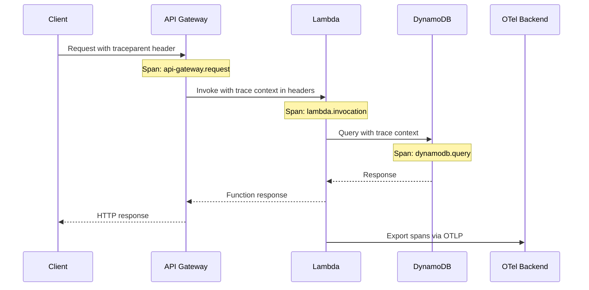

# How to Trace AWS API Gateway to Lambda End-to-End with OpenTelemetry

Author: [nawazdhandala](https://www.github.com/nawazdhandala)

Tags: OpenTelemetry, AWS Lambda, API Gateway, Distributed Tracing, Serverless, W3C Trace Context, Observability

Description: Learn how to set up end-to-end distributed tracing from API Gateway through Lambda functions using OpenTelemetry with W3C trace context propagation.

---

When a request hits your API Gateway and flows through to a Lambda function, you want to see the entire journey as a single trace. The latency at the gateway, the cold start overhead, the function execution, and any downstream calls your Lambda makes should all appear as connected spans in one trace. Without this, debugging a slow API call means jumping between CloudWatch log groups and guessing where the time went.

OpenTelemetry makes this possible by propagating trace context through every hop. API Gateway passes trace headers to Lambda, Lambda passes them to downstream services, and the result is a complete picture of every request. This guide walks through the setup step by step.

## The End-to-End Trace Architecture

Here is what the full trace looks like when everything is wired together.



The trace starts at the client (or at API Gateway if the client does not send trace headers), flows through Lambda, and includes every downstream call. Each service adds its spans to the same trace using the propagated trace ID.

## Configuring API Gateway for Trace Propagation

API Gateway can propagate trace context in two ways: through AWS X-Ray headers or through W3C `traceparent` headers. For OpenTelemetry compatibility, you want W3C format, but you should support both since some AWS services still use the X-Ray format.

For HTTP API (API Gateway v2), trace context propagation is simpler because the headers pass through to your Lambda function automatically.

```yaml
# serverless.yml with API Gateway v2 (HTTP API)
service: traced-api

provider:
  name: aws
  runtime: nodejs18.x
  region: us-east-1
  # Enable X-Ray tracing on API Gateway.
  # This creates gateway-level spans and passes the
  # X-Amzn-Trace-Id header to Lambda.
  tracing:
    apiGateway: true
    lambda: true
  environment:
    OTEL_SERVICE_NAME: traced-api
    OTEL_EXPORTER_OTLP_ENDPOINT: https://your-collector:4318
    AWS_LAMBDA_EXEC_WRAPPER: /opt/otel-handler

functions:
  getOrder:
    handler: handlers/getOrder.handler
    layers:
      - arn:aws:lambda:us-east-1:901920570463:layer:aws-otel-nodejs-amd64-ver-1-18-1:1
    events:
      - httpApi:
          path: /orders/{id}
          method: get
```

With `tracing.apiGateway: true`, API Gateway creates its own trace segment and forwards the trace ID. The W3C `traceparent` header from the client also passes through to Lambda, which means your OpenTelemetry instrumentation can pick up either format.

## Extracting Trace Context in Lambda

The critical step is extracting the trace context from the incoming event so your Lambda spans join the same trace that started at the client or API Gateway.

```javascript
// trace-extractor.js
const { propagation, context, ROOT_CONTEXT } = require('@opentelemetry/api');
const { W3CTraceContextPropagator } = require('@opentelemetry/core');
const { AWSXRayPropagator } = require('@opentelemetry/propagator-aws-xray');

// Create a composite propagator that understands both W3C and X-Ray formats.
// API Gateway may send either depending on the configuration and the
// headers present in the original client request.
const compositePropagator = {
  inject(ctx, carrier, setter) {
    new W3CTraceContextPropagator().inject(ctx, carrier, setter);
  },
  extract(ctx, carrier, getter) {
    // Try W3C format first since it is the OpenTelemetry standard
    let extracted = new W3CTraceContextPropagator().extract(ctx, carrier, getter);

    // If W3C extraction did not find a trace, try X-Ray format
    // which API Gateway uses when X-Ray tracing is enabled
    if (extracted === ctx) {
      extracted = new AWSXRayPropagator().extract(ctx, carrier, getter);
    }

    return extracted;
  },
  fields() {
    return ['traceparent', 'tracestate', 'x-amzn-trace-id'];
  },
};

// Extract trace context from an API Gateway event.
// The headers come in the event object, not as real HTTP headers,
// so we need to build a carrier object from the event.
function extractTraceContext(event) {
  // API Gateway v2 (HTTP API) puts headers in event.headers
  // API Gateway v1 (REST API) also uses event.headers but
  // with different casing behavior
  const headers = event.headers || {};

  // Normalize header names to lowercase for consistent extraction.
  // API Gateway v2 lowercases headers automatically, but v1 does not.
  const normalizedHeaders = {};
  for (const [key, value] of Object.entries(headers)) {
    normalizedHeaders[key.toLowerCase()] = value;
  }

  const getter = {
    get(carrier, key) {
      return carrier[key.toLowerCase()];
    },
    keys(carrier) {
      return Object.keys(carrier);
    },
  };

  return compositePropagator.extract(ROOT_CONTEXT, normalizedHeaders, getter);
}

module.exports = { extractTraceContext, compositePropagator };
```

This composite extraction handles the reality that traces can arrive in either W3C or X-Ray format. The `extractTraceContext` function normalizes the headers and tries both propagators, which makes your Lambda work correctly regardless of how it was invoked.

## Building the Instrumented Lambda Handler

With trace extraction in place, build a handler that creates properly parented spans.

```javascript
// handlers/getOrder.js
const { trace, context, SpanKind, SpanStatusCode } = require('@opentelemetry/api');
const { extractTraceContext, compositePropagator } = require('../trace-extractor');
const { DynamoDBClient, GetItemCommand } = require('@aws-sdk/client-dynamodb');

const tracer = trace.getTracer('order-service', '1.0.0');

// Create the DynamoDB client outside the handler for connection reuse
const dynamodb = new DynamoDBClient({});

exports.handler = async (event, lambdaContext) => {
  // Extract the parent trace context from the API Gateway event.
  // This links our Lambda spans to the broader request trace.
  const parentContext = extractTraceContext(event);

  // Start the root span for this Lambda invocation, parented
  // to the trace context from API Gateway
  return context.with(parentContext, async () => {
    const span = tracer.startSpan('lambda.getOrder', {
      kind: SpanKind.SERVER,
      attributes: {
        // Record API Gateway specific attributes for correlation
        'http.method': event.requestContext?.http?.method || 'GET',
        'http.route': '/orders/{id}',
        'http.target': event.rawPath || event.path,
        'faas.trigger': 'http',
        'faas.invocation_id': lambdaContext.awsRequestId,
        // Record the API Gateway request ID so you can correlate
        // with API Gateway access logs
        'aws.apigateway.request_id': event.requestContext?.requestId,
        'aws.apigateway.stage': event.requestContext?.stage,
      },
    });

    return context.with(trace.setSpan(context.active(), span), async () => {
      try {
        const orderId = event.pathParameters?.id;

        if (!orderId) {
          span.setStatus({ code: SpanStatusCode.ERROR, message: 'Missing order ID' });
          span.end();
          return { statusCode: 400, body: JSON.stringify({ error: 'Missing order ID' }) };
        }

        // Fetch the order from DynamoDB with a child span
        const order = await getOrderFromDynamo(orderId);

        if (!order) {
          span.setAttribute('order.found', false);
          span.end();
          return { statusCode: 404, body: JSON.stringify({ error: 'Order not found' }) };
        }

        span.setAttribute('order.found', true);
        span.setAttribute('order.status', order.status?.S || 'unknown');
        span.setStatus({ code: SpanStatusCode.OK });
        span.end();

        return {
          statusCode: 200,
          headers: { 'Content-Type': 'application/json' },
          body: JSON.stringify(order),
        };
      } catch (error) {
        span.recordException(error);
        span.setStatus({ code: SpanStatusCode.ERROR, message: error.message });
        span.end();
        return { statusCode: 500, body: JSON.stringify({ error: 'Internal server error' }) };
      }
    });
  });
};

// Fetch an order with a traced DynamoDB call
async function getOrderFromDynamo(orderId) {
  const span = tracer.startSpan('dynamodb.getItem', {
    kind: SpanKind.CLIENT,
    attributes: {
      'db.system': 'dynamodb',
      'db.operation': 'GetItem',
      'db.name': 'orders',
      'aws.dynamodb.table': 'orders',
    },
  });

  try {
    const result = await dynamodb.send(
      new GetItemCommand({
        TableName: 'orders',
        Key: { orderId: { S: orderId } },
      })
    );

    span.setAttribute('db.response.items', result.Item ? 1 : 0);
    span.setStatus({ code: SpanStatusCode.OK });
    return result.Item || null;
  } catch (error) {
    span.recordException(error);
    span.setStatus({ code: SpanStatusCode.ERROR });
    throw error;
  } finally {
    span.end();
  }
}
```

Every span in this handler is linked to the parent trace through context propagation. The API Gateway request ID is recorded as an attribute so you can cross-reference with API Gateway's own logs.

## Propagating Trace Context to Downstream Services

When your Lambda calls other services, you need to inject the trace context into outgoing requests so the downstream service can continue the trace.

```javascript
// traced-http.js
const { trace, context, SpanKind, SpanStatusCode, propagation } = require('@opentelemetry/api');

const tracer = trace.getTracer('order-service', '1.0.0');

// Make an HTTP call to a downstream service with trace context propagation.
// The downstream service receives the traceparent header and can create
// child spans that appear in the same trace.
async function callDownstreamService(url, method, body) {
  const span = tracer.startSpan('http.client', {
    kind: SpanKind.CLIENT,
    attributes: {
      'http.method': method,
      'http.url': url,
    },
  });

  return context.with(trace.setSpan(context.active(), span), async () => {
    // Build headers and inject trace context into them
    const headers = { 'Content-Type': 'application/json' };
    propagation.inject(context.active(), headers);

    try {
      const response = await fetch(url, {
        method,
        headers,
        body: body ? JSON.stringify(body) : undefined,
      });

      span.setAttribute('http.status_code', response.status);

      if (response.status >= 400) {
        span.setStatus({ code: SpanStatusCode.ERROR });
      } else {
        span.setStatus({ code: SpanStatusCode.OK });
      }

      return response;
    } catch (error) {
      span.recordException(error);
      span.setStatus({ code: SpanStatusCode.ERROR, message: error.message });
      throw error;
    } finally {
      span.end();
    }
  });
}

module.exports = { callDownstreamService };
```

The `propagation.inject` call adds the `traceparent` and `tracestate` headers to the outgoing request. If the downstream service is instrumented with OpenTelemetry, its spans will automatically appear as children in the same trace.

## Handling REST API (API Gateway v1) Differences

If you are using the REST API (v1) instead of HTTP API (v2), there are some differences in how the event object is structured.

```javascript
// api-gateway-compat.js

// Normalize the API Gateway event to handle differences between
// v1 (REST API) and v2 (HTTP API) event formats
function normalizeApiGatewayEvent(event) {
  // Detect which version of API Gateway sent this event
  const isV2 = !!event.requestContext?.http;

  return {
    // HTTP method is in different locations for v1 and v2
    method: isV2
      ? event.requestContext.http.method
      : event.httpMethod,

    // Path is structured differently between versions
    path: isV2
      ? event.rawPath
      : event.path,

    // Path parameters work the same way in both versions
    pathParameters: event.pathParameters || {},

    // Query string parameters have the same structure
    queryParameters: isV2
      ? event.queryStringParameters || {}
      : event.queryStringParameters || {},

    // Headers are lowercase in v2 but mixed case in v1
    headers: event.headers || {},

    // Request context IDs are in different locations
    requestId: isV2
      ? event.requestContext.requestId
      : event.requestContext?.requestId,

    stage: isV2
      ? event.requestContext.stage
      : event.requestContext?.stage,

    // API Gateway version for span attributes
    gatewayVersion: isV2 ? 'v2' : 'v1',
  };
}

module.exports = { normalizeApiGatewayEvent };
```

Use this normalization function at the start of your handler so the rest of your code does not need to worry about which API Gateway version triggered the invocation.

## Correlating API Gateway Access Logs with Traces

For complete end-to-end visibility, configure API Gateway access logs to include the trace ID. This lets you search your API Gateway logs by trace ID and vice versa.

```yaml
# serverless.yml - configure access logging with trace IDs
provider:
  name: aws
  # Configure access log format to include trace context.
  # The $context.requestId correlates with the span attribute
  # we recorded in the Lambda handler.
  httpApi:
    accessLogFormat: >-
      {
        "requestId": "$context.requestId",
        "ip": "$context.identity.sourceIp",
        "method": "$context.httpMethod",
        "path": "$context.path",
        "status": "$context.status",
        "latency": "$context.responseLatency",
        "integrationLatency": "$context.integrationLatency",
        "xrayTraceId": "$context.xrayTraceId"
      }
```

The `integrationLatency` field is especially useful. It tells you how long API Gateway waited for Lambda to respond. Comparing this with your Lambda span duration reveals how much overhead the API Gateway integration itself adds.

## Visualizing the End-to-End Trace

When everything is connected, your trace viewer shows a waterfall like this:

```mermaid
gantt
    title End-to-End API Gateway to Lambda Trace
    dateFormat X
    axisFormat %L ms

    section API Gateway
    Gateway Processing     :0, 15
    Integration Latency    :15, 285

    section Lambda
    Cold Start (init)      :15, 120
    Handler Execution      :120, 260
    Telemetry Flush        :260, 285

    section DynamoDB
    GetItem Query          :140, 190
```



The waterfall view immediately tells you where time is being spent. In this example, the cold start accounts for most of the latency. On warm invocations, that 105ms of init overhead disappears, and the total request time drops dramatically.

## Testing the Trace Chain

Verify that your end-to-end tracing works by sending a request with a known trace ID and checking that all spans appear.

```bash
# Send a request with a specific traceparent header
# so you can search for this exact trace in your backend
curl -v \
  -H "traceparent: 00-4bf92f3577b34da6a3ce929d0e0e4736-00f067aa0ba902b7-01" \
  https://your-api-id.execute-api.us-east-1.amazonaws.com/orders/12345
```

Search your observability backend for trace ID `4bf92f3577b34da6a3ce929d0e0e4736`. You should see the API Gateway span (if X-Ray is enabled), the Lambda invocation span, and the DynamoDB query span all connected in one trace.

## Wrapping Up

End-to-end tracing from API Gateway through Lambda gives you the full picture of every API request. The setup requires three things: enabling trace propagation at API Gateway, extracting trace context in your Lambda handler, and injecting context into downstream calls. The composite W3C/X-Ray propagator handles the format differences between AWS native tracing and OpenTelemetry. Once connected, you can see exactly where latency lives in your serverless architecture and make targeted improvements instead of guessing.
