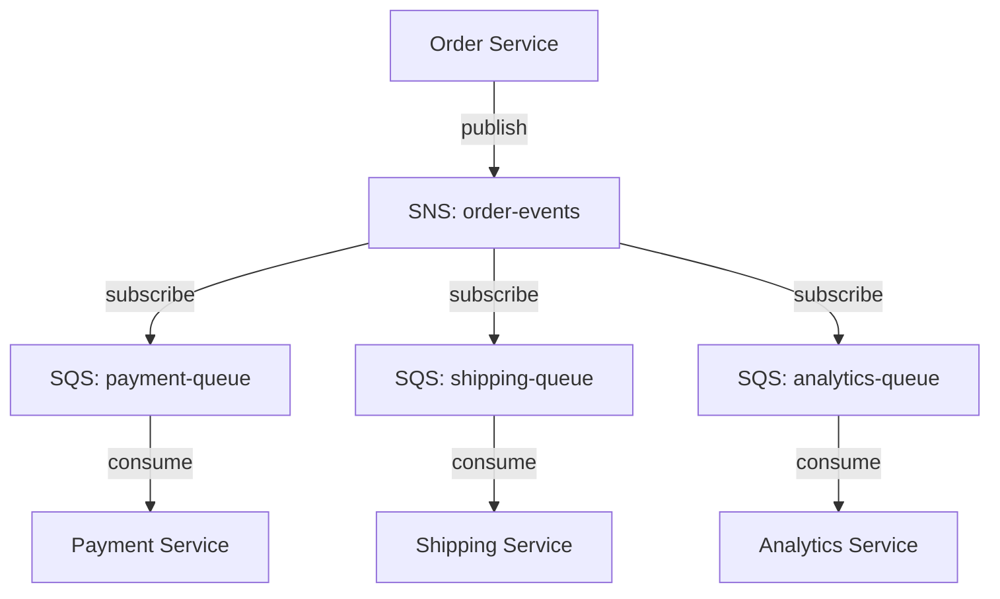

# How to Trace AWS SQS and SNS Message Flows with OpenTelemetry

Author: [nawazdhandala](https://www.github.com/nawazdhandala)

Tags: OpenTelemetry, AWS, SQS, SNS, Distributed Tracing, Messaging, Python, Observability

Description: Learn how to instrument AWS SQS and SNS with OpenTelemetry to trace message flows from SNS publish through SQS delivery and processing in your distributed applications.

---

AWS SQS and SNS form the backbone of event-driven architectures on AWS. SNS handles fan-out by publishing messages to multiple subscribers, while SQS provides reliable queue-based delivery. Together, they enable the classic SNS-to-SQS fan-out pattern that powers everything from order processing to notification systems.

The problem is that once a message enters SNS or SQS, it disappears from your application's view until a consumer picks it up. You lose trace continuity. OpenTelemetry fixes this by propagating trace context through SQS message attributes and SNS message attributes, connecting the publisher and every downstream consumer into a single distributed trace.

## The SNS-to-SQS Fan-Out Pattern

The most common architecture pairs SNS topics with SQS queues. A service publishes a message to an SNS topic, and SNS delivers copies to one or more subscribed SQS queues. Different services consume from their respective queues.



Tracing this flow means injecting context when publishing to SNS, preserving it through the SNS-to-SQS delivery, and extracting it when consuming from SQS.

## Instrumenting with Python and Boto3

The `opentelemetry-instrumentation-botocore` package instruments the AWS SDK for Python (boto3/botocore) automatically. It handles SQS and SNS among many other AWS services.

Install the required packages:

```bash
# Install OpenTelemetry and the botocore instrumentation
pip install opentelemetry-api \
    opentelemetry-sdk \
    opentelemetry-exporter-otlp \
    opentelemetry-instrumentation-botocore \
    boto3
```

Set up the tracer and instrument botocore:

```python
from opentelemetry import trace
from opentelemetry.sdk.trace import TracerProvider
from opentelemetry.sdk.trace.export import BatchSpanProcessor
from opentelemetry.exporter.otlp.proto.grpc.trace_exporter import OTLPSpanExporter
from opentelemetry.sdk.resources import Resource
from opentelemetry.instrumentation.botocore import BotocoreInstrumentor

# Configure the tracer provider
resource = Resource.create({"service.name": "order-service"})
provider = TracerProvider(resource=resource)
provider.add_span_processor(
    BatchSpanProcessor(OTLPSpanExporter(endpoint="http://localhost:4317"))
)
trace.set_tracer_provider(provider)

# Instrument botocore (the library that boto3 uses under the hood)
# This patches all AWS service clients, including SQS and SNS
BotocoreInstrumentor().instrument()
```

With this setup, every AWS API call made through boto3 will be traced. For SQS and SNS specifically, the instrumentation also handles trace context propagation through message attributes.

## Publishing to SNS with Trace Context

After instrumentation, publishing to SNS automatically creates a span and injects trace context:

```python
import boto3
import json

# Create an SNS client
sns = boto3.client("sns", region_name="us-east-1")

def publish_order_event(order):
    """
    Publish an order event to SNS.
    The botocore instrumentation automatically:
    1. Creates a PRODUCER span for the SNS Publish call
    2. Injects trace context into SNS MessageAttributes
    3. Sets span attributes like messaging.system and messaging.destination.name
    """
    response = sns.publish(
        TopicArn="arn:aws:sns:us-east-1:123456789:order-events",
        Message=json.dumps({
            "order_id": order["id"],
            "action": "created",
            "total": order["total"]
        }),
        MessageAttributes={
            # Your custom attributes
            "event_type": {
                "DataType": "String",
                "StringValue": "order.created"
            }
        }
    )

    print(f"Published message: {response['MessageId']}")
    return response
```

The instrumentation adds trace context to the SNS `MessageAttributes` alongside your custom attributes. When SNS delivers the message to subscribed SQS queues, these attributes are preserved.

## Sending Messages Directly to SQS

For direct SQS usage without SNS, the same instrumentation handles trace context injection:

```python
# Create an SQS client
sqs = boto3.client("sqs", region_name="us-east-1")

def send_task(task_data):
    """
    Send a task message directly to SQS.
    Trace context is automatically injected into MessageAttributes.
    """
    response = sqs.send_message(
        QueueUrl="https://sqs.us-east-1.amazonaws.com/123456789/task-queue",
        MessageBody=json.dumps(task_data),
        MessageAttributes={
            "task_type": {
                "DataType": "String",
                "StringValue": task_data["type"]
            }
        }
    )
    return response


def send_batch_tasks(tasks):
    """
    Send multiple task messages in a batch.
    Each message in the batch gets its own trace context.
    """
    entries = []
    for i, task in enumerate(tasks):
        entries.append({
            "Id": str(i),
            "MessageBody": json.dumps(task),
            "MessageAttributes": {
                "task_type": {
                    "DataType": "String",
                    "StringValue": task["type"]
                }
            }
        })

    response = sqs.send_message_batch(
        QueueUrl="https://sqs.us-east-1.amazonaws.com/123456789/task-queue",
        Entries=entries
    )
    return response
```

Batch sends are interesting because each message in the batch should carry its own trace context. The botocore instrumentation handles this by creating a span for the batch operation and injecting context into each entry.

## Consuming from SQS with Trace Context Extraction

The consumer side extracts trace context from the SQS message attributes. The instrumentation does this when you call `receive_message` and process the results:

```python
import time

sqs = boto3.client("sqs", region_name="us-east-1")
queue_url = "https://sqs.us-east-1.amazonaws.com/123456789/payment-queue"

def poll_and_process():
    """
    Long-poll SQS and process messages with trace context.
    """
    while True:
        # The receive_message call is traced as an SQS.ReceiveMessage span
        response = sqs.receive_message(
            QueueUrl=queue_url,
            MaxNumberOfMessages=10,
            WaitTimeSeconds=20,  # long polling
            MessageAttributeNames=["All"]  # needed to receive trace context
        )

        messages = response.get("Messages", [])
        if not messages:
            continue

        for message in messages:
            # Process each message within its trace context
            process_payment_message(message)

            # Delete the message after successful processing
            sqs.delete_message(
                QueueUrl=queue_url,
                ReceiptHandle=message["ReceiptHandle"]
            )
```

One critical detail: you must include `MessageAttributeNames=["All"]` in your `receive_message` call. Without it, SQS does not return the message attributes, and the instrumentation cannot extract the trace context. This is the most common mistake when setting up SQS tracing.

## Adding Custom Processing Spans

The automatic instrumentation gives you spans for the AWS API calls, but you often want to add custom spans for your business logic:

```python
tracer = trace.get_tracer("payment-service")

def process_payment_message(message):
    """
    Process a payment message with custom tracing.
    The botocore instrumentation sets the trace context from the message.
    Custom spans created here become children of that context.
    """
    body = json.loads(message["Body"])

    # If the message came through SNS, the actual payload is nested
    if "Message" in body:
        order_data = json.loads(body["Message"])
    else:
        order_data = body

    # Create a custom span for payment processing
    with tracer.start_as_current_span("process-payment") as span:
        span.set_attribute("order.id", order_data["order_id"])
        span.set_attribute("payment.amount", order_data["total"])

        # Validate the payment
        with tracer.start_as_current_span("validate-payment"):
            validate_payment_details(order_data)

        # Charge the customer
        with tracer.start_as_current_span("charge-customer"):
            charge_result = charge_customer(order_data)
            span.set_attribute("payment.status", charge_result["status"])

        # Send confirmation
        with tracer.start_as_current_span("send-confirmation"):
            send_payment_confirmation(order_data, charge_result)
```

These nested spans create a detailed trace tree that shows exactly what happened during payment processing, all linked back to the original SNS publish event.

## Handling the SNS Message Envelope

When SNS delivers to SQS, it wraps the original message in an envelope. The SQS message body contains a JSON object with fields like `Type`, `MessageId`, `TopicArn`, `Message` (the actual payload), and `MessageAttributes`. You need to handle this wrapping in your consumer:

```python
def unwrap_sns_message(sqs_message_body):
    """
    Unwrap an SNS notification envelope from an SQS message.
    SNS wraps the original message in a JSON envelope when
    delivering to subscribed SQS queues.
    """
    envelope = json.loads(sqs_message_body)

    # Check if this is an SNS notification
    if envelope.get("Type") == "Notification":
        return {
            "payload": json.loads(envelope["Message"]),
            "topic_arn": envelope.get("TopicArn"),
            "sns_message_id": envelope.get("MessageId"),
            "timestamp": envelope.get("Timestamp"),
            "subject": envelope.get("Subject")
        }

    # Direct SQS message (not from SNS)
    return {"payload": envelope}
```

The trace context propagation works regardless of the envelope. The botocore instrumentation stores trace context in SQS message attributes (which are separate from the message body), so the SNS envelope does not interfere with tracing.

## Dead Letter Queue Tracing

SQS dead letter queues (DLQs) receive messages that fail processing after a configured number of attempts. The trace context survives the move to the DLQ:

```python
def process_dlq():
    """
    Process messages from the dead letter queue.
    These messages carry the original trace context, so DLQ
    processing spans link back to the original publish event.
    """
    dlq_url = "https://sqs.us-east-1.amazonaws.com/123456789/payment-queue-dlq"

    response = sqs.receive_message(
        QueueUrl=dlq_url,
        MaxNumberOfMessages=10,
        MessageAttributeNames=["All"],
        # Request the ApproximateReceiveCount to see how many times it failed
        AttributeNames=["ApproximateReceiveCount", "SentTimestamp"]
    )

    for message in response.get("Messages", []):
        with tracer.start_as_current_span("process-dead-letter") as span:
            # Record DLQ-specific attributes
            attrs = message.get("Attributes", {})
            span.set_attribute("dlq.receive_count",
                int(attrs.get("ApproximateReceiveCount", 0)))
            span.set_attribute("dlq.original_sent_timestamp",
                attrs.get("SentTimestamp", ""))

            # Analyze and handle the failed message
            handle_failed_message(message)
```

## Collector Configuration for AWS Messaging

Set up your OpenTelemetry Collector to receive traces from your SQS and SNS instrumented services:

```yaml
receivers:
  otlp:
    protocols:
      grpc:
        endpoint: 0.0.0.0:4317
      http:
        endpoint: 0.0.0.0:4318

processors:
  batch:
    timeout: 5s
    send_batch_size: 256
  resource:
    attributes:
      # Add cloud provider context
      - key: cloud.provider
        value: aws
        action: upsert

exporters:
  otlp:
    endpoint: https://oneuptime.example.com:4317

service:
  pipelines:
    traces:
      receivers: [otlp]
      processors: [batch, resource]
      exporters: [otlp]
```

## FIFO Queues and Tracing

SQS FIFO queues guarantee ordering and exactly-once processing within a message group. The tracing approach is identical, but you get additional useful attributes:

```python
# FIFO queue message with deduplication and grouping
sqs.send_message(
    QueueUrl="https://sqs.us-east-1.amazonaws.com/123456789/orders.fifo",
    MessageBody=json.dumps(order_data),
    MessageGroupId=order_data["customer_id"],  # ordering per customer
    MessageDeduplicationId=order_data["order_id"],  # prevent duplicates
    MessageAttributes={
        "event_type": {
            "DataType": "String",
            "StringValue": "order.created"
        }
    }
)
```

The instrumentation captures `MessageGroupId` and `MessageDeduplicationId` as span attributes, which helps when debugging ordering issues or deduplication behavior in your traces.

Tracing AWS SQS and SNS with OpenTelemetry transforms opaque cloud messaging into something you can see and debug. From the initial SNS publish through fan-out delivery to SQS, through consumer processing and even dead letter handling, every step shows up as a connected span in your distributed traces. That visibility makes the difference between guessing where a message went wrong and knowing exactly what happened.
