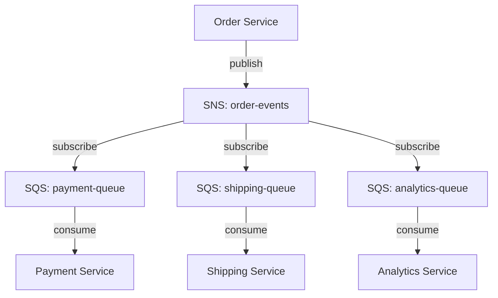

# How to Trace AWS SQS and SNS Message Flows with OpenTelemetry

Author: [nawazdhandala](https://www.github.com/nawazdhandala)

Tags: OpenTelemetry, AWS, SQS, SNS, Distributed Tracing, Messaging, Python, Observability

Description: Learn how to instrument AWS SQS and SNS with OpenTelemetry to trace message flows from SNS publish through SQS delivery and processing in your distributed applications.

---

AWS SQS and SNS form the backbone of event-driven architectures on AWS. SNS handles fan-out by publishing messages to multiple subscribers, while SQS provides reliable queue-based delivery. Together, they enable the classic SNS-to-SQS fan-out pattern that powers everything from order processing to notification systems.

The problem is that once a message enters SNS or SQS, it disappears from your application's view until a consumer picks it up. You lose trace continuity. OpenTelemetry fixes this by propagating trace context through SQS message attributes and SNS message attributes, connecting the publisher and downstream consumers in your distributed traces.

## The SNS-to-SQS Fan-Out Pattern

The most common architecture pairs SNS topics with SQS queues. A service publishes a message to an SNS topic, and SNS delivers copies to one or more subscribed SQS queues. Different services consume from their respective queues.


```mermaid
graph TD
    A[Order Service] -->|publish| B[SNS: order-events]
    B -->|subscribe| C[SQS: payment-queue]
    B -->|subscribe| D[SQS: shipping-queue]
    B -->|subscribe| E[SQS: analytics-queue]
    C -->|consume| F[Payment Service]
    D -->|consume| G[Shipping Service]
    E -->|consume| H[Analytics Service]
```

Tracing this flow means injecting context when publishing to SNS, preserving it through the SNS-to-SQS delivery, and extracting it when consuming from SQS.

## Instrumenting with Python and Boto3

The `opentelemetry-instrumentation-botocore` package instruments AWS SDK calls made through boto3/botocore. For SQS message-attribute propagation, use `opentelemetry-instrumentation-boto3sqs`.

Install the required packages:

```bash
# Install OpenTelemetry and the AWS SDK/SQS instrumentation

pip install opentelemetry-api \
    opentelemetry-sdk \
    opentelemetry-exporter-otlp \
    opentelemetry-instrumentation-botocore \
    opentelemetry-instrumentation-boto3sqs \
    boto3
```

Set up the tracer and instrument botocore and SQS:

```python
from opentelemetry import trace
from opentelemetry.sdk.trace import TracerProvider
from opentelemetry.sdk.trace.export import BatchSpanProcessor
from opentelemetry.exporter.otlp.proto.grpc.trace_exporter import OTLPSpanExporter
from opentelemetry.sdk.resources import Resource
from opentelemetry.instrumentation.botocore import BotocoreInstrumentor
from opentelemetry.instrumentation.boto3sqs import Boto3SQSInstrumentor

# Configure the tracer provider
resource = Resource.create({"service.name": "order-service"})
provider = TracerProvider(resource=resource)
provider.add_span_processor(
    BatchSpanProcessor(OTLPSpanExporter(endpoint="http://localhost:4317"))
)
trace.set_tracer_provider(provider)

# Instrument botocore (the library that boto3 uses under the hood)
# This traces AWS service clients, including SQS and SNS
BotocoreInstrumentor().instrument()

# Instrument SQS send/receive/delete operations and SQS message attributes
Boto3SQSInstrumentor().instrument()
```

With this setup, AWS API calls made through boto3 will be traced. For direct SQS usage, the SQS instrumentation also handles trace context propagation through message attributes.

## Publishing to SNS with Trace Context

After instrumentation, publishing to SNS creates an AWS SDK span. To propagate trace context through SNS message attributes, inject the current context into the `MessageAttributes` you pass to `publish`:

```python
import boto3
import json
from opentelemetry import propagate
from opentelemetry.instrumentation.boto3sqs import Boto3SQSSetter

# Create an SNS client
sns = boto3.client("sns", region_name="us-east-1")

def publish_order_event(order):
    """
    Publish an order event to SNS.
    Botocore traces the SNS Publish call. The explicit propagate.inject call
    adds trace context to SNS MessageAttributes.
    """
    message_attributes = {
        # Your custom attributes
        "event_type": {
            "DataType": "String",
            "StringValue": "order.created"
        }
    }
    propagate.inject(message_attributes, setter=Boto3SQSSetter())

    response = sns.publish(
        TopicArn="arn:aws:sns:us-east-1:123456789:order-events",
        Message=json.dumps({
            "order_id": order["id"],
            "action": "created",
            "total": order["total"]
        }),
        MessageAttributes=message_attributes
    )

    print(f"Published message: {response['MessageId']}")
    return response
```

The explicit injection adds trace context to the SNS `MessageAttributes` alongside your custom attributes. For SQS subscriptions, enable raw message delivery when you want SNS message attributes to arrive as SQS message attributes that the SQS instrumentation can extract automatically. SNS supports a maximum of 10 message attributes for raw-delivery SQS subscriptions.

## Sending Messages Directly to SQS

For direct SQS usage without SNS, the SQS instrumentation handles trace context injection:

```python
# Create an SQS client
sqs = boto3.client("sqs", region_name="us-east-1")

def send_task(task_data):
    """
    Send a task message directly to SQS.
    Trace context is automatically injected into MessageAttributes.
    """
    response = sqs.send_message(
        QueueUrl="https://sqs.us-east-1.amazonaws.com/123456789/task-queue",
        MessageBody=json.dumps(task_data),
        MessageAttributes={
            "task_type": {
                "DataType": "String",
                "StringValue": task_data["type"]
            }
        }
    )
    return response


def send_batch_tasks(tasks):
    """
    Send multiple task messages in a batch.
    Each message in the batch gets its own trace context.
    """
    entries = []
    for i, task in enumerate(tasks):
        entries.append({
            "Id": str(i),
            "MessageBody": json.dumps(task),
            "MessageAttributes": {
                "task_type": {
                    "DataType": "String",
                    "StringValue": task["type"]
                }
            }
        })

    response = sqs.send_message_batch(
        QueueUrl="https://sqs.us-east-1.amazonaws.com/123456789/task-queue",
        Entries=entries
    )
    return response
```

Batch sends are interesting because each message in the batch should carry its own trace context. The SQS instrumentation handles this by creating spans for the batched entries and injecting context into each entry.

## Consuming from SQS with Trace Context Extraction

The consumer side extracts trace context from the SQS message attributes. The instrumentation does this when you call `receive_message` and process the results:

```python
import time

sqs = boto3.client("sqs", region_name="us-east-1")
queue_url = "https://sqs.us-east-1.amazonaws.com/123456789/payment-queue"

def poll_and_process():
    """
    Long-poll SQS and process messages with trace context.
    """
    while True:
        # The receive_message call is traced as an SQS.ReceiveMessage span
        response = sqs.receive_message(
            QueueUrl=queue_url,
            MaxNumberOfMessages=10,
            WaitTimeSeconds=20,  # long polling
            MessageAttributeNames=["All"]  # needed to receive trace context
        )

        messages = response.get("Messages", [])
        if not messages:
            continue

        for message in messages:
            # Process each message within its trace context
            process_payment_message(message)

            # Delete the message after successful processing
            sqs.delete_message(
                QueueUrl=queue_url,
                ReceiptHandle=message["ReceiptHandle"]
            )
```

One critical detail: you must include `MessageAttributeNames=["All"]` in your `receive_message` call. Without it, SQS does not return the message attributes, and the instrumentation cannot extract the trace context. This is the most common mistake when setting up SQS tracing.

## Adding Custom Processing Spans

The automatic instrumentation gives you spans for the AWS API calls, but you often want to add custom spans for your business logic:

```python
tracer = trace.get_tracer("payment-service")

def process_payment_message(message):
    """
    Process a payment message with custom tracing.
    The SQS instrumentation sets the message's processing span as current.
    Custom spans created here become children of that processing span.
    """
    body = json.loads(message["Body"])

    # If the message came through SNS, the actual payload is nested
    if "Message" in body:
        order_data = json.loads(body["Message"])
    else:
        order_data = body

    # Create a custom span for payment processing
    with tracer.start_as_current_span("process-payment") as span:
        span.set_attribute("order.id", order_data["order_id"])
        span.set_attribute("payment.amount", order_data["total"])

        # Validate the payment
        with tracer.start_as_current_span("validate-payment"):
            validate_payment_details(order_data)

        # Charge the customer
        with tracer.start_as_current_span("charge-customer"):
            charge_result = charge_customer(order_data)
            span.set_attribute("payment.status", charge_result["status"])

        # Send confirmation
        with tracer.start_as_current_span("send-confirmation"):
            send_payment_confirmation(order_data, charge_result)
```

These nested spans create a detailed trace tree that shows exactly what happened during payment processing, linked back to the original SNS publish event through the propagated message context.

## Handling the SNS Message Envelope

When SNS delivers to SQS without raw message delivery, it wraps the original message in an envelope. The SQS message body contains a JSON object with fields like `Type`, `MessageId`, `TopicArn`, and `Message` (the actual payload). You need to handle this wrapping in your consumer:

```python
def unwrap_sns_message(sqs_message_body):
    """
    Unwrap an SNS notification envelope from an SQS message.
    SNS wraps the original message in a JSON envelope when
    delivering to subscribed SQS queues.
    """
    envelope = json.loads(sqs_message_body)

    # Check if this is an SNS notification
    if envelope.get("Type") == "Notification":
        return {
            "payload": json.loads(envelope["Message"]),
            "topic_arn": envelope.get("TopicArn"),
            "sns_message_id": envelope.get("MessageId"),
            "timestamp": envelope.get("Timestamp"),
            "subject": envelope.get("Subject")
        }

    # Direct SQS message (not from SNS)
    return {"payload": envelope}
```

Automatic SQS extraction works when the trace context is available as SQS message attributes, which is why raw message delivery matters for SNS-to-SQS propagation. If you keep the SNS envelope, extract the trace context from the SNS message attributes in the envelope yourself before creating processing spans.

## Dead Letter Queue Tracing

SQS dead letter queues (DLQs) receive messages that fail processing after a configured number of attempts. The trace context survives the move to the DLQ:

```python
def process_dlq():
    """
    Process messages from the dead letter queue.
    These messages carry the original trace context, so DLQ
    processing spans link back to the original publish event.
    """
    dlq_url = "https://sqs.us-east-1.amazonaws.com/123456789/payment-queue-dlq"

    response = sqs.receive_message(
        QueueUrl=dlq_url,
        MaxNumberOfMessages=10,
        MessageAttributeNames=["All"],
        # Request the ApproximateReceiveCount to see how many times it failed
        MessageSystemAttributeNames=["ApproximateReceiveCount", "SentTimestamp"]
    )

    for message in response.get("Messages", []):
        with tracer.start_as_current_span("process-dead-letter") as span:
            # Record DLQ-specific attributes
            attrs = message.get("Attributes", {})
            span.set_attribute("dlq.receive_count",
                int(attrs.get("ApproximateReceiveCount", 0)))
            span.set_attribute("dlq.original_sent_timestamp",
                attrs.get("SentTimestamp", ""))

            # Analyze and handle the failed message
            handle_failed_message(message)
```

## Collector Configuration for AWS Messaging

Set up your OpenTelemetry Collector to receive traces from your SQS and SNS instrumented services:

```yaml
receivers:
  otlp:
    protocols:
      grpc:
        endpoint: 0.0.0.0:4317
      http:
        endpoint: 0.0.0.0:4318

processors:
  batch:
    timeout: 5s
    send_batch_size: 256
  resource:
    attributes:
      # Add cloud provider context
      - key: cloud.provider
        value: aws
        action: upsert

exporters:
  otlp:
    endpoint: https://oneuptime.example.com:4317

service:
  pipelines:
    traces:
      receivers: [otlp]
      processors: [batch, resource]
      exporters: [otlp]
```

## FIFO Queues and Tracing

SQS FIFO queues guarantee ordering and exactly-once processing within a message group. The tracing approach is identical, and the FIFO identifiers are useful to record in your own spans when debugging ordering or deduplication behavior:

```python
# FIFO queue message with deduplication and grouping
sqs.send_message(
    QueueUrl="https://sqs.us-east-1.amazonaws.com/123456789/orders.fifo",
    MessageBody=json.dumps(order_data),
    MessageGroupId=order_data["customer_id"],  # ordering per customer
    MessageDeduplicationId=order_data["order_id"],  # prevent duplicates
    MessageAttributes={
        "event_type": {
            "DataType": "String",
            "StringValue": "order.created"
        }
    }
)
```

When consuming FIFO messages, you can request `MessageGroupId` and `MessageDeduplicationId` with `MessageSystemAttributeNames` and add them to your processing spans.

Tracing AWS SQS and SNS with OpenTelemetry transforms opaque cloud messaging into something you can see and debug. From the initial SNS publish through fan-out delivery to SQS, through consumer processing and even dead letter handling, every step shows up as a connected span in your distributed traces. That visibility makes the difference between guessing where a message went wrong and knowing exactly what happened.
