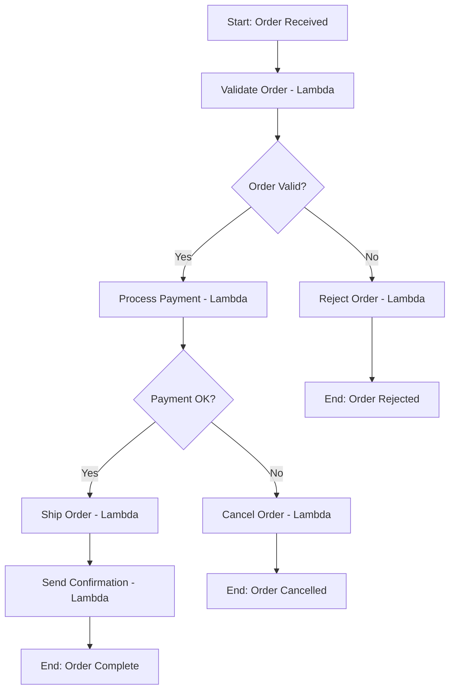
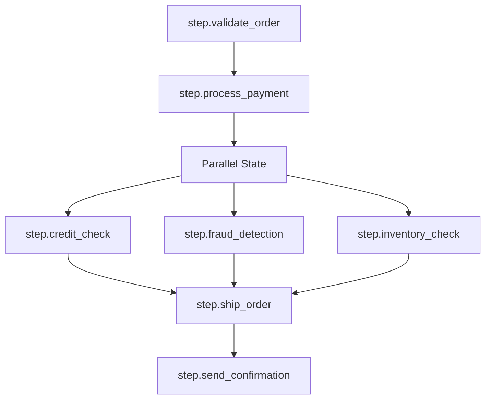

# How to Trace AWS Step Functions with OpenTelemetry

Author: [nawazdhandala](https://www.github.com/nawazdhandala)

Tags: OpenTelemetry, AWS, Step Functions, Tracing, Serverless, Observability

Description: Learn how to trace AWS Step Functions workflows end-to-end with OpenTelemetry, including Lambda task states and context propagation between steps.

---

AWS Step Functions let you orchestrate complex workflows by chaining Lambda functions, API calls, and other AWS services into state machines. They're great for breaking down multi-step business processes, but observability gets complicated fast. Each state in your workflow might run in a different Lambda execution environment, and the built-in X-Ray integration only gives you a partial picture. If you want to bring Step Functions telemetry into your existing OpenTelemetry-based observability stack, you need to do some extra work.

This guide covers how to instrument Step Functions workflows with OpenTelemetry, propagate trace context between states, and build end-to-end traces that connect every step of your workflow.

## The Challenge with Step Functions Tracing

Step Functions workflows are inherently distributed. Each task state might invoke a Lambda function that runs in its own isolated environment. There's no shared memory or process, so trace context doesn't automatically flow from one step to the next.

Here's what a typical Step Functions workflow looks like:



Each Lambda invocation is a separate execution context. Without explicit context propagation, you'd get disconnected traces for each step instead of one trace covering the entire order workflow.

## Setting Up OpenTelemetry in Lambda Functions

Every Lambda function that participates in your Step Functions workflow needs the OpenTelemetry SDK. The easiest approach is to use the AWS Lambda OpenTelemetry layer.

```bash
# Add the OpenTelemetry Lambda layer to your function
# This provides auto-instrumentation for AWS SDK calls
aws lambda update-function-configuration \
  --function-name validate-order \
  --layers arn:aws:lambda:us-east-1:184161586896:layer:opentelemetry-collector-amd64-0.12.0:1 \
  --environment "Variables={
    AWS_LAMBDA_EXEC_WRAPPER=/opt/otel-handler,
    OPENTELEMETRY_COLLECTOR_CONFIG_FILE=/var/task/collector.yaml,
    OTEL_SERVICE_NAME=order-workflow
  }"
```

If you prefer manual instrumentation (which gives you more control), set up the SDK directly in your Lambda handler code.

```python
# lambda_tracing.py - Shared tracing setup for all workflow Lambda functions
from opentelemetry import trace
from opentelemetry.sdk.trace import TracerProvider
from opentelemetry.sdk.trace.export import BatchSpanProcessor
from opentelemetry.exporter.otlp.proto.http.trace_exporter import OTLPSpanExporter
from opentelemetry.sdk.resources import Resource

# Initialize the tracer provider once per Lambda cold start
resource = Resource.create({"service.name": "order-workflow"})
provider = TracerProvider(resource=resource)

# Export traces to your OTLP endpoint (collector or backend)
exporter = OTLPSpanExporter(endpoint="https://your-collector:4318/v1/traces")
provider.add_span_processor(BatchSpanProcessor(exporter))

trace.set_tracer_provider(provider)
tracer = trace.get_tracer("step-functions-workflow")
```

## Propagating Trace Context Through Step Functions

The key to end-to-end tracing is passing the trace context from one step to the next. Step Functions lets you modify the input passed between states using ResultPath and OutputPath. You can embed the trace context in the workflow state and extract it in each Lambda.

Here's how to inject trace context into the Step Functions input.

```python
from opentelemetry import trace, context
from opentelemetry.propagate import inject

def lambda_handler(event, ctx):
    """First step in the workflow - creates the root span and injects context."""
    tracer = trace.get_tracer("step-functions-workflow")

    with tracer.start_as_current_span("step.validate_order") as span:
        span.set_attribute("order.id", event.get("orderId"))
        span.set_attribute("step_functions.state", "ValidateOrder")

        # Validate the order
        is_valid = validate_order(event["orderId"])

        # Inject current trace context into the output
        # This will be passed as input to the next state
        trace_context = {}
        inject(trace_context)

        return {
            "orderId": event["orderId"],
            "isValid": is_valid,
            "orderDetails": event.get("orderDetails", {}),
            "_traceContext": trace_context  # Carry the trace context forward
        }
```

In subsequent Lambda functions, extract the context and create linked spans.

```python
from opentelemetry import trace, context
from opentelemetry.propagate import extract, inject

def lambda_handler(event, ctx):
    """Subsequent step - extracts parent context and continues the trace."""
    tracer = trace.get_tracer("step-functions-workflow")

    # Extract the trace context passed from the previous step
    parent_context = extract(event.get("_traceContext", {}))

    # Start a new span linked to the parent trace
    with tracer.start_as_current_span(
        "step.process_payment",
        context=parent_context,
        attributes={
            "order.id": event["orderId"],
            "step_functions.state": "ProcessPayment",
        }
    ) as span:
        # Process the payment
        result = charge_customer(event["orderId"], event["orderDetails"])
        span.set_attribute("payment.status", result["status"])
        span.set_attribute("payment.amount", result["amount"])

        # Inject updated context for the next step
        trace_context = {}
        inject(trace_context)

        return {
            "orderId": event["orderId"],
            "paymentStatus": result["status"],
            "orderDetails": event["orderDetails"],
            "_traceContext": trace_context
        }
```

## Step Functions State Machine Definition

Your state machine definition needs to pass the `_traceContext` field between states. Here's how the relevant part of the ASL (Amazon States Language) definition looks.

```json
{
  "Comment": "Order processing workflow with OpenTelemetry tracing",
  "StartAt": "ValidateOrder",
  "States": {
    "ValidateOrder": {
      "Type": "Task",
      "Resource": "arn:aws:lambda:us-east-1:123456789:function:validate-order",
      "ResultPath": "$",
      "Next": "IsOrderValid"
    },
    "IsOrderValid": {
      "Type": "Choice",
      "Choices": [
        {
          "Variable": "$.isValid",
          "BooleanEquals": true,
          "Next": "ProcessPayment"
        }
      ],
      "Default": "RejectOrder"
    },
    "ProcessPayment": {
      "Type": "Task",
      "Resource": "arn:aws:lambda:us-east-1:123456789:function:process-payment",
      "ResultPath": "$",
      "Next": "IsPaymentSuccessful"
    },
    "IsPaymentSuccessful": {
      "Type": "Choice",
      "Choices": [
        {
          "Variable": "$.paymentStatus",
          "StringEquals": "success",
          "Next": "ShipOrder"
        }
      ],
      "Default": "CancelOrder"
    },
    "ShipOrder": {
      "Type": "Task",
      "Resource": "arn:aws:lambda:us-east-1:123456789:function:ship-order",
      "ResultPath": "$",
      "Next": "SendConfirmation"
    },
    "SendConfirmation": {
      "Type": "Task",
      "Resource": "arn:aws:lambda:us-east-1:123456789:function:send-confirmation",
      "End": true
    },
    "RejectOrder": {
      "Type": "Task",
      "Resource": "arn:aws:lambda:us-east-1:123456789:function:reject-order",
      "End": true
    },
    "CancelOrder": {
      "Type": "Task",
      "Resource": "arn:aws:lambda:us-east-1:123456789:function:cancel-order",
      "End": true
    }
  }
}
```

The key detail is `"ResultPath": "$"` which ensures the entire Lambda output (including `_traceContext`) replaces the state input for the next step.

## Creating a Wrapper for Consistent Instrumentation

Instead of repeating the context extraction and injection logic in every Lambda, create a decorator that handles it automatically.

```python
import functools
from opentelemetry import trace
from opentelemetry.propagate import extract, inject

tracer = trace.get_tracer("step-functions-workflow")

def step_function_traced(state_name):
    """Decorator that handles trace context propagation for Step Functions."""
    def decorator(func):
        @functools.wraps(func)
        def wrapper(event, context):
            # Extract parent context from previous step if available
            parent_ctx = extract(event.get("_traceContext", {}))

            with tracer.start_as_current_span(
                f"step.{state_name}",
                context=parent_ctx,
                attributes={
                    "step_functions.state": state_name,
                    "step_functions.execution_id": event.get("executionId", "unknown"),
                    "faas.trigger": "other",
                    "cloud.provider": "aws",
                }
            ):
                # Call the actual handler
                result = func(event, context)

                # Inject trace context into the result for the next step
                trace_context = {}
                inject(trace_context)

                if isinstance(result, dict):
                    result["_traceContext"] = trace_context
                return result

        return wrapper
    return decorator


# Usage is now clean and simple
@step_function_traced("validate_order")
def lambda_handler(event, context):
    """Just focus on business logic - tracing is handled by the decorator."""
    order = get_order(event["orderId"])
    is_valid = order["total"] > 0 and order["items"]

    return {
        "orderId": event["orderId"],
        "isValid": is_valid,
        "orderDetails": order,
    }
```

This decorator pattern keeps your Lambda handlers clean. They don't need to know anything about OpenTelemetry - the decorator manages context extraction, span creation, and context injection automatically.

## Handling Parallel States

Step Functions supports parallel execution with the Parallel state type. When two branches run concurrently, each branch should get its own child span.

```python
@step_function_traced("parallel_enrichment")
def lambda_handler(event, context):
    """This runs in one branch of a Parallel state."""
    tracer = trace.get_tracer("step-functions-workflow")

    # Add attributes to identify which parallel branch this is
    current_span = trace.get_current_span()
    current_span.set_attribute("step_functions.parallel_branch", "credit_check")

    result = run_credit_check(event["orderId"])

    return {
        "orderId": event["orderId"],
        "creditScore": result["score"],
        "creditApproved": result["approved"],
    }
```

The resulting trace will show the parallel branches as concurrent child spans under the parent.



## Adding Workflow-Level Metadata

For better searchability, add Step Functions-specific attributes to your spans. The execution ARN is the most important one since it uniquely identifies a workflow run.

```python
import os

def enrich_span_with_workflow_metadata(span, event):
    """Add Step Functions metadata for filtering and correlation."""
    span.set_attribute(
        "step_functions.execution_arn",
        event.get("executionArn", "unknown")
    )
    span.set_attribute(
        "step_functions.state_machine_arn",
        event.get("stateMachineArn", "unknown")
    )
    span.set_attribute(
        "aws.region",
        os.environ.get("AWS_REGION", "unknown")
    )
    span.set_attribute(
        "aws.account_id",
        event.get("accountId", "unknown")
    )
```

You can pass the execution ARN into your workflow by including it in the initial input when you start the execution, or by using the Step Functions context object in your ASL definition.

## Flushing Traces in Lambda

Lambda functions can freeze between invocations, which means the BatchSpanProcessor might not flush pending spans. Always force a flush before the handler returns.

```python
from opentelemetry import trace

def lambda_handler(event, context):
    # ... your logic here ...

    # Force flush before Lambda freezes the execution environment
    provider = trace.get_tracer_provider()
    if hasattr(provider, 'force_flush'):
        provider.force_flush(timeout_millis=5000)

    return result
```

Without this, you might lose spans from short-lived Lambda invocations. This is especially important for Step Functions because a workflow with 6 steps means 6 Lambda invocations, and losing even one span breaks your end-to-end trace.

## Wrapping Up

Tracing AWS Step Functions with OpenTelemetry takes more effort than tracing a monolithic application, but the pattern is consistent. Inject trace context into the workflow state, extract it in each Lambda handler, create spans with meaningful attributes, and flush before the Lambda freezes. The decorator approach keeps things maintainable as your workflow grows. Once it's set up, you'll have complete visibility into your workflow execution, from the first step to the last, all within your existing OpenTelemetry observability platform.
