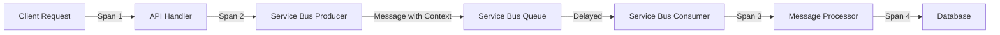

# How to Trace Azure Service Bus Messages with OpenTelemetry in .NET

Author: [nawazdhandala](https://www.github.com/nawazdhandala)

Tags: OpenTelemetry, Azure Service Bus, .NET, Messaging, Cloud, Tracing

Description: Learn how to implement distributed tracing for Azure Service Bus messages in .NET applications using OpenTelemetry for complete message flow visibility.

Distributed tracing in messaging systems presents unique challenges compared to synchronous HTTP APIs. Messages can sit in queues for extended periods, get processed by different services, and follow complex routing patterns. Azure Service Bus adds another layer of complexity with features like sessions, dead-letter queues, and scheduled messages.

OpenTelemetry provides the tools to trace messages through these asynchronous flows, connecting producers, queues, and consumers into unified traces. This visibility is critical for debugging issues where a message fails processing or takes unexpectedly long to complete.

## Understanding Service Bus Tracing Semantics

Azure Service Bus tracing differs from HTTP tracing in several important ways. Each message send operation creates a producer span, and each message receive operation creates a consumer span. The trace context propagates via message application properties, not HTTP headers.

The challenge is maintaining trace continuity across the async boundary. A message might be sent during one request and processed minutes or hours later. OpenTelemetry handles this by storing trace context in the message itself, allowing the consumer to continue the trace when processing begins.



## Installing Required Packages

Azure Service Bus instrumentation requires the core OpenTelemetry packages plus the Azure-specific instrumentation library.

```xml
<PackageReference Include="Azure.Messaging.ServiceBus" Version="7.17.0" />
<PackageReference Include="OpenTelemetry" Version="1.7.0" />
<PackageReference Include="OpenTelemetry.Instrumentation.Azure" Version="1.0.0-beta.1" />
<PackageReference Include="OpenTelemetry.Exporter.OpenTelemetryProtocol" Version="1.7.0" />
<PackageReference Include="OpenTelemetry.Extensions.Hosting" Version="1.7.0" />
```

The Azure instrumentation package is currently in beta but provides robust automatic instrumentation for Service Bus operations.

## Configuring OpenTelemetry with Service Bus Instrumentation

Set up the OpenTelemetry pipeline in your application startup, adding Azure Service Bus instrumentation.

```csharp
using Azure.Messaging.ServiceBus;
using OpenTelemetry;
using OpenTelemetry.Resources;
using OpenTelemetry.Trace;

var builder = WebApplication.CreateBuilder(args);

// Register Service Bus client as a singleton
builder.Services.AddSingleton<ServiceBusClient>(sp =>
{
    var connectionString = builder.Configuration["ServiceBus:ConnectionString"];
    var clientOptions = new ServiceBusClientOptions
    {
        TransportType = ServiceBusTransportType.AmqpWebSockets,
        RetryOptions = new ServiceBusRetryOptions
        {
            MaxRetries = 3,
            Delay = TimeSpan.FromSeconds(1),
            MaxDelay = TimeSpan.FromSeconds(10),
            Mode = ServiceBusRetryMode.Exponential
        }
    };
    return new ServiceBusClient(connectionString, clientOptions);
});

// Configure OpenTelemetry
builder.Services.AddOpenTelemetry()
    .ConfigureResource(resource => resource
        .AddService("order-processing-service", "1.0.0")
        .AddAttributes(new Dictionary<string, object>
        {
            ["deployment.environment"] = builder.Environment.EnvironmentName,
            ["service.namespace"] = "ecommerce"
        }))
    .WithTracing(tracing => tracing
        .AddAspNetCoreInstrumentation()
        .AddHttpClientInstrumentation()
        .AddAzureServiceBusInstrumentation(options =>
        {
            // Include message payload in spans (be careful with sensitive data)
            options.EnrichWithDiagnosticSource = true;
        })
        .AddSource("OrderProcessing.*")
        .AddOtlpExporter());

var app = builder.Build();
```

The Azure Service Bus instrumentation automatically creates spans for send and receive operations, propagates trace context through message properties, and captures relevant attributes like queue name and message ID.

## Manual Context Propagation for Advanced Scenarios

While automatic instrumentation handles basic scenarios, some patterns require manual context propagation.

```csharp
using Azure.Messaging.ServiceBus;
using OpenTelemetry;
using OpenTelemetry.Context.Propagation;
using System.Diagnostics;

namespace OrderProcessing.Messaging
{
    public class ServiceBusMessageSender
    {
        private readonly ServiceBusClient _client;
        private readonly ActivitySource _activitySource;
        private static readonly TextMapPropagator _propagator = Propagators.DefaultTextMapPropagator;

        public ServiceBusMessageSender(ServiceBusClient client)
        {
            _client = client;
            _activitySource = new ActivitySource("OrderProcessing.Messaging");
        }

        public async Task SendOrderMessageAsync(Order order, string queueName)
        {
            // Create a span for the send operation
            using var activity = _activitySource.StartActivity(
                $"ServiceBus Publisher {queueName}",
                ActivityKind.Producer);

            activity?.SetTag("messaging.system", "azureservicebus");
            activity?.SetTag("messaging.destination", queueName);
            activity?.SetTag("messaging.operation", "send");
            activity?.SetTag("order.id", order.Id);
            activity?.SetTag("order.total", order.Total);

            var sender = _client.CreateSender(queueName);

            try
            {
                var messageBody = JsonSerializer.Serialize(order);
                var message = new ServiceBusMessage(messageBody)
                {
                    MessageId = Guid.NewGuid().ToString(),
                    ContentType = "application/json",
                    Subject = "OrderCreated"
                };

                // Manually inject trace context into message properties
                var contextToInject = Activity.Current?.Context ?? default;
                _propagator.Inject(
                    new PropagationContext(contextToInject, Baggage.Current),
                    message.ApplicationProperties,
                    (props, key, value) => props[key] = value);

                // Add business metadata
                message.ApplicationProperties["order.type"] = order.OrderType;
                message.ApplicationProperties["order.priority"] = order.Priority;

                await sender.SendMessageAsync(message);

                activity?.SetTag("messaging.message_id", message.MessageId);
                activity?.AddEvent(new ActivityEvent("Message sent successfully"));
            }
            catch (Exception ex)
            {
                activity?.RecordException(ex);
                activity?.SetStatus(ActivityStatusCode.Error, ex.Message);
                throw;
            }
            finally
            {
                await sender.DisposeAsync();
            }
        }

        public async Task SendBatchAsync(IEnumerable<Order> orders, string queueName)
        {
            using var activity = _activitySource.StartActivity(
                $"ServiceBus Batch Publisher {queueName}",
                ActivityKind.Producer);

            activity?.SetTag("messaging.system", "azureservicebus");
            activity?.SetTag("messaging.destination", queueName);
            activity?.SetTag("messaging.batch_size", orders.Count());

            var sender = _client.CreateSender(queueName);

            try
            {
                using var messageBatch = await sender.CreateMessageBatchAsync();

                foreach (var order in orders)
                {
                    var messageBody = JsonSerializer.Serialize(order);
                    var message = new ServiceBusMessage(messageBody)
                    {
                        MessageId = Guid.NewGuid().ToString()
                    };

                    // Each message in the batch gets its own trace context
                    _propagator.Inject(
                        new PropagationContext(Activity.Current?.Context ?? default, Baggage.Current),
                        message.ApplicationProperties,
                        (props, key, value) => props[key] = value);

                    if (!messageBatch.TryAddMessage(message))
                    {
                        activity?.AddEvent(new ActivityEvent(
                            "Batch full, sending partial batch",
                            tags: new ActivityTagsCollection { ["messages_in_batch"] = messageBatch.Count }));

                        await sender.SendMessagesAsync(messageBatch);
                        messageBatch.Clear();
                        messageBatch.TryAddMessage(message);
                    }
                }

                if (messageBatch.Count > 0)
                {
                    await sender.SendMessagesAsync(messageBatch);
                }

                activity?.SetTag("messages.sent", orders.Count());
            }
            catch (Exception ex)
            {
                activity?.RecordException(ex);
                activity?.SetStatus(ActivityStatusCode.Error, ex.Message);
                throw;
            }
            finally
            {
                await sender.DisposeAsync();
            }
        }
    }
}
```

## Implementing Message Processing with Context Extraction

On the consumer side, extract the trace context from message properties to continue the distributed trace.

```csharp
using Azure.Messaging.ServiceBus;
using OpenTelemetry;
using OpenTelemetry.Context.Propagation;
using System.Diagnostics;

namespace OrderProcessing.Messaging
{
    public class ServiceBusMessageProcessor
    {
        private readonly ServiceBusClient _client;
        private readonly ActivitySource _activitySource;
        private static readonly TextMapPropagator _propagator = Propagators.DefaultTextMapPropagator;

        public ServiceBusMessageProcessor(ServiceBusClient client)
        {
            _client = client;
            _activitySource = new ActivitySource("OrderProcessing.Messaging");
        }

        public async Task StartProcessingAsync(string queueName, CancellationToken cancellationToken)
        {
            var processor = _client.CreateProcessor(queueName, new ServiceBusProcessorOptions
            {
                AutoCompleteMessages = false,
                MaxConcurrentCalls = 10,
                PrefetchCount = 20
            });

            processor.ProcessMessageAsync += ProcessMessageHandler;
            processor.ProcessErrorAsync += ProcessErrorHandler;

            await processor.StartProcessingAsync(cancellationToken);
        }

        private async Task ProcessMessageHandler(ProcessMessageEventArgs args)
        {
            // Extract parent context from message properties
            var parentContext = _propagator.Extract(
                default,
                args.Message.ApplicationProperties,
                ExtractTraceContext);

            Baggage.Current = parentContext.Baggage;

            // Create consumer span linked to producer span
            using var activity = _activitySource.StartActivity(
                $"ServiceBus Consumer {args.EntityPath}",
                ActivityKind.Consumer,
                parentContext.ActivityContext);

            activity?.SetTag("messaging.system", "azureservicebus");
            activity?.SetTag("messaging.destination", args.EntityPath);
            activity?.SetTag("messaging.operation", "receive");
            activity?.SetTag("messaging.message_id", args.Message.MessageId);
            activity?.SetTag("messaging.delivery_count", args.Message.DeliveryCount);

            try
            {
                var messageBody = args.Message.Body.ToString();
                var order = JsonSerializer.Deserialize<Order>(messageBody);

                activity?.SetTag("order.id", order.Id);
                activity?.SetTag("order.type", order.OrderType);

                // Process the order
                await ProcessOrderAsync(order);

                // Complete the message
                await args.CompleteMessageAsync(args.Message);

                activity?.SetStatus(ActivityStatusCode.Ok);
                activity?.AddEvent(new ActivityEvent("Message processed successfully"));
            }
            catch (JsonException ex)
            {
                activity?.RecordException(ex);
                activity?.SetStatus(ActivityStatusCode.Error, "Invalid message format");

                // Dead-letter messages that can't be deserialized
                await args.DeadLetterMessageAsync(
                    args.Message,
                    "InvalidFormat",
                    "Message could not be deserialized");
            }
            catch (Exception ex)
            {
                activity?.RecordException(ex);
                activity?.SetStatus(ActivityStatusCode.Error, ex.Message);

                // Abandon message for retry
                if (args.Message.DeliveryCount < 3)
                {
                    await args.AbandonMessageAsync(args.Message);
                    activity?.AddEvent(new ActivityEvent("Message abandoned for retry"));
                }
                else
                {
                    await args.DeadLetterMessageAsync(
                        args.Message,
                        "ProcessingFailed",
                        $"Failed after {args.Message.DeliveryCount} attempts");
                    activity?.AddEvent(new ActivityEvent("Message dead-lettered"));
                }
            }
        }

        private static IEnumerable<string> ExtractTraceContext(
            IDictionary<string, object> props,
            string key)
        {
            if (props.TryGetValue(key, out var value) && value is string stringValue)
            {
                return new[] { stringValue };
            }
            return Enumerable.Empty<string>();
        }

        private async Task ProcessOrderAsync(Order order)
        {
            using var activity = _activitySource.StartActivity("ProcessOrder");

            activity?.SetTag("order.id", order.Id);

            // Business logic here
            await Task.Delay(100); // Simulate processing

            activity?.AddEvent(new ActivityEvent("Order processing completed"));
        }

        private Task ProcessErrorHandler(ProcessErrorEventArgs args)
        {
            using var activity = _activitySource.StartActivity(
                "ServiceBus Error Handler",
                ActivityKind.Consumer);

            activity?.SetTag("messaging.system", "azureservicebus");
            activity?.SetTag("error.type", args.Exception.GetType().Name);
            activity?.RecordException(args.Exception);
            activity?.SetStatus(ActivityStatusCode.Error, args.Exception.Message);

            // Log error for monitoring
            Console.WriteLine($"Error processing message: {args.Exception.Message}");

            return Task.CompletedTask;
        }
    }
}
```

## Handling Session-Enabled Queues

Service Bus sessions require special handling to maintain trace context across session lifetime.

```csharp
public class SessionProcessor
{
    private readonly ServiceBusClient _client;
    private readonly ActivitySource _activitySource;

    public SessionProcessor(ServiceBusClient client)
    {
        _client = client;
        _activitySource = new ActivitySource("OrderProcessing.Sessions");
    }

    public async Task ProcessSessionMessagesAsync(string queueName)
    {
        var processor = _client.CreateSessionProcessor(queueName, new ServiceBusSessionProcessorOptions
        {
            MaxConcurrentSessions = 5,
            MaxConcurrentCallsPerSession = 1,
            SessionIdleTimeout = TimeSpan.FromMinutes(1)
        });

        processor.ProcessMessageAsync += async args =>
        {
            // Create a span for the session message
            using var activity = _activitySource.StartActivity(
                $"Session Message {args.SessionId}",
                ActivityKind.Consumer);

            activity?.SetTag("messaging.session_id", args.SessionId);
            activity?.SetTag("messaging.message_id", args.Message.MessageId);

            try
            {
                var messageBody = args.Message.Body.ToString();

                // Process message
                await ProcessSessionMessageAsync(args.SessionId, messageBody);

                await args.CompleteMessageAsync(args.Message);
            }
            catch (Exception ex)
            {
                activity?.RecordException(ex);
                activity?.SetStatus(ActivityStatusCode.Error);
                await args.AbandonMessageAsync(args.Message);
            }
        };

        processor.ProcessErrorAsync += async args =>
        {
            Console.WriteLine($"Session error: {args.Exception.Message}");
            await Task.CompletedTask;
        };

        await processor.StartProcessingAsync();
    }

    private async Task ProcessSessionMessageAsync(string sessionId, string messageBody)
    {
        using var activity = _activitySource.StartActivity("ProcessSessionMessage");
        activity?.SetTag("session.id", sessionId);

        // Session-specific processing logic
        await Task.Delay(50);
    }
}
```

## Tracing Scheduled and Deferred Messages

Scheduled messages create interesting tracing scenarios where there's a significant time gap between send and receive.

```csharp
public class ScheduledMessageSender
{
    private readonly ServiceBusClient _client;
    private readonly ActivitySource _activitySource;

    public async Task ScheduleOrderReminderAsync(Order order, TimeSpan delay)
    {
        using var activity = _activitySource.StartActivity(
            "Schedule Service Bus Message",
            ActivityKind.Producer);

        var sender = _client.CreateSender("order-reminders");

        var message = new ServiceBusMessage(JsonSerializer.Serialize(order))
        {
            MessageId = Guid.NewGuid().ToString(),
            ScheduledEnqueueTime = DateTimeOffset.UtcNow.Add(delay)
        };

        // Inject trace context
        Propagators.DefaultTextMapPropagator.Inject(
            new PropagationContext(Activity.Current?.Context ?? default, Baggage.Current),
            message.ApplicationProperties,
            (props, key, value) => props[key] = value);

        var sequenceNumber = await sender.ScheduleMessageAsync(message, message.ScheduledEnqueueTime);

        activity?.SetTag("messaging.scheduled_time", message.ScheduledEnqueueTime);
        activity?.SetTag("messaging.sequence_number", sequenceNumber);
        activity?.SetTag("order.id", order.Id);

        await sender.DisposeAsync();
    }
}
```

## Monitoring Dead-Letter Queues

Dead-letter queue processing should maintain traceability to understand why messages failed.

```csharp
public class DeadLetterQueueMonitor
{
    private readonly ServiceBusClient _client;
    private readonly ActivitySource _activitySource;

    public async Task ProcessDeadLetterQueueAsync(string queueName)
    {
        var receiver = _client.CreateReceiver(
            queueName,
            new ServiceBusReceiverOptions
            {
                SubQueue = SubQueue.DeadLetter
            });

        using var activity = _activitySource.StartActivity(
            "Process Dead Letter Queue",
            ActivityKind.Consumer);

        activity?.SetTag("messaging.destination", $"{queueName}/$DeadLetterQueue");

        try
        {
            var messages = await receiver.ReceiveMessagesAsync(maxMessages: 10, maxWaitTime: TimeSpan.FromSeconds(5));

            foreach (var message in messages)
            {
                using var messageActivity = _activitySource.StartActivity(
                    "Dead Letter Message Analysis",
                    ActivityKind.Consumer);

                messageActivity?.SetTag("messaging.message_id", message.MessageId);
                messageActivity?.SetTag("messaging.delivery_count", message.DeliveryCount);
                messageActivity?.SetTag("deadletter.reason", message.DeadLetterReason);
                messageActivity?.SetTag("deadletter.description", message.DeadLetterErrorDescription);

                // Analyze and potentially reprocess or log
                await AnalyzeDeadLetterMessageAsync(message);

                await receiver.CompleteMessageAsync(message);
            }
        }
        finally
        {
            await receiver.DisposeAsync();
        }
    }

    private async Task AnalyzeDeadLetterMessageAsync(ServiceBusReceivedMessage message)
    {
        // Analysis logic
        await Task.Delay(10);
    }
}
```

## Best Practices for Production

Always set appropriate timeouts on processor operations to prevent hung message processing from blocking other messages. Use the PrefetchCount setting to optimize throughput, but balance this against memory usage for large messages.

Monitor the age of traces to identify messages that are taking too long to process. Set up alerts for messages that repeatedly fail and end up in dead-letter queues, using the trace context to link back to the original request that triggered the message.

Consider implementing correlation IDs at the business level in addition to OpenTelemetry trace IDs. This provides an additional mechanism for tracking message flows that's visible in application logs and easier to share with non-technical stakeholders.

Azure Service Bus with OpenTelemetry provides complete visibility into asynchronous message flows, making it possible to understand complex distributed workflows that span multiple services and time periods.