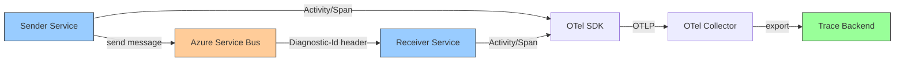

# How to Trace Azure Service Bus Messages with OpenTelemetry

Author: [nawazdhandala](https://www.github.com/nawazdhandala)

Tags: OpenTelemetry, Azure, Service Bus, Distributed Tracing, Messaging, Observability, .NET

Description: Learn how to trace Azure Service Bus messages with OpenTelemetry for end-to-end visibility across producers and consumers in distributed applications.

---

Azure Service Bus is a fully managed enterprise message broker that supports queues and publish-subscribe topics. In microservice architectures, Service Bus often sits between services as the glue holding asynchronous workflows together. The challenge is that once a message enters Service Bus, the trace context from the sending service is lost unless you take steps to preserve it. OpenTelemetry provides the instrumentation libraries and propagation mechanisms to maintain that context across the messaging boundary.

This guide covers instrumenting Azure Service Bus with OpenTelemetry in .NET, including automatic instrumentation with the Azure SDK, manual context propagation, and collector configuration for processing the resulting telemetry.

## How Azure SDK and OpenTelemetry Work Together

The Azure SDK for .NET has built-in support for distributed tracing through the `System.Diagnostics.Activity` API, which is the .NET foundation that OpenTelemetry builds on. Starting with version 7.x of the `Azure.Messaging.ServiceBus` package, the SDK automatically creates activities (spans) for send and receive operations and propagates trace context through the `Diagnostic-Id` message property.

This means you get basic tracing out of the box. However, to get that telemetry into your OpenTelemetry pipeline and to add custom attributes and business context, you need to configure the OpenTelemetry SDK to listen for those activities.



## Setting Up OpenTelemetry in .NET

First, add the required NuGet packages and configure the OpenTelemetry SDK to capture Azure SDK activities:

```csharp
// Program.cs - Configure OpenTelemetry with Azure Service Bus tracing
using Azure.Messaging.ServiceBus;
using OpenTelemetry;
using OpenTelemetry.Trace;
using OpenTelemetry.Resources;

var builder = WebApplication.CreateBuilder(args);

// Configure OpenTelemetry tracing
builder.Services.AddOpenTelemetry()
    .ConfigureResource(resource => resource
        .AddService(
            serviceName: "order-processor",
            serviceVersion: "1.0.0")
        .AddAttributes(new Dictionary<string, object>
        {
            ["deployment.environment"] = "production"
        }))
    .WithTracing(tracing => tracing
        // Capture Azure SDK activities including Service Bus
        .AddSource("Azure.*")
        // Capture ASP.NET Core incoming requests
        .AddAspNetCoreInstrumentation()
        // Capture outgoing HTTP calls
        .AddHttpClientInstrumentation()
        // Export to the OpenTelemetry Collector
        .AddOtlpExporter(opts =>
        {
            opts.Endpoint = new Uri("http://otel-collector:4317");
        }));

// Register the Service Bus client
builder.Services.AddSingleton(sp =>
    new ServiceBusClient(builder.Configuration["ServiceBus:ConnectionString"]));

var app = builder.Build();
```

The `.AddSource("Azure.*")` line tells the OpenTelemetry SDK to listen for all activities produced by Azure SDK libraries. This captures Service Bus send, receive, and processing operations automatically.

## Sending Messages with Trace Context

When you send a message through Service Bus, the Azure SDK automatically creates a span and attaches the trace context to the message. You can enrich this with additional attributes:

```csharp
// OrderPublisher.cs - Send messages with tracing
using Azure.Messaging.ServiceBus;
using System.Diagnostics;
using System.Text.Json;

public class OrderPublisher
{
    private readonly ServiceBusSender _sender;
    // Create an ActivitySource for custom spans
    private static readonly ActivitySource ActivitySource =
        new("OrderService.Publisher");

    public OrderPublisher(ServiceBusClient client)
    {
        _sender = client.CreateSender("order-queue");
    }

    public async Task PublishOrderAsync(Order order)
    {
        // Create a custom span wrapping the publish operation
        using var activity = ActivitySource.StartActivity(
            "order.publish",
            ActivityKind.Producer);

        // Add business context to the span
        activity?.SetTag("order.id", order.Id);
        activity?.SetTag("order.total", order.Total);
        activity?.SetTag("messaging.system", "azure_service_bus");
        activity?.SetTag("messaging.destination.name", "order-queue");

        // Create the Service Bus message
        var message = new ServiceBusMessage(
            JsonSerializer.SerializeToUtf8Bytes(order))
        {
            ContentType = "application/json",
            Subject = "OrderCreated",
            MessageId = Guid.NewGuid().ToString(),
            // Application properties for routing and filtering
            ApplicationProperties =
            {
                ["order_id"] = order.Id,
                ["event_type"] = "OrderCreated",
                ["priority"] = order.Total > 1000 ? "high" : "normal"
            }
        };

        // The Azure SDK automatically injects trace context
        // into the message's Diagnostic-Id property
        await _sender.SendMessageAsync(message);

        activity?.SetTag("messaging.message.id", message.MessageId);
        activity?.AddEvent(new ActivityEvent("message_sent"));
    }
}
```

The Azure SDK handles trace context propagation behind the scenes. When `SendMessageAsync` executes, the SDK creates its own internal activity and writes the `Diagnostic-Id` into the message properties. This happens transparently, so you do not need to manually inject headers like you would with some other messaging systems.

The custom activity wrapping the send call gives you a place to attach business-specific attributes like the order ID and total. These attributes make it easy to find specific traces later when investigating issues.

## Receiving and Processing Messages

On the receiving side, the Azure SDK extracts the trace context from the incoming message and creates a linked activity. You can process messages using the `ServiceBusProcessor` for automatic message handling:

```csharp
// OrderProcessor.cs - Receive and process messages with tracing
using Azure.Messaging.ServiceBus;
using System.Diagnostics;
using System.Text.Json;

public class OrderProcessor
{
    private readonly ServiceBusProcessor _processor;
    private static readonly ActivitySource ActivitySource =
        new("OrderService.Consumer");

    public OrderProcessor(ServiceBusClient client)
    {
        _processor = client.CreateProcessor("order-queue",
            new ServiceBusProcessorOptions
            {
                // Process up to 10 messages concurrently
                MaxConcurrentCalls = 10,
                // Auto-complete disabled for manual acknowledgment
                AutoCompleteMessages = false,
                // Maximum lock duration before renewal
                MaxAutoLockRenewalDuration = TimeSpan.FromMinutes(5)
            });

        _processor.ProcessMessageAsync += HandleMessageAsync;
        _processor.ProcessErrorAsync += HandleErrorAsync;
    }

    private async Task HandleMessageAsync(
        ProcessMessageEventArgs args)
    {
        // The Azure SDK automatically creates an activity linked
        // to the sender's trace context
        using var activity = ActivitySource.StartActivity(
            "order.process",
            ActivityKind.Consumer);

        var message = args.Message;

        activity?.SetTag("messaging.system", "azure_service_bus");
        activity?.SetTag("messaging.destination.name", "order-queue");
        activity?.SetTag("messaging.message.id", message.MessageId);
        activity?.SetTag("messaging.operation", "process");

        try
        {
            // Deserialize the order from the message body
            var order = JsonSerializer.Deserialize<Order>(
                message.Body.ToArray());

            activity?.SetTag("order.id", order.Id);

            // Calculate delivery latency
            if (message.EnqueuedTime != default)
            {
                var latency = DateTimeOffset.UtcNow - message.EnqueuedTime;
                activity?.SetTag("messaging.delivery_latency_ms",
                    latency.TotalMilliseconds);
            }

            // Track delivery attempt count
            activity?.SetTag("messaging.delivery_count",
                message.DeliveryCount);

            // Process the order
            await FulfillOrderAsync(order);

            // Complete the message on success
            await args.CompleteMessageAsync(message);
            activity?.SetStatus(ActivityStatusCode.Ok);
        }
        catch (Exception ex)
        {
            // Record the error on the span
            activity?.SetStatus(ActivityStatusCode.Error, ex.Message);
            activity?.RecordException(ex);

            // Abandon the message for retry
            await args.AbandonMessageAsync(message);
        }
    }

    private Task HandleErrorAsync(ProcessErrorEventArgs args)
    {
        // Log Service Bus processing errors
        Activity.Current?.SetStatus(ActivityStatusCode.Error,
            args.Exception.Message);
        Activity.Current?.RecordException(args.Exception);
        return Task.CompletedTask;
    }

    public async Task StartAsync() => await _processor.StartProcessingAsync();
    public async Task StopAsync() => await _processor.StopProcessingAsync();
}
```

The `ServiceBusProcessor` automatically handles message receiving, lock renewal, and retry logic. The Azure SDK creates activities for each received message that are linked to the sender's trace context through the `Diagnostic-Id` property. Your custom activity adds business context on top of the SDK's automatic instrumentation.

The delivery count attribute is especially useful for debugging. If you see messages with high delivery counts, it indicates repeated processing failures that warrant investigation.

## Handling Sessions and Ordered Processing

Azure Service Bus sessions guarantee ordered processing for messages with the same session ID. When using sessions, the tracing setup is similar but uses the session processor:

```csharp
// SessionProcessor.cs - Process session-based messages with tracing
public class SessionOrderProcessor
{
    private readonly ServiceBusSessionProcessor _processor;
    private static readonly ActivitySource ActivitySource =
        new("OrderService.SessionConsumer");

    public SessionOrderProcessor(ServiceBusClient client)
    {
        _processor = client.CreateSessionProcessor("order-session-queue",
            new ServiceBusSessionProcessorOptions
            {
                MaxConcurrentSessions = 5,
                MaxConcurrentCallsPerSession = 1,
                AutoCompleteMessages = false
            });

        _processor.ProcessMessageAsync += HandleSessionMessageAsync;
        _processor.ProcessErrorAsync += HandleErrorAsync;
    }

    private async Task HandleSessionMessageAsync(
        ProcessSessionMessageEventArgs args)
    {
        using var activity = ActivitySource.StartActivity(
            "order.session.process",
            ActivityKind.Consumer);

        // Track session information in the span
        activity?.SetTag("messaging.session.id", args.Message.SessionId);
        activity?.SetTag("messaging.message.id", args.Message.MessageId);
        activity?.SetTag("messaging.destination.name",
            "order-session-queue");

        // Session state can track processing progress
        var stateBytes = await args.GetSessionStateAsync();
        if (stateBytes != null)
        {
            var state = JsonSerializer.Deserialize<SessionState>(
                stateBytes.ToArray());
            activity?.SetTag("session.messages_processed",
                state.MessagesProcessed);
        }

        // Process the message
        var order = JsonSerializer.Deserialize<Order>(
            args.Message.Body.ToArray());

        await ProcessSessionOrderAsync(order, args.Message.SessionId);
        await args.CompleteMessageAsync(args.Message);
    }
}
```

The session ID appears as a span attribute, which lets you filter and group traces by session in your tracing backend. This is valuable for understanding the ordering behavior and identifying sessions that are processing slowly.

## Collector Configuration

Configure your OpenTelemetry Collector to handle the telemetry from your Service Bus applications:

```yaml
# otel-collector-config.yaml
receivers:
  otlp:
    protocols:
      grpc:
        endpoint: 0.0.0.0:4317
      http:
        endpoint: 0.0.0.0:4318

processors:
  batch:
    timeout: 10s
    send_batch_size: 200

  # Enrich spans with Azure resource attributes
  resourcedetection:
    detectors: [azure]
    timeout: 5s

  # Add attributes for easier filtering
  attributes:
    actions:
      - key: cloud.provider
        value: azure
        action: upsert

exporters:
  otlp:
    endpoint: https://oneuptime-ingest.example.com:4317
    tls:
      insecure: false

service:
  pipelines:
    traces:
      receivers: [otlp]
      processors: [resourcedetection, attributes, batch]
      exporters: [otlp]
```

The Azure resource detector automatically adds attributes like subscription ID, resource group, and instance metadata when running on Azure infrastructure. This contextual information is useful for correlating Service Bus traces with the specific compute resources processing them.

## Troubleshooting Trace Gaps

If you see disconnected traces where the sender and receiver spans do not share a trace ID, here are the common causes:

First, verify that the Azure SDK version is 7.x or later. Older versions do not support the `Diagnostic-Id` property for trace propagation.

Second, confirm that the OpenTelemetry SDK is configured to capture Azure activities with `.AddSource("Azure.*")`. Without this, the SDK activities are created but not exported.

Third, check that the message is not being cloned or reconstructed between send and receive. Some middleware or message transformation code can strip the `Diagnostic-Id` property.

Finally, if you are using the Azure Functions Service Bus trigger, be aware that the Functions host has its own activity handling. You may need to configure the Functions OpenTelemetry integration separately to ensure proper context propagation.

## Conclusion

Tracing Azure Service Bus messages with OpenTelemetry provides the visibility needed to debug and monitor asynchronous workflows in distributed systems. The Azure SDK's built-in activity support makes basic instrumentation straightforward, while custom spans and attributes let you add the business context that makes traces truly useful for troubleshooting. Combined with a properly configured collector pipeline, this instrumentation gives you end-to-end visibility from the initial request through message processing and beyond.
