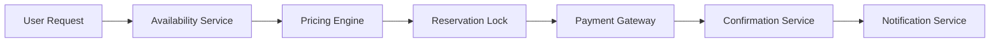

# How to Trace Booking and Reservation Systems with OpenTelemetry

Author: [nawazdhandala](https://www.github.com/nawazdhandala)

Tags: OpenTelemetry, Tracing, Booking Systems, Reservations, Distributed Tracing, Observability

Description: Learn how to instrument booking and reservation systems with OpenTelemetry for end-to-end tracing across availability checks, payments, and confirmations.

---

Booking and reservation systems are among the most complex distributed applications you will encounter. A single reservation request might touch an availability service, a pricing engine, a payment gateway, a confirmation service, and a notification system. When something goes wrong, pinpointing the failure across all these moving parts without proper observability is painful and slow.

OpenTelemetry gives you the tools to trace every step of a booking workflow from the initial search all the way through to the confirmation email. In this guide, we will walk through practical instrumentation strategies for booking systems using OpenTelemetry tracing.

## Why Booking Systems Need Distributed Tracing

A typical booking flow involves multiple services that each handle a specific concern. The user searches for availability, selects an option, provides payment details, and receives a confirmation. Behind the scenes, each of those steps might involve several service calls, database queries, and external API requests.

Without tracing, debugging a failed booking means correlating timestamps across logs from different services and hoping you can reconstruct the sequence of events. With OpenTelemetry, every step in the booking process is linked together through a single trace ID, giving you a complete picture of what happened and how long each step took.

Here is what a typical booking flow looks like:



## Setting Up OpenTelemetry for a Booking Service

Let's start with the core setup for a Node.js booking service. This configuration initializes the OpenTelemetry SDK with the necessary exporters and propagators.

```javascript
// tracing.js - OpenTelemetry initialization for booking service
const { NodeSDK } = require('@opentelemetry/sdk-node');
const { OTLPTraceExporter } = require('@opentelemetry/exporter-trace-otlp-grpc');
const { getNodeAutoInstrumentations } = require('@opentelemetry/auto-instrumentations-node');
const { Resource } = require('@opentelemetry/resources');
const { SemanticResourceAttributes } = require('@opentelemetry/semantic-conventions');

// Create the SDK with service-specific resource attributes
const sdk = new NodeSDK({
  resource: new Resource({
    [SemanticResourceAttributes.SERVICE_NAME]: 'booking-service',
    [SemanticResourceAttributes.SERVICE_VERSION]: '2.1.0',
    // Custom attribute to identify the business domain
    'service.domain': 'reservations',
  }),
  traceExporter: new OTLPTraceExporter({
    // Send traces to the OpenTelemetry Collector
    url: 'grpc://otel-collector:4317',
  }),
  instrumentations: [getNodeAutoInstrumentations()],
});

sdk.start();
```

The auto-instrumentation handles HTTP requests and database calls automatically. But for booking-specific logic, we need custom spans that capture business context.

## Tracing the Availability Check

The availability check is usually the first step. Users search for rooms, flights, or appointments, and the system needs to query inventory in real time. This is where you want to capture search parameters as span attributes so you can later analyze patterns like which date ranges cause slow queries.

```javascript
const { trace, SpanStatusCode } = require('@opentelemetry/api');

// Get a tracer instance for the booking domain
const tracer = trace.getTracer('booking-service', '2.1.0');

async function checkAvailability(searchParams) {
  // Create a span that represents the entire availability check
  return tracer.startActiveSpan('booking.check_availability', async (span) => {
    try {
      // Record search parameters as span attributes for analysis
      span.setAttribute('booking.check_in', searchParams.checkIn);
      span.setAttribute('booking.check_out', searchParams.checkOut);
      span.setAttribute('booking.guests', searchParams.guests);
      span.setAttribute('booking.property_id', searchParams.propertyId);

      // Query the inventory database
      const available = await inventoryDb.query({
        propertyId: searchParams.propertyId,
        dateRange: [searchParams.checkIn, searchParams.checkOut],
      });

      // Record how many options were found
      span.setAttribute('booking.available_count', available.length);
      span.setStatus({ code: SpanStatusCode.OK });

      return available;
    } catch (error) {
      // Mark the span as failed and record the error
      span.setStatus({
        code: SpanStatusCode.ERROR,
        message: error.message,
      });
      span.recordException(error);
      throw error;
    } finally {
      span.end();
    }
  });
}
```

By attaching the search parameters directly to the span, you can later filter traces by property, date range, or guest count. This makes it straightforward to find all slow availability checks for a specific property during peak dates.

## Instrumenting the Reservation Lock

Once a user selects an option, the system needs to temporarily lock that inventory to prevent double bookings. This is a critical section that often involves distributed locks or database transactions.

```javascript
async function createReservationLock(reservationDetails) {
  // Wrap the lock acquisition in its own span
  return tracer.startActiveSpan('booking.acquire_lock', async (span) => {
    try {
      span.setAttribute('booking.reservation_id', reservationDetails.id);
      span.setAttribute('booking.lock_type', 'pessimistic');

      // Attempt to acquire a distributed lock on the inventory
      const lockResult = await distributedLock.acquire(
        `reservation:${reservationDetails.propertyId}:${reservationDetails.roomId}`,
        { ttl: 600000 } // 10-minute lock timeout
      );

      span.setAttribute('booking.lock_acquired', lockResult.success);
      span.setAttribute('booking.lock_ttl_ms', 600000);

      if (!lockResult.success) {
        // Record a span event when the lock fails due to contention
        span.addEvent('lock_contention', {
          'booking.contention_reason': lockResult.reason,
          'booking.competing_reservation': lockResult.holderId,
        });
        span.setStatus({ code: SpanStatusCode.ERROR, message: 'Lock contention' });
        throw new Error('Room no longer available');
      }

      span.setStatus({ code: SpanStatusCode.OK });
      return lockResult;
    } catch (error) {
      span.setStatus({ code: SpanStatusCode.ERROR, message: error.message });
      span.recordException(error);
      throw error;
    } finally {
      span.end();
    }
  });
}
```

Lock contention is one of the most common causes of booking failures, especially during high-traffic periods. By recording contention events on the span, you get immediate visibility into how often locks fail and what is competing for the same inventory.

## Tracing the Payment Flow

Payment processing is where things get especially interesting from a tracing perspective. You are crossing a trust boundary into an external payment provider, and you need to capture the round-trip time, the payment status, and any retry attempts.

```javascript
async function processPayment(paymentDetails) {
  return tracer.startActiveSpan('booking.process_payment', {
    // Mark this as a client span since we are calling an external service
    kind: trace.SpanKind.CLIENT,
  }, async (span) => {
    try {
      span.setAttribute('booking.reservation_id', paymentDetails.reservationId);
      span.setAttribute('payment.method', paymentDetails.method);
      span.setAttribute('payment.currency', paymentDetails.currency);
      // Never log the full card number or sensitive payment data
      span.setAttribute('payment.card_last_four', paymentDetails.cardLastFour);

      // Call the payment gateway with context propagation
      const result = await paymentGateway.charge({
        amount: paymentDetails.amount,
        currency: paymentDetails.currency,
        token: paymentDetails.token,
      });

      // Record the payment outcome
      span.setAttribute('payment.transaction_id', result.transactionId);
      span.setAttribute('payment.status', result.status);
      span.setAttribute('payment.gateway_latency_ms', result.gatewayLatencyMs);

      if (result.status === 'declined') {
        span.addEvent('payment_declined', {
          'payment.decline_reason': result.declineReason,
        });
      }

      span.setStatus({ code: SpanStatusCode.OK });
      return result;
    } catch (error) {
      span.setStatus({ code: SpanStatusCode.ERROR, message: error.message });
      span.recordException(error);
      throw error;
    } finally {
      span.end();
    }
  });
}
```

Notice that we are careful about what we attach as attributes. You should never log full credit card numbers, CVVs, or other sensitive payment data in your spans. Stick to non-sensitive identifiers like the last four digits and the transaction ID.

## Tying It All Together with the Booking Orchestrator

The orchestrator function is where individual steps come together into a single traced workflow. Each child span is automatically linked to the parent, creating a complete trace for the entire booking.

```javascript
async function createBooking(bookingRequest) {
  // The top-level span captures the entire booking lifecycle
  return tracer.startActiveSpan('booking.create', async (parentSpan) => {
    try {
      parentSpan.setAttribute('booking.user_id', bookingRequest.userId);
      parentSpan.setAttribute('booking.source', bookingRequest.source);

      // Step 1: Check availability
      const availability = await checkAvailability(bookingRequest.search);

      // Step 2: Lock the reservation
      const lock = await createReservationLock({
        id: generateReservationId(),
        propertyId: bookingRequest.search.propertyId,
        roomId: availability[0].roomId,
      });

      // Step 3: Process payment
      const payment = await processPayment({
        reservationId: lock.reservationId,
        amount: availability[0].totalPrice,
        currency: 'USD',
        method: bookingRequest.paymentMethod,
        token: bookingRequest.paymentToken,
        cardLastFour: bookingRequest.cardLastFour,
      });

      // Step 4: Confirm the booking
      const confirmation = await confirmBooking(lock.reservationId, payment.transactionId);

      parentSpan.setAttribute('booking.confirmation_code', confirmation.code);
      parentSpan.setStatus({ code: SpanStatusCode.OK });

      return confirmation;
    } catch (error) {
      parentSpan.setStatus({ code: SpanStatusCode.ERROR, message: error.message });
      parentSpan.recordException(error);

      // Attempt rollback on failure
      await rollbackBooking(bookingRequest, error);
      throw error;
    } finally {
      parentSpan.end();
    }
  });
}
```

When you view this trace in your observability backend, you will see the parent `booking.create` span with child spans for each step. If the payment takes 3 seconds but the availability check takes 50 milliseconds, that is immediately visible in the waterfall view.

## Adding Metrics for Booking Health

Beyond tracing, you can use OpenTelemetry metrics to track booking-level KPIs that help you understand system health at a glance.

```javascript
const { metrics } = require('@opentelemetry/api');

// Create a meter for booking metrics
const meter = metrics.getMeter('booking-service', '2.1.0');

// Track booking outcomes
const bookingCounter = meter.createCounter('booking.attempts', {
  description: 'Total number of booking attempts',
});

// Track booking duration as a histogram
const bookingDuration = meter.createHistogram('booking.duration_ms', {
  description: 'Time taken to complete a booking in milliseconds',
  unit: 'ms',
});

// Use these in your booking function
function recordBookingMetrics(status, durationMs, source) {
  bookingCounter.add(1, {
    'booking.status': status,    // success, failed, timeout
    'booking.source': source,     // web, mobile, api
  });
  bookingDuration.record(durationMs, {
    'booking.status': status,
  });
}
```

These metrics give you a high-level view of booking success rates, average durations, and failure patterns. You can set up alerts when the failure rate exceeds a threshold or when booking latency spikes beyond acceptable levels.

## Best Practices for Booking System Tracing

There are a few things to keep in mind when instrumenting booking systems specifically.

First, always propagate context across service boundaries. If your availability service calls a pricing engine, the trace context must travel with that request. OpenTelemetry handles this automatically for HTTP and gRPC when you use the auto-instrumentation, but if you are using message queues, you need to inject and extract context manually.

Second, use semantic conventions consistently. Prefix your custom attributes with your domain name (like `booking.` or `payment.`) to avoid collisions with standard OpenTelemetry attributes.

Third, think about sampling. Booking systems can generate a lot of traces, especially during peak seasons. Use tail-based sampling in the OpenTelemetry Collector to keep all error traces and a representative sample of successful ones.

Fourth, always record rollback operations. When a booking fails partway through, the rollback process is just as important to trace as the forward path. Create spans for lock releases, payment refunds, and inventory restoration so you can verify that cleanup happens correctly.

## Wrapping Up

Booking and reservation systems benefit enormously from distributed tracing. The multi-step nature of reservations, combined with external dependencies like payment gateways, creates plenty of opportunities for failures and performance bottlenecks. By instrumenting each step with OpenTelemetry, you get the visibility you need to diagnose issues quickly and keep your booking pipeline running smoothly. Start with the orchestrator-level spans, then work your way into the individual services as you identify the areas that need the most attention.
