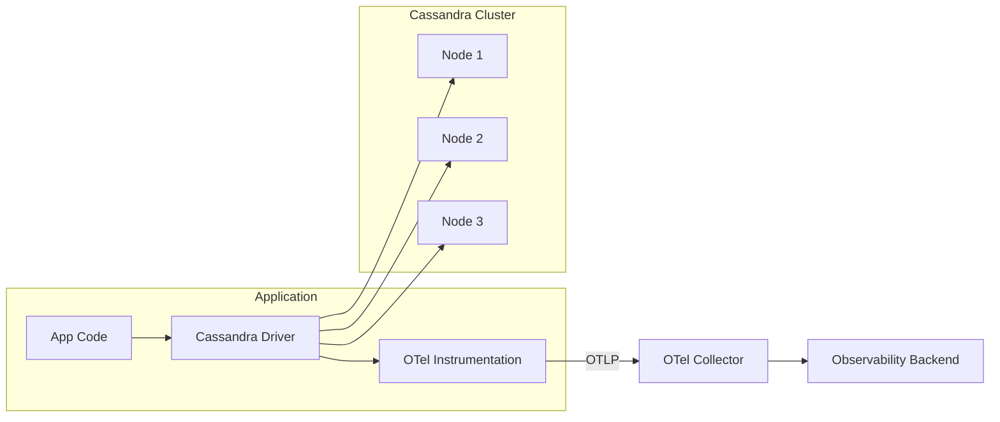
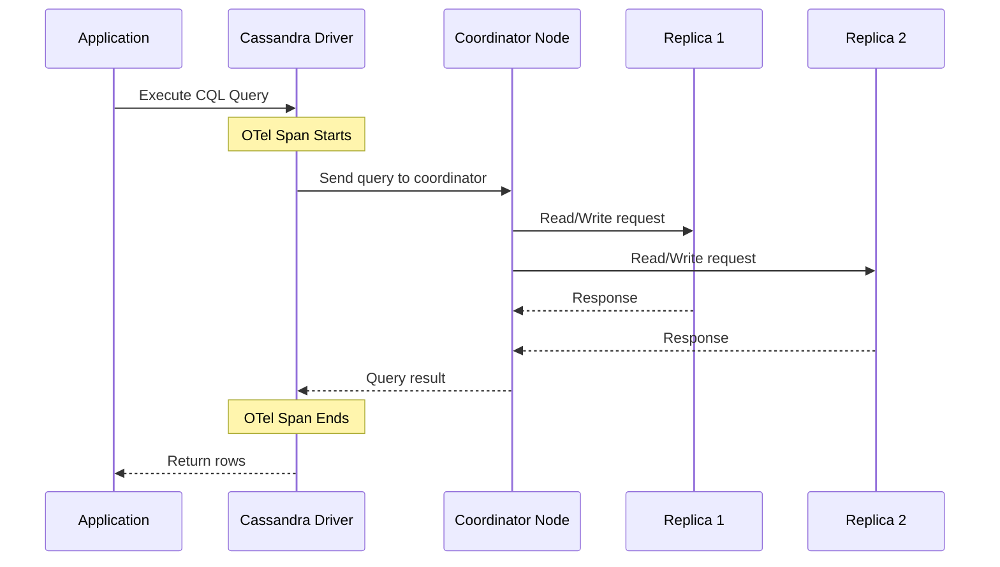

# How to Trace Cassandra CQL Queries with OpenTelemetry

Author: [nawazdhandala](https://www.github.com/nawazdhandala)

Tags: OpenTelemetry, Cassandra, CQL, Tracing, Distributed Database, Observability, NoSQL, Java, Python

Description: Learn how to trace Apache Cassandra CQL queries using OpenTelemetry instrumentation across Java and Python applications with practical configuration examples.

---

> Apache Cassandra powers some of the largest production workloads on the planet. Its distributed architecture handles massive write throughput and scales horizontally with ease. But when a CQL query takes longer than expected, finding the root cause can be surprisingly difficult without proper tracing in place.

OpenTelemetry gives you the ability to trace every CQL query from your application through the Cassandra driver, capturing timing, consistency levels, coordinator nodes, and errors. This guide covers how to set up CQL query tracing for both Java and Python applications, two of the most popular languages in the Cassandra ecosystem.

---

## Why Trace CQL Queries?

Cassandra's distributed nature means a single query can involve multiple replicas, cross data centers, and trigger read repairs. Without tracing, debugging slow queries or inconsistencies requires digging through logs on multiple nodes. With OpenTelemetry tracing, every CQL execution becomes a span with rich metadata that ties back to the originating application request.

Tracing CQL queries helps you answer questions like:
- Which queries are consistently slow?
- Are timeouts related to specific tables or consistency levels?
- Which coordinator nodes are involved in slow operations?
- How does query latency correlate with application response time?

---

## Architecture

The tracing setup involves instrumenting your Cassandra driver at the application level and, optionally, collecting server-side metrics from Cassandra nodes via JMX.



---

## Java: Tracing with the DataStax Driver

The Java driver for Cassandra (DataStax driver) is the most widely used. OpenTelemetry provides an instrumentation module that hooks into the driver's request execution pipeline.

### Installation

Add the OpenTelemetry Cassandra instrumentation to your project. If you use Maven, add these dependencies.

```xml
<!-- pom.xml -->
<dependencies>
    <!-- OpenTelemetry API and SDK -->
    <dependency>
        <groupId>io.opentelemetry</groupId>
        <artifactId>opentelemetry-api</artifactId>
        <version>1.35.0</version>
    </dependency>
    <dependency>
        <groupId>io.opentelemetry</groupId>
        <artifactId>opentelemetry-sdk</artifactId>
        <version>1.35.0</version>
    </dependency>

    <!-- OTLP exporter for sending traces to the collector -->
    <dependency>
        <groupId>io.opentelemetry</groupId>
        <artifactId>opentelemetry-exporter-otlp</artifactId>
        <version>1.35.0</version>
    </dependency>

    <!-- Cassandra driver instrumentation -->
    <dependency>
        <groupId>io.opentelemetry.instrumentation</groupId>
        <artifactId>opentelemetry-cassandra-4.4</artifactId>
        <version>2.1.0-alpha</version>
    </dependency>

    <!-- DataStax Java driver for Cassandra -->
    <dependency>
        <groupId>com.datastax.oss</groupId>
        <artifactId>java-driver-core</artifactId>
        <version>4.17.0</version>
    </dependency>
</dependencies>
```

### Configuration

Set up the OpenTelemetry SDK and connect it to the Cassandra driver. The instrumentation wraps each CQL execution in a span.

```java
import io.opentelemetry.api.OpenTelemetry;
import io.opentelemetry.api.trace.Tracer;
import io.opentelemetry.api.trace.Span;
import io.opentelemetry.sdk.OpenTelemetrySdk;
import io.opentelemetry.sdk.trace.SdkTracerProvider;
import io.opentelemetry.sdk.trace.export.BatchSpanProcessor;
import io.opentelemetry.exporter.otlp.trace.OtlpGrpcSpanExporter;
import io.opentelemetry.sdk.resources.Resource;
import io.opentelemetry.semconv.ResourceAttributes;
import com.datastax.oss.driver.api.core.CqlSession;
import com.datastax.oss.driver.api.core.cql.ResultSet;
import com.datastax.oss.driver.api.core.cql.SimpleStatement;
import com.datastax.oss.driver.api.core.cql.Row;

public class CassandraTracingExample {

    // Initialize the OpenTelemetry SDK with OTLP export
    private static OpenTelemetry initOpenTelemetry() {
        // Configure the OTLP exporter to send spans to the collector
        OtlpGrpcSpanExporter exporter = OtlpGrpcSpanExporter.builder()
            .setEndpoint("http://localhost:4317")
            .build();

        // Define the service identity for trace attribution
        Resource resource = Resource.getDefault().merge(
            Resource.create(io.opentelemetry.api.common.Attributes.of(
                ResourceAttributes.SERVICE_NAME, "cassandra-app"
            ))
        );

        SdkTracerProvider tracerProvider = SdkTracerProvider.builder()
            .addSpanProcessor(BatchSpanProcessor.builder(exporter).build())
            .setResource(resource)
            .build();

        return OpenTelemetrySdk.builder()
            .setTracerProvider(tracerProvider)
            .build();
    }

    public static void main(String[] args) {
        OpenTelemetry openTelemetry = initOpenTelemetry();
        Tracer tracer = openTelemetry.getTracer("cassandra-client");

        // Connect to the Cassandra cluster
        CqlSession session = CqlSession.builder()
            .withKeyspace("my_keyspace")
            .build();

        // Create a parent span representing the business operation
        Span parentSpan = tracer.spanBuilder("process-user-request")
            .startSpan();

        try {
            // Execute a CQL query within the parent span context
            // This creates a child span with query details
            executeTracedQuery(session, tracer, parentSpan,
                "SELECT * FROM users WHERE user_id = ?", "user-12345");
        } finally {
            parentSpan.end();
        }

        session.close();
    }

    // Execute a CQL query and record it as a traced span
    private static void executeTracedQuery(
            CqlSession session, Tracer tracer, Span parent,
            String cql, Object... params) {

        // Start a child span for the database query
        Span span = tracer.spanBuilder("db.cassandra.query")
            .setParent(io.opentelemetry.context.Context.current().with(parent))
            .startSpan();

        try {
            // Set standard database span attributes
            span.setAttribute("db.system", "cassandra");
            span.setAttribute("db.statement", cql);
            span.setAttribute("db.cassandra.keyspace", "my_keyspace");
            span.setAttribute("db.cassandra.consistency_level", "LOCAL_QUORUM");

            // Build and execute the statement
            SimpleStatement stmt = SimpleStatement.builder(cql)
                .addPositionalValues(params)
                .build();

            ResultSet rs = session.execute(stmt);

            // Record the coordinator node that handled the query
            span.setAttribute("db.cassandra.coordinator.id",
                rs.getExecutionInfo().getCoordinator().toString());

            // Record the number of rows returned
            int rowCount = 0;
            for (Row row : rs) {
                rowCount++;
            }
            span.setAttribute("db.cassandra.rows_returned", rowCount);

        } catch (Exception e) {
            // Record any errors on the span
            span.recordException(e);
            span.setStatus(io.opentelemetry.api.trace.StatusCode.ERROR,
                e.getMessage());
        } finally {
            span.end();
        }
    }
}
```

### Using the Java Agent for Auto-Instrumentation

If you prefer not to modify application code, the OpenTelemetry Java agent automatically instruments the DataStax driver. This captures CQL queries as spans without any code changes.

```bash
# Download the OpenTelemetry Java agent
curl -L -o opentelemetry-javaagent.jar \
  https://github.com/open-telemetry/opentelemetry-java-instrumentation/releases/latest/download/opentelemetry-javaagent.jar

# Run your application with the agent attached
# The agent automatically instruments the Cassandra driver
java -javaagent:opentelemetry-javaagent.jar \
  -Dotel.service.name=cassandra-app \
  -Dotel.exporter.otlp.endpoint=http://localhost:4317 \
  -Dotel.instrumentation.cassandra.enabled=true \
  -jar my-cassandra-app.jar
```

The Java agent captures these attributes automatically for every CQL execution:
- `db.system` (cassandra)
- `db.statement` (the CQL query)
- `db.cassandra.keyspace`
- `db.cassandra.consistency_level`
- `db.cassandra.coordinator.id`
- `db.cassandra.page_size`

---

## Python: Tracing with the cassandra-driver

For Python applications using the `cassandra-driver` package, OpenTelemetry provides an instrumentation library that hooks into the driver's execution path.

Install the required packages for Python Cassandra tracing.

```bash
# Install the Cassandra driver and OpenTelemetry instrumentation
pip install cassandra-driver
pip install opentelemetry-api opentelemetry-sdk opentelemetry-exporter-otlp
pip install opentelemetry-instrumentation-cassandra
```

Set up the tracer and enable auto-instrumentation for the Cassandra driver. This captures every query execution as a span.

```python
from opentelemetry import trace
from opentelemetry.sdk.trace import TracerProvider
from opentelemetry.sdk.trace.export import BatchSpanProcessor
from opentelemetry.exporter.otlp.proto.grpc.trace_exporter import OTLPSpanExporter
from opentelemetry.sdk.resources import Resource
from opentelemetry.instrumentation.cassandra import CassandraInstrumentor
from cassandra.cluster import Cluster
from cassandra.query import SimpleStatement, ConsistencyLevel

# Configure the OpenTelemetry tracer
resource = Resource.create({"service.name": "cassandra-python-app"})
provider = TracerProvider(resource=resource)
exporter = OTLPSpanExporter(endpoint="http://localhost:4317")
provider.add_span_processor(BatchSpanProcessor(exporter))
trace.set_tracer_provider(provider)

# Enable auto-instrumentation for the cassandra-driver
# This wraps all query executions in OpenTelemetry spans
CassandraInstrumentor().instrument()

# Connect to the Cassandra cluster
cluster = Cluster(['cassandra-node1', 'cassandra-node2', 'cassandra-node3'])
session = cluster.connect('my_keyspace')

# Every query executed through this session is now automatically traced
tracer = trace.get_tracer("cassandra-client")

def get_user_by_id(user_id):
    """Fetch a user record with full OpenTelemetry tracing."""
    # Create a parent span for the business operation
    with tracer.start_as_current_span("get_user") as span:
        # Add business context to the span
        span.set_attribute("user.id", user_id)

        # Build a statement with explicit consistency level
        stmt = SimpleStatement(
            "SELECT * FROM users WHERE user_id = %s",
            consistency_level=ConsistencyLevel.LOCAL_QUORUM
        )

        # Execute the query - auto-instrumentation creates a child span
        result = session.execute(stmt, [user_id])
        row = result.one()

        if row:
            span.set_attribute("user.found", True)
        else:
            span.set_attribute("user.found", False)

        return row

# Example usage
user = get_user_by_id("user-12345")
```

---

## Collector Configuration for Cassandra Tracing

The OpenTelemetry Collector receives spans from your application and can also scrape JMX metrics from Cassandra nodes for a complete picture.

This configuration handles both application traces and Cassandra JMX metrics.

```yaml
# otel-collector-config.yaml
receivers:
  otlp:
    protocols:
      grpc:
        endpoint: 0.0.0.0:4317

  # Scrape Cassandra JMX metrics via a Prometheus JMX exporter
  # Requires jmx_exporter running as a Java agent on each Cassandra node
  prometheus:
    config:
      scrape_configs:
        - job_name: 'cassandra-jmx'
          scrape_interval: 30s
          static_configs:
            - targets:
              - 'cassandra-node1:7070'
              - 'cassandra-node2:7070'
              - 'cassandra-node3:7070'

processors:
  batch:
    timeout: 10s

  # Add Cassandra-specific resource attributes
  resource:
    attributes:
      - key: db.system
        value: cassandra
        action: upsert

exporters:
  otlp:
    endpoint: https://oneuptime.com/otlp
    tls:
      insecure: false

service:
  pipelines:
    traces:
      receivers: [otlp]
      processors: [resource, batch]
      exporters: [otlp]
    metrics:
      receivers: [prometheus]
      processors: [batch]
      exporters: [otlp]
```

---

## Tracing Batch Queries and Prepared Statements

Cassandra workloads frequently use batch statements and prepared statements for efficiency. Here is how to trace these patterns in Python.

This example shows how to instrument batch operations so each batch appears as a single span with metadata about the batch size and type.

```python
from cassandra.query import BatchStatement, BatchType

def insert_user_events_batch(session, events):
    """Insert multiple events in a batch with tracing."""
    with tracer.start_as_current_span("db.cassandra.batch") as span:
        # Record batch metadata
        span.set_attribute("db.cassandra.batch_size", len(events))
        span.set_attribute("db.cassandra.batch_type", "UNLOGGED")
        span.set_attribute("db.operation", "INSERT")
        span.set_attribute("db.cassandra.table", "user_events")

        # Prepare the insert statement once, reuse for each event
        prepared = session.prepare(
            "INSERT INTO user_events (user_id, event_time, event_type, payload) "
            "VALUES (?, ?, ?, ?)"
        )

        # Build the batch statement
        batch = BatchStatement(batch_type=BatchType.UNLOGGED)
        for event in events:
            batch.add(prepared, [
                event['user_id'],
                event['event_time'],
                event['event_type'],
                event['payload']
            ])

        # Execute the batch - auto-instrumentation adds a child span
        try:
            session.execute(batch)
            span.set_attribute("db.cassandra.batch_success", True)
        except Exception as e:
            span.record_exception(e)
            span.set_status(trace.StatusCode.ERROR, str(e))
            raise
```

---

## Understanding CQL Trace Output

When you have OpenTelemetry tracing in place, each CQL query span contains attributes that map to Cassandra's query execution lifecycle.



The span captures the total time from the driver sending the request to receiving the response. The coordinator node attribute (`db.cassandra.coordinator.id`) tells you which node handled the request, which is useful for diagnosing node-specific latency issues.

---

## Practical Tips

**Watch consistency levels.** Queries with `ALL` or `EACH_QUORUM` consistency are naturally slower because they wait for more replicas. Record the consistency level in your spans to correlate it with latency.

**Track prepared vs. unprepared queries.** Prepared statements skip the parsing step and are significantly faster for repeated queries. Add an attribute to distinguish them in your traces.

**Monitor tombstones.** Cassandra uses tombstones for deletes, and excessive tombstones cause slow reads. While OpenTelemetry does not directly capture tombstone counts, you can monitor the `TombstoneScannedHistogram` JMX metric through the Prometheus scraper.

**Use sampling wisely.** High-throughput Cassandra workloads can generate enormous trace volumes. Use head-based or tail-based sampling in the collector to keep costs manageable while retaining traces for slow or errored queries.

---

## Conclusion

Tracing CQL queries with OpenTelemetry brings visibility into one of the most opaque parts of a Cassandra-based architecture. Whether you use the Java agent for zero-code instrumentation or manual Python instrumentation for fine-grained control, the result is the same: every query gets a span with timing, consistency level, coordinator node, and error information. Combined with JMX metrics scraped through the collector and a backend like [OneUptime](https://oneuptime.com), you get full observability across your Cassandra stack.
