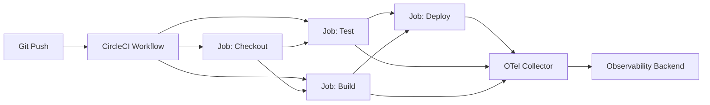

# How to Trace CircleCI Workflows with OpenTelemetry

Author: [nawazdhandala](https://www.github.com/nawazdhandala)

Tags: OpenTelemetry, CircleCI, CI/CD, Tracing, Observability, Pipelines, DevOps

Description: Learn how to trace CircleCI workflows with OpenTelemetry for full visibility into your CI/CD pipeline performance.

---

CircleCI workflows orchestrate your build, test, and deploy jobs. When a workflow takes 30 minutes instead of the usual 10, finding the bottleneck means clicking through the CircleCI UI job by job. When builds start failing intermittently, you end up comparing logs across multiple runs. OpenTelemetry tracing gives you a structured view of your entire workflow execution, with timing data, error context, and job dependencies captured in a single trace.

This guide shows how to instrument CircleCI workflows so every job and step emits OpenTelemetry spans that you can analyze in your observability backend.

---

## Workflow Architecture



Each CircleCI job runs in its own container. To build a unified trace across jobs, you need to propagate trace context between them. The approach uses CircleCI workspaces to pass the traceparent header from one job to the next.

---

## The Tracing Orb Approach

The cleanest way to add tracing to CircleCI is with a reusable script that each job sources. First, let us create the helper script:

```bash
#!/bin/bash
# otel_trace.sh
# Helper script that wraps CircleCI job steps with OpenTelemetry spans.
# It uses curl to send spans directly to the collector in OTLP/HTTP format.
# This avoids needing to install language-specific SDKs in every job.

OTEL_ENDPOINT="${OTEL_EXPORTER_OTLP_ENDPOINT:-http://otel-collector:4318}"
TRACE_FILE="/tmp/workspace/trace-context/traceparent.txt"

# Generate a trace ID if one does not already exist
init_trace() {
    if [ -f "$TRACE_FILE" ]; then
        # Read existing trace context from workspace
        export TRACEPARENT=$(cat "$TRACE_FILE")
        export TRACE_ID=$(echo "$TRACEPARENT" | cut -d'-' -f2)
        export PARENT_SPAN_ID=$(echo "$TRACEPARENT" | cut -d'-' -f3)
    else
        # Generate new trace ID (32 hex chars)
        export TRACE_ID=$(openssl rand -hex 16)
        export PARENT_SPAN_ID="0000000000000000"
    fi
}

# Generate a new span ID (16 hex chars)
new_span_id() {
    openssl rand -hex 8
}

# Send a span to the collector using OTLP/HTTP JSON format
send_span() {
    local span_name="$1"
    local span_id="$2"
    local parent_id="$3"
    local start_time="$4"
    local end_time="$5"
    local status="$6"

    curl -s -X POST "${OTEL_ENDPOINT}/v1/traces" \
        -H "Content-Type: application/json" \
        -d "{
            \"resourceSpans\": [{
                \"resource\": {
                    \"attributes\": [
                        {\"key\": \"service.name\", \"value\": {\"stringValue\": \"circleci-pipeline\"}},
                        {\"key\": \"ci.pipeline.id\", \"value\": {\"stringValue\": \"${CIRCLE_WORKFLOW_ID}\"}},
                        {\"key\": \"ci.provider\", \"value\": {\"stringValue\": \"circleci\"}}
                    ]
                },
                \"scopeSpans\": [{
                    \"spans\": [{
                        \"traceId\": \"${TRACE_ID}\",
                        \"spanId\": \"${span_id}\",
                        \"parentSpanId\": \"${parent_id}\",
                        \"name\": \"${span_name}\",
                        \"kind\": 1,
                        \"startTimeUnixNano\": \"${start_time}\",
                        \"endTimeUnixNano\": \"${end_time}\",
                        \"status\": {\"code\": ${status}},
                        \"attributes\": [
                            {\"key\": \"circleci.job\", \"value\": {\"stringValue\": \"${CIRCLE_JOB}\"}},
                            {\"key\": \"circleci.branch\", \"value\": {\"stringValue\": \"${CIRCLE_BRANCH}\"}},
                            {\"key\": \"circleci.build_num\", \"value\": {\"stringValue\": \"${CIRCLE_BUILD_NUM}\"}},
                            {\"key\": \"circleci.repo\", \"value\": {\"stringValue\": \"${CIRCLE_REPOSITORY_URL}\"}}
                        ]
                    }]
                }]
            }]
        }"
}

# Save the current trace context to the workspace for downstream jobs
save_trace_context() {
    local span_id="$1"
    mkdir -p /tmp/workspace/trace-context
    echo "00-${TRACE_ID}-${span_id}-01" > "$TRACE_FILE"
}
```

This shell-based approach works in any CircleCI job regardless of language. It sends spans directly to the collector using the OTLP/HTTP JSON format, which means you do not need to install any SDKs.

---

## CircleCI Configuration

Here is a complete `.circleci/config.yml` that uses the tracing helper:

```yaml
# .circleci/config.yml
# CircleCI workflow configuration with OpenTelemetry tracing.
# Each job sources the tracing helper script and wraps its steps
# in traced spans. Trace context is passed between jobs using workspaces.

version: 2.1

executors:
  default:
    docker:
      - image: cimg/python:3.12

jobs:
  checkout-code:
    executor: default
    steps:
      - checkout
      - run:
          name: Initialize tracing
          command: |
            source .circleci/otel_trace.sh
            init_trace
            SPAN_ID=$(new_span_id)
            START=$(date +%s%N)

            # The actual work happens here
            echo "Code checked out successfully"

            END=$(date +%s%N)
            send_span "checkout" "$SPAN_ID" "$PARENT_SPAN_ID" "$START" "$END" 1
            save_trace_context "$SPAN_ID"
      - persist_to_workspace:
          root: /tmp/workspace
          paths:
            - trace-context
            - .

  run-tests:
    executor: default
    steps:
      - attach_workspace:
          at: /tmp/workspace
      - run:
          name: Run tests with tracing
          command: |
            source .circleci/otel_trace.sh
            init_trace
            SPAN_ID=$(new_span_id)
            START=$(date +%s%N)

            # Run the test suite
            cd /tmp/workspace
            python -m pytest tests/ -v --junitxml=test-results.xml
            TEST_EXIT=$?

            END=$(date +%s%N)

            # Status 1 = OK, 2 = ERROR in OTLP
            if [ $TEST_EXIT -eq 0 ]; then
                send_span "tests" "$SPAN_ID" "$PARENT_SPAN_ID" "$START" "$END" 1
            else
                send_span "tests" "$SPAN_ID" "$PARENT_SPAN_ID" "$START" "$END" 2
            fi

            save_trace_context "$SPAN_ID"
            exit $TEST_EXIT
      - persist_to_workspace:
          root: /tmp/workspace
          paths:
            - trace-context
      - store_test_results:
          path: /tmp/workspace/test-results.xml

  build:
    executor: default
    steps:
      - attach_workspace:
          at: /tmp/workspace
      - run:
          name: Build with tracing
          command: |
            source .circleci/otel_trace.sh
            init_trace
            SPAN_ID=$(new_span_id)
            START=$(date +%s%N)

            # Build the application
            cd /tmp/workspace
            docker build -t myapp:${CIRCLE_SHA1} .
            BUILD_EXIT=$?

            END=$(date +%s%N)
            STATUS=$( [ $BUILD_EXIT -eq 0 ] && echo 1 || echo 2 )
            send_span "build" "$SPAN_ID" "$PARENT_SPAN_ID" "$START" "$END" "$STATUS"
            save_trace_context "$SPAN_ID"
            exit $BUILD_EXIT
      - persist_to_workspace:
          root: /tmp/workspace
          paths:
            - trace-context

  deploy:
    executor: default
    steps:
      - attach_workspace:
          at: /tmp/workspace
      - run:
          name: Deploy with tracing
          command: |
            source .circleci/otel_trace.sh
            init_trace
            SPAN_ID=$(new_span_id)
            START=$(date +%s%N)

            # Deploy to production
            kubectl set image deployment/myapp myapp=myregistry/myapp:${CIRCLE_SHA1}
            kubectl rollout status deployment/myapp --timeout=300s
            DEPLOY_EXIT=$?

            END=$(date +%s%N)
            STATUS=$( [ $DEPLOY_EXIT -eq 0 ] && echo 1 || echo 2 )
            send_span "deploy" "$SPAN_ID" "$PARENT_SPAN_ID" "$START" "$END" "$STATUS"
            exit $DEPLOY_EXIT

workflows:
  build-test-deploy:
    jobs:
      - checkout-code
      - run-tests:
          requires:
            - checkout-code
      - build:
          requires:
            - checkout-code
      - deploy:
          requires:
            - run-tests
            - build
          filters:
            branches:
              only: main
```

The workspace mechanism is what ties the trace together. Each job reads the trace context from the workspace, creates a new span with the correct parent, and saves the updated context back for downstream jobs.

---

## Python SDK Approach for Complex Jobs

For jobs that do complex work, you might prefer the Python SDK over the shell approach. It gives you finer-grained spans:

```python
# trace_test_job.py
# A more detailed tracing script for the test job. Instead of wrapping
# the entire job in one span, this creates child spans for each test
# phase: setup, unit tests, integration tests, and teardown.

import subprocess
import os
import json
import time
from opentelemetry import trace
from opentelemetry.sdk.trace import TracerProvider
from opentelemetry.sdk.trace.export import BatchSpanProcessor
from opentelemetry.exporter.otlp.proto.grpc.trace_exporter import OTLPSpanExporter
from opentelemetry.sdk.resources import Resource
from opentelemetry.trace.propagation.tracecontext import TraceContextTextMapPropagator
from opentelemetry import context

# Set up the tracer with CircleCI metadata
resource = Resource.create({
    "service.name": "circleci-pipeline",
    "ci.provider": "circleci",
    "ci.pipeline.id": os.getenv("CIRCLE_WORKFLOW_ID", "unknown"),
    "ci.job.name": os.getenv("CIRCLE_JOB", "unknown"),
    "ci.build.number": os.getenv("CIRCLE_BUILD_NUM", "unknown"),
    "ci.repo.url": os.getenv("CIRCLE_REPOSITORY_URL", "unknown"),
    "ci.branch": os.getenv("CIRCLE_BRANCH", "unknown"),
    "ci.commit.sha": os.getenv("CIRCLE_SHA1", "unknown"),
})

provider = TracerProvider(resource=resource)
provider.add_span_processor(
    BatchSpanProcessor(OTLPSpanExporter(
        endpoint=os.getenv("OTEL_EXPORTER_OTLP_ENDPOINT", "http://otel-collector:4317")
    ))
)
trace.set_tracer_provider(provider)
tracer = trace.get_tracer("circleci.tests")

# Load trace context from workspace if available
propagator = TraceContextTextMapPropagator()
trace_file = "/tmp/workspace/trace-context/traceparent.txt"
if os.path.exists(trace_file):
    with open(trace_file) as f:
        traceparent = f.read().strip()
    carrier = {"traceparent": traceparent}
    ctx = propagator.extract(carrier)
    context.attach(ctx)

def run_traced_command(name, command):
    """Run a command inside a traced span and capture the result."""
    with tracer.start_as_current_span(name) as span:
        span.set_attribute("command", command)
        start = time.time()

        result = subprocess.run(
            command, shell=True, capture_output=True, text=True
        )

        duration = time.time() - start
        span.set_attribute("duration_s", round(duration, 2))
        span.set_attribute("exit_code", result.returncode)

        if result.returncode != 0:
            span.set_status(trace.StatusCode.ERROR, result.stderr[:500])
            span.set_attribute("error.output", result.stderr[:1000])

        return result

# Run test phases as individual spans
with tracer.start_as_current_span("test-suite") as root:
    run_traced_command("install-deps", "pip install -r requirements.txt")
    run_traced_command("unit-tests", "pytest tests/unit/ -v")
    run_traced_command("integration-tests", "pytest tests/integration/ -v")
    run_traced_command("lint", "flake8 src/")

# Save updated trace context
carrier = {}
propagator.inject(carrier)
os.makedirs("/tmp/workspace/trace-context", exist_ok=True)
with open(trace_file, "w") as f:
    f.write(carrier.get("traceparent", ""))

provider.shutdown()
```

This gives you a trace where the test job span has children for dependency installation, unit tests, integration tests, and linting. You can immediately see that integration tests take 8 minutes while unit tests take 30 seconds.

---

## Tracking Workflow Metrics Over Time

Beyond individual traces, you want to track CI/CD metrics over time to spot trends:

```python
# ci_metrics.py
# Emit CI/CD pipeline metrics to track workflow health over time.
# These metrics power dashboards showing build success rates,
# average duration, and flaky test frequency.

from opentelemetry import metrics
from opentelemetry.sdk.metrics import MeterProvider
from opentelemetry.sdk.metrics.export import PeriodicExportingMetricReader
from opentelemetry.exporter.otlp.proto.grpc.metric_exporter import OTLPMetricExporter
import os

reader = PeriodicExportingMetricReader(
    OTLPMetricExporter(endpoint="http://otel-collector:4317"),
    export_interval_millis=10000,
)
provider = MeterProvider(metric_readers=[reader])
metrics.set_meter_provider(provider)
meter = metrics.get_meter("circleci.metrics")

# Workflow duration histogram
workflow_duration = meter.create_histogram(
    "ci.workflow.duration",
    unit="s",
    description="CircleCI workflow duration",
)

# Job outcome counter
job_outcomes = meter.create_counter(
    "ci.job.outcomes",
    description="CircleCI job outcomes by status",
)

# Test result counters
tests_passed = meter.create_counter("ci.tests.passed")
tests_failed = meter.create_counter("ci.tests.failed")

def record_workflow_completion(duration_s, branch, status):
    """Record metrics when a workflow completes."""
    attrs = {
        "ci.branch": branch,
        "ci.status": status,
        "ci.repo": os.getenv("CIRCLE_PROJECT_REPONAME", "unknown"),
    }
    workflow_duration.record(duration_s, attrs)
    job_outcomes.add(1, attrs)
```

These metrics let you build dashboards showing trends like "builds on the main branch have gotten 20% slower over the last month" or "the integration-test job has a 15% failure rate."

---

## Collector Configuration

Point your CircleCI jobs at an OpenTelemetry Collector that is accessible from your CI environment:

```yaml
# otel-collector-config.yaml
# Collector configuration for receiving CI/CD telemetry from CircleCI.
# The resource processor adds a ci.platform attribute to all telemetry.

receivers:
  otlp:
    protocols:
      grpc:
        endpoint: 0.0.0.0:4317
      http:
        endpoint: 0.0.0.0:4318

processors:
  batch:
    timeout: 5s
  resource:
    attributes:
      - key: ci.platform
        value: circleci
        action: upsert

exporters:
  otlp:
    endpoint: "https://your-oneuptime-endpoint:4317"
    tls:
      insecure: false

service:
  pipelines:
    traces:
      receivers: [otlp]
      processors: [resource, batch]
      exporters: [otlp]
    metrics:
      receivers: [otlp]
      processors: [resource, batch]
      exporters: [otlp]
```

Make sure the collector endpoint is reachable from CircleCI's execution environment. If you are using CircleCI cloud, the collector needs to be publicly accessible or you need to use a CircleCI self-hosted runner that has network access to your collector.

---

## Summary

Tracing CircleCI workflows with OpenTelemetry gives you structured visibility into your CI/CD pipeline. You can see exactly how long each job and step takes, identify bottlenecks, and track failure patterns over time. The key technique is using CircleCI workspaces to propagate trace context between jobs, creating a connected trace across the entire workflow. Whether you use the lightweight shell approach for simple jobs or the full Python SDK for detailed step-level tracing, the result is the same: your CI/CD pipeline becomes an observable system instead of a collection of logs you have to piece together manually.
