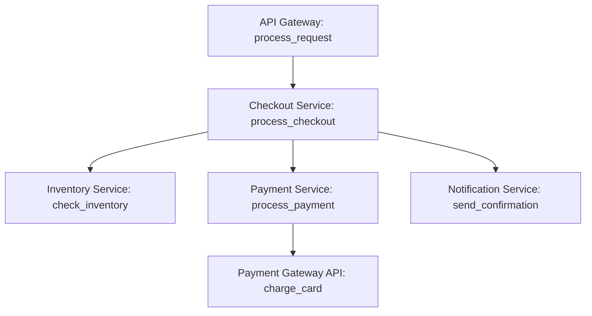

# How to Understand Trace Context and Why It's the Foundation of Distributed Tracing

Author: [nawazdhandala](https://www.github.com/nawazdhandala)

Tags: OpenTelemetry, Trace Context, W3C, Distributed Tracing, Context Propagation

Description: Explore how trace context enables distributed tracing by linking operations across services, processes, and network boundaries.

Distributed systems break single operations into multiple requests across many services. A user clicks "checkout" and that simple action triggers dozens of internal operations: validating the cart, checking inventory, processing payment, updating databases, sending notifications, and logging events. These operations span multiple services, containers, and cloud regions.

Without trace context, each operation looks independent. You see logs from the payment service, metrics from the inventory service, and traces from the notification service, but no way to connect them. Trace context solves this by creating a thread that ties related operations together, regardless of where they execute.

Understanding trace context means understanding the invisible coordination layer that makes distributed tracing possible.

## The Problem Trace Context Solves

Imagine debugging a failed checkout. The user reports the error happened at 14:32. You check logs from the checkout service and see successful processing. You check the payment service and see a failed transaction. You check the inventory service and see a successful reservation. But which checkout attempt corresponds to which payment and inventory operation?

Without correlation, you're guessing. You look for timestamps that line up. You search for user IDs or order IDs. You try to reconstruct the flow by piecing together evidence. This works for simple problems but becomes impossible as systems grow.

Trace context provides explicit correlation. Every operation in a distributed transaction carries identifiers that link it to related operations. The checkout service operation, payment service operation, and inventory service operation all share the same trace ID. You can query by trace ID and see the complete flow.

## What Trace Context Contains

Trace context is lightweight metadata that travels with each request. The W3C Trace Context specification defines two required fields and one optional field.

### Trace ID

A unique 16-byte identifier for the entire distributed trace. Every span in the trace shares this ID. When Service A calls Service B, both services use the same trace ID.

```
trace-id: 4bf92f3577b34da6a3ce929d0e0e4736
```

The trace ID is globally unique. Two different user requests will never have the same trace ID. This uniqueness enables correlation across any number of services.

### Span ID

An 8-byte identifier for the current operation. Each span gets a unique span ID. When Service A creates a span and calls Service B, Service B's span gets a different span ID but the same trace ID.

```
span-id: 00f067aa0ba902b7
```

The span ID identifies one specific operation within the trace. Combined with the trace ID, you can locate any span in any trace.

### Trace Flags

A single byte of flags controlling trace behavior. The most important flag is the sampled flag, which indicates whether this trace should be recorded.

```
trace-flags: 01  (sampled)
trace-flags: 00  (not sampled)
```

When a trace is sampled, all services record their spans. When not sampled, services may skip recording to reduce overhead. The sampling decision propagates with the trace context so all services make consistent decisions.

## How Trace Context Propagates

Trace context must travel across network boundaries. HTTP requests, gRPC calls, message queues, and any other inter-service communication must carry trace context.

### HTTP Header Propagation

The W3C Trace Context specification defines an HTTP header format for carrying trace context.

```http
GET /api/payment/charge HTTP/1.1
Host: payment-service.example.com
traceparent: 00-4bf92f3577b34da6a3ce929d0e0e4736-00f067aa0ba902b7-01
tracestate: vendor1=value1,vendor2=value2
```

The `traceparent` header contains trace context in a compact format:

```
version-trace_id-parent_span_id-trace_flags
00-4bf92f3577b34da6a3ce929d0e0e4736-00f067aa0ba902b7-01
```

Breaking this down:
- `00`: Version (currently always 00)
- `4bf92f3577b34da6a3ce929d0e0e4736`: Trace ID
- `00f067aa0ba902b7`: Parent span ID (the span that made this request)
- `01`: Trace flags (sampled)

The receiving service extracts this context, creates a new span with the same trace ID, sets the parent span ID to link the spans, and continues propagation to downstream calls.

```python
from opentelemetry import trace
from opentelemetry.propagate import extract
import requests

def call_payment_service(amount, currency):
    # Get the current trace context
    tracer = trace.get_tracer(__name__)

    with tracer.start_as_current_span("call_payment_service") as span:
        span.set_attribute("payment.amount", amount)
        span.set_attribute("payment.currency", currency)

        # OpenTelemetry automatically injects trace context into headers
        response = requests.post(
            "https://payment-service/charge",
            json={"amount": amount, "currency": currency}
        )

        span.set_attribute("http.status_code", response.status_code)
        return response.json()
```

OpenTelemetry instrumentation automatically injects the `traceparent` header. On the receiving side, instrumentation extracts the context:

```python
from flask import Flask, request
from opentelemetry import trace
from opentelemetry.propagate import extract

app = Flask(__name__)

@app.route('/charge', methods=['POST'])
def charge():
    # Extract trace context from incoming request headers
    ctx = extract(request.headers)

    tracer = trace.get_tracer(__name__)

    # Start span with extracted context as parent
    with tracer.start_as_current_span("process_charge", context=ctx) as span:
        data = request.json
        span.set_attribute("payment.amount", data["amount"])

        # Process payment
        result = process_payment(data["amount"], data["currency"])

        return {"status": "success", "transaction_id": result.id}
```

The `extract` function reads the `traceparent` header and reconstructs the trace context. The new span becomes a child of the parent span from the calling service.

### gRPC Metadata Propagation

gRPC uses metadata instead of HTTP headers, but the principle is identical.

```go
import (
    "context"
    "go.opentelemetry.io/otel"
    "go.opentelemetry.io/otel/propagation"
    "google.golang.org/grpc/metadata"
)

func callPaymentService(ctx context.Context, amount float64) error {
    tracer := otel.Tracer("checkout-service")

    ctx, span := tracer.Start(ctx, "call_payment_service")
    defer span.End()

    // Create gRPC metadata
    md := metadata.New(nil)

    // Inject trace context into metadata
    otel.GetTextMapPropagator().Inject(ctx, propagation.HeaderCarrier(md))

    // Create context with metadata
    ctx = metadata.NewOutgoingContext(ctx, md)

    // Make gRPC call with context
    resp, err := paymentClient.Charge(ctx, &PaymentRequest{
        Amount: amount,
    })

    return err
}
```

The receiving gRPC service extracts context from metadata:

```go
func (s *PaymentServer) Charge(ctx context.Context, req *PaymentRequest) (*PaymentResponse, error) {
    // Extract metadata from incoming context
    md, ok := metadata.FromIncomingContext(ctx)
    if !ok {
        md = metadata.New(nil)
    }

    // Extract trace context from metadata
    ctx = otel.GetTextMapPropagator().Extract(ctx, propagation.HeaderCarrier(md))

    tracer := otel.Tracer("payment-service")

    ctx, span := tracer.Start(ctx, "process_charge")
    defer span.End()

    // Process payment
    result := processPayment(req.Amount)

    return &PaymentResponse{TransactionId: result.ID}, nil
}
```

### Message Queue Propagation

Asynchronous message queues require storing trace context in message headers or body.

```javascript
const { trace, context, propagation } = require('@opentelemetry/api');
const amqp = require('amqplib');

async function publishOrderEvent(order) {
  const span = trace.getTracer('order-service').startSpan('publish_order_event');

  try {
    // Create message with order data
    const message = {
      orderId: order.id,
      userId: order.userId,
      total: order.total,
      timestamp: Date.now()
    };

    // Create carrier object for trace context
    const carrier = {};

    // Inject trace context into carrier
    propagation.inject(context.active(), carrier);

    // Add trace context to message headers
    const messageBuffer = Buffer.from(JSON.stringify(message));

    await channel.publish('orders', 'order.created', messageBuffer, {
      headers: carrier,
      persistent: true
    });

    span.setStatus({ code: trace.SpanStatusCode.OK });
  } catch (error) {
    span.recordException(error);
    span.setStatus({ code: trace.SpanStatusCode.ERROR });
    throw error;
  } finally {
    span.end();
  }
}
```

The message consumer extracts context from message headers:

```javascript
async function consumeOrderEvents() {
  await channel.consume('order-processing', async (msg) => {
    // Extract trace context from message headers
    const carrier = msg.properties.headers;
    const ctx = propagation.extract(context.active(), carrier);

    const tracer = trace.getTracer('inventory-service');

    // Start span with extracted context
    const span = tracer.startSpan('process_order_event', undefined, ctx);

    try {
      const order = JSON.parse(msg.content.toString());

      span.setAttribute('order.id', order.orderId);
      span.setAttribute('order.total', order.total);

      // Process the order
      await processOrder(order);

      channel.ack(msg);
      span.setStatus({ code: trace.SpanStatusCode.OK });
    } catch (error) {
      span.recordException(error);
      span.setStatus({ code: trace.SpanStatusCode.ERROR });
      channel.nack(msg);
    } finally {
      span.end();
    }
  });
}
```

## Building the Trace Tree

Trace context creates parent-child relationships between spans. As context propagates through services, each service creates new spans linked to their parents.



All these spans share the same trace ID. Each span has its own span ID. Each span records its parent's span ID, creating the tree structure.

```
Trace ID: 4bf92f3577b34da6a3ce929d0e0e4736

Span: process_request
  Span ID: 00f067aa0ba902b7
  Parent ID: none (root span)
  Service: api-gateway
  Duration: 234ms

  Span: process_checkout
    Span ID: 00f067aa0ba902b8
    Parent ID: 00f067aa0ba902b7
    Service: checkout-service
    Duration: 189ms

    Span: check_inventory
      Span ID: 00f067aa0ba902b9
      Parent ID: 00f067aa0ba902b8
      Service: inventory-service
      Duration: 45ms

    Span: process_payment
      Span ID: 00f067aa0ba902ba
      Parent ID: 00f067aa0ba902b8
      Service: payment-service
      Duration: 98ms

      Span: charge_card
        Span ID: 00f067aa0ba902bb
        Parent ID: 00f067aa0ba902ba
        Service: payment-gateway
        Duration: 87ms

    Span: send_confirmation
      Span ID: 00f067aa0ba902bc
      Parent ID: 00f067aa0ba902b8
      Service: notification-service
      Duration: 12ms
```

This hierarchy shows exactly how operations relate. The payment took 98ms total, but 87ms was spent waiting for the payment gateway. The checkout took 189ms, mostly because payment took 98ms. The full request took 234ms, with 45ms of overhead in the API gateway.

## Handling Context in Different Languages

Each programming language provides idiomatic ways to propagate context through function calls.

### Python: Context Managers and Function Arguments

Python uses context managers and explicit context passing.

```python
from opentelemetry import trace

def process_order(order_id, items):
    tracer = trace.get_tracer(__name__)

    # Context manager automatically manages current span
    with tracer.start_as_current_span("process_order") as span:
        span.set_attribute("order.id", order_id)

        # Nested spans automatically become children
        validate_order_items(items)
        charge_payment(order_id)
        reserve_inventory(items)

def validate_order_items(items):
    tracer = trace.get_tracer(__name__)

    # This span automatically becomes a child of process_order
    with tracer.start_as_current_span("validate_order_items") as span:
        span.set_attribute("item_count", len(items))

        for item in items:
            validate_item(item)
```

OpenTelemetry maintains an implicit "current span" that child spans reference automatically when using context managers.

### Go: Explicit Context Passing

Go requires explicitly passing context through the call chain.

```go
func processOrder(ctx context.Context, orderID string, items []Item) error {
    ctx, span := tracer.Start(ctx, "process_order")
    defer span.End()

    span.SetAttribute("order.id", orderID)

    // Pass context to child functions
    if err := validateOrderItems(ctx, items); err != nil {
        return err
    }

    if err := chargePayment(ctx, orderID); err != nil {
        return err
    }

    if err := reserveInventory(ctx, items); err != nil {
        return err
    }

    return nil
}

func validateOrderItems(ctx context.Context, items []Item) error {
    // Extract parent context and create child span
    ctx, span := tracer.Start(ctx, "validate_order_items")
    defer span.End()

    span.SetAttribute("item_count", len(items))

    for _, item := range items {
        if err := validateItem(ctx, item); err != nil {
            return err
        }
    }

    return nil
}
```

The `ctx` parameter carries trace context. Every function that creates spans or makes external calls needs this context parameter.

### Java: ThreadLocal and Context Scope

Java uses thread-local storage and explicit scope management.

```java
public class OrderService {
    private final Tracer tracer;

    public void processOrder(String orderId, List<Item> items) {
        Span span = tracer.spanBuilder("process_order")
                .startSpan();

        // Make span active for this thread
        try (Scope scope = span.makeCurrent()) {
            span.setAttribute("order.id", orderId);

            // These calls automatically use the current span as parent
            validateOrderItems(items);
            chargePayment(orderId);
            reserveInventory(items);

            span.setStatus(StatusCode.OK);
        } catch (Exception e) {
            span.recordException(e);
            span.setStatus(StatusCode.ERROR);
            throw e;
        } finally {
            span.end();
        }
    }

    private void validateOrderItems(List<Item> items) {
        Span span = tracer.spanBuilder("validate_order_items")
                .startSpan();

        try (Scope scope = span.makeCurrent()) {
            span.setAttribute("item_count", items.size());

            for (Item item : items) {
                validateItem(item);
            }

            span.setStatus(StatusCode.OK);
        } finally {
            span.end();
        }
    }
}
```

The `makeCurrent()` method stores the span in thread-local storage. Subsequent operations on that thread automatically use it as the parent span.

### JavaScript: Async Context

JavaScript's async nature requires special context handling.

```javascript
const { trace, context } = require('@opentelemetry/api');

async function processOrder(orderId, items) {
  const tracer = trace.getTracer('order-service');
  const span = tracer.startSpan('process_order');

  // context.with() preserves context across async boundaries
  return await context.with(trace.setSpan(context.active(), span), async () => {
    span.setAttribute('order.id', orderId);

    try {
      // These async operations maintain parent context
      await validateOrderItems(items);
      await chargePayment(orderId);
      await reserveInventory(items);

      span.setStatus({ code: trace.SpanStatusCode.OK });
    } catch (error) {
      span.recordException(error);
      span.setStatus({ code: trace.SpanStatusCode.ERROR });
      throw error;
    } finally {
      span.end();
    }
  });
}

async function validateOrderItems(items) {
  const tracer = trace.getTracer('order-service');

  // Automatically uses current span as parent
  const span = tracer.startSpan('validate_order_items');

  try {
    span.setAttribute('item_count', items.length);

    for (const item of items) {
      await validateItem(item);
    }

    span.setStatus({ code: trace.SpanStatusCode.OK });
  } finally {
    span.end();
  }
}
```

The `context.with()` function ensures context propagates through promise chains and async/await calls.

## Baggage: Carrying Extra Context

Beyond the standard trace context fields, OpenTelemetry supports baggage for carrying arbitrary key-value pairs across service boundaries.

```python
from opentelemetry import baggage, trace

def handle_api_request(user_id, user_tier):
    tracer = trace.get_tracer(__name__)

    # Set baggage values that propagate to all downstream services
    ctx = baggage.set_baggage("user.id", user_id)
    ctx = baggage.set_baggage("user.tier", user_tier, ctx)

    with tracer.start_as_current_span("handle_api_request", context=ctx) as span:
        # Downstream services can access these baggage values
        process_request()

def process_request():
    # Baggage automatically propagates
    user_tier = baggage.get_baggage("user.tier")

    if user_tier == "premium":
        # Apply premium processing
        use_priority_queue()
    else:
        use_standard_queue()
```

Baggage travels alongside trace context in HTTP headers:

```http
GET /api/process HTTP/1.1
traceparent: 00-4bf92f3577b34da6a3ce929d0e0e4736-00f067aa0ba902b7-01
baggage: user.id=user-123,user.tier=premium
```

Use baggage sparingly. Each baggage entry increases the size of every request. Too much baggage impacts performance. Use it for lightweight, important context like user ID, tenant ID, or feature flags.

## Trace Context Without OpenTelemetry

The W3C Trace Context standard works independently of OpenTelemetry. You can implement it manually if needed.

```javascript
// Manually generate trace context
function generateTraceContext() {
  const traceId = randomHex(16); // 16 bytes = 32 hex chars
  const spanId = randomHex(8);   // 8 bytes = 16 hex chars
  const flags = '01';             // sampled

  return {
    traceId,
    spanId,
    traceparent: `00-${traceId}-${spanId}-${flags}`
  };
}

// Manually inject into HTTP headers
function makeRequestWithTracing(url, data) {
  const traceContext = generateTraceContext();

  return fetch(url, {
    method: 'POST',
    headers: {
      'Content-Type': 'application/json',
      'traceparent': traceContext.traceparent
    },
    body: JSON.stringify(data)
  });
}

// Manually extract from HTTP headers
function extractTraceContext(headers) {
  const traceparent = headers.get('traceparent');

  if (!traceparent) {
    return null;
  }

  const parts = traceparent.split('-');

  if (parts.length !== 4 || parts[0] !== '00') {
    return null;
  }

  return {
    version: parts[0],
    traceId: parts[1],
    parentSpanId: parts[2],
    flags: parts[3]
  };
}
```

Manual implementation helps when integrating with systems that don't support OpenTelemetry or when building custom instrumentation for proprietary protocols.

## Context Loss and How to Prevent It

Trace context can break at service boundaries. Common causes include:

### Missing Propagation in HTTP Clients

If an HTTP client doesn't inject trace context, downstream services start new traces instead of continuing the existing trace.

```python
import requests
from opentelemetry.instrumentation.requests import RequestsInstrumentor

# Without instrumentation, trace context doesn't propagate
response = requests.get("https://api.example.com/data")

# Instrument requests library to enable automatic propagation
RequestsInstrumentor().instrument()

# Now trace context propagates automatically
response = requests.get("https://api.example.com/data")
```

### Thread Pool Execution

Starting new threads often loses trace context because context is thread-local.

```java
// Context is lost in new thread
executor.submit(() -> {
    // This code doesn't have trace context
    processData();
});

// Wrap task to propagate context
Span parentSpan = Span.current();
Context parentContext = Context.current();

executor.submit(() -> {
    try (Scope scope = parentContext.makeCurrent()) {
        // This code has trace context
        processData();
    }
});
```

### Message Queue Gaps

If producers don't inject context into messages or consumers don't extract it, traces break at queue boundaries. Always explicitly propagate context through message headers.

### Custom RPC Protocols

Custom protocols need custom propagation logic. You must manually inject and extract trace context.

```ruby
# Custom RPC client injection
def rpc_call(service, method, params)
  carrier = {}

  # Inject trace context into carrier
  OpenTelemetry.propagation.inject(carrier)

  # Send carrier with RPC request
  rpc_client.call(service, method, params, carrier)
end

# Custom RPC server extraction
def handle_rpc_call(request)
  # Extract trace context from request
  context = OpenTelemetry.propagation.extract(request.headers)

  tracer = OpenTelemetry.tracer_provider.tracer('rpc-server')

  tracer.in_span('handle_rpc_call', with_parent: context) do |span|
    # Process request with trace context
    process_request(request)
  end
end
```

## Debugging Trace Context

When traces look wrong, debug the trace context propagation.

### Log Trace IDs

Add trace IDs to logs to verify they propagate correctly.

```python
from opentelemetry import trace
import logging

logger = logging.getLogger(__name__)

def process_request():
    span = trace.get_current_span()
    trace_id = span.get_span_context().trace_id
    span_id = span.get_span_context().span_id

    logger.info(f"Processing request - trace_id={trace_id:032x} span_id={span_id:016x}")
```

If logs from different services show the same trace ID, propagation works. If they show different trace IDs, propagation is broken.

### Inspect HTTP Headers

Use tools to inspect HTTP headers and verify traceparent is present.

```bash
# Use curl with verbose output to see headers
curl -v https://api.example.com/endpoint

# Look for traceparent header in response
# < traceparent: 00-4bf92f3577b34da6a3ce929d0e0e4736-00f067aa0ba902b7-01
```

### Test with Simple HTTP Servers

Create test servers that echo received headers to verify injection works.

```python
from flask import Flask, request

app = Flask(__name__)

@app.route('/debug')
def debug():
    headers = dict(request.headers)
    return {
        "received_headers": headers,
        "traceparent": headers.get("Traceparent", "NOT FOUND")
    }
```

Call this endpoint from your instrumented code to verify headers are injected correctly.

## The Foundation of Observability

Trace context is the invisible glue that makes distributed tracing work. Without it, you have disconnected spans from isolated services. With it, you have complete traces showing request flow through complex systems.

Every observability capability builds on trace context: correlating logs with traces, linking metrics to specific requests, understanding performance bottlenecks, and debugging production issues. The W3C Trace Context standard ensures interoperability, letting OpenTelemetry work with other tracing systems and letting different services use different instrumentation libraries while maintaining trace continuity.

Understanding trace context means understanding how distributed systems coordinate to provide unified visibility. Master this foundation and everything else in distributed tracing makes sense.
