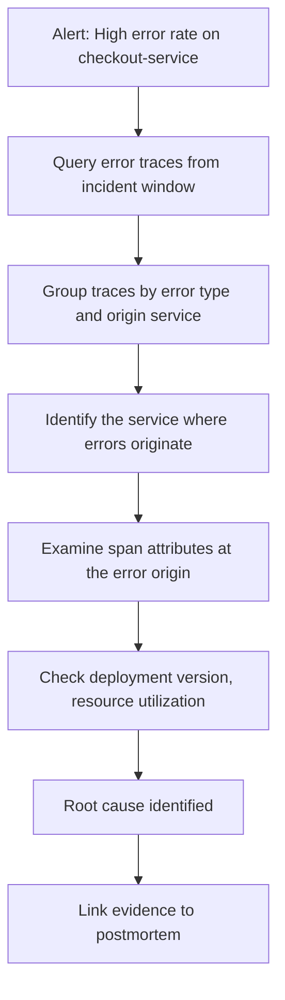

# How to Use OpenTelemetry Trace Correlation to Accelerate Root Cause Analysis During Incidents

Author: [nawazdhandala](https://www.github.com/nawazdhandala)

Tags: OpenTelemetry, Trace Correlation, Root Cause Analysis, Incident Response

Description: Use OpenTelemetry trace correlation techniques to rapidly identify root causes during production incidents across distributed services.

When a production incident hits a distributed system, the root cause is rarely in the service that first shows symptoms. A timeout in the checkout service might originate from a slow database query three services deep. OpenTelemetry trace correlation connects these dots by linking spans across service boundaries through trace context propagation. This post covers practical techniques for using trace correlation to cut incident investigation time from hours to minutes.

## Trace Context Propagation Basics

OpenTelemetry automatically propagates trace context across service boundaries using the W3C Trace Context standard. Every outgoing HTTP request, gRPC call, or message carries a `traceparent` header that links child spans back to their parent. This creates a complete picture of a distributed request.

```python
# No special code needed for context propagation with auto-instrumentation
# The OpenTelemetry SDK handles this automatically

# Install auto-instrumentation packages
# pip install opentelemetry-instrumentation-requests
# pip install opentelemetry-instrumentation-flask

from opentelemetry.instrumentation.requests import RequestsInstrumentor
from opentelemetry.instrumentation.flask import FlaskInstrumentor

# Auto-instrumenting HTTP clients and servers propagates trace context
RequestsInstrumentor().instrument()
FlaskInstrumentor().instrument(app=app)

# When service A calls service B, the trace context flows automatically:
# Service A (span) --traceparent header--> Service B (child span)
# Both spans share the same trace_id
```

## Correlating Traces with Logs

During an incident, you often start with a log line and need to find the full trace. OpenTelemetry's log correlation injects trace_id and span_id into every log record, making this connection seamless.

```python
import logging
from opentelemetry.instrumentation.logging import LoggingInstrumentor

# Enable log correlation - injects trace_id and span_id into log records
LoggingInstrumentor().instrument(set_logging_format=True)

# Configure structured logging that includes trace context
handler = logging.StreamHandler()
formatter = logging.Formatter(
    '{"timestamp": "%(asctime)s", '
    '"level": "%(levelname)s", '
    '"message": "%(message)s", '
    '"trace_id": "%(otelTraceID)s", '
    '"span_id": "%(otelSpanID)s", '
    '"service": "payment-service"}'
)
handler.setFormatter(formatter)

logger = logging.getLogger(__name__)
logger.addHandler(handler)
logger.setLevel(logging.INFO)

# Every log line now carries trace context
# {"timestamp": "2026-02-06 14:32:00", "level": "ERROR",
#  "message": "Payment gateway timeout", "trace_id": "abc123...",
#  "span_id": "def456...", "service": "payment-service"}
```

## Correlating Traces with Metrics Using Exemplars

Exemplars link metric data points to specific trace IDs. When you see a latency spike on a dashboard, exemplars let you click through to an actual trace that contributed to that spike.

```python
from opentelemetry import metrics, trace
import time

meter = metrics.get_meter("payment-service")

# Create a histogram that will carry exemplars
request_duration = meter.create_histogram(
    name="http.server.request.duration",
    description="Request duration in milliseconds",
    unit="ms",
)

def handle_request(request):
    start = time.monotonic()
    try:
        response = process(request)
        return response
    finally:
        duration_ms = (time.monotonic() - start) * 1000

        # The OpenTelemetry SDK automatically attaches the current
        # trace_id and span_id as exemplars on histogram recordings
        # when there is an active span context
        request_duration.record(duration_ms, {
            "http.method": request.method,
            "http.route": request.path,
        })
```

Configure the collector to preserve exemplars when exporting to Prometheus.

```yaml
# otel-collector-config.yaml
exporters:
  prometheus:
    endpoint: "0.0.0.0:8889"
    resource_to_telemetry_conversion:
      enabled: true
    # Enable exemplar storage in Prometheus
    enable_open_metrics: true
```

## Investigation Workflow: From Alert to Root Cause

Here is a step-by-step workflow that uses trace correlation to investigate an incident.



## Querying Correlated Traces During an Incident

When an alert fires, query your trace backend for error traces within the incident time window. Here is how to do this programmatically.

```python
import requests
from datetime import datetime, timedelta
from collections import Counter

class IncidentInvestigator:
    def __init__(self, trace_api_url: str):
        self.api_url = trace_api_url

    def find_error_traces(
        self,
        service: str,
        start: datetime,
        end: datetime,
        limit: int = 200,
    ) -> list[dict]:
        """Fetch error traces for a service during the incident window."""
        response = requests.get(
            f"{self.api_url}/api/traces",
            params={
                "service": service,
                "start": int(start.timestamp() * 1_000_000),
                "end": int(end.timestamp() * 1_000_000),
                "tags": '{"error":"true"}',
                "limit": limit,
            },
        )
        return response.json()["data"]

    def find_root_cause_service(self, traces: list[dict]) -> dict:
        """
        Analyze error traces to find which service is the most common
        origin of errors by finding leaf error spans (no error children).
        """
        origin_counts = Counter()

        for trace_data in traces:
            spans = trace_data["spans"]
            error_span_ids = {
                s["spanID"] for s in spans
                if s.get("tags", {}).get("error") == "true"
            }

            for span in spans:
                if span["spanID"] not in error_span_ids:
                    continue
                # Check if any child spans also have errors
                has_error_child = any(
                    s["spanID"] in error_span_ids
                    for s in spans
                    if any(r["spanID"] == span["spanID"] for r in s.get("references", []))
                )
                if not has_error_child:
                    origin_counts[span["process"]["serviceName"]] += 1

        return {
            "most_common_origin": origin_counts.most_common(1)[0] if origin_counts else None,
            "origin_distribution": dict(origin_counts),
        }
```

## Adding Investigation-Friendly Span Attributes

The quality of root cause analysis depends on what context your spans carry. Include attributes that answer the questions investigators will ask.

```python
from opentelemetry import trace
import os

tracer = trace.get_tracer("payment-service")

def process_payment(order_id: str, amount: float):
    with tracer.start_as_current_span("process-payment") as span:
        # Deployment context - "was this caused by a new release?"
        span.set_attribute("deployment.version", os.getenv("APP_VERSION", "unknown"))
        span.set_attribute("deployment.commit", os.getenv("GIT_COMMIT", "unknown"))

        # Infrastructure context - "is this a single-node issue?"
        span.set_attribute("host.name", os.getenv("HOSTNAME", "unknown"))
        span.set_attribute("cloud.availability_zone", os.getenv("AZ", "unknown"))

        return execute_payment(order_id, amount)
```

Trace correlation reduces MTTR by eliminating the manual step of comparing timestamps across separate systems. A single trace ID threads through logs, metrics, and traces. When an alert fires, the investigation path is: find the trace, follow the error propagation, read the span attributes at the origin, and identify the root cause.

For more on building the alerting pipeline that triggers these investigations, see the post on multi-burn-rate SLO alerts at https://oneuptime.com/blog/post/2026-02-06-multi-burn-rate-slo-alerts/view. For structuring the findings into a postmortem, see the blameless postmortem workflow post at https://oneuptime.com/blog/post/2026-02-06-blameless-postmortem-opentelemetry-traces/view.
