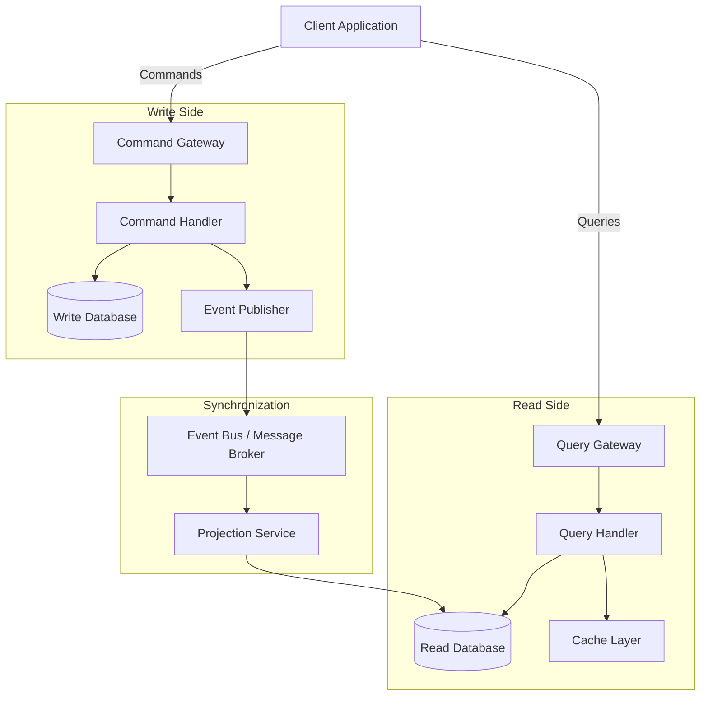
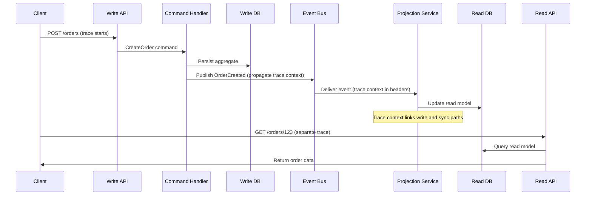

# How to Trace CQRS Read and Write Paths Separately with OpenTelemetry

Author: [nawazdhandala](https://www.github.com/nawazdhandala)

Tags: OpenTelemetry, CQRS, Distributed Tracing, Observability, Microservices, Architecture Patterns

Description: Learn how to instrument CQRS architectures with OpenTelemetry to separately trace command (write) and query (read) paths for better debugging and performance analysis.

---

CQRS (Command Query Responsibility Segregation) splits your application into two distinct paths: the write side that handles commands and the read side that serves queries. Each path has its own performance characteristics, failure modes, and scaling requirements. Treating them as a single blob in your observability setup means missing important signals.

With OpenTelemetry, you can instrument both sides independently. You get clear traces showing how commands flow through validation, domain logic, and persistence. And you get separate traces showing how queries hit read models, caches, and search indexes. When the write side is slow, you can see exactly why without noise from query traffic. When a read model returns stale data, you can trace the projection pipeline to find the bottleneck.

## CQRS Architecture Overview

Let's set up the context. In a typical CQRS system, the write side and read side share very little. They might even use different databases.



The write side receives commands, validates them, executes business logic, persists state changes, and publishes events. The read side receives queries and returns data from optimized read models. A projection service listens for events and keeps the read models in sync.

## Setting Up Separate Tracers

The first step is to create separate tracers for the read and write paths. This isn't strictly required by OpenTelemetry, but it makes it much easier to filter and analyze traces later. Each tracer gets its own name, so you can immediately tell which path a span belongs to.

```python
# tracers.py - Separate tracers for CQRS read and write paths
from opentelemetry import trace
from opentelemetry.sdk.trace import TracerProvider
from opentelemetry.sdk.trace.export import BatchSpanProcessor
from opentelemetry.exporter.otlp.proto.grpc.trace_exporter import OTLPSpanExporter
from opentelemetry.sdk.resources import Resource

# Shared resource for the service
resource = Resource.create({
    "service.name": "order-service",
    "service.version": "3.1.0",
})

# Configure the provider with OTLP export
provider = TracerProvider(resource=resource)
provider.add_span_processor(BatchSpanProcessor(
    OTLPSpanExporter(endpoint="otel-collector:4317", insecure=True)
))
trace.set_tracer_provider(provider)

# Create separate tracers for each CQRS path
# The tracer name becomes an attribute on every span it creates
write_tracer = trace.get_tracer("cqrs.write", "3.1.0")
read_tracer = trace.get_tracer("cqrs.read", "3.1.0")
sync_tracer = trace.get_tracer("cqrs.sync", "3.1.0")
```

## Instrumenting the Write Path

The write path handles commands. Each command goes through validation, authorization, domain logic, persistence, and event publication. Let's trace each of these phases.

```python
# command_handler.py - Write path instrumentation
from opentelemetry.trace import SpanKind, StatusCode

class OrderCommandHandler:
    def __init__(self, repository, event_publisher):
        self.repository = repository
        self.event_publisher = event_publisher

    def handle(self, command):
        """Route and execute a command with full tracing."""
        command_type = command.__class__.__name__

        # Root span for the entire command execution
        with write_tracer.start_as_current_span(
            f"command.{command_type}",
            kind=SpanKind.SERVER,
            attributes={
                "cqrs.path": "write",
                "cqrs.command.type": command_type,
                "cqrs.aggregate.id": getattr(command, "aggregate_id", "unknown"),
            }
        ) as cmd_span:
            try:
                # Phase 1: Validate the command
                with write_tracer.start_as_current_span(
                    "command.validate",
                    attributes={
                        "cqrs.command.type": command_type,
                        "cqrs.validation.rules_count": len(self._get_validators(command_type)),
                    }
                ) as val_span:
                    validation_errors = self._validate(command)
                    if validation_errors:
                        val_span.set_attribute("cqrs.validation.passed", False)
                        val_span.set_attribute("cqrs.validation.errors", str(validation_errors))
                        cmd_span.set_status(StatusCode.ERROR, "Validation failed")
                        return {"success": False, "errors": validation_errors}
                    val_span.set_attribute("cqrs.validation.passed", True)

                # Phase 2: Load the aggregate
                with write_tracer.start_as_current_span(
                    "command.load_aggregate",
                    attributes={
                        "cqrs.aggregate.type": "Order",
                        "cqrs.aggregate.id": command.aggregate_id,
                    }
                ) as load_span:
                    aggregate = self.repository.load(command.aggregate_id)
                    load_span.set_attribute("cqrs.aggregate.version", aggregate.version)

                # Phase 3: Execute domain logic
                with write_tracer.start_as_current_span(
                    "command.execute_domain_logic",
                    attributes={"cqrs.command.type": command_type}
                ):
                    events = aggregate.handle_command(command)

                # Phase 4: Persist state changes
                with write_tracer.start_as_current_span(
                    "command.persist",
                    attributes={
                        "cqrs.aggregate.id": command.aggregate_id,
                        "cqrs.events.count": len(events),
                        "db.system": "postgresql",
                        "db.operation": "INSERT",
                    }
                ):
                    self.repository.save(aggregate, events)

                # Phase 5: Publish events for the read side to consume
                with write_tracer.start_as_current_span(
                    "command.publish_events",
                    kind=SpanKind.PRODUCER,
                    attributes={
                        "cqrs.events.count": len(events),
                        "cqrs.events.types": ",".join(e.type for e in events),
                        "messaging.system": "rabbitmq",
                    }
                ):
                    for event in events:
                        self.event_publisher.publish(event)

                cmd_span.set_attribute("cqrs.command.success", True)
                cmd_span.set_status(StatusCode.OK)
                return {"success": True, "events": len(events)}

            except Exception as e:
                cmd_span.set_attribute("cqrs.command.success", False)
                cmd_span.set_status(StatusCode.ERROR, str(e))
                cmd_span.record_exception(e)
                raise

    def _validate(self, command):
        # Run validation rules
        return []

    def _get_validators(self, command_type):
        return []
```

## Instrumenting the Read Path

The read path is typically simpler but has different performance concerns. Queries hit read models, caches, and sometimes search indexes. You want to know which data source served the query and how long each layer took.

```python
# query_handler.py - Read path instrumentation
from opentelemetry.trace import SpanKind, StatusCode

class OrderQueryHandler:
    def __init__(self, read_db, cache):
        self.read_db = read_db
        self.cache = cache

    def handle(self, query):
        """Execute a query with full tracing of the read path."""
        query_type = query.__class__.__name__

        # Root span for the query execution
        with read_tracer.start_as_current_span(
            f"query.{query_type}",
            kind=SpanKind.SERVER,
            attributes={
                "cqrs.path": "read",
                "cqrs.query.type": query_type,
            }
        ) as query_span:
            try:
                # Try the cache first
                with read_tracer.start_as_current_span(
                    "query.cache_lookup",
                    attributes={
                        "cqrs.cache.system": "redis",
                        "cqrs.query.type": query_type,
                    }
                ) as cache_span:
                    cache_key = self._build_cache_key(query)
                    cached_result = self.cache.get(cache_key)

                    if cached_result is not None:
                        cache_span.set_attribute("cqrs.cache.hit", True)
                        query_span.set_attribute("cqrs.data_source", "cache")
                        query_span.set_attribute("cqrs.cache.hit", True)
                        query_span.set_status(StatusCode.OK)
                        return cached_result

                    cache_span.set_attribute("cqrs.cache.hit", False)

                # Cache miss - query the read model database
                with read_tracer.start_as_current_span(
                    "query.read_model",
                    attributes={
                        "cqrs.query.type": query_type,
                        "db.system": "postgresql",
                        "db.operation": "SELECT",
                        "db.name": "order_read_model",
                    }
                ) as db_span:
                    result = self._execute_query(query)
                    db_span.set_attribute("cqrs.result.count", len(result) if isinstance(result, list) else 1)

                # Populate the cache for next time
                with read_tracer.start_as_current_span(
                    "query.cache_populate",
                    attributes={
                        "cqrs.cache.system": "redis",
                        "cqrs.cache.ttl_seconds": 300,
                    }
                ):
                    self.cache.set(cache_key, result, ttl=300)

                query_span.set_attribute("cqrs.data_source", "read_model")
                query_span.set_attribute("cqrs.cache.hit", False)
                query_span.set_status(StatusCode.OK)
                return result

            except Exception as e:
                query_span.set_status(StatusCode.ERROR, str(e))
                query_span.record_exception(e)
                raise

    def _build_cache_key(self, query):
        return f"query:{query.__class__.__name__}:{hash(str(query))}"

    def _execute_query(self, query):
        # Execute against the read model database
        return []
```

## Tracing the Synchronization Layer

The projection service that keeps read models in sync is arguably the most important part to observe. If projections lag behind, users see stale data. If projections fail, queries return incorrect results.

```python
# projection_handler.py - Synchronization path instrumentation
from opentelemetry import context
from opentelemetry.trace import SpanKind, StatusCode
from opentelemetry.propagate import extract
import time

class OrderProjectionHandler:
    """Consumes events and updates the order read model."""

    def __init__(self, read_db, cache):
        self.read_db = read_db
        self.cache = cache

    def handle_event(self, event, message_headers):
        """Process a domain event and update the read model."""
        # Extract trace context from the message to link with the write path
        parent_context = extract(message_headers)

        with sync_tracer.start_as_current_span(
            f"projection.handle.{event['type']}",
            context=parent_context,
            kind=SpanKind.CONSUMER,
            attributes={
                "cqrs.path": "sync",
                "cqrs.projection.name": "OrderReadModel",
                "cqrs.event.type": event["type"],
                "cqrs.event.id": event["id"],
                "cqrs.aggregate.id": event["aggregate_id"],
            }
        ) as span:
            # Calculate and record the lag between event creation and processing
            event_time = event.get("timestamp", 0)
            processing_lag_ms = (time.time() - event_time) * 1000
            span.set_attribute("cqrs.projection.lag_ms", processing_lag_ms)

            try:
                # Update the read model database
                with sync_tracer.start_as_current_span(
                    "projection.update_read_model",
                    attributes={
                        "db.system": "postgresql",
                        "db.operation": "UPSERT",
                        "db.name": "order_read_model",
                    }
                ):
                    self._apply_event(event)

                # Invalidate the cache for this aggregate
                with sync_tracer.start_as_current_span(
                    "projection.invalidate_cache",
                    attributes={
                        "cqrs.cache.system": "redis",
                        "cqrs.cache.invalidated_keys": 1,
                    }
                ):
                    self.cache.delete(f"query:*:{event['aggregate_id']}")

                span.set_status(StatusCode.OK)

            except Exception as e:
                span.set_status(StatusCode.ERROR, str(e))
                span.record_exception(e)
                # Record the failed event for retry/dead-letter processing
                span.set_attribute("cqrs.projection.retry_needed", True)
                raise

    def _apply_event(self, event):
        # Apply the event to the read model
        pass
```

## Metrics for Each Path

Beyond traces, you want separate metrics for each CQRS path. This lets you build dashboards that show the health and performance of reads and writes independently.

```python
# cqrs_metrics.py - Separate metrics for read and write paths
from opentelemetry import metrics

meter = metrics.get_meter("cqrs.metrics")

# Write path metrics
command_duration = meter.create_histogram(
    name="cqrs.command.duration",
    description="Duration of command execution",
    unit="ms",
)

command_count = meter.create_counter(
    name="cqrs.command.count",
    description="Number of commands processed",
    unit="commands",
)

events_produced = meter.create_counter(
    name="cqrs.events.produced",
    description="Number of domain events produced by commands",
    unit="events",
)

# Read path metrics
query_duration = meter.create_histogram(
    name="cqrs.query.duration",
    description="Duration of query execution",
    unit="ms",
)

query_count = meter.create_counter(
    name="cqrs.query.count",
    description="Number of queries processed",
    unit="queries",
)

cache_hit_ratio = meter.create_counter(
    name="cqrs.cache.lookups",
    description="Cache lookup results",
    unit="lookups",
)

# Synchronization metrics
projection_lag = meter.create_histogram(
    name="cqrs.projection.lag",
    description="Lag between event creation and projection processing",
    unit="ms",
)

projection_errors = meter.create_counter(
    name="cqrs.projection.errors",
    description="Number of projection processing failures",
    unit="errors",
)


def record_command(command_type, duration_ms, success):
    """Record metrics for a command execution."""
    attributes = {
        "cqrs.path": "write",
        "cqrs.command.type": command_type,
        "cqrs.command.success": str(success),
    }
    command_duration.record(duration_ms, attributes)
    command_count.add(1, attributes)


def record_query(query_type, duration_ms, cache_hit):
    """Record metrics for a query execution."""
    attributes = {
        "cqrs.path": "read",
        "cqrs.query.type": query_type,
    }
    query_duration.record(duration_ms, attributes)
    query_count.add(1, attributes)
    cache_hit_ratio.add(1, {
        "cqrs.cache.hit": str(cache_hit),
        "cqrs.query.type": query_type,
    })
```

## Filtering Traces by Path in Your Backend

With the `cqrs.path` attribute on every span, you can easily filter traces in your observability backend. Here are some useful queries you can build:

- Show all write path traces slower than 500ms: `cqrs.path = "write" AND duration > 500ms`
- Show all read path cache misses: `cqrs.path = "read" AND cqrs.cache.hit = "False"`
- Show projection lag spikes: `cqrs.path = "sync" AND cqrs.projection.lag_ms > 5000`
- Show failed commands by type: `cqrs.path = "write" AND cqrs.command.success = "False"`

## An HTTP Layer Example

In a real application, the CQRS split often starts at the HTTP layer. Here's how to set up a FastAPI application with separate tracing for commands and queries.

```python
# api.py - FastAPI routes with CQRS-aware tracing
from fastapi import FastAPI, Request
from opentelemetry.instrumentation.fastapi import FastAPIInstrumentor

app = FastAPI()

# Auto-instrument FastAPI for basic HTTP tracing
FastAPIInstrumentor.instrument_app(app)


@app.post("/orders")
async def create_order(request: Request):
    """Command endpoint - creates a new order."""
    body = await request.json()

    # The command handler's internal tracing kicks in here
    with write_tracer.start_as_current_span(
        "api.command.CreateOrder",
        attributes={
            "cqrs.path": "write",
            "cqrs.command.type": "CreateOrder",
            "http.method": "POST",
            "http.route": "/orders",
        }
    ):
        handler = OrderCommandHandler(repository, event_publisher)
        result = handler.handle(CreateOrderCommand(**body))
        return result


@app.get("/orders/{order_id}")
async def get_order(order_id: str):
    """Query endpoint - retrieves order details."""
    with read_tracer.start_as_current_span(
        "api.query.GetOrder",
        attributes={
            "cqrs.path": "read",
            "cqrs.query.type": "GetOrder",
            "http.method": "GET",
            "http.route": "/orders/{order_id}",
        }
    ):
        handler = OrderQueryHandler(read_db, cache)
        result = handler.handle(GetOrderQuery(order_id=order_id))
        return result


@app.get("/orders")
async def list_orders(customer_id: str = None, status: str = None):
    """Query endpoint - lists orders with optional filters."""
    with read_tracer.start_as_current_span(
        "api.query.ListOrders",
        attributes={
            "cqrs.path": "read",
            "cqrs.query.type": "ListOrders",
            "cqrs.query.has_filters": str(bool(customer_id or status)),
            "http.method": "GET",
            "http.route": "/orders",
        }
    ):
        handler = OrderQueryHandler(read_db, cache)
        result = handler.handle(ListOrdersQuery(customer_id=customer_id, status=status))
        return result
```

## Tracing the Full Write-to-Read Journey

Sometimes you need to see the complete journey from a command being issued to the read model being updated. This crosses the boundary between the write path, the synchronization path, and impacts the read path. Since these cross message boundaries, you use context propagation through your event bus.



The write and sync paths share a trace because context is propagated through the event bus. The read path runs in its own trace because it's a separate HTTP request from the client. This is the natural structure of CQRS, and your tracing should reflect it.

## Wrapping Up

CQRS architectures benefit enormously from path-aware tracing. By using separate tracers (or at minimum, consistent path attributes), you can analyze write and read performance independently. The synchronization layer between them deserves special attention since it's where you'll find the root cause of stale data and consistency issues. OpenTelemetry's flexible instrumentation model works well here. You aren't forced into a one-size-fits-all tracing approach. You can model your traces to match the actual structure of your system, which is exactly what CQRS demands.
