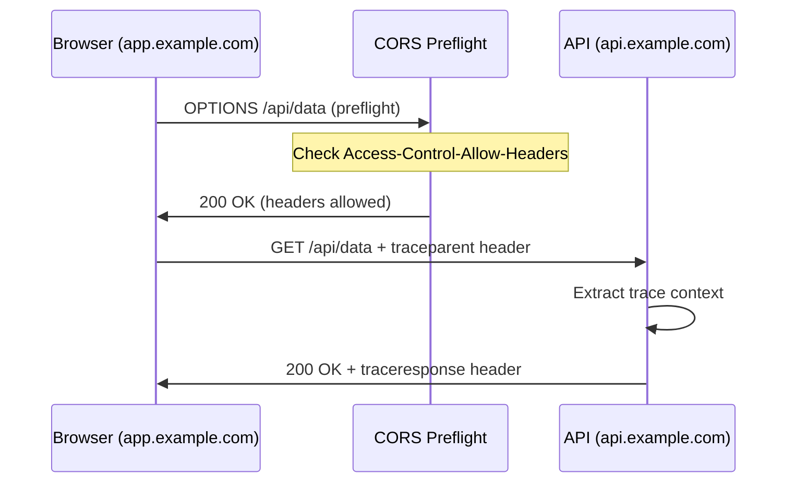

# How to Trace Cross-Origin API Requests from Browser to Backend with OpenTelemetry

Author: [nawazdhandala](https://www.github.com/nawazdhandala)

Tags: OpenTelemetry, CORS, Distributed Tracing, Browser SDK, Cross-Origin, Context Propagation

Description: Learn how to set up distributed tracing across cross-origin API requests from browser applications to backend services using OpenTelemetry context propagation.

---

Modern web applications almost always make API calls to a different origin than the one serving the page. Your frontend might be hosted on `app.example.com` while your API lives at `api.example.com`. This cross-origin setup creates a specific challenge for distributed tracing: the browser needs to send trace context headers with its requests, and the API server needs to accept those headers through its CORS configuration. If either side is not set up correctly, your traces will be disconnected, with frontend spans on one side and backend spans on the other, and no link between them.

This post walks through every step needed to get cross-origin distributed tracing working with OpenTelemetry, from browser SDK configuration to CORS headers to backend context extraction.

## Why Cross-Origin Tracing Breaks

When a browser makes a cross-origin request, the CORS protocol governs which headers can be sent and received. By default, browsers only send a limited set of "simple" headers. The `traceparent` and `tracestate` headers that OpenTelemetry uses for context propagation are not on that list. If your API does not explicitly allow these headers in its CORS configuration, the browser will strip them from the request.



The preflight request is the key interaction. If the server's CORS response does not include `traceparent` in the `Access-Control-Allow-Headers` list, the browser will not send it on the actual request. Your traces will appear to start fresh on the backend with no connection to the frontend span.

## Configuring the Browser SDK

Start by setting up the OpenTelemetry browser SDK with the correct propagation and instrumentation for cross-origin requests.

```javascript
// src/tracing/init.js
import { WebTracerProvider } from '@opentelemetry/sdk-trace-web';
import { BatchSpanProcessor } from '@opentelemetry/sdk-trace-base';
import { OTLPTraceExporter } from '@opentelemetry/exporter-trace-otlp-http';
import { ZoneContextManager } from '@opentelemetry/context-zone';
import { registerInstrumentations } from '@opentelemetry/instrumentation';
import { FetchInstrumentation } from '@opentelemetry/instrumentation-fetch';
import { XMLHttpRequestInstrumentation } from '@opentelemetry/instrumentation-xml-http-request';
import { Resource } from '@opentelemetry/resources';
import {
  CompositePropagator,
  W3CTraceContextPropagator,
  W3CBaggagePropagator,
} from '@opentelemetry/core';
import { propagation } from '@opentelemetry/api';

// Set up propagators before creating the provider.
// The W3C Trace Context propagator handles the traceparent header
// and the Baggage propagator handles the baggage header.
propagation.setGlobalPropagator(
  new CompositePropagator({
    propagators: [
      new W3CTraceContextPropagator(),
      new W3CBaggagePropagator(),
    ],
  })
);

const provider = new WebTracerProvider({
  resource: new Resource({
    'service.name': 'frontend-app',
    'service.version': '1.0.0',
  }),
});

provider.addSpanProcessor(
  new BatchSpanProcessor(
    new OTLPTraceExporter({
      url: 'https://collector.example.com/v1/traces',
    })
  )
);

provider.register({
  contextManager: new ZoneContextManager(),
});
```

The `CompositePropagator` with both W3C propagators ensures that both `traceparent` and `baggage` headers are injected into outgoing requests. The `traceparent` header carries the trace ID and span ID, while `baggage` carries arbitrary key-value pairs that you want to propagate across services.

## Configuring the Fetch Instrumentation for Cross-Origin

The critical part is telling the fetch instrumentation which URLs should receive trace context headers. By default, the instrumentation only propagates headers to same-origin requests.

```javascript
// src/tracing/init.js (continued)

// Register instrumentations with explicit cross-origin configuration
registerInstrumentations({
  instrumentations: [
    new FetchInstrumentation({
      // List the origins that should receive trace context headers.
      // Only include origins you control, since sending trace headers
      // to third-party APIs leaks internal information.
      propagateTraceHeaderCorsUrls: [
        /https:\/\/api\.example\.com/,
        /https:\/\/auth\.example\.com/,
        /https:\/\/uploads\.example\.com/,
      ],

      // Add custom attributes to fetch spans for better filtering
      applyCustomAttributesOnSpan: (span, request, result) => {
        // Tag the span with the API service being called
        const url = new URL(request.url || request);
        span.setAttribute('api.origin', url.origin);
        span.setAttribute('api.pathname', url.pathname);
      },

      // Ignore requests to analytics and monitoring endpoints
      // to avoid creating spans that trace the tracing infrastructure
      ignoreUrls: [
        /\/v1\/traces/,
        /\/v1\/metrics/,
        /analytics\.example\.com/,
      ],
    }),

    new XMLHttpRequestInstrumentation({
      // Same configuration for XHR-based requests
      propagateTraceHeaderCorsUrls: [
        /https:\/\/api\.example\.com/,
        /https:\/\/auth\.example\.com/,
      ],
    }),
  ],
});
```

The `propagateTraceHeaderCorsUrls` option takes an array of regular expressions or strings. When a fetch request matches one of these patterns, the instrumentation will inject the `traceparent` header. For requests that do not match, the header is omitted, which prevents leaking trace information to third-party services.

The `ignoreUrls` option is equally important. Without it, the SDK would create spans for the OTLP export requests themselves, creating an infinite loop of traces about traces.

## Configuring CORS on the Backend

The backend API server must be configured to allow the trace context headers in cross-origin requests. The exact configuration depends on your framework, but the required headers are the same everywhere.

### Express.js Configuration

```javascript
// server/cors-config.js
const cors = require('cors');

// Configure CORS to allow trace context propagation
// from the frontend application
const corsOptions = {
  origin: [
    'https://app.example.com',
    'https://staging.example.com',
  ],

  // These headers must be allowed for OpenTelemetry
  // context propagation to work across origins
  allowedHeaders: [
    'Content-Type',
    'Authorization',
    'traceparent',    // W3C Trace Context header
    'tracestate',     // W3C Trace Context state header
    'baggage',        // W3C Baggage header
  ],

  // Expose the traceresponse header so the browser SDK
  // can read the server's trace information
  exposedHeaders: [
    'traceresponse',
  ],

  // Allow credentials if your API uses cookies or auth tokens
  credentials: true,

  // Cache preflight responses for 1 hour to reduce
  // the number of OPTIONS requests
  maxAge: 3600,
};

module.exports = cors(corsOptions);
```

### Nginx Configuration

```nginx
# nginx/cors.conf

# Handle CORS preflight and regular requests for the API
location /api/ {
    # Preflight requests
    if ($request_method = 'OPTIONS') {
        add_header 'Access-Control-Allow-Origin' 'https://app.example.com';
        add_header 'Access-Control-Allow-Methods' 'GET, POST, PUT, DELETE, OPTIONS';
        # Include traceparent and baggage in allowed headers
        add_header 'Access-Control-Allow-Headers'
            'Content-Type, Authorization, traceparent, tracestate, baggage';
        add_header 'Access-Control-Expose-Headers' 'traceresponse';
        add_header 'Access-Control-Max-Age' 3600;
        add_header 'Access-Control-Allow-Credentials' 'true';
        return 204;
    }

    # Regular requests also need CORS headers
    add_header 'Access-Control-Allow-Origin' 'https://app.example.com';
    add_header 'Access-Control-Allow-Credentials' 'true';
    add_header 'Access-Control-Expose-Headers' 'traceresponse';

    proxy_pass http://backend;
}
```

The `Access-Control-Expose-Headers` entry for `traceresponse` is optional but useful. It allows the backend to send trace information back to the browser, which some advanced correlation setups use.

## Extracting Trace Context on the Backend

With CORS configured correctly, the `traceparent` header will arrive at your backend service. Your OpenTelemetry backend SDK needs to extract it and continue the trace.

### Node.js/Express Backend

```javascript
// server/tracing.js
const { NodeTracerProvider } = require('@opentelemetry/sdk-trace-node');
const { BatchSpanProcessor } = require('@opentelemetry/sdk-trace-base');
const { OTLPTraceExporter } = require('@opentelemetry/exporter-trace-otlp-http');
const { registerInstrumentations } = require('@opentelemetry/instrumentation');
const { HttpInstrumentation } = require('@opentelemetry/instrumentation-http');
const { ExpressInstrumentation } = require('@opentelemetry/instrumentation-express');
const { Resource } = require('@opentelemetry/resources');

const provider = new NodeTracerProvider({
  resource: new Resource({
    'service.name': 'api-service',
    'service.version': '2.0.0',
  }),
});

provider.addSpanProcessor(
  new BatchSpanProcessor(
    new OTLPTraceExporter({
      url: 'https://collector.example.com/v1/traces',
    })
  )
);

provider.register();

// The HTTP instrumentation automatically extracts the traceparent
// header and creates child spans that continue the browser's trace
registerInstrumentations({
  instrumentations: [
    new HttpInstrumentation(),
    new ExpressInstrumentation(),
  ],
});
```

The `HttpInstrumentation` on the Node.js side handles the W3C Trace Context extraction automatically. When it sees a `traceparent` header on an incoming request, it creates the server span as a child of the browser's span, linking both sides of the trace.

### Python/Django Backend

```python
# settings.py - Django OpenTelemetry configuration
from opentelemetry import trace
from opentelemetry.sdk.trace import TracerProvider
from opentelemetry.sdk.trace.export import BatchSpanProcessor
from opentelemetry.exporter.otlp.proto.http.trace_exporter import OTLPSpanExporter
from opentelemetry.sdk.resources import Resource
from opentelemetry.instrumentation.django import DjangoInstrumentor

# Configure the tracer provider with service metadata
resource = Resource.create({
    "service.name": "api-service",
    "service.version": "2.0.0",
})

provider = TracerProvider(resource=resource)
provider.add_span_processor(
    BatchSpanProcessor(
        OTLPSpanExporter(endpoint="https://collector.example.com/v1/traces")
    )
)
trace.set_tracer_provider(provider)

# DjangoInstrumentor automatically extracts the traceparent
# header from incoming requests and creates server spans
# as children of the browser trace
DjangoInstrumentor().instrument()
```

## Verifying the Trace Connection

After setting up both sides, you need to verify that traces actually connect across the origin boundary. Here is a simple test you can run from the browser console.

```javascript
// Run this in the browser DevTools console to verify
// that trace context is being propagated correctly

// Make a test request and inspect the headers
fetch('https://api.example.com/health', {
  method: 'GET',
}).then(async (response) => {
  console.log('Response status:', response.status);

  // Check if the traceresponse header came back
  const traceResponse = response.headers.get('traceresponse');
  console.log('Trace response header:', traceResponse);
});
```

Then check your trace backend. You should see a trace that starts with a span from `frontend-app` and continues with a child span from `api-service`. If you see two separate traces instead, the context propagation is not working, and you should check your CORS configuration and `propagateTraceHeaderCorsUrls` patterns.

## Handling Multiple API Origins

Real applications often talk to several different backend services, each on its own origin. You can handle this by organizing your URL patterns and adding service identification to spans.

```javascript
// src/tracing/api-config.js

// Define which origins receive trace headers and their service names
const API_SERVICES = {
  'https://api.example.com': 'main-api',
  'https://auth.example.com': 'auth-service',
  'https://uploads.example.com': 'upload-service',
  'https://search.example.com': 'search-service',
};

// Build the regex array for propagateTraceHeaderCorsUrls
export const traceableOrigins = Object.keys(API_SERVICES).map(
  (origin) => new RegExp(origin.replace(/\./g, '\\.'))
);

// Custom attribute function that tags spans with the backend service name
export function tagApiService(span, request) {
  const url = new URL(typeof request === 'string' ? request : request.url);
  const serviceName = API_SERVICES[url.origin];
  if (serviceName) {
    span.setAttribute('api.service', serviceName);
  }
}
```

This configuration makes it easy to add new backend services and keeps the service tagging consistent. When you view traces in your observability platform, you can filter by `api.service` to see all requests to a specific backend.

## Common Pitfalls

There are several issues that commonly break cross-origin tracing.

**Wildcard CORS origins with credentials.** If your CORS configuration uses `Access-Control-Allow-Origin: *`, it will not work when the browser also sends credentials (cookies, auth headers). You must specify exact origins.

**Missing headers in the preflight response.** Some reverse proxies or CDNs strip custom headers from OPTIONS responses. If the preflight does not include `traceparent` in `Access-Control-Allow-Headers`, the actual request will not carry it.

**Propagating to third-party APIs.** Never add third-party API domains to `propagateTraceHeaderCorsUrls`. Sending your internal trace IDs to external services is a security concern and the request will likely fail the CORS check anyway.

**Load balancer interference.** Some load balancers modify or strip the `traceparent` header. If traces are connecting intermittently, check each hop between the browser and your application server.

## Summary

Cross-origin distributed tracing with OpenTelemetry requires coordination between three layers: the browser SDK must be configured to inject trace headers on cross-origin requests using `propagateTraceHeaderCorsUrls`, the backend CORS configuration must allow the `traceparent`, `tracestate`, and `baggage` headers, and the backend OpenTelemetry SDK must extract the incoming trace context and create child spans. When all three are aligned, you get a single trace that flows from the user's browser click through to the deepest backend service, regardless of how many origins are involved along the way.
