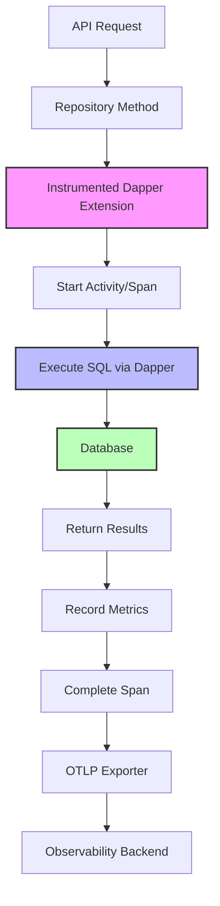

# How to Trace Dapper Database Queries with OpenTelemetry in .NET

Author: [nawazdhandala](https://www.github.com/nawazdhandala)

Tags: OpenTelemetry, Dapper, .NET, Database, SQL, Micro-ORM, Tracing

Description: Learn how to instrument Dapper database operations with OpenTelemetry to gain visibility into SQL query performance, connection management, and database interactions.

Dapper has earned its place as one of the most popular micro-ORMs in the .NET ecosystem, offering raw SQL performance with convenient object mapping. However, unlike Entity Framework Core which has built-in OpenTelemetry instrumentation, Dapper requires manual instrumentation to achieve the same level of observability. This creates a gap in distributed tracing when your application uses Dapper for database access.

## The Challenge of Instrumenting Dapper

Dapper extends the `IDbConnection` interface with extension methods, making it lightweight and performant. This design, while elegant, means there's no central interception point for adding instrumentation. Unlike ORMs that use query builders or expression trees, Dapper executes SQL directly, requiring a different instrumentation approach.

Key challenges include:
- No built-in instrumentation hooks in Dapper
- Extension methods don't easily support decoration or interception
- Need to capture SQL statements without impacting performance
- Parameter values require careful handling due to sensitive data
- Connection lifecycle events aren't automatically tracked
- Bulk operations need special consideration for span creation

The solution requires wrapping Dapper operations with OpenTelemetry spans while maintaining Dapper's performance characteristics.

## Setting Up OpenTelemetry with Dapper

Start by installing the necessary packages:

```bash
dotnet add package OpenTelemetry
dotnet add package OpenTelemetry.Extensions.Hosting
dotnet add package OpenTelemetry.Exporter.OpenTelemetryProtocol
dotnet add package Dapper
dotnet add package System.Data.SqlClient
# Or use Microsoft.Data.SqlClient for newer SQL Server features
```

Configure OpenTelemetry in your application:

```csharp
using OpenTelemetry.Resources;
using OpenTelemetry.Trace;
using OpenTelemetry.Metrics;

var builder = WebApplication.CreateBuilder(args);

builder.Services.AddOpenTelemetry()
    .ConfigureResource(resource => resource
        .AddService("DapperApp", serviceVersion: "1.0.0"))
    .WithTracing(tracing => tracing
        .AddSource("Dapper.*")
        .AddAspNetCoreInstrumentation()
        .AddHttpClientInstrumentation()
        .AddOtlpExporter(options =>
        {
            options.Endpoint = new Uri("http://localhost:4317");
        }))
    .WithMetrics(metrics => metrics
        .AddMeter("Dapper.*")
        .AddOtlpExporter(options =>
        {
            options.Endpoint = new Uri("http://localhost:4317");
        }));

var app = builder.Build();
app.Run();
```

## Creating an Instrumented Dapper Wrapper

Build a wrapper around Dapper that automatically creates OpenTelemetry spans:

```csharp
using System.Data;
using System.Diagnostics;
using System.Diagnostics.Metrics;
using Dapper;

public static class DapperInstrumentation
{
    private static readonly ActivitySource ActivitySource =
        new ActivitySource("Dapper.Operations", "1.0.0");

    private static readonly Meter Meter =
        new Meter("Dapper.Operations", "1.0.0");

    private static readonly Counter<long> QueryCounter;
    private static readonly Histogram<double> QueryDuration;
    private static readonly Counter<long> ConnectionCounter;

    static DapperInstrumentation()
    {
        QueryCounter = Meter.CreateCounter<long>(
            "db.client.queries",
            unit: "queries",
            description: "Number of database queries executed");

        QueryDuration = Meter.CreateHistogram<double>(
            "db.client.query.duration",
            unit: "ms",
            description: "Duration of database queries");

        ConnectionCounter = Meter.CreateCounter<long>(
            "db.client.connections",
            unit: "connections",
            description: "Number of database connections");
    }

    public static async Task<IEnumerable<T>> QueryAsync<T>(
        this IDbConnection connection,
        string sql,
        object? param = null,
        IDbTransaction? transaction = null,
        int? commandTimeout = null,
        CommandType? commandType = null)
    {
        using var activity = StartQueryActivity(
            "Query",
            connection,
            sql,
            commandType);

        var stopwatch = Stopwatch.StartNew();

        try
        {
            // Add parameter information (be careful with sensitive data)
            AddParameterTags(activity, param);

            var result = await connection.QueryAsync<T>(
                sql,
                param,
                transaction,
                commandTimeout,
                commandType);

            stopwatch.Stop();

            var count = result.Count();
            activity?.SetTag("db.result.count", count);
            activity?.SetTag("db.duration_ms", stopwatch.ElapsedMilliseconds);

            QueryCounter.Add(1,
                new KeyValuePair<string, object?>("operation", "query"),
                new KeyValuePair<string, object?>("status", "success"));

            QueryDuration.Record(stopwatch.ElapsedMilliseconds,
                new KeyValuePair<string, object?>("operation", "query"));

            activity?.SetStatus(ActivityStatusCode.Ok);

            return result;
        }
        catch (Exception ex)
        {
            stopwatch.Stop();

            activity?.SetTag("db.error", true);
            activity?.SetTag("db.error.type", ex.GetType().Name);
            activity?.RecordException(ex);
            activity?.SetStatus(ActivityStatusCode.Error, ex.Message);

            QueryCounter.Add(1,
                new KeyValuePair<string, object?>("operation", "query"),
                new KeyValuePair<string, object?>("status", "error"));

            throw;
        }
    }

    public static async Task<T?> QueryFirstOrDefaultAsync<T>(
        this IDbConnection connection,
        string sql,
        object? param = null,
        IDbTransaction? transaction = null,
        int? commandTimeout = null,
        CommandType? commandType = null)
    {
        using var activity = StartQueryActivity(
            "QueryFirstOrDefault",
            connection,
            sql,
            commandType);

        var stopwatch = Stopwatch.StartNew();

        try
        {
            AddParameterTags(activity, param);

            var result = await connection.QueryFirstOrDefaultAsync<T>(
                sql,
                param,
                transaction,
                commandTimeout,
                commandType);

            stopwatch.Stop();

            activity?.SetTag("db.result.found", result != null);
            activity?.SetTag("db.duration_ms", stopwatch.ElapsedMilliseconds);

            QueryCounter.Add(1,
                new KeyValuePair<string, object?>("operation", "query_first"));

            QueryDuration.Record(stopwatch.ElapsedMilliseconds,
                new KeyValuePair<string, object?>("operation", "query_first"));

            activity?.SetStatus(ActivityStatusCode.Ok);

            return result;
        }
        catch (Exception ex)
        {
            stopwatch.Stop();

            activity?.RecordException(ex);
            activity?.SetStatus(ActivityStatusCode.Error, ex.Message);

            QueryCounter.Add(1,
                new KeyValuePair<string, object?>("operation", "query_first"),
                new KeyValuePair<string, object?>("status", "error"));

            throw;
        }
    }

    public static async Task<int> ExecuteAsync(
        this IDbConnection connection,
        string sql,
        object? param = null,
        IDbTransaction? transaction = null,
        int? commandTimeout = null,
        CommandType? commandType = null)
    {
        using var activity = StartQueryActivity(
            "Execute",
            connection,
            sql,
            commandType);

        var stopwatch = Stopwatch.StartNew();

        try
        {
            AddParameterTags(activity, param);

            var rowsAffected = await connection.ExecuteAsync(
                sql,
                param,
                transaction,
                commandTimeout,
                commandType);

            stopwatch.Stop();

            activity?.SetTag("db.rows_affected", rowsAffected);
            activity?.SetTag("db.duration_ms", stopwatch.ElapsedMilliseconds);

            QueryCounter.Add(1,
                new KeyValuePair<string, object?>("operation", "execute"),
                new KeyValuePair<string, object?>("status", "success"));

            QueryDuration.Record(stopwatch.ElapsedMilliseconds,
                new KeyValuePair<string, object?>("operation", "execute"));

            activity?.SetStatus(ActivityStatusCode.Ok);

            return rowsAffected;
        }
        catch (Exception ex)
        {
            stopwatch.Stop();

            activity?.RecordException(ex);
            activity?.SetStatus(ActivityStatusCode.Error, ex.Message);

            QueryCounter.Add(1,
                new KeyValuePair<string, object?>("operation", "execute"),
                new KeyValuePair<string, object?>("status", "error"));

            throw;
        }
    }

    public static async Task<T> ExecuteScalarAsync<T>(
        this IDbConnection connection,
        string sql,
        object? param = null,
        IDbTransaction? transaction = null,
        int? commandTimeout = null,
        CommandType? commandType = null)
    {
        using var activity = StartQueryActivity(
            "ExecuteScalar",
            connection,
            sql,
            commandType);

        var stopwatch = Stopwatch.StartNew();

        try
        {
            AddParameterTags(activity, param);

            var result = await connection.ExecuteScalarAsync<T>(
                sql,
                param,
                transaction,
                commandTimeout,
                commandType);

            stopwatch.Stop();

            activity?.SetTag("db.duration_ms", stopwatch.ElapsedMilliseconds);

            QueryCounter.Add(1,
                new KeyValuePair<string, object?>("operation", "execute_scalar"));

            QueryDuration.Record(stopwatch.ElapsedMilliseconds,
                new KeyValuePair<string, object?>("operation", "execute_scalar"));

            activity?.SetStatus(ActivityStatusCode.Ok);

            return result;
        }
        catch (Exception ex)
        {
            stopwatch.Stop();

            activity?.RecordException(ex);
            activity?.SetStatus(ActivityStatusCode.Error, ex.Message);

            QueryCounter.Add(1,
                new KeyValuePair<string, object?>("operation", "execute_scalar"),
                new KeyValuePair<string, object?>("status", "error"));

            throw;
        }
    }

    public static async Task<SqlMapper.GridReader> QueryMultipleAsync(
        this IDbConnection connection,
        string sql,
        object? param = null,
        IDbTransaction? transaction = null,
        int? commandTimeout = null,
        CommandType? commandType = null)
    {
        using var activity = StartQueryActivity(
            "QueryMultiple",
            connection,
            sql,
            commandType);

        var stopwatch = Stopwatch.StartNew();

        try
        {
            AddParameterTags(activity, param);

            var result = await connection.QueryMultipleAsync(
                sql,
                param,
                transaction,
                commandTimeout,
                commandType);

            stopwatch.Stop();

            activity?.SetTag("db.duration_ms", stopwatch.ElapsedMilliseconds);

            QueryCounter.Add(1,
                new KeyValuePair<string, object?>("operation", "query_multiple"));

            QueryDuration.Record(stopwatch.ElapsedMilliseconds,
                new KeyValuePair<string, object?>("operation", "query_multiple"));

            activity?.SetStatus(ActivityStatusCode.Ok);

            return result;
        }
        catch (Exception ex)
        {
            stopwatch.Stop();

            activity?.RecordException(ex);
            activity?.SetStatus(ActivityStatusCode.Error, ex.Message);

            QueryCounter.Add(1,
                new KeyValuePair<string, object?>("operation", "query_multiple"),
                new KeyValuePair<string, object?>("status", "error"));

            throw;
        }
    }

    private static Activity? StartQueryActivity(
        string operationName,
        IDbConnection connection,
        string sql,
        CommandType? commandType)
    {
        var activity = ActivitySource.StartActivity(
            $"DB {operationName}",
            ActivityKind.Client);

        if (activity == null)
            return null;

        // Add database semantic conventions
        activity.SetTag("db.system", GetDatabaseSystem(connection));
        activity.SetTag("db.connection_string", SanitizeConnectionString(connection.ConnectionString));
        activity.SetTag("db.statement", sql);
        activity.SetTag("db.operation", operationName);

        if (commandType.HasValue)
        {
            activity.SetTag("db.command_type", commandType.Value.ToString());
        }

        // Extract database name from connection
        var databaseName = GetDatabaseName(connection);
        if (!string.IsNullOrEmpty(databaseName))
        {
            activity.SetTag("db.name", databaseName);
        }

        return activity;
    }

    private static void AddParameterTags(Activity? activity, object? param)
    {
        if (activity == null || param == null)
            return;

        // Add parameter count but not values (security concern)
        var properties = param.GetType().GetProperties();
        activity.SetTag("db.parameter_count", properties.Length);

        // Optionally add parameter names (not values)
        var parameterNames = string.Join(", ", properties.Select(p => p.Name));
        activity.SetTag("db.parameter_names", parameterNames);
    }

    private static string GetDatabaseSystem(IDbConnection connection)
    {
        return connection.GetType().Name switch
        {
            "SqlConnection" => "mssql",
            "NpgsqlConnection" => "postgresql",
            "MySqlConnection" => "mysql",
            "SqliteConnection" => "sqlite",
            _ => "unknown"
        };
    }

    private static string SanitizeConnectionString(string connectionString)
    {
        // Remove sensitive information from connection string
        if (string.IsNullOrEmpty(connectionString))
            return string.Empty;

        // Simple sanitization - in production use a proper parser
        var sanitized = System.Text.RegularExpressions.Regex.Replace(
            connectionString,
            @"(Password|PWD|User ID|UID)=[^;]*",
            "$1=***",
            System.Text.RegularExpressions.RegexOptions.IgnoreCase);

        return sanitized;
    }

    private static string? GetDatabaseName(IDbConnection connection)
    {
        try
        {
            return connection.Database;
        }
        catch
        {
            return null;
        }
    }
}
```

## Using the Instrumented Dapper Extensions

Replace standard Dapper calls with the instrumented versions:

```csharp
using System.Data;
using System.Data.SqlClient;

public class ProductRepository
{
    private readonly string _connectionString;

    public ProductRepository(IConfiguration configuration)
    {
        _connectionString = configuration.GetConnectionString("DefaultConnection")
            ?? throw new InvalidOperationException("Connection string not found");
    }

    public async Task<IEnumerable<Product>> GetAllProductsAsync()
    {
        using var connection = new SqlConnection(_connectionString);

        // Uses instrumented QueryAsync
        return await connection.QueryAsync<Product>(
            "SELECT Id, Name, Price, Category FROM Products ORDER BY Name");
    }

    public async Task<Product?> GetProductByIdAsync(int id)
    {
        using var connection = new SqlConnection(_connectionString);

        // Uses instrumented QueryFirstOrDefaultAsync
        return await connection.QueryFirstOrDefaultAsync<Product>(
            "SELECT Id, Name, Price, Category FROM Products WHERE Id = @Id",
            new { Id = id });
    }

    public async Task<int> CreateProductAsync(Product product)
    {
        using var connection = new SqlConnection(_connectionString);

        // Uses instrumented ExecuteScalarAsync
        return await connection.ExecuteScalarAsync<int>(
            @"INSERT INTO Products (Name, Price, Category)
              VALUES (@Name, @Price, @Category);
              SELECT CAST(SCOPE_IDENTITY() AS INT);",
            product);
    }

    public async Task<int> UpdateProductAsync(Product product)
    {
        using var connection = new SqlConnection(_connectionString);

        // Uses instrumented ExecuteAsync
        return await connection.ExecuteAsync(
            @"UPDATE Products
              SET Name = @Name, Price = @Price, Category = @Category
              WHERE Id = @Id",
            product);
    }

    public async Task<int> DeleteProductAsync(int id)
    {
        using var connection = new SqlConnection(_connectionString);

        // Uses instrumented ExecuteAsync
        return await connection.ExecuteAsync(
            "DELETE FROM Products WHERE Id = @Id",
            new { Id = id });
    }

    public async Task<ProductWithOrders> GetProductWithOrdersAsync(int productId)
    {
        using var connection = new SqlConnection(_connectionString);

        // Uses instrumented QueryMultipleAsync for multiple result sets
        using var multi = await connection.QueryMultipleAsync(
            @"SELECT Id, Name, Price, Category FROM Products WHERE Id = @ProductId;
              SELECT o.Id, o.OrderDate, o.Quantity, o.TotalPrice
              FROM Orders o WHERE o.ProductId = @ProductId
              ORDER BY o.OrderDate DESC;",
            new { ProductId = productId });

        var product = await multi.ReadFirstOrDefaultAsync<Product>();
        var orders = (await multi.ReadAsync<Order>()).ToList();

        return new ProductWithOrders
        {
            Product = product,
            Orders = orders
        };
    }
}

public class Product
{
    public int Id { get; set; }
    public string Name { get; set; } = string.Empty;
    public decimal Price { get; set; }
    public string Category { get; set; } = string.Empty;
}

public class Order
{
    public int Id { get; set; }
    public DateTime OrderDate { get; set; }
    public int Quantity { get; set; }
    public decimal TotalPrice { get; set; }
}

public class ProductWithOrders
{
    public Product? Product { get; set; }
    public List<Order> Orders { get; set; } = new();
}
```

## Instrumenting Bulk Operations

Dapper supports bulk operations that need special instrumentation considerations:

```csharp
public static class DapperBulkInstrumentation
{
    private static readonly ActivitySource ActivitySource =
        new ActivitySource("Dapper.Bulk", "1.0.0");

    public static async Task<int> BulkInsertAsync<T>(
        this IDbConnection connection,
        string sql,
        IEnumerable<T> items,
        IDbTransaction? transaction = null,
        int? commandTimeout = null)
    {
        using var activity = ActivitySource.StartActivity(
            "DB BulkInsert",
            ActivityKind.Client);

        var itemsList = items.ToList();
        activity?.SetTag("db.system", "mssql");
        activity?.SetTag("db.statement", sql);
        activity?.SetTag("db.operation", "BulkInsert");
        activity?.SetTag("db.bulk.item_count", itemsList.Count);

        var stopwatch = Stopwatch.StartNew();

        try
        {
            // Execute bulk operation
            var rowsAffected = await connection.ExecuteAsync(
                sql,
                itemsList,
                transaction,
                commandTimeout);

            stopwatch.Stop();

            activity?.SetTag("db.rows_affected", rowsAffected);
            activity?.SetTag("db.duration_ms", stopwatch.ElapsedMilliseconds);
            activity?.SetTag("db.throughput_items_per_second",
                itemsList.Count / stopwatch.Elapsed.TotalSeconds);

            activity?.SetStatus(ActivityStatusCode.Ok);

            return rowsAffected;
        }
        catch (Exception ex)
        {
            stopwatch.Stop();

            activity?.RecordException(ex);
            activity?.SetStatus(ActivityStatusCode.Error, ex.Message);

            throw;
        }
    }
}

// Usage example
public async Task ImportProductsAsync(List<Product> products)
{
    using var connection = new SqlConnection(_connectionString);

    await connection.BulkInsertAsync(
        "INSERT INTO Products (Name, Price, Category) VALUES (@Name, @Price, @Category)",
        products);
}
```

## Managing Database Connections with Instrumentation

Track connection lifecycle events:

```csharp
public class InstrumentedConnectionFactory
{
    private static readonly ActivitySource ActivitySource =
        new ActivitySource("Dapper.Connection", "1.0.0");

    private static readonly Counter<long> ConnectionCounter;

    static InstrumentedConnectionFactory()
    {
        var meter = new Meter("Dapper.Connection");
        ConnectionCounter = meter.CreateCounter<long>(
            "db.connections.opened",
            unit: "connections");
    }

    private readonly string _connectionString;

    public InstrumentedConnectionFactory(string connectionString)
    {
        _connectionString = connectionString;
    }

    public async Task<IDbConnection> CreateOpenConnectionAsync()
    {
        using var activity = ActivitySource.StartActivity(
            "DB Connection",
            ActivityKind.Client);

        activity?.SetTag("db.system", "mssql");
        activity?.SetTag("db.operation", "connect");

        var stopwatch = Stopwatch.StartNew();

        try
        {
            var connection = new SqlConnection(_connectionString);
            await connection.OpenAsync();

            stopwatch.Stop();

            activity?.SetTag("db.connection.duration_ms", stopwatch.ElapsedMilliseconds);
            activity?.SetTag("db.connection.state", connection.State.ToString());

            ConnectionCounter.Add(1,
                new KeyValuePair<string, object?>("status", "success"));

            activity?.SetStatus(ActivityStatusCode.Ok);

            return connection;
        }
        catch (Exception ex)
        {
            stopwatch.Stop();

            activity?.RecordException(ex);
            activity?.SetStatus(ActivityStatusCode.Error, ex.Message);

            ConnectionCounter.Add(1,
                new KeyValuePair<string, object?>("status", "error"));

            throw;
        }
    }
}
```

## Tracing Transaction Boundaries

Instrument database transactions:

```csharp
public class TransactionScope : IDisposable
{
    private readonly Activity? _activity;
    private readonly IDbTransaction _transaction;

    public TransactionScope(IDbConnection connection)
    {
        var activitySource = new ActivitySource("Dapper.Transaction");

        _activity = activitySource.StartActivity(
            "DB Transaction",
            ActivityKind.Internal);

        _activity?.SetTag("db.transaction.isolation_level", "ReadCommitted");

        _transaction = connection.BeginTransaction();
    }

    public void Commit()
    {
        try
        {
            _transaction.Commit();
            _activity?.SetTag("db.transaction.outcome", "commit");
            _activity?.SetStatus(ActivityStatusCode.Ok);
        }
        catch (Exception ex)
        {
            _activity?.RecordException(ex);
            _activity?.SetStatus(ActivityStatusCode.Error, ex.Message);
            throw;
        }
    }

    public void Rollback()
    {
        _transaction.Rollback();
        _activity?.SetTag("db.transaction.outcome", "rollback");
        _activity?.SetStatus(ActivityStatusCode.Ok);
    }

    public void Dispose()
    {
        _transaction?.Dispose();
        _activity?.Dispose();
    }
}

// Usage
public async Task TransferFundsAsync(int fromAccount, int toAccount, decimal amount)
{
    using var connection = new SqlConnection(_connectionString);
    await connection.OpenAsync();

    using var transactionScope = new TransactionScope(connection);

    try
    {
        await connection.ExecuteAsync(
            "UPDATE Accounts SET Balance = Balance - @Amount WHERE Id = @Id",
            new { Amount = amount, Id = fromAccount });

        await connection.ExecuteAsync(
            "UPDATE Accounts SET Balance = Balance + @Amount WHERE Id = @Id",
            new { Amount = amount, Id = toAccount });

        transactionScope.Commit();
    }
    catch
    {
        transactionScope.Rollback();
        throw;
    }
}
```

## Visualizing Dapper Query Performance

Understanding the telemetry flow:



## Best Practices for Dapper Instrumentation

**Sanitize Connection Strings**: Never include passwords or sensitive credentials in span attributes. Always sanitize connection strings before adding them to telemetry.

**Be Selective with SQL Statements**: While recording the full SQL statement is valuable, consider truncating very long queries or parameterized queries to avoid span bloat.

**Don't Log Parameter Values**: Parameter values might contain sensitive user data. Log parameter names and counts, but not the actual values.

**Use Semantic Conventions**: Follow OpenTelemetry database semantic conventions for consistency with other instrumentation.

**Monitor Connection Pool Health**: Track connection creation times to identify connection pool exhaustion issues.

**Correlate with Application Logic**: Ensure database spans properly nest within business logic spans to understand the full request context.

**Sample High-Volume Queries**: For high-throughput applications, consider sampling frequently-executed queries rather than tracing every single execution.

Dapper's simplicity and performance make it a great choice for data access, and with proper OpenTelemetry instrumentation, you don't have to sacrifice observability for performance. The instrumentation patterns shown here give you the visibility needed to optimize queries, diagnose issues, and understand your application's database interactions in production.
