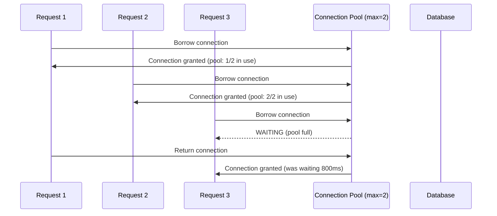
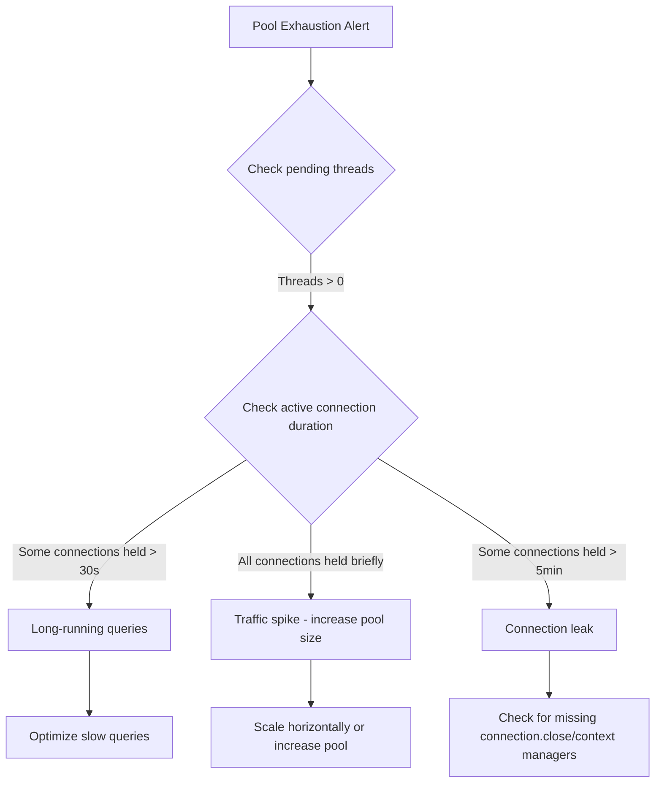

# How to Trace Database Connection Pool Exhaustion with OpenTelemetry Metrics

Author: [nawazdhandala](https://www.github.com/nawazdhandala)

Tags: OpenTelemetry, Database, Connection Pooling, Metrics, Observability, Performance, Troubleshooting

Description: Learn to detect and diagnose database connection pool exhaustion using OpenTelemetry metrics, traces, and practical alerting strategies.

---

Connection pool exhaustion is one of the nastiest problems in production systems. Your application has a fixed number of database connections in its pool. When every connection is in use and a new request needs one, it blocks. If connections are not returned quickly enough, the pool fills up, requests pile up, and your entire service stalls. The worst part is that the database itself might be perfectly healthy. The bottleneck is in your application's connection management.

OpenTelemetry can expose connection pool internals as metrics, giving you visibility into pool usage before it becomes a crisis. This guide shows how to instrument connection pools, track the right metrics, and build alerts that catch exhaustion before users notice.

## Understanding the Problem

A database connection pool maintains a set of reusable connections. When your code needs to run a query, it borrows a connection from the pool. When the query finishes, the connection goes back. This avoids the overhead of establishing a new TCP connection and completing the database handshake for every single query.

The problem starts when the pool cannot keep up with demand.



In this scenario, Request 3 had to wait 800ms just to get a connection before its query even started. If many requests are waiting, your p99 latency climbs and eventually requests start timing out.

## Step 1: Expose Connection Pool Metrics

Most database drivers and connection pool libraries provide hooks or statistics APIs that let you read pool state. The approach varies by language and library.

Here is an example using Java with HikariCP, one of the most popular connection pools.

```java
// ConnectionPoolMetrics.java
import io.opentelemetry.api.metrics.Meter;
import io.opentelemetry.api.metrics.ObservableGauge;
import com.zaxxer.hikari.HikariDataSource;

public class ConnectionPoolMetrics {

    // Register OpenTelemetry gauges that read HikariCP pool stats
    public static void register(Meter meter, HikariDataSource dataSource) {

        // Number of connections currently in use (borrowed from pool)
        meter.gaugeBuilder("db.pool.connections.active")
            .setDescription("Active connections currently in use")
            .setUnit("connections")
            .buildWithCallback(measurement -> {
                measurement.record(
                    dataSource.getHikariPoolMXBean().getActiveConnections(),
                    io.opentelemetry.api.common.Attributes.of(
                        io.opentelemetry.api.common.AttributeKey.stringKey("db.pool.name"),
                        dataSource.getPoolName()
                    )
                );
            });

        // Number of idle connections sitting in the pool
        meter.gaugeBuilder("db.pool.connections.idle")
            .setDescription("Idle connections available in the pool")
            .setUnit("connections")
            .buildWithCallback(measurement -> {
                measurement.record(
                    dataSource.getHikariPoolMXBean().getIdleConnections(),
                    io.opentelemetry.api.common.Attributes.of(
                        io.opentelemetry.api.common.AttributeKey.stringKey("db.pool.name"),
                        dataSource.getPoolName()
                    )
                );
            });

        // Total size of the pool (active + idle)
        meter.gaugeBuilder("db.pool.connections.total")
            .setDescription("Total connections in the pool")
            .setUnit("connections")
            .buildWithCallback(measurement -> {
                measurement.record(
                    dataSource.getHikariPoolMXBean().getTotalConnections(),
                    io.opentelemetry.api.common.Attributes.of(
                        io.opentelemetry.api.common.AttributeKey.stringKey("db.pool.name"),
                        dataSource.getPoolName()
                    )
                );
            });

        // Number of threads waiting for a connection - this is the critical metric
        meter.gaugeBuilder("db.pool.connections.pending")
            .setDescription("Threads waiting for a connection from the pool")
            .setUnit("threads")
            .buildWithCallback(measurement -> {
                measurement.record(
                    dataSource.getHikariPoolMXBean().getThreadsAwaitingConnection(),
                    io.opentelemetry.api.common.Attributes.of(
                        io.opentelemetry.api.common.AttributeKey.stringKey("db.pool.name"),
                        dataSource.getPoolName()
                    )
                );
            });
    }
}
```

For Python with SQLAlchemy, the approach uses the pool events system.

```python
# pool_metrics.py
from opentelemetry import metrics
from sqlalchemy import event
import time

meter = metrics.get_meter("db.connection_pool")

# Gauge for active connections
active_connections = meter.create_up_down_counter(
    "db.pool.connections.active",
    description="Number of connections currently checked out from the pool",
    unit="connections",
)

# Histogram for how long requests wait to get a connection
wait_time_histogram = meter.create_histogram(
    "db.pool.checkout.wait_time",
    description="Time spent waiting for a connection from the pool",
    unit="ms",
)

# Counter for connection checkout timeouts
timeout_counter = meter.create_counter(
    "db.pool.checkout.timeouts",
    description="Number of times a connection checkout timed out",
    unit="1",
)

pool_attrs = {"db.pool.name": "main"}


def instrument_pool(engine):
    """Attach OpenTelemetry metrics to a SQLAlchemy engine's connection pool."""

    # Track when connections are checked out
    @event.listens_for(engine, "checkout")
    def on_checkout(dbapi_conn, connection_rec, connection_proxy):
        # Increment active connection count
        active_connections.add(1, pool_attrs)
        # Store checkout time for wait_time calculation
        connection_rec.info["checkout_time"] = time.monotonic()

    # Track when connections are returned to the pool
    @event.listens_for(engine, "checkin")
    def on_checkin(dbapi_conn, connection_rec):
        active_connections.add(-1, pool_attrs)

    # Measure how long the checkout process takes
    # A long checkout time means the pool is under pressure
    @event.listens_for(engine.pool, "connect")
    def on_connect(dbapi_conn, connection_rec):
        connection_rec.info["created_at"] = time.monotonic()
```

## Step 2: Add Wait Time Measurement

The most critical signal for connection pool exhaustion is checkout wait time. This measures how long a request sits idle, waiting for a connection to become available.

Here is how to measure it precisely using span events.

```python
# Enhanced checkout tracking with span events
from opentelemetry import trace

tracer = trace.get_tracer("db.pool")

def get_connection_with_tracing(pool):
    """Wrapper that creates a span around connection acquisition."""
    with tracer.start_as_current_span("db.pool.checkout") as span:
        start = time.monotonic()

        try:
            # This call will block if the pool is exhausted
            connection = pool.connect()
            wait_ms = (time.monotonic() - start) * 1000

            # Record the wait time as both a span attribute and metric
            span.set_attribute("db.pool.wait_time_ms", wait_ms)
            wait_time_histogram.record(wait_ms, pool_attrs)

            if wait_ms > 100:
                # Add an event to the span if the wait was significant
                span.add_event("slow_pool_checkout", {
                    "wait_time_ms": wait_ms,
                    "pool_size": pool.size(),
                })

            return connection

        except Exception as e:
            # Connection checkout timed out
            timeout_counter.add(1, pool_attrs)
            span.set_status(trace.StatusCode.ERROR, str(e))
            raise
```

## Step 3: Collector Configuration

The collector does not need any special receivers for connection pool metrics since they come from your application via OTLP. However, you should configure processors to handle the metrics efficiently.

```yaml
# otel-collector-config.yaml
receivers:
  otlp:
    protocols:
      grpc:
        endpoint: 0.0.0.0:4317
      http:
        endpoint: 0.0.0.0:4318

processors:
  batch:
    timeout: 10s
    send_batch_size: 1024

  # Add service metadata so you can distinguish between
  # different services sharing the same database
  resource:
    attributes:
      - key: deployment.environment
        value: "production"
        action: upsert

exporters:
  otlp:
    endpoint: "http://your-backend:4317"
    tls:
      insecure: true

service:
  pipelines:
    metrics:
      receivers: [otlp]
      processors: [resource, batch]
      exporters: [otlp]
    traces:
      receivers: [otlp]
      processors: [resource, batch]
      exporters: [otlp]
```

## Step 4: Build Alerts for Pool Exhaustion

Here are alert rules that catch connection pool problems at different severity levels.

```yaml
# connection-pool-alerts.yaml
groups:
  - name: db_pool_alerts
    rules:
      # Early warning: pool utilization above 80%
      - alert: ConnectionPoolHighUtilization
        expr: |
          db_pool_connections_active
          / (db_pool_connections_active + db_pool_connections_idle)
          > 0.80
        for: 5m
        labels:
          severity: warning
        annotations:
          summary: "Connection pool utilization above 80% for {{ $labels.db_pool_name }}"
          description: >
            The connection pool {{ $labels.db_pool_name }} on
            {{ $labels.service_name }} is using more than 80% of its capacity.
            Active: {{ $value }}. Consider increasing the pool size or
            investigating long-running queries.

      # Critical: threads are waiting for connections
      - alert: ConnectionPoolThreadsWaiting
        expr: db_pool_connections_pending > 0
        for: 2m
        labels:
          severity: critical
        annotations:
          summary: "Threads waiting for DB connections on {{ $labels.service_name }}"
          description: >
            {{ $value }} threads are waiting for a connection from pool
            {{ $labels.db_pool_name }}. This means the pool is fully
            exhausted and requests are being delayed.

      # Alert on high checkout wait times
      - alert: ConnectionPoolSlowCheckout
        expr: |
          histogram_quantile(0.95,
            sum(rate(db_pool_checkout_wait_time_bucket[5m]))
            by (le, db_pool_name, service_name)
          ) > 200
        for: 5m
        labels:
          severity: warning
        annotations:
          summary: "Slow connection pool checkout on {{ $labels.service_name }}"
          description: >
            The p95 connection checkout time for pool {{ $labels.db_pool_name }}
            exceeds 200ms. Requests are spending significant time just waiting
            for database connections.

      # Alert on checkout timeouts
      - alert: ConnectionPoolTimeouts
        expr: rate(db_pool_checkout_timeouts_total[5m]) > 0
        for: 1m
        labels:
          severity: critical
        annotations:
          summary: "Connection pool timeouts on {{ $labels.service_name }}"
          description: >
            Connection checkout timeouts are occurring. Requests are failing
            because no database connection became available within the timeout
            period.
```

## Step 5: Diagnosing the Root Cause

When a pool exhaustion alert fires, you need to figure out why connections are not being returned to the pool. The usual suspects are:

**Long-running queries.** A query that takes 30 seconds holds its connection for 30 seconds. Use the database span metrics (from the slow SQL queries guide) to identify which queries are taking the longest.

**Connection leaks.** Code that borrows a connection but fails to return it due to an exception in the middle of a transaction. This is the most dangerous cause because the pool slowly drains over time.

**Sudden traffic spikes.** A burst of concurrent requests that exceeds the pool size. This is normal during traffic peaks but should not happen during regular load.



To find connection leaks, look for spans where a connection was checked out but the corresponding check-in never happened. Adding a maximum lifetime to connections in the pool (HikariCP's `maxLifetime`, SQLAlchemy's `pool_recycle`) acts as a safety net by forcibly closing old connections.

## Connection Pool Sizing Guidance

A common question is how large the pool should be. Bigger is not always better. Each connection consumes memory on both the application and the database server. A pool that is too large can overwhelm the database with too many concurrent queries.

A reasonable starting formula is: `pool_size = (number_of_CPU_cores * 2) + effective_spindle_count`. For SSD-based databases, this usually works out to somewhere between 10 and 20 connections per application instance.

Track these metrics over time and adjust based on actual utilization. If your pool is at 50% utilization during peak traffic, it is probably sized correctly. If it regularly hits 90%, you need either more connections or fewer concurrent queries.

## Summary

Connection pool exhaustion is a problem that exists entirely in the application layer. Your database monitoring will not catch it. Your infrastructure monitoring will not catch it. Only application-level metrics can reveal what is happening inside the pool.

With OpenTelemetry metrics tracking active connections, idle connections, pending threads, and checkout wait times, you get the visibility needed to detect exhaustion early and diagnose the root cause quickly. Combine these metrics with database span tracing to close the loop between "the pool is full" and "here is the specific query holding all the connections."
