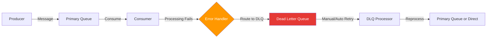

# How to Trace Dead Letter Queue Processing with OpenTelemetry

Author: [nawazdhandala](https://www.github.com/nawazdhandala)

Tags: OpenTelemetry, Dead Letter Queue, DLQ, Tracing, Error Handling, Messaging

Description: Learn how to trace dead letter queue processing with OpenTelemetry to track failed messages from initial failure through DLQ routing to eventual reprocessing.

---

Dead letter queues are where failed messages go when your consumers cannot process them. Every message in a DLQ represents a problem that needs attention, whether it is a malformed payload, a transient downstream failure, or a bug in your processing logic. Without proper tracing, DLQ messages become black holes. You know something failed, but you have no context about why it failed, where it originally came from, or what happened when you tried to reprocess it.

OpenTelemetry lets you build continuous traces that follow a message from its original queue, through the failure that sent it to the DLQ, and into the reprocessing pipeline that eventually handles it.

## The DLQ Tracing Problem

The fundamental challenge with DLQ tracing is that the message crosses multiple system boundaries. It starts in a primary queue, fails during processing, gets routed to the DLQ (sometimes by the broker, sometimes by your code), sits there for some period, and then gets picked up by a reprocessing consumer. Each of these transitions is a potential place where trace context gets lost.



To maintain trace continuity across all these hops, you need to propagate context at every boundary and record the right attributes to tell the story of what happened.

## Setting Up the Base Instrumentation

Start with a standard OpenTelemetry setup that supports both the primary consumer and the DLQ processor.

```python
from opentelemetry import trace, metrics
from opentelemetry.sdk.trace import TracerProvider
from opentelemetry.sdk.trace.export import BatchSpanProcessor
from opentelemetry.exporter.otlp.proto.grpc.trace_exporter import OTLPSpanExporter
from opentelemetry.sdk.resources import Resource

resource = Resource.create({
    "service.name": "order-processor",
    "service.version": "3.2.1",
})

provider = TracerProvider(resource=resource)
provider.add_span_processor(
    BatchSpanProcessor(OTLPSpanExporter(endpoint="http://localhost:4317"))
)
trace.set_tracer_provider(provider)

tracer = trace.get_tracer("dlq.processing")
meter = metrics.get_meter("dlq.metrics")

# Track DLQ routing events
dlq_routed_counter = meter.create_counter(
    name="messaging.dlq.routed",
    description="Messages routed to dead letter queue",
    unit="messages",
)

# Track DLQ reprocessing outcomes
dlq_reprocessed_counter = meter.create_counter(
    name="messaging.dlq.reprocessed",
    description="Messages reprocessed from dead letter queue",
    unit="messages",
)
```

The counters give you aggregate visibility into how many messages are flowing into and out of your DLQs, while the tracer handles per-message tracing.

## Instrumenting the Primary Consumer with DLQ Routing

The primary consumer is where messages first fail. Your instrumentation needs to capture both the processing attempt and the DLQ routing decision.

```python
import json
import pika
from opentelemetry.propagate import extract, inject
from opentelemetry.context.propagation import get_global_textmap_propagator

def on_message(channel, method, properties, body):
    # Extract trace context from the incoming message headers
    carrier = {}
    if properties.headers:
        carrier = {
            k: v for k, v in properties.headers.items()
            if k in ("traceparent", "tracestate")
        }
    parent_context = extract(carrier)

    # Start the primary processing span
    with tracer.start_as_current_span(
        f"{method.routing_key} process",
        context=parent_context,
        kind=trace.SpanKind.CONSUMER,
        attributes={
            "messaging.system": "rabbitmq",
            "messaging.source.name": method.routing_key,
            "messaging.operation": "process",
            "messaging.message.id": properties.message_id or "",
            "messaging.rabbitmq.delivery_tag": method.delivery_tag,
        }
    ) as process_span:
        try:
            payload = json.loads(body)
            result = process_order(payload)

            # Success: acknowledge the message
            channel.basic_ack(delivery_tag=method.delivery_tag)
            process_span.set_attribute("messaging.processing.outcome", "success")

        except Exception as e:
            # Record the failure on the processing span
            process_span.set_status(trace.StatusCode.ERROR, str(e))
            process_span.record_exception(e)
            process_span.set_attribute("messaging.processing.outcome", "failed")

            # Route to DLQ with trace context preserved
            route_to_dlq(channel, method, properties, body, e)

            # Acknowledge the original message since we handled it via DLQ
            channel.basic_ack(delivery_tag=method.delivery_tag)
```

The processing span records both success and failure outcomes. When processing fails, it calls `route_to_dlq` before acknowledging the original message. This ensures the message does not get redelivered by the broker while also moving it to the DLQ for later handling.

## The DLQ Routing Function

The routing function creates a child span that documents the DLQ transition and preserves trace context in the DLQ message.

```python
def route_to_dlq(channel, method, properties, body, error):
    # Create a span for the DLQ routing operation
    with tracer.start_as_current_span(
        "dlq route",
        kind=trace.SpanKind.PRODUCER,
        attributes={
            "messaging.system": "rabbitmq",
            "messaging.destination.name": f"{method.routing_key}.dlq",
            "messaging.operation": "publish",
            "messaging.dlq.reason": str(error),
            "messaging.dlq.original_queue": method.routing_key,
            "messaging.dlq.retry_count": _get_retry_count(properties),
        }
    ) as dlq_span:
        # Inject current trace context into headers for the DLQ message
        headers = dict(properties.headers or {})
        inject(headers)

        # Add DLQ-specific metadata to the message headers
        headers["x-dlq-reason"] = str(error)[:500]
        headers["x-dlq-original-queue"] = method.routing_key
        headers["x-dlq-timestamp"] = str(int(time.time()))
        headers["x-dlq-retry-count"] = str(_get_retry_count(properties) + 1)

        # Publish to the dead letter queue
        dlq_queue = f"{method.routing_key}.dlq"
        channel.basic_publish(
            exchange="",
            routing_key=dlq_queue,
            body=body,
            properties=pika.BasicProperties(
                headers=headers,
                message_id=properties.message_id,
                content_type=properties.content_type,
                delivery_mode=2,  # Persistent
            )
        )

        dlq_routed_counter.add(1, {
            "messaging.dlq.queue": dlq_queue,
            "messaging.dlq.error_type": type(error).__name__,
            "messaging.dlq.original_queue": method.routing_key,
        })

def _get_retry_count(properties):
    """Extract the current retry count from message headers."""
    if properties.headers and "x-dlq-retry-count" in properties.headers:
        return int(properties.headers["x-dlq-retry-count"])
    return 0
```

This function does several important things. It injects the current trace context so the DLQ processor can continue the trace. It adds metadata headers that explain why the message was dead-lettered, which queue it came from, and how many times it has been retried. The retry count is especially important because it lets you implement maximum retry policies and track messages that keep failing repeatedly.

## Instrumenting the DLQ Processor

The DLQ processor is a separate consumer that reads from the dead letter queue and attempts to reprocess messages. It needs to extract the original trace context and decide whether to retry or permanently fail the message.

```python
import time

MAX_RETRIES = 3

def on_dlq_message(channel, method, properties, body):
    # Extract the preserved trace context from DLQ message headers
    carrier = {}
    if properties.headers:
        carrier = {
            k: v for k, v in properties.headers.items()
            if k in ("traceparent", "tracestate")
        }
    parent_context = extract(carrier)

    # Parse DLQ metadata from headers
    headers = properties.headers or {}
    original_queue = headers.get("x-dlq-original-queue", "unknown")
    retry_count = int(headers.get("x-dlq-retry-count", "0"))
    dlq_timestamp = int(headers.get("x-dlq-timestamp", "0"))
    dlq_reason = headers.get("x-dlq-reason", "unknown")

    # Calculate how long the message sat in the DLQ
    dwell_time_seconds = int(time.time()) - dlq_timestamp if dlq_timestamp else 0

    with tracer.start_as_current_span(
        "dlq reprocess",
        context=parent_context,
        kind=trace.SpanKind.CONSUMER,
        attributes={
            "messaging.system": "rabbitmq",
            "messaging.source.name": method.routing_key,
            "messaging.operation": "process",
            "messaging.dlq.original_queue": original_queue,
            "messaging.dlq.retry_count": retry_count,
            "messaging.dlq.dwell_time_seconds": dwell_time_seconds,
            "messaging.dlq.original_reason": dlq_reason,
        }
    ) as reprocess_span:
        # Check if we have exceeded the maximum retry limit
        if retry_count >= MAX_RETRIES:
            reprocess_span.set_attribute("messaging.dlq.action", "permanent_failure")
            reprocess_span.set_status(
                trace.StatusCode.ERROR,
                f"Max retries ({MAX_RETRIES}) exceeded"
            )

            # Move to a permanent failure store
            store_permanent_failure(body, headers)
            channel.basic_ack(delivery_tag=method.delivery_tag)

            dlq_reprocessed_counter.add(1, {
                "messaging.dlq.outcome": "permanent_failure",
                "messaging.dlq.original_queue": original_queue,
            })
            return

        try:
            payload = json.loads(body)
            result = process_order(payload)

            # Successful reprocessing
            channel.basic_ack(delivery_tag=method.delivery_tag)
            reprocess_span.set_attribute("messaging.dlq.action", "reprocessed_success")

            dlq_reprocessed_counter.add(1, {
                "messaging.dlq.outcome": "success",
                "messaging.dlq.original_queue": original_queue,
                "messaging.dlq.retry_count": retry_count,
            })

        except Exception as e:
            reprocess_span.set_status(trace.StatusCode.ERROR, str(e))
            reprocess_span.record_exception(e)
            reprocess_span.set_attribute("messaging.dlq.action", "reprocess_failed")

            # Route back to DLQ with incremented retry count
            route_to_dlq(channel, method, properties, body, e)
            channel.basic_ack(delivery_tag=method.delivery_tag)

            dlq_reprocessed_counter.add(1, {
                "messaging.dlq.outcome": "failed_again",
                "messaging.dlq.original_queue": original_queue,
                "messaging.dlq.retry_count": retry_count,
            })
```

The `dwell_time_seconds` attribute is one of the most useful pieces of data you can capture. It tells you how long messages are sitting in the DLQ before being reprocessed. If your DLQ processor runs on a schedule (say, every 5 minutes), the dwell time confirms that schedule is being met. If dwell times are growing, your DLQ processor might be falling behind.

## Monitoring DLQ Health with Metrics

Beyond per-message tracing, aggregate metrics give you the big picture of DLQ health across all your queues.

```python
# Observable gauge for current DLQ depth
dlq_depth_gauge = meter.create_observable_gauge(
    name="messaging.dlq.depth",
    description="Current number of messages in dead letter queues",
    unit="messages",
    callbacks=[lambda options: observe_dlq_depths(options)],
)

def observe_dlq_depths(options):
    """Report the current depth of all DLQ queues."""
    import requests

    # Query RabbitMQ management API for queue depths
    response = requests.get(
        "http://localhost:15672/api/queues",
        auth=("guest", "guest")
    )
    queues = response.json()

    for queue in queues:
        # Only report on DLQ queues (those ending in .dlq)
        if queue["name"].endswith(".dlq"):
            yield metrics.Observation(
                value=queue.get("messages", 0),
                attributes={
                    "messaging.dlq.queue": queue["name"],
                    "messaging.dlq.original_queue": queue["name"].replace(".dlq", ""),
                }
            )
```

This gauge polls the RabbitMQ management API to report how many messages are waiting in each DLQ. You can set up alerts on this metric so that when a DLQ starts accumulating messages faster than the reprocessor can handle them, you get notified before the backlog becomes a crisis.

## Collector Configuration

The collector should handle both the trace data from your instrumented consumers and the DLQ metrics.

```yaml
# Collector config for DLQ tracing and monitoring
receivers:
  otlp:
    protocols:
      grpc:
        endpoint: 0.0.0.0:4317
      http:
        endpoint: 0.0.0.0:4318

processors:
  batch:
    timeout: 5s
    send_batch_size: 256

  # Filter to separate DLQ-related spans for specialized processing
  filter/dlq:
    spans:
      include:
        match_type: regexp
        attributes:
          - key: messaging.dlq.original_queue
            value: ".*"

exporters:
  otlp:
    endpoint: https://your-oneuptime-instance.com:4317

service:
  pipelines:
    traces:
      receivers: [otlp]
      processors: [batch]
      exporters: [otlp]
    metrics:
      receivers: [otlp]
      processors: [batch]
      exporters: [otlp]
```

## Analyzing DLQ Traces

Once your instrumentation is running, you can use your tracing backend to answer critical questions about DLQ behavior:

- Which error types cause the most DLQ routing? Filter spans by `messaging.dlq.reason` to group failures.
- How long do messages sit in the DLQ? Look at the `messaging.dlq.dwell_time_seconds` attribute on reprocess spans.
- What is the reprocessing success rate? Compare `messaging.dlq.outcome` values of "success" vs "failed_again" vs "permanent_failure".
- Are specific original queues generating more DLQ traffic? Group the `messaging.dlq.routed` counter by `messaging.dlq.original_queue`.

The connected trace from producer through failure through DLQ reprocessing gives you the complete lifecycle of every problematic message, something that would take hours of log correlation to piece together manually.

## Wrapping Up

Tracing dead letter queue processing with OpenTelemetry transforms DLQs from opaque failure dumps into well-understood recovery pipelines. By propagating trace context through the DLQ routing and reprocessing stages, you maintain end-to-end visibility even when messages take the unhappy path. The combination of per-message traces and aggregate DLQ metrics gives you both the detail to debug individual failures and the overview to understand systemic patterns.

The most important thing to get right is trace context preservation during the DLQ routing step. If you inject the context into the DLQ message headers correctly, everything downstream just works. Start there, then layer on the retry counting, dwell time tracking, and depth monitoring as your DLQ processing matures.
