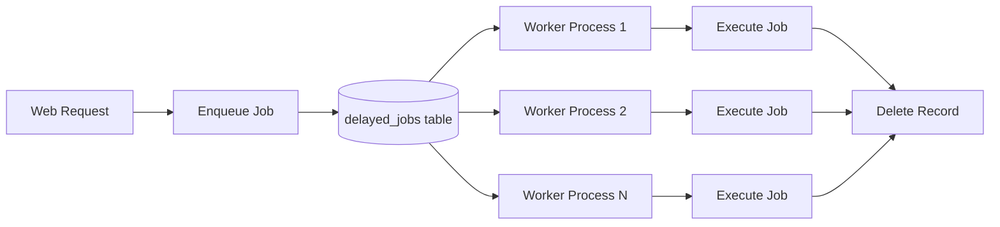

# How to Trace Delayed Job Workers with OpenTelemetry in Ruby

Author: [nawazdhandala](https://www.github.com/nawazdhandala)

Tags: OpenTelemetry, Ruby, Delayed Job, Workers, Background Processing

Description: Complete guide to implementing distributed tracing for Delayed Job background workers using OpenTelemetry in Ruby applications.

Background jobs handle critical work outside the request-response cycle. They send emails, process payments, generate reports, and sync data with external systems. When these jobs fail or run slowly, your application breaks in ways users might not immediately notice. By the time you discover the problem, you have a backlog of failed jobs and angry customers.

Delayed Job is one of Ruby's oldest and simplest background processing libraries. It stores jobs in your database and processes them with worker processes. While newer alternatives like Sidekiq exist, many applications still rely on Delayed Job for its simplicity and reliability. Adding OpenTelemetry tracing to Delayed Job gives you visibility into job execution, helps identify bottlenecks, and connects background work to the requests that triggered it.

## Why Tracing Background Jobs Matters

Background jobs run invisibly. You might queue a job during an HTTP request, but that job executes seconds or minutes later in a separate process. Without tracing, you can't see:

- How long jobs actually take to run
- Which jobs are slow or timing out
- Whether jobs fail silently
- What the job did during execution
- How queued jobs relate to the requests that created them

Traditional logging shows individual job executions in isolation. Distributed tracing connects jobs to their triggering requests and shows the complete story of async work flowing through your system.

## Understanding Delayed Job Architecture

Delayed Job uses your database as a queue. When you enqueue a job, it creates a record in the `delayed_jobs` table. Worker processes poll this table, lock jobs, execute them, and delete completed jobs.



For tracing to work across this boundary, context must be serialized when enqueuing the job and restored when executing it.

## Installing Required Dependencies

Add OpenTelemetry gems alongside Delayed Job:

```ruby
# Gemfile

# Background job processing
gem 'delayed_job'
gem 'delayed_job_active_record'  # or delayed_job_mongoid

# OpenTelemetry core
gem 'opentelemetry-sdk'
gem 'opentelemetry-exporter-otlp'

# Rails instrumentation (if using Rails)
gem 'opentelemetry-instrumentation-rails'
gem 'opentelemetry-instrumentation-active_record'

# Additional instrumentations as needed
gem 'opentelemetry-instrumentation-net-http'
```

Run bundle install:

```bash
bundle install
```

## Basic OpenTelemetry Configuration

Set up OpenTelemetry before your application and workers start:

```ruby
# config/initializers/opentelemetry.rb

require 'opentelemetry/sdk'
require 'opentelemetry/exporter/otlp'

OpenTelemetry::SDK.configure do |c|
  # Service name distinguishes web vs worker processes
  c.service_name = ENV.fetch('OTEL_SERVICE_NAME', 'myapp')

  c.resource = OpenTelemetry::SDK::Resources::Resource.create({
    'service.version' => ENV.fetch('APP_VERSION', 'unknown'),
    'deployment.environment' => ENV.fetch('RAILS_ENV', 'development'),
    # Tag worker processes differently
    'service.type' => ENV.fetch('PROCESS_TYPE', 'web')  # 'web' or 'worker'
  })

  c.add_span_processor(
    OpenTelemetry::SDK::Trace::Export::BatchSpanProcessor.new(
      OpenTelemetry::Exporter::OTLP::Exporter.new(
        endpoint: ENV.fetch('OTEL_EXPORTER_OTLP_ENDPOINT', 'http://localhost:4318/v1/traces')
      )
    )
  )

  # Enable automatic instrumentation
  c.use_all
end
```

## Creating a Delayed Job Plugin for Tracing

Delayed Job supports plugins that hook into the job lifecycle. Create a plugin that handles trace context propagation:

```ruby
# lib/delayed_job_opentelemetry_plugin.rb

require 'delayed_job'
require 'opentelemetry'

module DelayedJobOpenTelemetryPlugin
  class Plugin < Delayed::Plugin
    # Tracer for creating spans
    def self.tracer
      @tracer ||= OpenTelemetry.tracer_provider.tracer('delayed-job', '1.0')
    end

    callbacks do |lifecycle|
      # Before a job is enqueued
      lifecycle.before(:enqueue) do |job|
        # Capture current trace context
        current_context = OpenTelemetry::Context.current
        span = OpenTelemetry::Trace.current_span

        if span && span.context.valid?
          # Serialize trace context into job payload
          job.trace_context = {
            'traceparent' => format_traceparent(span.context),
            'tracestate' => span.context.tracestate.to_s
          }

          # Add event to parent span
          span.add_event('job_enqueued', attributes: {
            'job.class' => job.payload_object.class.name,
            'job.queue' => job.queue || 'default',
            'job.priority' => job.priority
          })
        end
      end

      # When job execution starts
      lifecycle.around(:invoke_job) do |job, *args, &block|
        # Extract trace context from job
        parent_context = extract_context(job)

        # Start a new span as child of the enqueuing span
        tracer.in_span(
          "delayed_job.execute",
          with_parent: parent_context,
          kind: :consumer,
          attributes: {
            'job.id' => job.id,
            'job.class' => job.payload_object.class.name,
            'job.queue' => job.queue || 'default',
            'job.priority' => job.priority,
            'job.attempts' => job.attempts,
            'job.run_at' => job.run_at.to_s,
            'messaging.system' => 'delayed_job',
            'messaging.operation' => 'process'
          }
        ) do |span|
          # Record queue time (how long job waited before execution)
          if job.run_at && job.locked_at
            queue_time_ms = ((job.locked_at - job.run_at) * 1000).round(2)
            span.set_attribute('job.queue_time_ms', queue_time_ms)
          end

          begin
            # Execute the job
            result = block.call(job, *args)

            span.set_attribute('job.success', true)
            span.add_event('job_completed')

            result
          rescue StandardError => e
            # Record failure in span
            span.record_exception(e)
            span.set_attribute('job.success', false)
            span.set_attribute('job.error', e.class.name)

            span.add_event('job_failed', attributes: {
              'error.type' => e.class.name,
              'error.message' => e.message
            })

            # Re-raise so Delayed Job handles retries
            raise
          end
        end
      end

      # When a job fails permanently
      lifecycle.after(:failure) do |_worker, job|
        span = OpenTelemetry::Trace.current_span
        if span && span.recording?
          span.set_attribute('job.max_attempts_reached', true)
          span.add_event('job_permanently_failed', attributes: {
            'job.attempts' => job.attempts,
            'job.last_error' => job.last_error&.truncate(500)
          })
        end
      end
    end

    private

    # Format trace context as W3C traceparent header
    def self.format_traceparent(context)
      version = '00'
      trace_id = context.hex_trace_id
      span_id = context.hex_span_id
      flags = context.trace_flags.sampled? ? '01' : '00'

      "#{version}-#{trace_id}-#{span_id}-#{flags}"
    end

    # Extract OpenTelemetry context from job payload
    def self.extract_context(job)
      trace_context = job.payload_object.instance_variable_get(:@trace_context)
      return OpenTelemetry::Context.empty unless trace_context

      # Parse traceparent header
      traceparent = trace_context['traceparent']
      return OpenTelemetry::Context.empty unless traceparent

      # Extract trace and span IDs
      parts = traceparent.split('-')
      return OpenTelemetry::Context.empty unless parts.length == 4

      trace_id = [parts[1]].pack('H*')
      span_id = [parts[2]].pack('H*')
      trace_flags = OpenTelemetry::Trace::TraceFlags.from_byte(parts[3].to_i(16))

      # Create span context
      span_context = OpenTelemetry::Trace::SpanContext.new(
        trace_id: trace_id,
        span_id: span_id,
        trace_flags: trace_flags,
        tracestate: OpenTelemetry::Trace::Tracestate.from_string(trace_context['tracestate'] || ''),
        remote: true
      )

      # Return context with this span as parent
      OpenTelemetry::Trace.context_with_span(
        OpenTelemetry::Trace.non_recording_span(span_context)
      )
    end
  end
end

# Register the plugin
Delayed::Worker.plugins << DelayedJobOpenTelemetryPlugin::Plugin
```

## Making Jobs Store Trace Context

Delayed Job serializes your job objects. To propagate trace context, add an attribute to store it:

```ruby
# app/jobs/application_job.rb

class ApplicationJob
  # Store trace context as instance variable
  attr_accessor :trace_context

  def initialize(*args)
    # Your job initialization
    @args = args

    # Capture trace context at enqueue time
    @trace_context = nil  # Will be set by plugin
  end
end
```

For jobs that inherit from this base class, trace context is automatically preserved:

```ruby
# app/jobs/send_email_job.rb

class SendEmailJob < ApplicationJob
  def initialize(user_id, template)
    super()
    @user_id = user_id
    @template = template
  end

  def perform
    user = User.find(@user_id)

    # Get tracer for manual instrumentation within the job
    tracer = OpenTelemetry.tracer_provider.tracer('email-sender', '1.0')

    tracer.in_span('send_email') do |span|
      span.set_attribute('user.id', @user_id)
      span.set_attribute('email.template', @template)

      # Send email
      UserMailer.send_template(user, @template).deliver_now

      span.add_event('email_sent', attributes: {
        'email.to' => user.email
      })
    end
  end
end
```

## Enqueuing Jobs with Trace Context

When you enqueue a job from a traced context (like a Rails controller), the trace context automatically propagates:

```ruby
# app/controllers/users_controller.rb

class UsersController < ApplicationController
  def create
    user = User.create!(user_params)

    # The current span's context will be captured and stored in the job
    Delayed::Job.enqueue SendEmailJob.new(user.id, 'welcome')

    # The request span shows the job being enqueued
    # The job span (when executed) shows as a child of this span

    render json: user, status: :created
  end

  private

  def user_params
    params.require(:user).permit(:email, :name)
  end
end
```

The resulting trace shows:

1. HTTP request span (from web server)
2. Controller action span (Rails instrumentation)
3. Job enqueue event (added by plugin)
4. Job execution span (created when worker runs the job)

## Adding Custom Spans Within Jobs

Jobs often perform multiple operations. Add spans to trace each step:

```ruby
# app/jobs/process_order_job.rb

class ProcessOrderJob < ApplicationJob
  def initialize(order_id)
    super()
    @order_id = order_id
  end

  def perform
    tracer = OpenTelemetry.tracer_provider.tracer('order-processor', '1.0')

    # Load order
    order = tracer.in_span('load_order') do |span|
      span.set_attribute('order.id', @order_id)
      Order.find(@order_id)
    end

    # Validate inventory
    tracer.in_span('validate_inventory') do |span|
      span.set_attribute('order.items_count', order.items.count)

      order.items.each do |item|
        available = check_inventory(item.product_id, item.quantity)
        span.set_attribute("inventory.#{item.product_id}.available", available)

        unless available
          raise "Insufficient inventory for product #{item.product_id}"
        end
      end
    end

    # Process payment
    transaction_id = tracer.in_span('process_payment', kind: :client) do |span|
      span.set_attribute('payment.amount', order.total)
      span.set_attribute('payment.currency', order.currency)

      result = charge_payment(order)
      span.set_attribute('payment.transaction_id', result[:transaction_id])

      result[:transaction_id]
    end

    # Ship order
    tracer.in_span('create_shipment', kind: :client) do |span|
      tracking = create_shipment(order)
      span.set_attribute('shipment.tracking_number', tracking)

      order.update!(
        status: 'shipped',
        tracking_number: tracking,
        transaction_id: transaction_id
      )
    end
  end

  private

  def check_inventory(product_id, quantity)
    # Check inventory system
    true
  end

  def charge_payment(order)
    # Call payment processor
    { transaction_id: SecureRandom.uuid, success: true }
  end

  def create_shipment(order)
    # Call shipping API
    "TRACK#{SecureRandom.hex(8).upcase}"
  end
end
```

## Handling Job Failures and Retries

Delayed Job automatically retries failed jobs. Trace each attempt to see patterns in failures:

```ruby
# lib/delayed_job_opentelemetry_plugin.rb (additional callback)

lifecycle.around(:invoke_job) do |job, *args, &block|
  parent_context = extract_context(job)

  tracer.in_span(
    "delayed_job.execute",
    with_parent: parent_context,
    kind: :consumer,
    attributes: {
      'job.id' => job.id,
      'job.class' => job.payload_object.class.name,
      'job.attempts' => job.attempts,  # Current attempt number
      'job.max_attempts' => Delayed::Worker.max_attempts
    }
  ) do |span|
    # Tag retry attempts
    if job.attempts > 0
      span.set_attribute('job.is_retry', true)
      span.add_event('job_retry', attributes: {
        'retry.attempt' => job.attempts,
        'retry.previous_error' => job.last_error&.split("\n")&.first&.truncate(200)
      })
    end

    begin
      block.call(job, *args)
      span.set_attribute('job.success', true)
    rescue StandardError => e
      span.record_exception(e)
      span.set_attribute('job.success', false)

      # Check if this was the final attempt
      if job.attempts >= Delayed::Worker.max_attempts - 1
        span.set_attribute('job.will_retry', false)
        span.add_event('job_max_retries_reached')
      else
        span.set_attribute('job.will_retry', true)
        next_attempt = job.attempts + 1
        span.add_event('job_will_retry', attributes: {
          'retry.next_attempt' => next_attempt,
          'retry.max_attempts' => Delayed::Worker.max_attempts
        })
      end

      raise
    end
  end
end
```

## Tracing Jobs That Make HTTP Calls

When jobs call external APIs, HTTP instrumentation automatically creates child spans:

```ruby
# app/jobs/sync_customer_job.rb

require 'net/http'

class SyncCustomerJob < ApplicationJob
  def initialize(customer_id)
    super()
    @customer_id = customer_id
  end

  def perform
    customer = Customer.find(@customer_id)

    tracer = OpenTelemetry.tracer_provider.tracer('customer-sync', '1.0')

    tracer.in_span('sync_to_crm') do |span|
      span.set_attribute('customer.id', @customer_id)
      span.set_attribute('crm.endpoint', ENV['CRM_API_URL'])

      # Net::HTTP instrumentation automatically creates a child span
      # and propagates trace context to the external service
      uri = URI("#{ENV['CRM_API_URL']}/customers")
      response = Net::HTTP.post(
        uri,
        customer.to_json,
        'Content-Type' => 'application/json'
      )

      span.set_attribute('http.status_code', response.code.to_i)

      if response.is_a?(Net::HTTPSuccess)
        span.add_event('sync_successful')
      else
        span.record_exception(StandardError.new("Sync failed: #{response.code}"))
        raise "CRM sync failed with status #{response.code}"
      end
    end
  end
end
```

## Running Workers with Proper Configuration

Start worker processes with appropriate environment variables:

```bash
# Set process type to distinguish workers from web processes
export PROCESS_TYPE="worker"
export OTEL_SERVICE_NAME="myapp-worker"
export OTEL_EXPORTER_OTLP_ENDPOINT="http://collector:4318/v1/traces"

# Start Delayed Job worker
bundle exec rake jobs:work
```

For multiple workers:

```bash
# Worker 1
PROCESS_TYPE=worker OTEL_SERVICE_NAME=myapp-worker rake jobs:work &

# Worker 2
PROCESS_TYPE=worker OTEL_SERVICE_NAME=myapp-worker rake jobs:work &
```

## Monitoring Worker Performance

With tracing in place, you can analyze worker performance:

**Queue time**: How long jobs wait before execution
**Execution time**: How long jobs take to run
**Error rates**: Which jobs fail most often
**Retry patterns**: How many attempts jobs need to succeed
**External call latency**: Time spent calling APIs

Query your tracing backend to find slow jobs:

```
job.class = "ProcessOrderJob" AND duration > 5000ms
```

Find jobs that always fail:

```
job.success = false AND job.attempts >= max_attempts
```

Identify jobs stuck in retry loops:

```
job.is_retry = true GROUP BY job.class
```

## Graceful Shutdown for Workers

Ensure pending spans are exported before worker processes exit:

```ruby
# config/initializers/opentelemetry.rb

# Register shutdown handler
at_exit do
  puts "Flushing OpenTelemetry spans..."
  OpenTelemetry.tracer_provider.force_flush

  puts "Shutting down OpenTelemetry..."
  OpenTelemetry.tracer_provider.shutdown
end
```

This ensures traces are exported even if the worker process is killed during deployment.

Tracing Delayed Job workers with OpenTelemetry transforms background processing from a black box into a transparent, observable system. You see exactly what your jobs do, how long they take, and how they connect to the requests that triggered them. This visibility is essential for maintaining reliable background processing at scale.
