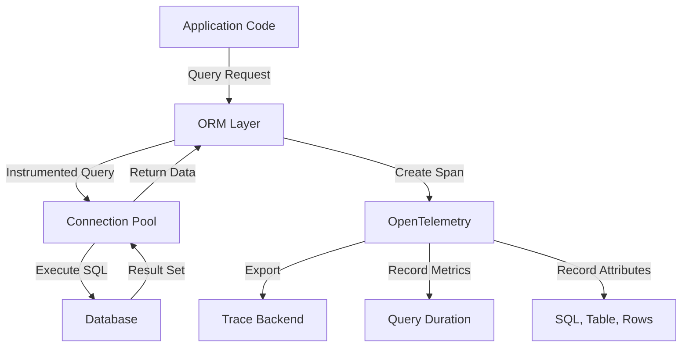

# How to Trace Diesel and SeaORM Queries with OpenTelemetry in Rust

Author: [nawazdhandala](https://www.github.com/nawazdhandala)

Tags: OpenTelemetry, Rust, Diesel, SeaORM, Database, SQL Tracing

Description: Implement comprehensive database query tracing for Diesel and SeaORM applications using OpenTelemetry to monitor query performance and identify bottlenecks.

Database queries often represent the most significant performance bottleneck in applications. Without proper instrumentation, identifying slow queries or inefficient database access patterns becomes guesswork. OpenTelemetry provides standardized tracing for database operations, enabling you to monitor query execution times, detect N+1 problems, and optimize database interactions.

This guide demonstrates how to instrument both Diesel and SeaORM, the two most popular Rust ORMs, with OpenTelemetry to capture detailed query traces including SQL statements, execution times, and connection pool metrics.

## Why Trace Database Queries

Database operations in production systems require visibility for several reasons:

- Identify slow queries consuming excessive resources
- Detect N+1 query patterns that multiply database load
- Monitor connection pool exhaustion and saturation
- Correlate database performance with application latency
- Track query patterns across different code paths
- Measure transaction duration and rollback rates

## Tracing Architecture

Here's how OpenTelemetry integrates with database ORMs:



## Dependencies for Diesel Tracing

Add required crates to `Cargo.toml` for Diesel instrumentation:

```toml
[dependencies]
# Diesel ORM with PostgreSQL backend
diesel = { version = "2.1", features = ["postgres", "r2d2", "chrono"] }
diesel-tracing = "0.2"

# Database connection pool
r2d2 = "0.8"

# OpenTelemetry ecosystem
opentelemetry = "0.22"
opentelemetry_sdk = "0.22"
opentelemetry-otlp = "0.15"

# Tracing integration
tracing = "0.1"
tracing-subscriber = { version = "0.3", features = ["env-filter"] }
tracing-opentelemetry = "0.23"

# Async runtime
tokio = { version = "1.35", features = ["full"] }

# Date/time support
chrono = "0.4"
```

## Initialize OpenTelemetry with Database Attributes

Set up the tracer with semantic conventions for database operations:

```rust
use opentelemetry::{global, trace::TracerProvider as _, KeyValue};
use opentelemetry_otlp::WithExportConfig;
use opentelemetry_sdk::{runtime, trace::TracerProvider, Resource};
use tracing_subscriber::{layer::SubscriberExt, util::SubscriberInitExt, EnvFilter};

fn init_tracer() -> Result<TracerProvider, Box<dyn std::error::Error>> {
    let exporter = opentelemetry_otlp::new_exporter()
        .tonic()
        .with_endpoint("http://localhost:4317");

    let provider = opentelemetry_otlp::new_pipeline()
        .tracing()
        .with_exporter(exporter)
        .with_trace_config(
            opentelemetry_sdk::trace::Config::default()
                .with_resource(Resource::new(vec![
                    KeyValue::new("service.name", "rust-database-service"),
                    KeyValue::new("service.version", "1.0.0"),
                    KeyValue::new("deployment.environment", "production"),
                ]))
        )
        .install_batch(runtime::Tokio)?;

    let telemetry = tracing_opentelemetry::layer()
        .with_tracer(provider.tracer("database-tracer"));

    tracing_subscriber::registry()
        .with(EnvFilter::from_default_env())
        .with(telemetry)
        .with(tracing_subscriber::fmt::layer())
        .init();

    Ok(provider)
}
```

## Instrument Diesel with Connection Pool

Create a connection pool wrapper that traces all database operations:

```rust
use diesel::prelude::*;
use diesel::r2d2::{self, ConnectionManager, Pool, PooledConnection};
use tracing::{info, info_span, instrument};

pub type DbPool = Pool<ConnectionManager<PgConnection>>;
pub type DbConnection = PooledConnection<ConnectionManager<PgConnection>>;

// Initialize a traced connection pool
pub fn create_pool(database_url: &str) -> Result<DbPool, Box<dyn std::error::Error>> {
    let manager = ConnectionManager::<PgConnection>::new(database_url);

    let pool = Pool::builder()
        .max_size(15)
        .min_idle(Some(5))
        .connection_timeout(std::time::Duration::from_secs(10))
        .build(manager)?;

    info!(
        max_size = 15,
        min_idle = 5,
        "Database connection pool initialized"
    );

    Ok(pool)
}

// Wrapper that adds tracing to connection acquisition
#[instrument(skip(pool))]
pub fn get_connection(pool: &DbPool) -> Result<DbConnection, r2d2::Error> {
    let span = info_span!(
        "db.connection.get",
        db.system = "postgresql",
        pool.size = pool.state().connections,
        pool.idle = pool.state().idle_connections
    );

    let _enter = span.enter();
    pool.get()
}
```

## Diesel Schema and Models

Define your database schema with Diesel:

```rust
// schema.rs - generated by diesel CLI
table! {
    users (id) {
        id -> Int4,
        email -> Varchar,
        name -> Varchar,
        created_at -> Timestamp,
        updated_at -> Timestamp,
    }
}

table! {
    posts (id) {
        id -> Int4,
        user_id -> Int4,
        title -> Varchar,
        content -> Text,
        published -> Bool,
        created_at -> Timestamp,
    }
}

joinable!(posts -> users (user_id));
allow_tables_to_appear_in_same_query!(users, posts);
```

Define models with instrumented methods:

```rust
use diesel::prelude::*;
use chrono::NaiveDateTime;
use tracing::{info, instrument};

#[derive(Queryable, Identifiable, Debug)]
#[diesel(table_name = users)]
pub struct User {
    pub id: i32,
    pub email: String,
    pub name: String,
    pub created_at: NaiveDateTime,
    pub updated_at: NaiveDateTime,
}

#[derive(Insertable)]
#[diesel(table_name = users)]
pub struct NewUser<'a> {
    pub email: &'a str,
    pub name: &'a str,
}

impl User {
    // Instrumented query method with detailed span attributes
    #[instrument(skip(conn), fields(db.system = "postgresql", db.operation = "SELECT"))]
    pub fn find_by_id(conn: &mut PgConnection, user_id: i32) -> QueryResult<User> {
        use crate::schema::users::dsl::*;

        info!(user_id = user_id, "Fetching user by ID");

        users
            .find(user_id)
            .first::<User>(conn)
    }

    #[instrument(skip(conn), fields(db.system = "postgresql", db.operation = "SELECT"))]
    pub fn find_by_email(conn: &mut PgConnection, user_email: &str) -> QueryResult<User> {
        use crate::schema::users::dsl::*;

        info!(email = user_email, "Fetching user by email");

        users
            .filter(email.eq(user_email))
            .first::<User>(conn)
    }

    #[instrument(skip(conn), fields(db.system = "postgresql", db.operation = "INSERT"))]
    pub fn create(conn: &mut PgConnection, new_user: NewUser) -> QueryResult<User> {
        use crate::schema::users::dsl::*;

        info!(email = new_user.email, name = new_user.name, "Creating new user");

        diesel::insert_into(users)
            .values(&new_user)
            .get_result(conn)
    }

    #[instrument(skip(conn), fields(db.system = "postgresql", db.operation = "SELECT"))]
    pub fn list_all(conn: &mut PgConnection, limit: i64) -> QueryResult<Vec<User>> {
        use crate::schema::users::dsl::*;

        info!(limit = limit, "Listing all users");

        users
            .limit(limit)
            .load::<User>(conn)
    }
}
```

## Trace Complex Queries and Joins

Instrument queries involving multiple tables:

```rust
#[derive(Queryable, Associations, Debug)]
#[diesel(belongs_to(User))]
#[diesel(table_name = posts)]
pub struct Post {
    pub id: i32,
    pub user_id: i32,
    pub title: String,
    pub content: String,
    pub published: bool,
    pub created_at: NaiveDateTime,
}

impl Post {
    // Trace queries with joins to detect N+1 problems
    #[instrument(
        skip(conn),
        fields(
            db.system = "postgresql",
            db.operation = "SELECT",
            db.sql.table = "posts"
        )
    )]
    pub fn find_with_user(conn: &mut PgConnection, post_id: i32) -> QueryResult<(Post, User)> {
        use crate::schema::{posts, users};

        info!(post_id = post_id, "Fetching post with user");

        posts::table
            .inner_join(users::table)
            .filter(posts::id.eq(post_id))
            .first::<(Post, User)>(conn)
    }

    #[instrument(
        skip(conn),
        fields(
            db.system = "postgresql",
            db.operation = "SELECT",
            query_type = "join"
        )
    )]
    pub fn list_published_with_authors(
        conn: &mut PgConnection,
        limit: i64,
    ) -> QueryResult<Vec<(Post, User)>> {
        use crate::schema::{posts, users};

        info!(limit = limit, "Listing published posts with authors");

        posts::table
            .inner_join(users::table)
            .filter(posts::published.eq(true))
            .order(posts::created_at.desc())
            .limit(limit)
            .load::<(Post, User)>(conn)
    }

    // Demonstrate a potential N+1 query pattern (anti-pattern)
    #[instrument(skip(conn))]
    pub fn list_with_separate_user_queries(
        conn: &mut PgConnection,
        limit: i64,
    ) -> QueryResult<Vec<(Post, User)>> {
        use crate::schema::posts::dsl::*;

        info!(limit = limit, "Listing posts (N+1 pattern)");

        let post_list = posts
            .filter(published.eq(true))
            .limit(limit)
            .load::<Post>(conn)?;

        // This creates N additional queries - visible in traces
        let mut results = Vec::new();
        for post in post_list {
            let user = User::find_by_id(conn, post.user_id)?;
            results.push((post, user));
        }

        Ok(results)
    }
}
```

## SeaORM Dependencies and Setup

For SeaORM instrumentation, add these dependencies:

```toml
[dependencies]
# SeaORM with PostgreSQL and tracing
sea-orm = { version = "0.12", features = ["sqlx-postgres", "runtime-tokio-native-tls", "macros"] }
sea-orm-migration = "0.12"

# OpenTelemetry (same as Diesel example)
opentelemetry = "0.22"
opentelemetry_sdk = "0.22"
opentelemetry-otlp = "0.15"

tracing = "0.1"
tracing-subscriber = { version = "0.3", features = ["env-filter"] }
tracing-opentelemetry = "0.23"

tokio = { version = "1.35", features = ["full"] }
```

## Instrument SeaORM Connection

Create a database connection with automatic tracing:

```rust
use sea_orm::{Database, DatabaseConnection, DbErr, ConnectOptions};
use tracing::{info, instrument};
use std::time::Duration;

#[instrument]
pub async fn create_connection(database_url: &str) -> Result<DatabaseConnection, DbErr> {
    let mut opt = ConnectOptions::new(database_url);

    // Configure connection options
    opt.max_connections(100)
        .min_connections(5)
        .connect_timeout(Duration::from_secs(10))
        .acquire_timeout(Duration::from_secs(10))
        .idle_timeout(Duration::from_secs(600))
        .max_lifetime(Duration::from_secs(3600))
        .sqlx_logging(true)  // Enable SQL logging through tracing
        .sqlx_logging_level(log::LevelFilter::Debug);

    info!(
        max_connections = 100,
        min_connections = 5,
        "Connecting to database"
    );

    let db = Database::connect(opt).await?;

    info!("Database connection established");

    Ok(db)
}
```

## SeaORM Entity Definitions

Define entities with instrumented queries:

```rust
use sea_orm::entity::prelude::*;
use tracing::{info, instrument};

#[derive(Clone, Debug, PartialEq, DeriveEntityModel)]
#[sea_orm(table_name = "users")]
pub struct Model {
    #[sea_orm(primary_key)]
    pub id: i32,
    pub email: String,
    pub name: String,
    pub created_at: DateTime,
    pub updated_at: DateTime,
}

#[derive(Copy, Clone, Debug, EnumIter, DeriveRelation)]
pub enum Relation {
    #[sea_orm(has_many = "super::post::Entity")]
    Posts,
}

impl Related<super::post::Entity> for Entity {
    fn to() -> RelationDef {
        Relation::Posts.def()
    }
}

impl ActiveModelBehavior for ActiveModel {}

// Custom methods with instrumentation
impl Entity {
    #[instrument(
        skip(db),
        fields(
            db.system = "postgresql",
            db.operation = "SELECT",
            db.sql.table = "users"
        )
    )]
    pub async fn find_by_email_traced(
        db: &DatabaseConnection,
        user_email: String,
    ) -> Result<Option<Model>, DbErr> {
        info!(email = %user_email, "Finding user by email");

        Self::find()
            .filter(Column::Email.eq(user_email))
            .one(db)
            .await
    }

    #[instrument(
        skip(db),
        fields(
            db.system = "postgresql",
            db.operation = "SELECT",
            query_type = "paginated"
        )
    )]
    pub async fn list_paginated(
        db: &DatabaseConnection,
        page: u64,
        per_page: u64,
    ) -> Result<Vec<Model>, DbErr> {
        info!(page = page, per_page = per_page, "Listing users with pagination");

        Self::find()
            .paginate(db, per_page)
            .fetch_page(page)
            .await
    }
}
```

## Trace SeaORM Transactions

Implement transaction tracing to monitor atomic operations:

```rust
use sea_orm::{DatabaseConnection, TransactionTrait, DbErr, Set};
use tracing::{info, error, instrument};

#[instrument(
    skip(db),
    fields(
        db.system = "postgresql",
        db.operation = "TRANSACTION"
    )
)]
pub async fn create_user_with_post(
    db: &DatabaseConnection,
    email: String,
    name: String,
    post_title: String,
    post_content: String,
) -> Result<(user::Model, post::Model), DbErr> {
    info!("Starting transaction: create user with post");

    // Begin transaction - automatically traced
    let txn = db.begin().await?;

    // Insert user
    let user = user::ActiveModel {
        email: Set(email),
        name: Set(name),
        created_at: Set(chrono::Utc::now().naive_utc()),
        updated_at: Set(chrono::Utc::now().naive_utc()),
        ..Default::default()
    };

    let user_result = user.insert(&txn).await?;
    info!(user_id = user_result.id, "User created in transaction");

    // Insert post for the user
    let post = post::ActiveModel {
        user_id: Set(user_result.id),
        title: Set(post_title),
        content: Set(post_content),
        published: Set(false),
        created_at: Set(chrono::Utc::now().naive_utc()),
        ..Default::default()
    };

    let post_result = post.insert(&txn).await?;
    info!(post_id = post_result.id, "Post created in transaction");

    // Commit transaction
    txn.commit().await?;
    info!("Transaction committed successfully");

    Ok((user_result, post_result))
}

#[instrument(skip(db))]
pub async fn transaction_with_rollback(
    db: &DatabaseConnection,
) -> Result<(), DbErr> {
    info!("Starting transaction that will rollback");

    let txn = db.begin().await?;

    // Perform some operations
    let user = user::ActiveModel {
        email: Set("test@example.com".to_string()),
        name: Set("Test User".to_string()),
        created_at: Set(chrono::Utc::now().naive_utc()),
        updated_at: Set(chrono::Utc::now().naive_utc()),
        ..Default::default()
    };

    let _result = user.insert(&txn).await?;

    // Simulate error condition
    error!("Simulated error - rolling back transaction");
    txn.rollback().await?;

    info!("Transaction rolled back");

    Ok(())
}
```

## Monitor Query Performance

Create middleware to track query execution metrics:

```rust
use tracing::{info, warn};
use std::time::Instant;

#[instrument(skip(db, query_fn), fields(db.system = "postgresql"))]
pub async fn execute_with_metrics<F, T>(
    db: &DatabaseConnection,
    operation: &str,
    query_fn: F,
) -> Result<T, DbErr>
where
    F: FnOnce(&DatabaseConnection) -> std::pin::Pin<Box<dyn std::future::Future<Output = Result<T, DbErr>>>>,
{
    let start = Instant::now();

    let result = query_fn(db).await;

    let duration = start.elapsed();

    match &result {
        Ok(_) => {
            info!(
                operation = operation,
                duration_ms = duration.as_millis(),
                "Query completed successfully"
            );
        }
        Err(e) => {
            warn!(
                operation = operation,
                duration_ms = duration.as_millis(),
                error = %e,
                "Query failed"
            );
        }
    }

    // Log slow query warning
    if duration.as_millis() > 100 {
        warn!(
            operation = operation,
            duration_ms = duration.as_millis(),
            "Slow query detected"
        );
    }

    result
}
```

## Connection Pool Monitoring

Track connection pool health metrics:

```rust
use sea_orm::DatabaseConnection;
use tracing::{info, warn};
use std::time::Duration;

pub async fn monitor_pool_health(db: &DatabaseConnection) {
    tokio::spawn({
        let db = db.clone();
        async move {
            let mut interval = tokio::time::interval(Duration::from_secs(30));

            loop {
                interval.tick().await;

                // SeaORM exposes pool metrics through the underlying SQLx pool
                info!(
                    "Connection pool health check",
                );

                // You can implement custom health checks here
                match db.ping().await {
                    Ok(_) => info!("Database ping successful"),
                    Err(e) => warn!(error = %e, "Database ping failed"),
                }
            }
        }
    });
}
```

## Production Best Practices

When tracing database queries in production:

**Sensitive Data**: Never log actual query parameter values that contain PII or sensitive information. Use placeholders or sanitize data before recording in spans.

**Performance Impact**: Query tracing adds minimal overhead, but avoid logging large result sets. Record row counts instead of full data.

**Sampling**: For high-traffic applications, implement trace sampling to reduce storage costs while maintaining visibility into query patterns.

**Index Monitoring**: Use traced query patterns to identify missing database indexes. Slow queries appearing frequently in traces indicate optimization opportunities.

**Connection Pool Sizing**: Monitor pool exhaustion patterns in traces to optimize connection pool size based on actual usage.

Tracing database queries with OpenTelemetry transforms database performance from a black box into a well-understood system component. Whether using Diesel or SeaORM, proper instrumentation reveals query patterns, identifies optimization opportunities, and correlates database performance with overall application behavior.
