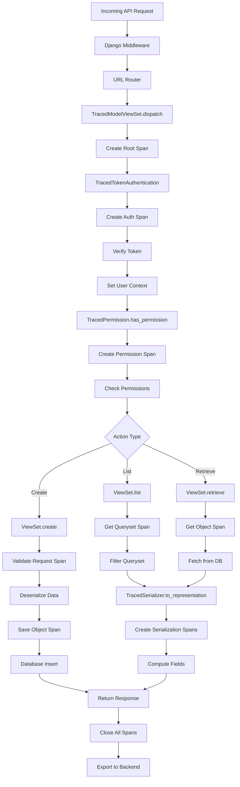

# How to Trace Django REST Framework API Endpoints with OpenTelemetry

Author: [nawazdhandala](https://www.github.com/nawazdhandala)

Tags: OpenTelemetry, Django REST Framework, API, Python, Tracing

Description: Learn how to instrument Django REST Framework APIs with OpenTelemetry to trace requests, monitor serializer performance, track authentication, and capture detailed API metrics.

Django REST Framework (DRF) is the most popular framework for building RESTful APIs in Python. Adding OpenTelemetry instrumentation to your DRF endpoints provides deep visibility into API performance, serialization overhead, authentication timing, permission checks, and business logic execution.

## Understanding DRF Request Lifecycle

Before instrumenting your API, understanding the DRF request flow helps identify what to measure:

1. Request reaches Django and passes through middleware
2. URL routing matches request to a viewset or APIView
3. Authentication classes verify the request
4. Throttling/rate limiting checks are performed
5. Permission classes authorize the action
6. Parser classes deserialize request data
7. View method executes business logic
8. Serializer transforms output data
9. Renderer classes format the response
10. Response travels back through middleware

Each of these stages can be instrumented to provide granular performance data.

## Installing Required Packages

Install OpenTelemetry alongside Django REST Framework:

```bash
pip install djangorestframework
pip install opentelemetry-api opentelemetry-sdk opentelemetry-exporter-otlp
pip install opentelemetry-instrumentation-django
```

If you haven't already set up the OpenTelemetry SDK, initialize it in your Django project:

```python
# myproject/telemetry.py

from opentelemetry import trace
from opentelemetry.sdk.trace import TracerProvider
from opentelemetry.sdk.trace.export import BatchSpanProcessor
from opentelemetry.exporter.otlp.proto.http.trace_exporter import OTLPSpanExporter
from opentelemetry.sdk.resources import Resource

def initialize_telemetry():
    resource = Resource.create({
        "service.name": "drf-api",
        "service.version": "2.0.0",
    })

    provider = TracerProvider(resource=resource)

    otlp_exporter = OTLPSpanExporter(
        endpoint="https://oneuptime.com/otlp/v1/traces",
        headers={"x-oneuptime-service-token": "your-token"}
    )

    provider.add_span_processor(BatchSpanProcessor(otlp_exporter))
    trace.set_tracer_provider(provider)

initialize_telemetry()
```

## Instrumenting APIView Classes

Create a base APIView class that adds tracing to all your API endpoints:

```python
# myapp/views/base.py

from rest_framework.views import APIView
from rest_framework.response import Response
from opentelemetry import trace
from opentelemetry.trace import SpanKind, Status, StatusCode
import time

class TracedAPIView(APIView):
    """Base APIView with OpenTelemetry instrumentation."""

    tracer = trace.get_tracer(__name__)

    def dispatch(self, request, *args, **kwargs):
        """Override dispatch to add tracing around the entire request lifecycle."""

        # Create a span for the API endpoint
        operation_name = f"{self.__class__.__name__}.{request.method.lower()}"

        with self.tracer.start_as_current_span(
            operation_name,
            kind=SpanKind.SERVER
        ) as span:
            # Add API-specific attributes
            span.set_attribute("api.endpoint", request.path)
            span.set_attribute("api.method", request.method)
            span.set_attribute("api.version", self.get_api_version(request))

            # Add query parameters (be careful with sensitive data)
            if request.query_params:
                span.set_attribute("api.query_param_count", len(request.query_params))
                # Only log non-sensitive query params
                safe_params = self.get_safe_query_params(request.query_params)
                for key, value in safe_params.items():
                    span.set_attribute(f"api.query.{key}", str(value))

            start_time = time.time()

            try:
                # Trace authentication
                with self.tracer.start_as_current_span("authenticate") as auth_span:
                    self.initial(request, *args, **kwargs)

                    if hasattr(request, 'user') and request.user.is_authenticated:
                        auth_span.set_attribute("auth.user_id", str(request.user.id))
                        span.set_attribute("user.id", str(request.user.id))

                # Execute the actual handler method (get, post, put, etc.)
                response = super().dispatch(request, *args, **kwargs)

                # Add response attributes
                span.set_attribute("http.status_code", response.status_code)

                if hasattr(response, 'data'):
                    # Measure response payload size
                    import json
                    response_size = len(json.dumps(response.data))
                    span.set_attribute("api.response.size_bytes", response_size)

                # Set span status based on response
                if 200 <= response.status_code < 400:
                    span.set_status(Status(StatusCode.OK))
                else:
                    span.set_status(Status(StatusCode.ERROR))

                return response

            except Exception as exc:
                span.record_exception(exc)
                span.set_status(Status(StatusCode.ERROR, str(exc)))
                raise

            finally:
                # Record total duration
                duration = (time.time() - start_time) * 1000
                span.set_attribute("api.duration_ms", duration)

    def get_api_version(self, request):
        """Extract API version from header or URL."""
        return request.headers.get("Accept-Version", "v1")

    def get_safe_query_params(self, params):
        """Filter out sensitive query parameters."""
        sensitive_keys = {'password', 'token', 'api_key', 'secret'}
        return {k: v for k, v in params.items() if k.lower() not in sensitive_keys}
```

Use this base class for your API views:

```python
# myapp/views/users.py

from myapp.views.base import TracedAPIView
from rest_framework.response import Response
from myapp.models import User
from myapp.serializers import UserSerializer

class UserListView(TracedAPIView):
    """API endpoint for listing users."""

    def get(self, request):
        users = User.objects.all()
        serializer = UserSerializer(users, many=True)
        return Response(serializer.data)
```

## Instrumenting ViewSets

ViewSets are the most common DRF pattern. Here's how to add tracing:

```python
# myapp/viewsets/base.py

from rest_framework import viewsets
from opentelemetry import trace
import time

class TracedModelViewSet(viewsets.ModelViewSet):
    """ModelViewSet with OpenTelemetry instrumentation."""

    tracer = trace.get_tracer(__name__)

    def dispatch(self, request, *args, **kwargs):
        """Add tracing to the entire request."""
        # Determine action name (list, retrieve, create, update, destroy)
        action = self.action or 'unknown'
        operation_name = f"{self.__class__.__name__}.{action}"

        with self.tracer.start_as_current_span(operation_name) as span:
            span.set_attribute("api.viewset", self.__class__.__name__)
            span.set_attribute("api.action", action)
            span.set_attribute("api.method", request.method)

            return super().dispatch(request, *args, **kwargs)

    def list(self, request, *args, **kwargs):
        """Trace list action with query details."""
        span = trace.get_current_span()

        # Trace queryset evaluation
        with self.tracer.start_as_current_span("get_queryset"):
            queryset = self.filter_queryset(self.get_queryset())

        # Add pagination info
        page = self.paginate_queryset(queryset)
        if page is not None:
            span.set_attribute("api.pagination.enabled", True)
            span.set_attribute("api.pagination.page_size", len(page))

        # Trace serialization
        with self.tracer.start_as_current_span("serialize_response") as ser_span:
            start = time.time()
            serializer = self.get_serializer(page or queryset, many=True)
            data = serializer.data
            ser_span.set_attribute("serializer.duration_ms", (time.time() - start) * 1000)
            ser_span.set_attribute("serializer.object_count", len(data))

        span.set_attribute("api.result_count", len(data))

        if page is not None:
            return self.get_paginated_response(data)

        return Response(data)

    def retrieve(self, request, *args, **kwargs):
        """Trace retrieve action with object details."""
        span = trace.get_current_span()

        # Add resource identifier
        pk = kwargs.get('pk')
        span.set_attribute("api.resource.id", str(pk))

        with self.tracer.start_as_current_span("get_object"):
            instance = self.get_object()

        span.set_attribute("api.resource.type", instance.__class__.__name__)

        with self.tracer.start_as_current_span("serialize_response"):
            serializer = self.get_serializer(instance)
            data = serializer.data

        return Response(data)

    def create(self, request, *args, **kwargs):
        """Trace create action with validation details."""
        span = trace.get_current_span()

        # Trace request validation
        with self.tracer.start_as_current_span("validate_request") as val_span:
            serializer = self.get_serializer(data=request.data)
            is_valid = serializer.is_valid(raise_exception=False)

            val_span.set_attribute("validation.is_valid", is_valid)

            if not is_valid:
                val_span.set_attribute("validation.errors", str(serializer.errors))
                serializer.is_valid(raise_exception=True)  # Raise the exception

        # Trace object creation
        with self.tracer.start_as_current_span("save_object"):
            self.perform_create(serializer)

        span.set_attribute("api.resource.created_id", str(serializer.instance.pk))

        headers = self.get_success_headers(serializer.data)
        return Response(serializer.data, status=201, headers=headers)
```

## Tracing Serializer Performance

Serializers can be a performance bottleneck. Instrument them to measure serialization time:

```python
# myapp/serializers/base.py

from rest_framework import serializers
from opentelemetry import trace
import time

class TracedSerializer(serializers.ModelSerializer):
    """Base serializer with OpenTelemetry instrumentation."""

    tracer = trace.get_tracer(__name__)

    def to_representation(self, instance):
        """Add tracing to serialization."""
        span = trace.get_current_span()

        with self.tracer.start_as_current_span(
            f"{self.__class__.__name__}.to_representation"
        ) as ser_span:
            ser_span.set_attribute("serializer.class", self.__class__.__name__)
            ser_span.set_attribute("serializer.model", instance.__class__.__name__)

            start = time.time()
            result = super().to_representation(instance)
            duration = (time.time() - start) * 1000

            ser_span.set_attribute("serializer.duration_ms", duration)
            ser_span.set_attribute("serializer.field_count", len(result))

            return result

    def to_internal_value(self, data):
        """Add tracing to deserialization."""
        with self.tracer.start_as_current_span(
            f"{self.__class__.__name__}.to_internal_value"
        ) as deser_span:
            deser_span.set_attribute("serializer.class", self.__class__.__name__)

            start = time.time()
            result = super().to_internal_value(data)
            duration = (time.time() - start) * 1000

            deser_span.set_attribute("deserializer.duration_ms", duration)

            return result


# Example usage
class UserSerializer(TracedSerializer):
    class Meta:
        model = User
        fields = ['id', 'username', 'email', 'created_at']
```

## Instrumenting Custom Serializer Fields

For expensive field computations, add specific instrumentation:

```python
# myapp/serializers/fields.py

from rest_framework import serializers
from opentelemetry import trace
import time

class TracedSerializerMethodField(serializers.SerializerMethodField):
    """SerializerMethodField with tracing."""

    tracer = trace.get_tracer(__name__)

    def to_representation(self, value):
        """Trace method field computation."""
        method_name = self.method_name or f'get_{self.field_name}'

        with self.tracer.start_as_current_span(
            f"compute_field.{method_name}"
        ) as span:
            span.set_attribute("field.name", self.field_name)
            span.set_attribute("field.method", method_name)

            start = time.time()
            result = super().to_representation(value)
            duration = (time.time() - start) * 1000

            span.set_attribute("field.duration_ms", duration)

            # Track if this field is slow
            if duration > 100:  # 100ms threshold
                span.set_attribute("field.slow", True)

            return result


# Example usage
class OrderSerializer(serializers.ModelSerializer):
    # This field makes an expensive computation
    total_price = TracedSerializerMethodField()

    def get_total_price(self, obj):
        # Calculate total from related items
        return sum(item.price * item.quantity for item in obj.items.all())

    class Meta:
        model = Order
        fields = ['id', 'customer', 'total_price', 'created_at']
```

## Tracing Authentication and Permissions

Authentication and permission checks are critical for API security. Instrument them:

```python
# myapp/authentication.py

from rest_framework.authentication import TokenAuthentication
from opentelemetry import trace
import time

class TracedTokenAuthentication(TokenAuthentication):
    """Token authentication with tracing."""

    tracer = trace.get_tracer(__name__)

    def authenticate(self, request):
        """Trace authentication process."""
        with self.tracer.start_as_current_span("authenticate.token") as span:
            span.set_attribute("auth.type", "token")

            start = time.time()

            try:
                result = super().authenticate(request)

                duration = (time.time() - start) * 1000
                span.set_attribute("auth.duration_ms", duration)

                if result:
                    user, token = result
                    span.set_attribute("auth.success", True)
                    span.set_attribute("auth.user_id", str(user.id))
                else:
                    span.set_attribute("auth.success", False)

                return result

            except Exception as exc:
                span.record_exception(exc)
                span.set_attribute("auth.success", False)
                span.set_attribute("auth.error", str(exc))
                raise
```

For permissions:

```python
# myapp/permissions.py

from rest_framework.permissions import BasePermission
from opentelemetry import trace

class TracedPermission(BasePermission):
    """Base permission class with tracing."""

    tracer = trace.get_tracer(__name__)

    def has_permission(self, request, view):
        """Trace permission check."""
        with self.tracer.start_as_current_span(
            f"permission.{self.__class__.__name__}"
        ) as span:
            span.set_attribute("permission.class", self.__class__.__name__)
            span.set_attribute("permission.type", "view")

            result = self._check_permission(request, view)

            span.set_attribute("permission.granted", result)

            return result

    def has_object_permission(self, request, view, obj):
        """Trace object-level permission check."""
        with self.tracer.start_as_current_span(
            f"permission.{self.__class__.__name__}.object"
        ) as span:
            span.set_attribute("permission.class", self.__class__.__name__)
            span.set_attribute("permission.type", "object")
            span.set_attribute("permission.object_type", obj.__class__.__name__)
            span.set_attribute("permission.object_id", str(obj.pk))

            result = self._check_object_permission(request, view, obj)

            span.set_attribute("permission.granted", result)

            return result

    def _check_permission(self, request, view):
        """Override this in subclasses."""
        return True

    def _check_object_permission(self, request, view, obj):
        """Override this in subclasses."""
        return True


# Example custom permission
class IsOwnerPermission(TracedPermission):
    """Check if user owns the object."""

    def _check_object_permission(self, request, view, obj):
        return obj.owner == request.user
```

## API Request Flow Visualization

Here's how a traced DRF request flows through the system:



## Tracing Pagination Performance

Large result sets benefit from pagination tracing:

```python
# myapp/pagination.py

from rest_framework.pagination import PageNumberPagination
from opentelemetry import trace
import time

class TracedPageNumberPagination(PageNumberPagination):
    """Pagination with performance tracing."""

    tracer = trace.get_tracer(__name__)
    page_size = 50

    def paginate_queryset(self, queryset, request, view=None):
        """Trace pagination logic."""
        span = trace.get_current_span()

        with self.tracer.start_as_current_span("paginate_queryset") as page_span:
            start = time.time()

            # Get total count (can be expensive)
            with self.tracer.start_as_current_span("count_queryset"):
                count = queryset.count()

            page_span.set_attribute("pagination.total_count", count)
            page_span.set_attribute("pagination.page_size", self.page_size)

            # Calculate page count
            page_count = (count + self.page_size - 1) // self.page_size
            page_span.set_attribute("pagination.page_count", page_count)

            result = super().paginate_queryset(queryset, request, view)

            duration = (time.time() - start) * 1000
            page_span.set_attribute("pagination.duration_ms", duration)

            # Add to parent span
            span.set_attribute("api.pagination.enabled", True)
            span.set_attribute("api.pagination.total_count", count)

            return result
```

## Filtering and Search Performance

Track filter and search operations:

```python
# myapp/filters.py

from django_filters import FilterSet
from opentelemetry import trace
import time

class TracedFilterSet(FilterSet):
    """FilterSet with tracing."""

    tracer = trace.get_tracer(__name__)

    @classmethod
    def filter_queryset(cls, request, queryset, view):
        """Trace filter application."""
        with cls.tracer.start_as_current_span("apply_filters") as span:
            span.set_attribute("filter.class", cls.__name__)

            # Get filter parameters from request
            filter_params = {k: v for k, v in request.query_params.items()
                           if k in cls.get_filters().keys()}

            span.set_attribute("filter.param_count", len(filter_params))
            span.set_attribute("filter.params", str(filter_params))

            start = time.time()
            filtered = super().filter_queryset(request, queryset, view)
            duration = (time.time() - start) * 1000

            span.set_attribute("filter.duration_ms", duration)

            # Count results (be careful, this evaluates the query)
            # Only do this if you're already counting for pagination
            if hasattr(view, 'paginator_class'):
                count = filtered.count()
                span.set_attribute("filter.result_count", count)

            return filtered
```

## Adding Business Metrics

Track API-specific business metrics:

```python
# myapp/viewsets/orders.py

from myapp.viewsets.base import TracedModelViewSet
from opentelemetry import trace, metrics

class OrderViewSet(TracedModelViewSet):
    """Order API with business metrics."""

    meter = metrics.get_meter(__name__)

    # Define metrics
    order_counter = meter.create_counter(
        name="api.orders.created",
        description="Number of orders created",
        unit="1"
    )

    order_value = meter.create_histogram(
        name="api.orders.value",
        description="Order value distribution",
        unit="USD"
    )

    def create(self, request, *args, **kwargs):
        """Create order with business metrics."""
        response = super().create(request, *args, **kwargs)

        if response.status_code == 201:
            # Record business metrics
            order = self.get_queryset().get(pk=response.data['id'])

            attributes = {
                "customer.tier": order.customer.tier,
                "order.currency": order.currency,
            }

            self.order_counter.add(1, attributes)
            self.order_value.record(float(order.total), attributes)

            # Add to span
            span = trace.get_current_span()
            span.set_attribute("order.total", float(order.total))
            span.set_attribute("order.item_count", order.items.count())

        return response
```

## Error Response Instrumentation

Track API errors systematically:

```python
# myapp/exceptions.py

from rest_framework.views import exception_handler
from opentelemetry import trace
from opentelemetry.trace import Status, StatusCode

def traced_exception_handler(exc, context):
    """Custom exception handler with tracing."""
    span = trace.get_current_span()

    # Record exception in span
    span.record_exception(exc)

    # Add error context
    span.set_attribute("error.type", exc.__class__.__name__)
    span.set_attribute("error.message", str(exc))

    # Add request context
    request = context.get('request')
    if request:
        span.set_attribute("error.request.path", request.path)
        span.set_attribute("error.request.method", request.method)

    # Get default error response
    response = exception_handler(exc, context)

    if response is not None:
        span.set_attribute("error.status_code", response.status_code)
        span.set_status(Status(StatusCode.ERROR, str(exc)))

    return response


# Configure in settings.py
REST_FRAMEWORK = {
    'EXCEPTION_HANDLER': 'myapp.exceptions.traced_exception_handler',
}
```

## Next Steps

With comprehensive DRF instrumentation, you can:

- Identify slow API endpoints and optimize them
- Monitor serialization overhead for large payloads
- Track authentication and permission check performance
- Analyze pagination and filtering efficiency

For database-specific optimizations, check out our guide on [monitoring Django database queries with OpenTelemetry](https://oneuptime.com/blog/post/2026-02-06-monitor-django-database-queries-opentelemetry/view).

Tracing your Django REST Framework APIs gives you complete visibility into API performance, from the HTTP request through serialization to database queries. This level of observability helps you build faster, more reliable APIs that scale with your application's needs.
