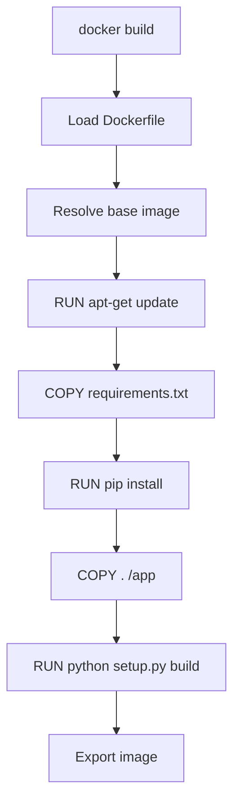

# How to Trace Docker Build Performance with OpenTelemetry

Author: [nawazdhandala](https://www.github.com/nawazdhandala)

Tags: OpenTelemetry, Docker, Build Performance, Tracing, Containers, DevOps

Description: Learn how to trace Docker image build performance with OpenTelemetry to identify slow layers, optimize caching, and reduce build times in your CI/CD pipeline.

---

Docker builds are one of those things that start fast and gradually get slower as projects grow. A Dockerfile that built in 30 seconds a year ago might take five minutes today, and nobody can pinpoint exactly why. Is it the dependency installation layer? The compilation step? Cache invalidation? Without structured observability, you are left staring at build output and guessing.

OpenTelemetry can bring the same tracing discipline to Docker builds that you apply to production services. By instrumenting the build process, you can see exactly how long each layer takes, whether cache is being used effectively, and how build times trend over time. This guide covers multiple approaches to achieving Docker build observability, from BuildKit's native OTLP support to wrapper scripts for more control.

## Why Trace Docker Builds?

Docker builds involve a sequence of layers, each defined by a Dockerfile instruction. The build engine (BuildKit in modern Docker) determines which layers can be cached and which need to be rebuilt. When builds are slow, the root cause is usually one of:

- A frequently invalidated cache layer that forces downstream rebuilds
- A slow package installation step (apt-get, pip install, npm install)
- Large COPY or ADD operations that transfer significant data
- Multi-stage build steps that duplicate work unnecessarily

Without tracing, you see total build time and log output. With tracing, you see a span for each layer with its duration, cache hit/miss status, and the specific instruction that produced it.

## BuildKit Native OpenTelemetry Support

Docker BuildKit has built-in support for exporting OpenTelemetry traces. This is the simplest path if you are using a recent version of Docker (23.0 or later).

To enable it, set the `OTEL_EXPORTER_OTLP_ENDPOINT` environment variable before running your build:

```bash
# Enable BuildKit OTLP export by setting the standard OTel environment variables
export DOCKER_BUILDKIT=1
export OTEL_EXPORTER_OTLP_ENDPOINT="http://localhost:4317"
export OTEL_EXPORTER_OTLP_PROTOCOL="grpc"

# Run the build as usual; BuildKit will emit spans automatically
docker build -t myapp:latest .
```

BuildKit creates spans for each build step, including internal operations like resolving base images and transferring context. The spans include attributes for the Dockerfile instruction, layer digest, and cache status.



## Collector Configuration for BuildKit Traces

Set up a Collector on the same machine where builds run to receive the BuildKit spans:

```yaml
# otel-collector-config.yaml
# Collector config for receiving Docker BuildKit traces

receivers:
  otlp:
    protocols:
      grpc:
        # BuildKit exports spans over gRPC
        endpoint: 0.0.0.0:4317

processors:
  batch:
    timeout: 5s

  resource:
    attributes:
      # Tag all build traces with a service name for easy filtering
      - key: service.name
        value: "docker-build"
        action: upsert

  # Filter out internal BuildKit spans that add noise
  filter:
    spans:
      exclude:
        match_type: regexp
        attributes:
          - key: "name"
            value: "^moby\\.buildkit\\.v1\\.frontend\\."

exporters:
  otlp:
    endpoint: your-backend:4317

service:
  pipelines:
    traces:
      receivers: [otlp]
      processors: [resource, filter, batch]
      exporters: [otlp]
```

The filter processor removes some of the internal BuildKit spans that are typically not useful for build performance analysis. You can adjust or remove this filter if you want full visibility into BuildKit internals.

## Custom Build Instrumentation Script

For more control over what gets traced and what attributes are recorded, you can wrap the Docker build with a Python script that creates OpenTelemetry spans around each build stage:

```python
# trace_docker_build.py
# Custom Docker build tracer that provides detailed layer-level spans

import subprocess
import re
import time
import sys
import os

from opentelemetry import trace
from opentelemetry.sdk.trace import TracerProvider
from opentelemetry.sdk.trace.export import BatchSpanProcessor
from opentelemetry.exporter.otlp.proto.grpc.trace_exporter import OTLPSpanExporter
from opentelemetry.sdk.resources import Resource
from opentelemetry.trace.status import Status, StatusCode


def setup_tracing():
    """Initialize the OpenTelemetry tracer."""
    resource = Resource.create({
        "service.name": "docker-build",
        "service.version": "1.0.0",
    })
    provider = TracerProvider(resource=resource)
    provider.add_span_processor(BatchSpanProcessor(OTLPSpanExporter()))
    trace.set_tracer_provider(provider)
    return trace.get_tracer("docker.build")


def parse_dockerfile(dockerfile_path):
    """Parse a Dockerfile and return a list of instruction stages."""
    stages = []
    with open(dockerfile_path, "r") as f:
        for line_num, line in enumerate(f, 1):
            stripped = line.strip()
            # Skip comments and empty lines
            if not stripped or stripped.startswith("#"):
                continue
            # Extract the instruction keyword
            parts = stripped.split(None, 1)
            if parts:
                instruction = parts[0].upper()
                args = parts[1] if len(parts) > 1 else ""
                stages.append({
                    "instruction": instruction,
                    "args": args,
                    "line": line_num,
                })
    return stages


def run_build_with_progress(image_tag, dockerfile_path, context_path, tracer):
    """Run docker build and create spans from build progress output."""
    with tracer.start_as_current_span("docker-build") as root_span:
        root_span.set_attribute("docker.image.tag", image_tag)
        root_span.set_attribute("docker.dockerfile", dockerfile_path)
        root_span.set_attribute("docker.context", context_path)

        # Parse the Dockerfile to get instruction details
        stages = parse_dockerfile(dockerfile_path)
        root_span.set_attribute("docker.total_instructions", len(stages))

        # Run the build with progress output
        build_start = time.time()
        cmd = [
            "docker", "build",
            "--progress=plain",
            "--no-cache" if os.environ.get("NO_CACHE") else "",
            "-t", image_tag,
            "-f", dockerfile_path,
            context_path,
        ]
        # Remove empty strings from command
        cmd = [c for c in cmd if c]

        process = subprocess.Popen(
            cmd,
            stdout=subprocess.PIPE,
            stderr=subprocess.STDOUT,
            text=True,
        )

        current_step_span = None
        step_pattern = re.compile(r"#\d+ \[.*\] (FROM|RUN|COPY|ADD|WORKDIR|ENV|EXPOSE|CMD|ENTRYPOINT)")

        for line in process.stdout:
            line = line.strip()

            # Detect new build step from progress output
            match = step_pattern.search(line)
            if match:
                # Close the previous step span
                if current_step_span:
                    current_step_span.end()

                # Start a new span for this step
                instruction = match.group(1)
                current_step_span = tracer.start_span(
                    name=f"layer: {instruction}",
                    attributes={
                        "docker.instruction": instruction,
                        "docker.step.output": line[:500],
                    },
                )

            # Check for CACHED indicator
            if "CACHED" in line and current_step_span:
                current_step_span.set_attribute("docker.cache.hit", True)

        # Close the last step span
        if current_step_span:
            current_step_span.end()

        # Wait for the build to complete
        return_code = process.wait()
        build_duration = time.time() - build_start

        root_span.set_attribute("docker.build.duration_seconds", build_duration)
        root_span.set_attribute("docker.build.exit_code", return_code)

        if return_code == 0:
            root_span.set_status(Status(StatusCode.OK))
        else:
            root_span.set_status(Status(StatusCode.ERROR, f"Build failed with exit code {return_code}"))

        return return_code


if __name__ == "__main__":
    tracer = setup_tracing()

    # Parse command-line arguments
    image_tag = sys.argv[1] if len(sys.argv) > 1 else "myapp:latest"
    dockerfile = sys.argv[2] if len(sys.argv) > 2 else "Dockerfile"
    context = sys.argv[3] if len(sys.argv) > 3 else "."

    exit_code = run_build_with_progress(image_tag, dockerfile, context, tracer)

    # Flush all spans before exiting
    trace.get_tracer_provider().force_flush()

    sys.exit(exit_code)
```

This script parses the `--progress=plain` output from Docker to identify when each build step starts. It creates a span for each step and tags cached layers accordingly. You run it in place of `docker build`:

```bash
# Use the wrapper script instead of docker build directly
python trace_docker_build.py myapp:latest Dockerfile .
```

## Tracking Build Metrics Over Time

Beyond individual build traces, you want aggregate metrics to track build performance trends. Add a metrics recording layer to your build instrumentation:

```python
# build_metrics.py
# Records Docker build metrics for trend analysis

from opentelemetry import metrics
from opentelemetry.sdk.metrics import MeterProvider
from opentelemetry.sdk.metrics.export import PeriodicExportingMetricReader
from opentelemetry.exporter.otlp.proto.grpc.metric_exporter import OTLPMetricExporter

# Set up the meter
reader = PeriodicExportingMetricReader(OTLPMetricExporter())
provider = MeterProvider(metric_readers=[reader])
metrics.set_meter_provider(provider)
meter = metrics.get_meter("docker.build")

# Histogram for total build duration
build_duration = meter.create_histogram(
    name="docker.build.duration",
    description="Total Docker image build duration",
    unit="s",
)

# Counter for build attempts and successes
build_total = meter.create_counter(
    name="docker.build.total",
    description="Total number of Docker builds",
    unit="1",
)

# Histogram for image size
image_size = meter.create_histogram(
    name="docker.image.size",
    description="Size of built Docker image",
    unit="By",
)


def record_build_metrics(duration_seconds, success, tag, size_bytes=None):
    """Record metrics for a completed Docker build."""
    attrs = {
        "docker.image.tag": tag,
        "docker.build.success": success,
    }

    # Record the build duration
    build_duration.record(duration_seconds, attrs)

    # Increment the build counter
    build_total.add(1, attrs)

    # Record image size if available
    if size_bytes:
        image_size.record(size_bytes, {"docker.image.tag": tag})

    # Flush metrics
    metrics.get_meter_provider().force_flush()
```

Call `record_build_metrics()` after each build to capture the duration and outcome. Over time, this lets you build dashboards showing how build duration trends by image tag, and whether cache hit rates are improving or degrading.

## Optimizing Based on Trace Data

Once you have traces flowing, here are the patterns to look for:

**Cache invalidation chains**: If a COPY instruction early in the Dockerfile frequently busts the cache, everything after it rebuilds too. Traces make this visible by showing a string of non-cached layers. The fix is to reorder your Dockerfile so that frequently changing files are copied later.

**Slow dependency installs**: If `RUN pip install` or `RUN npm install` consistently takes 60+ seconds, consider using a dependency caching strategy or a pre-built base image with dependencies baked in.

**Large context transfers**: If the build context transfer shows up as a significant span, your `.dockerignore` file might be missing entries. Add `node_modules`, `.git`, and other large directories to `.dockerignore`.

**Multi-stage build overhead**: If you see duplicate work across build stages, consider restructuring your multi-stage build to share intermediate layers.

## Integration with CI Pipelines

Combine Docker build tracing with your CI pipeline tracing (covered in a companion post) to see the full picture. The Docker build span becomes a child of the CI pipeline span, so you can see how much of your total pipeline time is spent building images:

```bash
# In your CI pipeline, set the traceparent before building
# This links the Docker build trace to the parent pipeline trace
export TRACEPARENT="00-${TRACE_ID}-${SPAN_ID}-01"

# Run the instrumented build
python trace_docker_build.py myapp:${GITHUB_SHA} Dockerfile .
```

## Wrapping Up

Docker build performance is one of those areas where small inefficiencies compound into real productivity loss over time. By tracing builds with OpenTelemetry, you get the data you need to make targeted optimizations instead of guessing. Whether you use BuildKit's native OTLP support or a custom wrapper script, the result is the same: clear visibility into what each layer costs, whether caching is working, and how build times are trending. Once you have this data, cutting build times in half is often just a matter of reordering a few Dockerfile instructions or fixing a cache invalidation issue that traces make obvious.
