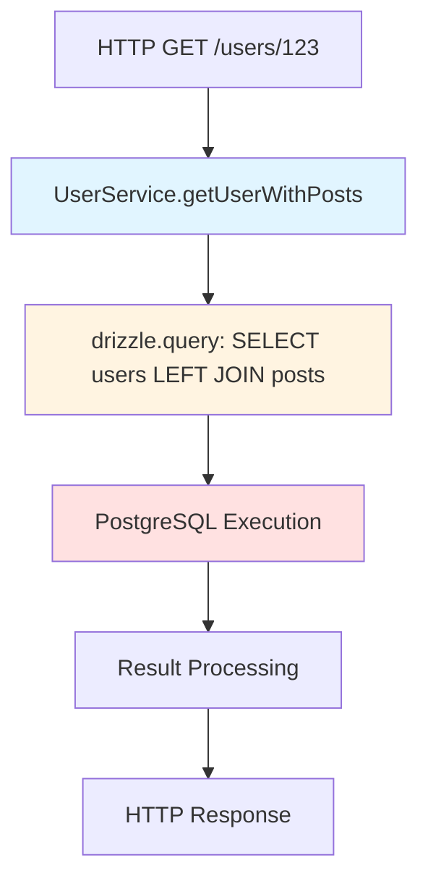

# How to Trace Drizzle ORM Queries with OpenTelemetry in Node.js

Author: [nawazdhandala](https://www.github.com/nawazdhandala)

Tags: OpenTelemetry, Drizzle ORM, Node.js, Database, SQL, Tracing

Description: Comprehensive guide to instrumenting Drizzle ORM with OpenTelemetry for SQL query tracing, performance monitoring, and database observability in Node.js applications.

Drizzle ORM has gained popularity as a lightweight, type-safe ORM for TypeScript and JavaScript applications. Its SQL-like API provides developer ergonomics while maintaining performance close to raw SQL. However, understanding query execution patterns and performance characteristics requires proper instrumentation. OpenTelemetry integration with Drizzle gives you deep insights into database operations while maintaining the library's lightweight philosophy.

## Why Drizzle Needs Instrumentation

Drizzle's approach differs from traditional ORMs. It generates SQL queries at runtime based on your schema and query builders, making it harder to predict what queries will execute without instrumentation. Performance characteristics can vary significantly based on joins, filters, and selected columns. OpenTelemetry tracing reveals:

- Generated SQL statements and their parameters
- Query execution timing and database round-trip latency
- Query patterns across different endpoints
- Transaction boundaries and their performance impact
- Connection acquisition overhead and pool utilization

## Understanding Drizzle's Architecture

Drizzle separates schema definition from query execution. The core library provides query builders that generate SQL, while separate dialect-specific drivers handle actual database communication. This architecture gives us multiple instrumentation points:

- Query builder level: Trace query construction
- Driver level: Intercept SQL execution
- Connection level: Monitor connection pool behavior

For comprehensive tracing, we focus on the driver level where actual SQL execution occurs.

## Setting Up the Foundation

Install OpenTelemetry and Drizzle dependencies:

```bash
npm install @opentelemetry/sdk-node \
            @opentelemetry/api \
            @opentelemetry/instrumentation \
            @opentelemetry/resources \
            @opentelemetry/semantic-conventions \
            @opentelemetry/exporter-trace-otlp-http \
            drizzle-orm \
            postgres
```

Initialize OpenTelemetry before any application code:

```javascript
// tracing.js
const { NodeSDK } = require('@opentelemetry/sdk-node');
const { getNodeAutoInstrumentations } = require('@opentelemetry/auto-instrumentations-node');
const { Resource } = require('@opentelemetry/resources');
const { SemanticResourceAttributes } = require('@opentelemetry/semantic-conventions');
const { OTLPTraceExporter } = require('@opentelemetry/exporter-trace-otlp-http');

// Configure OTLP exporter for trace data
const traceExporter = new OTLPTraceExporter({
  url: process.env.OTEL_EXPORTER_OTLP_ENDPOINT || 'http://localhost:4318/v1/traces',
  headers: {},
});

// Initialize the SDK with resource attributes
const sdk = new NodeSDK({
  resource: new Resource({
    [SemanticResourceAttributes.SERVICE_NAME]: 'drizzle-app',
    [SemanticResourceAttributes.SERVICE_VERSION]: '1.0.0',
    [SemanticResourceAttributes.DEPLOYMENT_ENVIRONMENT]: process.env.NODE_ENV || 'development',
  }),
  traceExporter,
  instrumentations: [getNodeAutoInstrumentations()],
});

sdk.start();

// Handle graceful shutdown
process.on('SIGTERM', () => {
  sdk.shutdown()
    .then(() => console.log('Tracing terminated'))
    .catch((error) => console.log('Error terminating tracing', error))
    .finally(() => process.exit(0));
});

module.exports = sdk;
```

## Creating an Instrumented Drizzle Client

Build a wrapper around Drizzle's database client that adds tracing:

```typescript
// instrumented-drizzle.ts
import { drizzle } from 'drizzle-orm/postgres-js';
import postgres from 'postgres';
import { trace, context, SpanStatusCode, Span } from '@opentelemetry/api';
import * as schema from './schema';

const tracer = trace.getTracer('drizzle-instrumentation', '1.0.0');

/**
 * Creates an instrumented Drizzle client
 * Wraps the postgres client to intercept all queries
 */
export function createInstrumentedDrizzle(connectionString: string) {
  // Create the base postgres client
  const baseClient = postgres(connectionString, {
    max: 20,
    idle_timeout: 30,
    connect_timeout: 10,
  });

  // Wrap the client to add tracing
  const instrumentedClient = createInstrumentedPostgresClient(baseClient);

  // Create Drizzle instance with instrumented client
  return drizzle(instrumentedClient, { schema });
}

/**
 * Wraps a postgres client to add OpenTelemetry spans
 */
function createInstrumentedPostgresClient(client: any) {
  // Create a proxy that intercepts all calls
  return new Proxy(client, {
    apply(target, thisArg, argumentsList) {
      // This handles the direct call syntax: sql`SELECT * FROM users`
      const [query, params] = argumentsList;

      return tracer.startActiveSpan('drizzle.query', async (span: Span) => {
        try {
          // Add semantic attributes for database operations
          span.setAttribute('db.system', 'postgresql');
          span.setAttribute('db.statement', query);
          span.setAttribute('db.operation', extractOperation(query));

          // Add parameter count (not values to protect sensitive data)
          if (params && Array.isArray(params)) {
            span.setAttribute('db.parameter.count', params.length);
          }

          // Execute the actual query
          const startTime = Date.now();
          const result = await Reflect.apply(target, thisArg, argumentsList);
          const duration = Date.now() - startTime;

          // Add result metadata
          span.setAttribute('db.query.duration_ms', duration);
          if (result && result.count !== undefined) {
            span.setAttribute('db.result.count', result.count);
          }

          span.setStatus({ code: SpanStatusCode.OK });
          return result;
        } catch (error: any) {
          span.recordException(error);
          span.setStatus({
            code: SpanStatusCode.ERROR,
            message: error.message,
          });
          throw error;
        } finally {
          span.end();
        }
      });
    },
    get(target, prop, receiver) {
      const originalProperty = Reflect.get(target, prop, receiver);

      // If it's a function, wrap it with tracing
      if (typeof originalProperty === 'function') {
        return new Proxy(originalProperty, {
          apply(fnTarget, fnThisArg, fnArgumentsList) {
            // For query-like methods, add tracing
            if (prop === 'query' || prop === 'execute') {
              const [query, params] = fnArgumentsList;

              return tracer.startActiveSpan(`drizzle.${String(prop)}`, async (span: Span) => {
                try {
                  span.setAttribute('db.system', 'postgresql');
                  span.setAttribute('db.statement', query);
                  span.setAttribute('db.operation', extractOperation(query));

                  const result = await Reflect.apply(fnTarget, fnThisArg, fnArgumentsList);
                  span.setStatus({ code: SpanStatusCode.OK });
                  return result;
                } catch (error: any) {
                  span.recordException(error);
                  span.setStatus({ code: SpanStatusCode.ERROR });
                  throw error;
                } finally {
                  span.end();
                }
              });
            }

            // For other methods, execute without tracing
            return Reflect.apply(fnTarget, fnThisArg, fnArgumentsList);
          }
        });
      }

      return originalProperty;
    }
  });
}

/**
 * Extract operation type from SQL statement
 */
function extractOperation(query: string): string {
  const normalized = query.trim().toUpperCase();
  const firstWord = normalized.split(/\s+/)[0];
  return firstWord || 'UNKNOWN';
}

export { tracer };
```

## Defining Your Schema

Create your database schema using Drizzle's schema builder:

```typescript
// schema.ts
import { pgTable, serial, text, timestamp, integer, boolean } from 'drizzle-orm/pg-core';

export const users = pgTable('users', {
  id: serial('id').primaryKey(),
  email: text('email').notNull().unique(),
  name: text('name').notNull(),
  createdAt: timestamp('created_at').defaultNow(),
  updatedAt: timestamp('updated_at').defaultNow(),
});

export const posts = pgTable('posts', {
  id: serial('id').primaryKey(),
  title: text('title').notNull(),
  content: text('content').notNull(),
  published: boolean('published').default(false),
  authorId: integer('author_id').references(() => users.id),
  views: integer('views').default(0),
  createdAt: timestamp('created_at').defaultNow(),
  updatedAt: timestamp('updated_at').defaultNow(),
});
```

## Initializing the Database Connection

Set up your instrumented Drizzle instance:

```typescript
// database.ts
import { createInstrumentedDrizzle } from './instrumented-drizzle';

// Create connection string from environment variables
const connectionString = process.env.DATABASE_URL ||
  `postgres://${process.env.DB_USER}:${process.env.DB_PASSWORD}@${process.env.DB_HOST}:${process.env.DB_PORT}/${process.env.DB_NAME}`;

// Create the instrumented Drizzle instance
export const db = createInstrumentedDrizzle(connectionString);

// Export for testing and utilities
export { users, posts } from './schema';
```

## Tracing Query Operations

Use the instrumented client in your application code:

```typescript
// services/user-service.ts
import { eq, and, like, desc } from 'drizzle-orm';
import { trace, SpanStatusCode } from '@opentelemetry/api';
import { db, users, posts } from '../database';

const tracer = trace.getTracer('user-service', '1.0.0');

export class UserService {
  /**
   * Find user by email with tracing
   * Creates a parent span for the operation
   */
  async findUserByEmail(email: string) {
    return tracer.startActiveSpan('UserService.findUserByEmail', async (span) => {
      try {
        span.setAttribute('user.email', email);

        // This query will create a child span via instrumented client
        const result = await db
          .select()
          .from(users)
          .where(eq(users.email, email))
          .limit(1);

        const user = result[0] || null;

        span.setAttribute('user.found', !!user);
        if (user) {
          span.setAttribute('user.id', user.id);
        }

        span.setStatus({ code: SpanStatusCode.OK });
        return user;
      } catch (error: any) {
        span.recordException(error);
        span.setStatus({ code: SpanStatusCode.ERROR });
        throw error;
      } finally {
        span.end();
      }
    });
  }

  /**
   * Create user with validation
   */
  async createUser(userData: { email: string; name: string }) {
    return tracer.startActiveSpan('UserService.createUser', async (span) => {
      try {
        span.setAttribute('operation', 'create');

        // Check if user exists
        const existing = await this.findUserByEmail(userData.email);
        if (existing) {
          throw new Error('User already exists');
        }

        // Insert new user - creates traced query
        const result = await db
          .insert(users)
          .values(userData)
          .returning();

        const newUser = result[0];
        span.setAttribute('user.id', newUser.id);
        span.setStatus({ code: SpanStatusCode.OK });

        return newUser;
      } catch (error: any) {
        span.recordException(error);
        span.setStatus({ code: SpanStatusCode.ERROR });
        throw error;
      } finally {
        span.end();
      }
    });
  }

  /**
   * Get user with their posts using join
   */
  async getUserWithPosts(userId: number) {
    return tracer.startActiveSpan('UserService.getUserWithPosts', async (span) => {
      try {
        span.setAttribute('user.id', userId);

        // Complex join query - fully traced
        const result = await db
          .select({
            user: users,
            post: posts,
          })
          .from(users)
          .leftJoin(posts, eq(posts.authorId, users.id))
          .where(eq(users.id, userId));

        // Group posts by user
        const userData = result[0]?.user;
        const userPosts = result
          .filter(r => r.post !== null)
          .map(r => r.post);

        span.setAttribute('posts.count', userPosts.length);
        span.setStatus({ code: SpanStatusCode.OK });

        return userData ? { ...userData, posts: userPosts } : null;
      } catch (error: any) {
        span.recordException(error);
        span.setStatus({ code: SpanStatusCode.ERROR });
        throw error;
      } finally {
        span.end();
      }
    });
  }
}
```

## Tracing Transactions

Drizzle's transaction API integrates seamlessly with OpenTelemetry:

```typescript
// services/post-service.ts
import { trace, SpanStatusCode } from '@opentelemetry/api';
import { db, users, posts } from '../database';
import { eq } from 'drizzle-orm';

const tracer = trace.getTracer('post-service', '1.0.0');

export class PostService {
  /**
   * Create post and update user statistics in a transaction
   */
  async createPostWithStats(authorId: number, postData: { title: string; content: string }) {
    return tracer.startActiveSpan('PostService.createPostWithStats', async (span) => {
      try {
        span.setAttribute('author.id', authorId);
        span.setAttribute('post.title', postData.title);

        // Drizzle transaction - each query inside creates a span
        const result = await db.transaction(async (tx) => {
          // Create the post
          const [newPost] = await tx
            .insert(posts)
            .values({
              ...postData,
              authorId,
            })
            .returning();

          // Update user's post count (hypothetical column)
          await tx
            .update(users)
            .set({
              // Increment logic would go here
              updatedAt: new Date()
            })
            .where(eq(users.id, authorId));

          return newPost;
        });

        span.setAttribute('post.id', result.id);
        span.setStatus({ code: SpanStatusCode.OK });

        return result;
      } catch (error: any) {
        span.recordException(error);
        span.setStatus({ code: SpanStatusCode.ERROR });
        throw error;
      } finally {
        span.end();
      }
    });
  }
}
```

## Adding Query Performance Metrics

Track query performance using OpenTelemetry metrics:

```typescript
// monitoring/query-metrics.ts
import { metrics } from '@opentelemetry/api';

const meter = metrics.getMeter('drizzle-query-metrics', '1.0.0');

// Create metrics for query monitoring
const queryDurationHistogram = meter.createHistogram('db.drizzle.query.duration', {
  description: 'Duration of database queries',
  unit: 'ms',
});

const queryCounter = meter.createCounter('db.drizzle.query.count', {
  description: 'Total number of database queries',
  unit: 'queries',
});

const queryErrorCounter = meter.createCounter('db.drizzle.query.errors', {
  description: 'Number of failed queries',
  unit: 'errors',
});

/**
 * Records query metrics for monitoring
 */
export function recordQueryMetrics(
  operation: string,
  duration: number,
  success: boolean
) {
  queryDurationHistogram.record(duration, { operation });
  queryCounter.add(1, { operation, success: success.toString() });

  if (!success) {
    queryErrorCounter.add(1, { operation });
  }
}
```

## Visualizing Query Execution Flow

The trace hierarchy for a complex operation:



## Connection Pool Monitoring

Monitor connection pool health:

```typescript
// monitoring/pool-monitor.ts
import { metrics } from '@opentelemetry/api';

const meter = metrics.getMeter('drizzle-pool-monitor', '1.0.0');

// Create pool metrics
const poolActiveConnections = meter.createObservableGauge(
  'db.drizzle.pool.active',
  {
    description: 'Active database connections',
    unit: 'connections',
  }
);

const poolIdleConnections = meter.createObservableGauge(
  'db.drizzle.pool.idle',
  {
    description: 'Idle database connections',
    unit: 'connections',
  }
);

/**
 * Setup pool monitoring callbacks
 */
export function setupPoolMonitoring(client: any) {
  poolActiveConnections.addCallback((result) => {
    // Access postgres.js client statistics
    if (client.options) {
      const stats = client.options.connection?.count || 0;
      result.observe(stats);
    }
  });
}
```

## Handling Prepared Statements

Drizzle's prepared statements need special handling:

```typescript
// Example of tracing prepared statements
const preparedQuery = db
  .select()
  .from(users)
  .where(eq(users.id, 1))
  .prepare('get_user_by_id');

// Execute with tracing
return tracer.startActiveSpan('execute_prepared', async (span) => {
  span.setAttribute('prepared_statement', 'get_user_by_id');
  const result = await preparedQuery.execute();
  span.end();
  return result;
});
```

## Production Optimization

Configure appropriate sampling and batching for production:

```typescript
// tracing-prod.ts
import { BatchSpanProcessor } from '@opentelemetry/sdk-trace-base';
import { TraceIdRatioBasedSampler } from '@opentelemetry/sdk-trace-base';

const sdk = new NodeSDK({
  spanProcessor: new BatchSpanProcessor(traceExporter, {
    maxQueueSize: 2048,
    maxExportBatchSize: 512,
    scheduledDelayMillis: 5000,
  }),
  sampler: new TraceIdRatioBasedSampler(0.1), // Sample 10% of traces
});
```

## Debugging Common Issues

**Issue**: Queries not appearing in traces

Verify that tracing is initialized before Drizzle:

```typescript
// app.ts
// MUST be first
require('./tracing');

// Then import database
const { db } = require('./database');
```

**Issue**: Lost context in async operations

Use async/await consistently to maintain trace context:

```typescript
// Correct
async function correct() {
  const result = await db.select().from(users);
  return result;
}

// Incorrect - breaks context
function incorrect() {
  return db.select().from(users).then(result => result);
}
```

## Testing with Tracing

Write tests that verify tracing behavior:

```typescript
// __tests__/tracing.test.ts
import { trace } from '@opentelemetry/api';
import { InMemorySpanExporter, SimpleSpanProcessor } from '@opentelemetry/sdk-trace-base';

describe('Drizzle Tracing', () => {
  let spanExporter: InMemorySpanExporter;

  beforeEach(() => {
    spanExporter = new InMemorySpanExporter();
    const provider = new BasicTracerProvider();
    provider.addSpanProcessor(new SimpleSpanProcessor(spanExporter));
  });

  it('should create spans for queries', async () => {
    await db.select().from(users).limit(1);

    const spans = spanExporter.getFinishedSpans();
    expect(spans.length).toBeGreaterThan(0);
    expect(spans[0].name).toContain('drizzle.query');
  });
});
```

## Conclusion

Instrumenting Drizzle ORM with OpenTelemetry provides essential visibility into your database operations while maintaining the library's performance characteristics. The proxy-based approach wraps the underlying database driver, capturing every query without modifying your application logic. This instrumentation reveals query patterns, performance bottlenecks, and connection pool behavior.

Start with basic query tracing and gradually add custom spans for business operations. Monitor the metrics to understand query performance distribution and identify outliers. Use the detailed traces to optimize your Drizzle queries, reduce database round trips, and ensure your application scales efficiently.

The lightweight nature of both Drizzle and OpenTelemetry means you get comprehensive observability without sacrificing performance. This combination provides the type safety and developer experience of Drizzle with the production-grade observability of OpenTelemetry.
