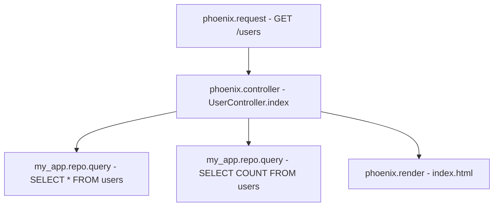

# How to Trace Ecto Database Queries in Phoenix with OpenTelemetry

Author: [nawazdhandala](https://www.github.com/nawazdhandala)

Tags: OpenTelemetry, Elixir, Phoenix, Ecto, Database, SQL Tracing

Description: Learn to instrument Ecto database queries with OpenTelemetry for comprehensive SQL tracing, query performance monitoring, and database observability in Phoenix applications.

Database queries are often the performance bottleneck in web applications. Understanding query execution time, frequency, and patterns is essential for optimization. OpenTelemetry provides first-class support for Ecto, Elixir's database wrapper, through the `opentelemetry_ecto` library. This instrumentation automatically captures all database interactions, creates spans with query details, and correlates them with your application traces.

This guide covers setting up Ecto instrumentation, understanding generated spans, and using traces to optimize database performance.

## Why Trace Database Queries

Database instrumentation reveals critical insights:

**Query Performance**: Identify slow queries that impact user experience. Trace data shows exact execution times and helps prioritize optimization efforts.

**Query Volume**: Discover unexpected query patterns like N+1 problems where a single request triggers dozens of database calls.

**Connection Issues**: Track connection pool exhaustion, timeouts, and database availability problems through span events and attributes.

**Data Access Patterns**: Understand which parts of your application generate the most database load and whether queries are properly indexed.

## Installing Ecto Instrumentation

Add the `opentelemetry_ecto` dependency to your `mix.exs`:

```elixir
defp deps do
  [
    {:phoenix, "~> 1.7"},
    {:ecto_sql, "~> 3.11"},
    {:postgrex, "~> 0.17"},
    # Core OpenTelemetry libraries
    {:opentelemetry, "~> 1.4"},
    {:opentelemetry_api, "~> 1.3"},
    # Phoenix instrumentation (from previous setup)
    {:opentelemetry_phoenix, "~> 1.2"},
    # Ecto instrumentation for database tracing
    {:opentelemetry_ecto, "~> 1.2"},
    {:opentelemetry_exporter, "~> 1.7"}
  ]
end
```

The `opentelemetry_ecto` library hooks into Ecto's Telemetry events to automatically create spans for all database operations including queries, inserts, updates, and deletes.

## Configuring Your Repo

Update your Repo configuration to enable Telemetry events. In `config/config.exs`:

```elixir
# Standard Ecto repo configuration
config :my_app, MyApp.Repo,
  username: "postgres",
  password: "postgres",
  database: "my_app_dev",
  hostname: "localhost",
  pool_size: 10,
  # Enable Telemetry for all query operations
  # This is required for opentelemetry_ecto to capture events
  telemetry_prefix: [:my_app, :repo]
```

The `:telemetry_prefix` option tells Ecto to emit events that the OpenTelemetry instrumentation can capture. Each database operation will trigger corresponding Telemetry events.

## Attaching Ecto Instrumentation

Set up the Ecto instrumentation in your `application.ex`, right after the Phoenix instrumentation:

```elixir
defmodule MyApp.Application do
  use Application

  @impl true
  def start(_type, _args) do
    # Attach Phoenix instrumentation
    OpentelemetryPhoenix.setup(adapter: :cowboy2)

    # Attach Ecto instrumentation
    # This must happen before your Repo starts
    OpentelemetryEcto.setup(
      [:my_app, :repo],
      # Options for customizing instrumentation
      db_statement: :enabled,  # Include SQL in spans
      time_unit: :microsecond  # Precision for timing
    )

    children = [
      MyApp.Repo,
      MyAppWeb.Endpoint,
      # ... other children
    ]

    opts = [strategy: :one_for_one, name: MyApp.Supervisor]
    Supervisor.start_link(children, opts)
  end
end
```

The `setup/2` function takes your repo's telemetry prefix and configuration options. The `:db_statement` option controls whether actual SQL queries are included in span attributes, which is valuable for debugging but may need filtering in production.

## Understanding Ecto Spans

Once configured, every database operation creates a span with detailed attributes. Here's what gets captured:

**Span Name**: Follows the pattern `<repo_name>.query` (e.g., `my_app.repo.query`)

**Database Attributes**:
- `db.system`: Database type (postgresql, mysql, etc.)
- `db.name`: Database name
- `db.statement`: The actual SQL query
- `db.operation`: Operation type (SELECT, INSERT, UPDATE, DELETE)

**Performance Metrics**:
- `db.total_time`: Total execution time in microseconds
- `db.queue_time`: Time waiting for a connection from the pool
- `db.query_time`: Actual database execution time
- `db.decode_time`: Time spent decoding the result

**Connection Pool**:
- `db.pool.size`: Current pool size
- `db.pool.checked_out`: Number of connections in use

Here's how database spans integrate with Phoenix request spans:



## Tracing Common Ecto Operations

Let's see how different Ecto operations appear in traces.

**Simple Query**:
```elixir
# Fetch all users with a simple query
users = MyApp.Repo.all(MyApp.Accounts.User)
```

Creates a span with:
- Operation: SELECT
- Statement: `SELECT u0."id", u0."email", u0."name" FROM "users" AS u0`
- Timing breakdown for queue, query, and decode

**Query with Preloads**:
```elixir
# Query with association preloading
users =
  MyApp.Accounts.User
  |> MyApp.Repo.all()
  |> MyApp.Repo.preload([:posts, :profile])
```

Creates multiple spans:
- Main query for users
- Preload query for posts
- Preload query for profiles

Each span shows the exact SQL and timing, making it easy to spot inefficient preloading strategies.

**Complex Query with Joins**:
```elixir
# Complex query with joins and filters
query =
  from u in MyApp.Accounts.User,
    join: p in assoc(u, :posts),
    where: p.published == true,
    group_by: u.id,
    having: count(p.id) > 5,
    order_by: [desc: count(p.id)],
    select: {u, count(p.id)}

results = MyApp.Repo.all(query)
```

The resulting span includes the complete SQL with JOINs, GROUP BY, and HAVING clauses, along with detailed timing information.

## Customizing Query Tracing

You can customize what gets captured in spans:

```elixir
# In application.ex with more detailed configuration
OpentelemetryEcto.setup(
  [:my_app, :repo],
  # Control SQL statement inclusion
  db_statement: :enabled,

  # Set time precision (microsecond, millisecond, nanosecond)
  time_unit: :microsecond,

  # Add custom attributes to all database spans
  span_attributes: fn query_meta ->
    %{
      # Add the table name being queried
      "db.table" => extract_table_name(query_meta),
      # Tag queries by source/context
      "db.query_source" => query_meta.source,
      # Add custom labels for filtering
      "environment" => System.get_env("MIX_ENV")
    }
  end
)

defp extract_table_name(query_meta) do
  case query_meta do
    %{source: {table, _schema}} -> table
    _ -> "unknown"
  end
end
```

This configuration adds context that helps filter and analyze traces in your observability platform.

## Filtering Sensitive Data

Database queries often contain sensitive information. Implement filtering to protect user data:

```elixir
# Create a custom Ecto instrumenter module
defmodule MyApp.SecureEctoInstrumenter do
  def setup do
    OpentelemetryEcto.setup(
      [:my_app, :repo],
      db_statement: :enabled,
      # Add custom filtering function
      sql_filter: &sanitize_sql/1
    )
  end

  # Sanitize SQL before adding to spans
  defp sanitize_sql(sql) do
    sql
    # Redact email patterns
    |> String.replace(~r/\b[\w.%+-]+@[\w.-]+\.[A-Z|a-z]{2,}\b/, "[EMAIL]")
    # Redact phone numbers
    |> String.replace(~r/\b\d{3}-\d{3}-\d{4}\b/, "[PHONE]")
    # Redact credit card patterns
    |> String.replace(~r/\b\d{4}[\s-]?\d{4}[\s-]?\d{4}[\s-]?\d{4}\b/, "[CC]")
    # Replace parameter values in WHERE clauses
    |> String.replace(~r/= '([^']+)'/, "= '[REDACTED]'")
    # Replace IN clause values
    |> String.replace(~r/IN \(([^)]+)\)/, "IN ([REDACTED])")
  end
end

# Use in application.ex
MyApp.SecureEctoInstrumenter.setup()
```

This approach ensures traces remain useful for debugging while protecting sensitive information.

## Monitoring Connection Pool Health

Database connection pool issues often manifest as slow queries. Ecto instrumentation captures pool metrics:

```elixir
# Example controller action that monitors pool health
defmodule MyAppWeb.HealthController do
  use MyAppWeb, :controller

  def database(conn, _params) do
    # Start a custom span to monitor pool checkout
    require OpenTelemetry.Tracer
    OpenTelemetry.Tracer.with_span "health.database" do
      # This will show pool queue time in the span
      case MyApp.Repo.query("SELECT 1") do
        {:ok, _} ->
          json(conn, %{status: "healthy", database: "connected"})
        {:error, reason} ->
          conn
          |> put_status(503)
          |> json(%{status: "unhealthy", error: inspect(reason)})
      end
    end
  end
end
```

The span will include `db.queue_time`, which spikes when the pool is exhausted. High queue times indicate you need more connections or have connection leaks.

## Tracing Transactions

Ecto transactions create parent spans that group all operations:

```elixir
# Multi-step transaction with proper tracing
def transfer_funds(from_account_id, to_account_id, amount) do
  MyApp.Repo.transaction(fn ->
    # Each query becomes a child span of the transaction span
    from_account =
      MyApp.Repo.get!(MyApp.Accounts.Account, from_account_id)
      |> MyApp.Repo.lock("FOR UPDATE")

    to_account =
      MyApp.Repo.get!(MyApp.Accounts.Account, to_account_id)
      |> MyApp.Repo.lock("FOR UPDATE")

    # Debit operation
    from_account
    |> Ecto.Changeset.change(%{balance: from_account.balance - amount})
    |> MyApp.Repo.update!()

    # Credit operation
    to_account
    |> Ecto.Changeset.change(%{balance: to_account.balance + amount})
    |> MyApp.Repo.update!()

    # Create audit log
    %MyApp.Accounts.Transfer{}
    |> Ecto.Changeset.change(%{
      from_account_id: from_account_id,
      to_account_id: to_account_id,
      amount: amount
    })
    |> MyApp.Repo.insert!()
  end)
end
```

The trace shows:
- Transaction BEGIN
- All queries within the transaction as child spans
- Transaction COMMIT or ROLLBACK
- Total transaction duration

This visibility helps identify long-running transactions that hold locks and impact concurrency.

## Analyzing Query Performance

Use trace data to identify performance issues:

**Slow Query Detection**: Filter spans by duration to find queries exceeding thresholds. Look for:
- Queries over 100ms that need optimization
- Decode time indicating large result sets
- Queue time suggesting pool exhaustion

**Query Volume Analysis**: Count spans by query pattern to find:
- Frequently executed queries that need caching
- Duplicate queries within a single request
- N+1 query patterns (covered in the next post)

**Index Effectiveness**: Compare query times for similar operations. Significant variance suggests missing indexes or poor query planning.

## Production Best Practices

For production deployments, consider these practices:

**Sampling**: Implement sampling to reduce trace volume while maintaining visibility:

```elixir
# In config/runtime.exs
config :opentelemetry,
  sampler: {:parent_based, %{
    root: {:trace_id_ratio_based, 0.1}  # Sample 10% of traces
  }}
```

**SQL Sanitization**: Always filter sensitive data from SQL statements before exporting traces.

**Query Length Limits**: Truncate very long SQL statements to avoid span size limits:

```elixir
defp truncate_sql(sql, max_length \\ 10_000) do
  if String.length(sql) > max_length do
    String.slice(sql, 0, max_length) <> "... [TRUNCATED]"
  else
    sql
  end
end
```

**Performance Monitoring**: Track the OpenTelemetry SDK's own performance metrics to ensure instrumentation overhead remains acceptable.

## Troubleshooting

**Missing database spans**: Verify the telemetry prefix matches your Repo configuration and that `OpentelemetryEcto.setup/2` is called before the Repo starts.

**Incomplete SQL**: Check the `:db_statement` option is set to `:enabled` in your setup configuration.

**High overhead**: Disable SQL statement capture for high-frequency queries or adjust sampling rates to reduce exported span volume.

## Conclusion

Instrumenting Ecto with OpenTelemetry provides deep visibility into your application's database layer. You can identify slow queries, diagnose connection pool issues, and understand data access patterns across your entire request flow. Combined with Phoenix instrumentation, you now have end-to-end tracing from HTTP request through database queries.

The next step is using these traces to debug specific performance problems like N+1 queries in Phoenix LiveView applications.
