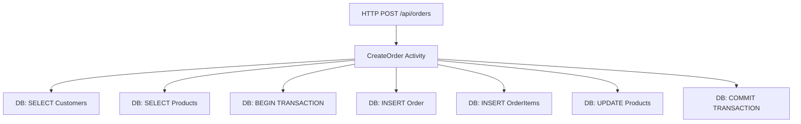

# How to Trace Entity Framework Core Queries with OpenTelemetry in ASP.NET Core

Author: [nawazdhandala](https://www.github.com/nawazdhandala)

Tags: OpenTelemetry, Entity Framework Core, .NET, Database, SQL, Tracing

Description: Comprehensive guide to instrumenting Entity Framework Core with OpenTelemetry for complete database query visibility, performance monitoring, and troubleshooting.

Database queries are often the bottleneck in web applications. Entity Framework Core, Microsoft's modern ORM, abstracts away SQL details, which is convenient but can make it difficult to understand what's happening at the database layer. OpenTelemetry provides the instrumentation needed to trace every database query, measure performance, and identify N+1 query problems.

Understanding how your application interacts with the database is critical for performance optimization. OpenTelemetry's EF Core instrumentation automatically creates spans for database operations, capturing query text, parameters, timing, and errors. Combined with custom instrumentation for business logic, you get end-to-end visibility from HTTP request through business logic down to individual SQL queries.

## Setting Up the Project

Create a new ASP.NET Core Web API project and add the necessary packages:

```bash
# Create the project
dotnet new webapi -n EfCoreTracingDemo
cd EfCoreTracingDemo

# Add Entity Framework Core packages
dotnet add package Microsoft.EntityFrameworkCore
dotnet add package Microsoft.EntityFrameworkCore.SqlServer
dotnet add package Microsoft.EntityFrameworkCore.Design

# Add OpenTelemetry packages
dotnet add package OpenTelemetry.Extensions.Hosting
dotnet add package OpenTelemetry.Instrumentation.AspNetCore
dotnet add package OpenTelemetry.Instrumentation.EntityFrameworkCore
dotnet add package OpenTelemetry.Exporter.Console
dotnet add package OpenTelemetry.Exporter.OpenTelemetryProtocol
```

The EntityFrameworkCore instrumentation package provides automatic tracing for all database operations executed through EF Core.

## Creating the Data Model

Define a realistic domain model for an e-commerce application:

```csharp
using Microsoft.EntityFrameworkCore;

namespace EfCoreTracingDemo.Models;

public class ApplicationDbContext : DbContext
{
    public ApplicationDbContext(DbContextOptions<ApplicationDbContext> options)
        : base(options)
    {
    }

    public DbSet<Customer> Customers => Set<Customer>();
    public DbSet<Order> Orders => Set<Order>();
    public DbSet<OrderItem> OrderItems => Set<OrderItem>();
    public DbSet<Product> Products => Set<Product>();

    protected override void OnModelCreating(ModelBuilder modelBuilder)
    {
        modelBuilder.Entity<Customer>(entity =>
        {
            entity.HasKey(e => e.Id);
            entity.Property(e => e.Email).IsRequired().HasMaxLength(255);
            entity.Property(e => e.Name).IsRequired().HasMaxLength(200);
            entity.HasIndex(e => e.Email).IsUnique();
        });

        modelBuilder.Entity<Order>(entity =>
        {
            entity.HasKey(e => e.Id);
            entity.Property(e => e.Status).IsRequired().HasMaxLength(50);
            entity.Property(e => e.TotalAmount).HasColumnType("decimal(18,2)");

            entity.HasOne(e => e.Customer)
                .WithMany(c => c.Orders)
                .HasForeignKey(e => e.CustomerId)
                .OnDelete(DeleteBehavior.Cascade);
        });

        modelBuilder.Entity<OrderItem>(entity =>
        {
            entity.HasKey(e => e.Id);
            entity.Property(e => e.UnitPrice).HasColumnType("decimal(18,2)");
            entity.Property(e => e.TotalPrice).HasColumnType("decimal(18,2)");

            entity.HasOne(e => e.Order)
                .WithMany(o => o.Items)
                .HasForeignKey(e => e.OrderId)
                .OnDelete(DeleteBehavior.Cascade);

            entity.HasOne(e => e.Product)
                .WithMany()
                .HasForeignKey(e => e.ProductId)
                .OnDelete(DeleteBehavior.Restrict);
        });

        modelBuilder.Entity<Product>(entity =>
        {
            entity.HasKey(e => e.Id);
            entity.Property(e => e.Name).IsRequired().HasMaxLength(200);
            entity.Property(e => e.Price).HasColumnType("decimal(18,2)");
        });
    }
}

public class Customer
{
    public int Id { get; set; }
    public string Name { get; set; } = string.Empty;
    public string Email { get; set; } = string.Empty;
    public DateTime CreatedAt { get; set; }
    public ICollection<Order> Orders { get; set; } = new List<Order>();
}

public class Order
{
    public int Id { get; set; }
    public int CustomerId { get; set; }
    public Customer Customer { get; set; } = null!;
    public string Status { get; set; } = "Pending";
    public decimal TotalAmount { get; set; }
    public DateTime CreatedAt { get; set; }
    public ICollection<OrderItem> Items { get; set; } = new List<OrderItem>();
}

public class OrderItem
{
    public int Id { get; set; }
    public int OrderId { get; set; }
    public Order Order { get; set; } = null!;
    public int ProductId { get; set; }
    public Product Product { get; set; } = null!;
    public int Quantity { get; set; }
    public decimal UnitPrice { get; set; }
    public decimal TotalPrice { get; set; }
}

public class Product
{
    public int Id { get; set; }
    public string Name { get; set; } = string.Empty;
    public string Description { get; set; } = string.Empty;
    public decimal Price { get; set; }
    public int StockQuantity { get; set; }
}
```

## Configuring OpenTelemetry with EF Core Instrumentation

Set up OpenTelemetry in your Program.cs to trace database operations:

```csharp
using Microsoft.EntityFrameworkCore;
using OpenTelemetry.Resources;
using OpenTelemetry.Trace;
using EfCoreTracingDemo.Models;

var builder = WebApplication.CreateBuilder(args);

builder.Services.AddControllers();
builder.Services.AddEndpointsApiExplorer();
builder.Services.AddSwaggerGen();

// Configure Entity Framework Core
builder.Services.AddDbContext<ApplicationDbContext>(options =>
{
    options.UseSqlServer(
        builder.Configuration.GetConnectionString("DefaultConnection"),
        sqlOptions =>
        {
            // Enable retry on failure for resilience
            sqlOptions.EnableRetryOnFailure(
                maxRetryCount: 3,
                maxRetryDelay: TimeSpan.FromSeconds(5),
                errorNumbersToAdd: null);
        });

    // Enable detailed errors in development
    if (builder.Environment.IsDevelopment())
    {
        options.EnableDetailedErrors();
        options.EnableSensitiveDataLogging();
    }
});

// Configure OpenTelemetry
builder.Services.AddOpenTelemetry()
    .ConfigureResource(resource => resource
        .AddService(
            serviceName: "EfCoreTracingDemo",
            serviceVersion: "1.0.0",
            serviceInstanceId: Environment.MachineName))
    .WithTracing(tracing => tracing
        .AddAspNetCoreInstrumentation(options =>
        {
            options.RecordException = true;
        })
        .AddEntityFrameworkCoreInstrumentation(options =>
        {
            // Enable detailed query logging
            options.SetDbStatementForText = true;
            options.SetDbStatementForStoredProcedure = true;

            // Enrich spans with additional context
            options.EnrichWithIDbCommand = (activity, command) =>
            {
                // Add custom tags
                activity.SetTag("db.connection_string",
                    command.Connection?.DataSource);
                activity.SetTag("db.command_type",
                    command.CommandType.ToString());
            };
        })
        .AddSource("EfCoreTracingDemo.*")
        .AddConsoleExporter()
        .AddOtlpExporter(otlpOptions =>
        {
            otlpOptions.Endpoint = new Uri("http://localhost:4317");
        }));

var app = builder.Build();

// Create database if it doesn't exist
using (var scope = app.Services.CreateScope())
{
    var db = scope.ServiceProvider.GetRequiredService<ApplicationDbContext>();
    db.Database.EnsureCreated();
}

if (app.Environment.IsDevelopment())
{
    app.UseSwagger();
    app.UseSwaggerUI();
}

app.UseHttpsRedirection();
app.UseAuthorization();
app.MapControllers();

app.Run();
```

The EntityFrameworkCore instrumentation automatically creates spans for every database command. The SetDbStatementForText option includes the actual SQL query in the span, which is invaluable for debugging.

## Building a Repository with Custom Instrumentation

Create a repository that combines EF Core's automatic instrumentation with custom activities:

```csharp
using System.Diagnostics;
using Microsoft.EntityFrameworkCore;
using EfCoreTracingDemo.Models;

namespace EfCoreTracingDemo.Repositories;

public class OrderRepository
{
    private readonly ApplicationDbContext _context;
    private static readonly ActivitySource ActivitySource = new("EfCoreTracingDemo.OrderRepository");

    public OrderRepository(ApplicationDbContext context)
    {
        _context = context;
    }

    public async Task<Order?> GetOrderWithDetailsAsync(int orderId)
    {
        // Create a custom activity for the overall operation
        using var activity = ActivitySource.StartActivity("GetOrderWithDetails");
        activity?.SetTag("order.id", orderId);

        try
        {
            // EF Core instrumentation automatically traces this query
            var order = await _context.Orders
                .Include(o => o.Customer)
                .Include(o => o.Items)
                    .ThenInclude(i => i.Product)
                .FirstOrDefaultAsync(o => o.Id == orderId);

            activity?.SetTag("order.found", order != null);

            if (order != null)
            {
                activity?.SetTag("order.items_count", order.Items.Count);
                activity?.SetTag("order.total_amount", order.TotalAmount);
            }

            activity?.SetStatus(ActivityStatusCode.Ok);
            return order;
        }
        catch (Exception ex)
        {
            activity?.SetStatus(ActivityStatusCode.Error, ex.Message);
            activity?.RecordException(ex);
            throw;
        }
    }

    public async Task<List<Order>> GetCustomerOrdersAsync(int customerId, int pageSize = 10)
    {
        using var activity = ActivitySource.StartActivity("GetCustomerOrders");
        activity?.SetTag("customer.id", customerId);
        activity?.SetTag("page_size", pageSize);

        try
        {
            // This demonstrates proper eager loading to avoid N+1 queries
            var orders = await _context.Orders
                .Where(o => o.CustomerId == customerId)
                .Include(o => o.Items)
                    .ThenInclude(i => i.Product)
                .OrderByDescending(o => o.CreatedAt)
                .Take(pageSize)
                .ToListAsync();

            activity?.SetTag("orders.count", orders.Count);
            activity?.SetStatus(ActivityStatusCode.Ok);

            return orders;
        }
        catch (Exception ex)
        {
            activity?.SetStatus(ActivityStatusCode.Error, ex.Message);
            activity?.RecordException(ex);
            throw;
        }
    }

    public async Task<Order> CreateOrderAsync(int customerId, List<CreateOrderItemDto> items)
    {
        using var activity = ActivitySource.StartActivity("CreateOrder");
        activity?.SetTag("customer.id", customerId);
        activity?.SetTag("items.count", items.Count);

        // Use a transaction for data consistency
        using var transaction = await _context.Database.BeginTransactionAsync();

        try
        {
            // Load customer
            var customer = await _context.Customers
                .FirstOrDefaultAsync(c => c.Id == customerId);

            if (customer == null)
            {
                throw new InvalidOperationException($"Customer {customerId} not found");
            }

            // Load products and validate stock
            var productIds = items.Select(i => i.ProductId).ToList();
            var products = await _context.Products
                .Where(p => productIds.Contains(p.Id))
                .ToDictionaryAsync(p => p.Id);

            activity?.SetTag("products.loaded", products.Count);

            var order = new Order
            {
                CustomerId = customerId,
                Status = "Pending",
                CreatedAt = DateTime.UtcNow
            };

            decimal totalAmount = 0;

            foreach (var item in items)
            {
                if (!products.TryGetValue(item.ProductId, out var product))
                {
                    throw new InvalidOperationException($"Product {item.ProductId} not found");
                }

                if (product.StockQuantity < item.Quantity)
                {
                    throw new InvalidOperationException(
                        $"Insufficient stock for product {product.Name}");
                }

                var orderItem = new OrderItem
                {
                    ProductId = product.Id,
                    Quantity = item.Quantity,
                    UnitPrice = product.Price,
                    TotalPrice = product.Price * item.Quantity
                };

                order.Items.Add(orderItem);
                totalAmount += orderItem.TotalPrice;

                // Update stock
                product.StockQuantity -= item.Quantity;
            }

            order.TotalAmount = totalAmount;

            _context.Orders.Add(order);
            await _context.SaveChangesAsync();

            await transaction.CommitAsync();

            activity?.SetTag("order.id", order.Id);
            activity?.SetTag("order.total_amount", totalAmount);
            activity?.SetStatus(ActivityStatusCode.Ok);

            return order;
        }
        catch (Exception ex)
        {
            await transaction.RollbackAsync();
            activity?.SetStatus(ActivityStatusCode.Error, ex.Message);
            activity?.RecordException(ex);
            throw;
        }
    }

    public async Task<OrderStatistics> GetOrderStatisticsAsync(int customerId)
    {
        using var activity = ActivitySource.StartActivity("GetOrderStatistics");
        activity?.SetTag("customer.id", customerId);

        try
        {
            // Use projection to avoid loading unnecessary data
            var stats = await _context.Orders
                .Where(o => o.CustomerId == customerId)
                .GroupBy(o => o.CustomerId)
                .Select(g => new OrderStatistics
                {
                    TotalOrders = g.Count(),
                    TotalSpent = g.Sum(o => o.TotalAmount),
                    AverageOrderValue = g.Average(o => o.TotalAmount),
                    LastOrderDate = g.Max(o => o.CreatedAt)
                })
                .FirstOrDefaultAsync();

            activity?.SetTag("total_orders", stats?.TotalOrders ?? 0);
            activity?.SetStatus(ActivityStatusCode.Ok);

            return stats ?? new OrderStatistics();
        }
        catch (Exception ex)
        {
            activity?.SetStatus(ActivityStatusCode.Error, ex.Message);
            activity?.RecordException(ex);
            throw;
        }
    }
}

public class CreateOrderItemDto
{
    public int ProductId { get; set; }
    public int Quantity { get; set; }
}

public class OrderStatistics
{
    public int TotalOrders { get; set; }
    public decimal TotalSpent { get; set; }
    public decimal AverageOrderValue { get; set; }
    public DateTime? LastOrderDate { get; set; }
}
```

The repository methods show proper patterns for EF Core queries. Each database operation gets its own span from the automatic instrumentation, while custom activities provide business context.

## Understanding Query Spans in Traces

When you execute an EF Core query, OpenTelemetry creates a hierarchical trace structure:



Each database operation appears as a child span under your custom activity, showing timing, SQL query text, and any errors.

## Detecting and Fixing N+1 Query Problems

N+1 query problems are a common performance issue with ORMs. OpenTelemetry makes them visible:

```csharp
// BAD: N+1 query problem
public async Task<List<OrderSummaryDto>> GetOrderSummariesBadAsync(int customerId)
{
    using var activity = ActivitySource.StartActivity("GetOrderSummaries_Bad");

    // This loads orders without their relationships
    var orders = await _context.Orders
        .Where(o => o.CustomerId == customerId)
        .ToListAsync();

    var summaries = new List<OrderSummaryDto>();

    // This causes a separate query for EACH order
    foreach (var order in orders)
    {
        // Lazy loading triggers a query here
        var itemCount = await _context.OrderItems
            .CountAsync(i => i.OrderId == order.Id);

        summaries.Add(new OrderSummaryDto
        {
            OrderId = order.Id,
            TotalAmount = order.TotalAmount,
            ItemCount = itemCount
        });
    }

    // The trace will show 1 + N queries (1 for orders, N for counts)
    return summaries;
}

// GOOD: Single query with projection
public async Task<List<OrderSummaryDto>> GetOrderSummariesGoodAsync(int customerId)
{
    using var activity = ActivitySource.StartActivity("GetOrderSummaries_Good");

    // Single query that projects exactly what we need
    var summaries = await _context.Orders
        .Where(o => o.CustomerId == customerId)
        .Select(o => new OrderSummaryDto
        {
            OrderId = o.Id,
            TotalAmount = o.TotalAmount,
            ItemCount = o.Items.Count
        })
        .ToListAsync();

    // The trace will show only 1 query
    activity?.SetTag("orders.count", summaries.Count);
    return summaries;
}

public class OrderSummaryDto
{
    public int OrderId { get; set; }
    public decimal TotalAmount { get; set; }
    public int ItemCount { get; set; }
}
```

When you look at the trace for the bad version, you'll see many sequential database queries. The good version shows a single query, making the performance difference obvious.

## Implementing Query Performance Monitoring

Add custom metrics to track query performance:

```csharp
using System.Diagnostics.Metrics;

public class DatabaseMetrics
{
    private readonly Meter _meter;
    private readonly Histogram<double> _queryDuration;
    private readonly Counter<long> _slowQueries;

    public DatabaseMetrics(IMeterFactory meterFactory)
    {
        _meter = meterFactory.Create("EfCoreTracingDemo.Database");

        _queryDuration = _meter.CreateHistogram<double>(
            "db.query.duration",
            unit: "ms",
            description: "Database query duration");

        _slowQueries = _meter.CreateCounter<long>(
            "db.query.slow",
            unit: "{queries}",
            description: "Count of slow queries (>100ms)");
    }

    public void RecordQuery(string operation, double durationMs)
    {
        _queryDuration.Record(durationMs,
            new KeyValuePair<string, object?>("db.operation", operation));

        if (durationMs > 100)
        {
            _slowQueries.Add(1,
                new KeyValuePair<string, object?>("db.operation", operation));
        }
    }
}
```

Create a DbContext interceptor to automatically record metrics:

```csharp
using Microsoft.EntityFrameworkCore.Diagnostics;
using System.Data.Common;

public class PerformanceInterceptor : DbCommandInterceptor
{
    private readonly DatabaseMetrics _metrics;

    public PerformanceInterceptor(DatabaseMetrics metrics)
    {
        _metrics = metrics;
    }

    public override DbDataReader ReaderExecuted(
        DbCommand command,
        CommandExecutedEventData eventData,
        DbDataReader result)
    {
        _metrics.RecordQuery(
            command.CommandText.Split(' ')[0], // First word (SELECT, INSERT, etc.)
            eventData.Duration.TotalMilliseconds);

        return base.ReaderExecuted(command, eventData, result);
    }

    public override async ValueTask<DbDataReader> ReaderExecutedAsync(
        DbCommand command,
        CommandExecutedEventData eventData,
        DbDataReader result,
        CancellationToken cancellationToken = default)
    {
        _metrics.RecordQuery(
            command.CommandText.Split(' ')[0],
            eventData.Duration.TotalMilliseconds);

        return await base.ReaderExecutedAsync(command, eventData, result, cancellationToken);
    }
}

// Register in Program.cs
builder.Services.AddSingleton<DatabaseMetrics>();
builder.Services.AddSingleton<PerformanceInterceptor>();

builder.Services.AddDbContext<ApplicationDbContext>((serviceProvider, options) =>
{
    var interceptor = serviceProvider.GetRequiredService<PerformanceInterceptor>();

    options.UseSqlServer(
        builder.Configuration.GetConnectionString("DefaultConnection"))
        .AddInterceptors(interceptor);
});
```

## Creating the API Controller

Build a controller that demonstrates the tracing in action:

```csharp
using Microsoft.AspNetCore.Mvc;
using EfCoreTracingDemo.Repositories;

namespace EfCoreTracingDemo.Controllers;

[ApiController]
[Route("api/[controller]")]
public class OrdersController : ControllerBase
{
    private readonly OrderRepository _orderRepository;
    private readonly ILogger<OrdersController> _logger;

    public OrdersController(OrderRepository orderRepository, ILogger<OrdersController> logger)
    {
        _orderRepository = orderRepository;
        _logger = logger;
    }

    [HttpGet("{id}")]
    public async Task<ActionResult<Order>> GetOrder(int id)
    {
        _logger.LogInformation("Fetching order {OrderId}", id);

        var order = await _orderRepository.GetOrderWithDetailsAsync(id);

        if (order == null)
        {
            return NotFound();
        }

        return Ok(order);
    }

    [HttpGet("customer/{customerId}")]
    public async Task<ActionResult<List<Order>>> GetCustomerOrders(int customerId, [FromQuery] int pageSize = 10)
    {
        _logger.LogInformation("Fetching orders for customer {CustomerId}", customerId);

        var orders = await _orderRepository.GetCustomerOrdersAsync(customerId, pageSize);
        return Ok(orders);
    }

    [HttpPost]
    public async Task<ActionResult<Order>> CreateOrder([FromBody] CreateOrderRequest request)
    {
        _logger.LogInformation("Creating order for customer {CustomerId}", request.CustomerId);

        try
        {
            var order = await _orderRepository.CreateOrderAsync(request.CustomerId, request.Items);
            return CreatedAtAction(nameof(GetOrder), new { id = order.Id }, order);
        }
        catch (InvalidOperationException ex)
        {
            _logger.LogWarning(ex, "Failed to create order");
            return BadRequest(new { error = ex.Message });
        }
    }

    [HttpGet("customer/{customerId}/statistics")]
    public async Task<ActionResult<OrderStatistics>> GetStatistics(int customerId)
    {
        _logger.LogInformation("Fetching statistics for customer {CustomerId}", customerId);

        var stats = await _orderRepository.GetOrderStatisticsAsync(customerId);
        return Ok(stats);
    }
}

public class CreateOrderRequest
{
    public int CustomerId { get; set; }
    public List<CreateOrderItemDto> Items { get; set; } = new();
}
```

Register the repository in your DI container:

```csharp
// In Program.cs
builder.Services.AddScoped<OrderRepository>();
```

## Best Practices for EF Core Observability

Follow these practices for effective database observability:

Use eager loading with Include to avoid N+1 queries. The traces will show you immediately if you're making too many database calls.

Use projection with Select when you don't need full entities. This reduces data transfer and shows in traces as more efficient queries.

Add meaningful tags to your custom activities. Include business identifiers like customer ID, order ID, or operation type.

Monitor query duration metrics to establish performance baselines. Set up alerts for queries that exceed acceptable thresholds.

Be careful with sensitive data in traces. The SetDbStatementForText option includes SQL with parameters, which might contain PII. Consider disabling in production or scrubbing sensitive data.

## Conclusion

OpenTelemetry's Entity Framework Core instrumentation provides complete visibility into your database layer. Every query, transaction, and database operation becomes observable, with detailed timing information and the actual SQL being executed.

Combined with custom activities for business logic, you get end-to-end traces that show exactly how requests flow through your application and down to the database. This visibility is invaluable for identifying N+1 queries, optimizing slow queries, and understanding the performance characteristics of your data access patterns.

Start by enabling the automatic EF Core instrumentation and examining the traces for your existing queries. Look for patterns like sequential queries that could be combined, or queries loading more data than necessary. Add custom activities around repository methods to provide business context, and use metrics to track query performance over time. With comprehensive database observability in place, you can confidently optimize your data access layer and maintain good performance as your application grows.
