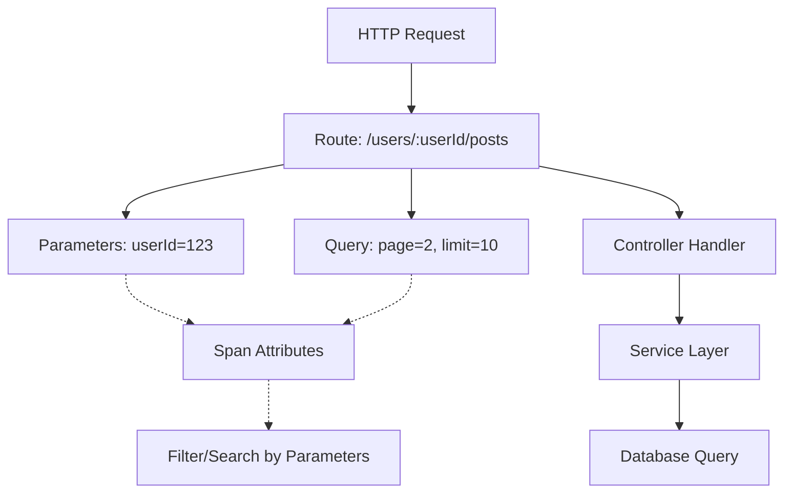

# How to Trace Express.js Route Parameters and Query Strings with OpenTelemetry

Author: [nawazdhandala](https://www.github.com/nawazdhandala)

Tags: OpenTelemetry, Express.js, Routes, Parameters, Query Strings, Tracing

Description: Learn how to capture and trace Express.js route parameters, query strings, and request data with OpenTelemetry for better debugging and observability in your Node.js applications.

Route parameters and query strings contain critical context about what your application is doing. Tracing them with OpenTelemetry gives you the ability to filter traces by user ID, search term, pagination offset, or any other parameter that matters to your application. This guide shows you how to capture this data effectively.

## Why Trace Route Parameters and Query Strings

When debugging production issues, knowing that a request took 5 seconds is useful. Knowing that the request was for user ID 12345 with a search query for "laptop" and page 50 of results is invaluable. Route parameters and query strings provide the business context that turns raw performance data into actionable insights.

The trace hierarchy with parameters looks like this:



## Basic Setup

Start with the core OpenTelemetry packages:

```bash
npm install @opentelemetry/sdk-node \
            @opentelemetry/api \
            @opentelemetry/instrumentation-express \
            @opentelemetry/instrumentation-http \
            @opentelemetry/exporter-trace-otlp-http
```

Initialize tracing before your Express app:

```typescript
// src/tracing.ts

import { NodeSDK } from '@opentelemetry/sdk-node';
import { OTLPTraceExporter } from '@opentelemetry/exporter-trace-otlp-http';
import { Resource } from '@opentelemetry/resources';
import { SemanticResourceAttributes } from '@opentelemetry/semantic-conventions';
import { ExpressInstrumentation } from '@opentelemetry/instrumentation-express';
import { HttpInstrumentation } from '@opentelemetry/instrumentation-http';

export function initializeTracing() {
  const resource = new Resource({
    [SemanticResourceAttributes.SERVICE_NAME]: 'express-params-tracing',
  });

  const sdk = new NodeSDK({
    resource,
    traceExporter: new OTLPTraceExporter({
      url: process.env.OTEL_EXPORTER_OTLP_ENDPOINT || 'http://localhost:4318/v1/traces',
    }),
    instrumentations: [
      new HttpInstrumentation(),
      new ExpressInstrumentation(),
    ],
  });

  sdk.start();
}
```

## Capturing Route Parameters

Route parameters are part of the URL path (e.g., `/users/:userId`). Create middleware to capture them:

```typescript
// src/middleware/params-tracing.ts

import { Request, Response, NextFunction } from 'express';
import { trace } from '@opentelemetry/api';

export function routeParamsTracingMiddleware() {
  return (req: Request, res: Response, next: NextFunction) => {
    const span = trace.getActiveSpan();

    if (span && req.params) {
      // Add all route parameters to the span
      Object.entries(req.params).forEach(([key, value]) => {
        span.setAttribute(`route.param.${key}`, value);
      });

      // Add param count
      span.setAttribute('route.param.count', Object.keys(req.params).length);

      // Add event for parameter capture
      if (Object.keys(req.params).length > 0) {
        span.addEvent('route.params.captured', {
          params: JSON.stringify(req.params),
        });
      }
    }

    next();
  };
}
```

Use the middleware in your Express app:

```typescript
// src/index.ts

import { initializeTracing } from './tracing';
initializeTracing();

import express from 'express';
import { routeParamsTracingMiddleware } from './middleware/params-tracing';

const app = express();

app.use(express.json());
app.use(routeParamsTracingMiddleware());

// Route with parameters
app.get('/users/:userId', (req, res) => {
  const span = trace.getActiveSpan();
  if (span) {
    // Parameters are already added by middleware
    span.addEvent('fetching.user');
  }

  res.json({ userId: req.params.userId, name: 'Alice' });
});

// Route with multiple parameters
app.get('/users/:userId/posts/:postId', (req, res) => {
  const { userId, postId } = req.params;

  res.json({
    userId,
    postId,
    title: 'Sample Post',
  });
});

app.listen(3000);
```

## Capturing Query Strings

Query strings provide filters, pagination, and search terms. Capture them selectively:

```typescript
// src/middleware/query-tracing.ts

import { Request, Response, NextFunction } from 'express';
import { trace } from '@opentelemetry/api';

// Keys that should never be traced (sensitive data)
const EXCLUDED_QUERY_KEYS = ['password', 'token', 'secret', 'api_key', 'apiKey'];

// Common pagination and filtering keys to always capture
const IMPORTANT_QUERY_KEYS = ['page', 'limit', 'offset', 'sort', 'order', 'q', 'search', 'filter'];

export function queryStringTracingMiddleware() {
  return (req: Request, res: Response, next: NextFunction) => {
    const span = trace.getActiveSpan();

    if (span && req.query) {
      const queryKeys = Object.keys(req.query);

      // Add query string count
      span.setAttribute('query.param.count', queryKeys.length);

      // Filter and add query parameters
      queryKeys.forEach((key) => {
        // Skip sensitive keys
        if (EXCLUDED_QUERY_KEYS.includes(key.toLowerCase())) {
          span.setAttribute(`query.param.${key}`, '[REDACTED]');
          return;
        }

        const value = req.query[key];

        // Handle array values
        if (Array.isArray(value)) {
          span.setAttribute(`query.param.${key}`, value.join(','));
          span.setAttribute(`query.param.${key}.count`, value.length);
        } else if (value !== undefined && value !== null) {
          // Convert to string and limit length to prevent huge spans
          const stringValue = String(value);
          const truncatedValue = stringValue.length > 100
            ? stringValue.substring(0, 100) + '...'
            : stringValue;

          span.setAttribute(`query.param.${key}`, truncatedValue);
        }
      });

      // Add important query params as top-level attributes for easier filtering
      IMPORTANT_QUERY_KEYS.forEach((key) => {
        if (req.query[key] !== undefined) {
          span.setAttribute(`request.${key}`, String(req.query[key]));
        }
      });

      // Add event with full query string (sanitized)
      const sanitizedQuery = { ...req.query };
      EXCLUDED_QUERY_KEYS.forEach((key) => {
        if (sanitizedQuery[key]) {
          sanitizedQuery[key] = '[REDACTED]';
        }
      });

      span.addEvent('query.params.captured', {
        query: JSON.stringify(sanitizedQuery),
        count: queryKeys.length,
      });
    }

    next();
  };
}
```

Apply the middleware:

```typescript
// src/index.ts (updated)

import { queryStringTracingMiddleware } from './middleware/query-tracing';

app.use(routeParamsTracingMiddleware());
app.use(queryStringTracingMiddleware());

// Route with query parameters
app.get('/search', (req, res) => {
  const { q, page, limit } = req.query;

  const span = trace.getActiveSpan();
  if (span) {
    span.addEvent('search.executing', {
      query: q,
      page: page || 1,
      limit: limit || 10,
    });
  }

  res.json({
    results: [],
    query: q,
    page: parseInt(page as string) || 1,
    limit: parseInt(limit as string) || 10,
  });
});
```

## Advanced Parameter Processing

Handle complex parameter scenarios:

```typescript
// src/middleware/advanced-params-tracing.ts

import { Request, Response, NextFunction } from 'express';
import { trace } from '@opentelemetry/api';

export function advancedParamsTracingMiddleware() {
  return (req: Request, res: Response, next: NextFunction) => {
    const span = trace.getActiveSpan();

    if (!span) {
      return next();
    }

    // 1. Capture numeric ID parameters with validation
    if (req.params.id) {
      const id = parseInt(req.params.id);
      if (!isNaN(id)) {
        span.setAttribute('resource.id', id);
        span.setAttribute('resource.id.valid', true);
      } else {
        span.setAttribute('resource.id', req.params.id);
        span.setAttribute('resource.id.valid', false);
        span.addEvent('invalid.id.format', {
          providedId: req.params.id,
        });
      }
    }

    // 2. Parse and trace date range queries
    if (req.query.startDate || req.query.endDate) {
      const startDate = req.query.startDate as string;
      const endDate = req.query.endDate as string;

      if (startDate) {
        const start = new Date(startDate);
        if (!isNaN(start.getTime())) {
          span.setAttribute('query.date.start', start.toISOString());
        }
      }

      if (endDate) {
        const end = new Date(endDate);
        if (!isNaN(end.getTime())) {
          span.setAttribute('query.date.end', end.toISOString());
        }
      }

      if (startDate && endDate) {
        const start = new Date(startDate);
        const end = new Date(endDate);
        const daysDiff = Math.ceil((end.getTime() - start.getTime()) / (1000 * 60 * 60 * 24));
        span.setAttribute('query.date.range_days', daysDiff);
      }
    }

    // 3. Parse and trace filters
    if (req.query.filter) {
      try {
        const filterValue = req.query.filter as string;

        // Handle different filter formats
        if (filterValue.startsWith('{')) {
          // JSON filter
          const filters = JSON.parse(filterValue);
          Object.entries(filters).forEach(([key, value]) => {
            span.setAttribute(`filter.${key}`, String(value));
          });
          span.setAttribute('filter.type', 'json');
        } else if (filterValue.includes(':')) {
          // Key-value filter (status:active)
          const pairs = filterValue.split(',');
          pairs.forEach((pair) => {
            const [key, value] = pair.split(':');
            if (key && value) {
              span.setAttribute(`filter.${key.trim()}`, value.trim());
            }
          });
          span.setAttribute('filter.type', 'key-value');
        } else {
          // Simple filter
          span.setAttribute('filter.value', filterValue);
          span.setAttribute('filter.type', 'simple');
        }
      } catch (error) {
        span.setAttribute('filter.parse_error', true);
        span.addEvent('filter.parse.failed', {
          error: error.message,
        });
      }
    }

    // 4. Trace pagination with calculations
    const page = parseInt(req.query.page as string) || 1;
    const limit = parseInt(req.query.limit as string) || 10;
    const offset = (page - 1) * limit;

    span.setAttribute('pagination.page', page);
    span.setAttribute('pagination.limit', limit);
    span.setAttribute('pagination.offset', offset);

    // 5. Trace sorting parameters
    if (req.query.sort) {
      const sortField = req.query.sort as string;
      const sortOrder = (req.query.order as string) || 'asc';

      span.setAttribute('sort.field', sortField);
      span.setAttribute('sort.order', sortOrder);
      span.addEvent('sort.applied', {
        field: sortField,
        order: sortOrder,
      });
    }

    // 6. Trace search queries with metadata
    if (req.query.q || req.query.search) {
      const searchQuery = (req.query.q || req.query.search) as string;

      span.setAttribute('search.query', searchQuery);
      span.setAttribute('search.query.length', searchQuery.length);
      span.setAttribute('search.query.word_count', searchQuery.split(/\s+/).length);

      // Flag special search patterns
      if (searchQuery.includes('*') || searchQuery.includes('?')) {
        span.setAttribute('search.wildcard', true);
      }
      if (searchQuery.startsWith('"') && searchQuery.endsWith('"')) {
        span.setAttribute('search.exact_match', true);
      }
    }

    next();
  };
}
```

## Route-Specific Parameter Tracing

Add custom tracing for specific routes:

```typescript
// src/routes/users.ts

import { Router } from 'express';
import { trace } from '@opentelemetry/api';

const router = Router();

// User profile route
router.get('/:userId', (req, res) => {
  const span = trace.getActiveSpan();
  const { userId } = req.params;

  if (span) {
    span.setAttribute('user.id', userId);
    span.setAttribute('route.type', 'user_profile');
    span.addEvent('user.profile.requested');
  }

  // Simulate user lookup
  const user = { id: userId, name: 'Alice', email: 'alice@example.com' };

  if (span) {
    span.addEvent('user.profile.found', {
      userId,
      hasEmail: !!user.email,
    });
  }

  res.json(user);
});

// User posts with pagination
router.get('/:userId/posts', (req, res) => {
  const span = trace.getActiveSpan();
  const { userId } = req.params;
  const page = parseInt(req.query.page as string) || 1;
  const limit = parseInt(req.query.limit as string) || 20;

  if (span) {
    span.setAttribute('user.id', userId);
    span.setAttribute('posts.page', page);
    span.setAttribute('posts.limit', limit);
    span.setAttribute('route.type', 'user_posts');

    span.addEvent('posts.query.prepared', {
      userId,
      page,
      limit,
      offset: (page - 1) * limit,
    });
  }

  // Simulate fetching posts
  const posts = [
    { id: 1, title: 'Post 1' },
    { id: 2, title: 'Post 2' },
  ];

  if (span) {
    span.setAttribute('posts.count', posts.length);
    span.addEvent('posts.fetched', {
      count: posts.length,
    });
  }

  res.json({
    posts,
    pagination: {
      page,
      limit,
      total: 100,
      hasMore: page * limit < 100,
    },
  });
});

// Search user's posts
router.get('/:userId/posts/search', (req, res) => {
  const span = trace.getActiveSpan();
  const { userId } = req.params;
  const { q, tags } = req.query;

  if (span) {
    span.setAttribute('user.id', userId);
    span.setAttribute('search.query', q as string);
    span.setAttribute('route.type', 'post_search');

    if (tags) {
      const tagArray = (tags as string).split(',');
      span.setAttribute('search.tags', tags as string);
      span.setAttribute('search.tags.count', tagArray.length);
    }

    span.addEvent('post.search.started', {
      userId,
      query: q,
      hasTags: !!tags,
    });
  }

  const results = [];

  if (span) {
    span.setAttribute('search.results.count', results.length);
    span.addEvent('post.search.completed', {
      resultCount: results.length,
    });
  }

  res.json({ results, query: q, userId });
});

export default router;
```

## Handling Array Parameters

Query strings can contain arrays. Handle them properly:

```typescript
// src/middleware/array-params-tracing.ts

import { Request, Response, NextFunction } from 'express';
import { trace } from '@opentelemetry/api';

export function arrayParamsTracingMiddleware() {
  return (req: Request, res: Response, next: NextFunction) => {
    const span = trace.getActiveSpan();

    if (!span || !req.query) {
      return next();
    }

    // Handle array query parameters (e.g., ?tags=nodejs&tags=typescript)
    Object.entries(req.query).forEach(([key, value]) => {
      if (Array.isArray(value)) {
        // Store array as comma-separated string
        span.setAttribute(`query.${key}`, value.join(','));
        span.setAttribute(`query.${key}.count`, value.length);
        span.setAttribute(`query.${key}.is_array`, true);

        // Add individual values if small array
        if (value.length <= 5) {
          value.forEach((item, index) => {
            span.setAttribute(`query.${key}.${index}`, String(item));
          });
        }
      }
    });

    next();
  };
}
```

Example usage:

```typescript
// Route that handles array parameters
app.get('/posts', (req, res) => {
  const span = trace.getActiveSpan();
  const tags = req.query.tags; // Can be string or string[]

  const tagArray = Array.isArray(tags) ? tags : tags ? [tags] : [];

  if (span) {
    span.setAttribute('query.tags.processed', tagArray.join(','));
    span.addEvent('posts.filtered.by.tags', {
      tags: tagArray,
      count: tagArray.length,
    });
  }

  res.json({ posts: [], filters: { tags: tagArray } });
});
```

## Sanitizing Sensitive Parameters

Protect sensitive data while maintaining useful traces:

```typescript
// src/middleware/params-sanitizer.ts

import { Request, Response, NextFunction } from 'express';
import { trace } from '@opentelemetry/api';

const SENSITIVE_PATTERNS = [
  /password/i,
  /secret/i,
  /token/i,
  /api[_-]?key/i,
  /auth/i,
  /credit[_-]?card/i,
  /ssn/i,
  /social[_-]?security/i,
];

const SENSITIVE_PARAM_NAMES = [
  'password',
  'confirmPassword',
  'oldPassword',
  'newPassword',
  'token',
  'accessToken',
  'refreshToken',
  'apiKey',
  'secret',
  'clientSecret',
];

function isSensitiveKey(key: string): boolean {
  // Check exact matches
  if (SENSITIVE_PARAM_NAMES.includes(key)) {
    return true;
  }

  // Check patterns
  return SENSITIVE_PATTERNS.some((pattern) => pattern.test(key));
}

function sanitizeValue(value: any): string {
  if (typeof value === 'string' && value.length > 0) {
    // Show only first 2 and last 2 characters
    if (value.length > 8) {
      return `${value.substring(0, 2)}****${value.substring(value.length - 2)}`;
    }
    return '****';
  }
  return '[REDACTED]';
}

export function paramsSanitizerMiddleware() {
  return (req: Request, res: Response, next: NextFunction) => {
    const span = trace.getActiveSpan();

    if (!span) {
      return next();
    }

    // Sanitize route params
    if (req.params) {
      Object.entries(req.params).forEach(([key, value]) => {
        if (isSensitiveKey(key)) {
          span.setAttribute(`route.param.${key}`, sanitizeValue(value));
          span.setAttribute(`route.param.${key}.sanitized`, true);
        }
      });
    }

    // Sanitize query params
    if (req.query) {
      Object.entries(req.query).forEach(([key, value]) => {
        if (isSensitiveKey(key)) {
          span.setAttribute(`query.param.${key}`, sanitizeValue(value));
          span.setAttribute(`query.param.${key}.sanitized`, true);
        }
      });
    }

    next();
  };
}
```

## Complete Example

Put it all together in a production-ready application:

```typescript
// src/index.ts (complete)

import { initializeTracing } from './tracing';
initializeTracing();

import express from 'express';
import { trace } from '@opentelemetry/api';
import { routeParamsTracingMiddleware } from './middleware/params-tracing';
import { queryStringTracingMiddleware } from './middleware/query-tracing';
import { advancedParamsTracingMiddleware } from './middleware/advanced-params-tracing';
import { arrayParamsTracingMiddleware } from './middleware/array-params-tracing';
import { paramsSanitizerMiddleware } from './middleware/params-sanitizer';

const app = express();

app.use(express.json());

// Apply tracing middleware in order
app.use(routeParamsTracingMiddleware());
app.use(queryStringTracingMiddleware());
app.use(advancedParamsTracingMiddleware());
app.use(arrayParamsTracingMiddleware());
app.use(paramsSanitizerMiddleware());

// Routes
app.get('/api/users/:userId', (req, res) => {
  res.json({ userId: req.params.userId });
});

app.get('/api/users/:userId/posts/:postId', (req, res) => {
  res.json({
    userId: req.params.userId,
    postId: req.params.postId,
  });
});

app.get('/api/search', (req, res) => {
  const { q, page, limit, sort, filter } = req.query;
  res.json({ results: [], query: q, page, limit, sort, filter });
});

app.get('/api/posts', (req, res) => {
  const { tags, categories, startDate, endDate } = req.query;
  res.json({ posts: [], filters: { tags, categories, startDate, endDate } });
});

app.listen(3000, () => {
  console.log('Server with parameter tracing running on http://localhost:3000');
});
```

## Querying Traces by Parameters

Once you have parameters in your traces, you can filter by them:

```
# Find all requests for user 123
trace.where("route.param.userId", "123")

# Find slow searches
trace.where("search.query").and("duration > 1000ms")

# Find paginated requests beyond page 10
trace.where("pagination.page > 10")

# Find filtered queries
trace.where("filter.type", "json")
```

Capturing route parameters and query strings transforms generic HTTP traces into rich, searchable data. By selectively tracing the right parameters while protecting sensitive data, you build an observability system that helps you understand not just what your application is doing, but exactly which resources and data it's processing.
