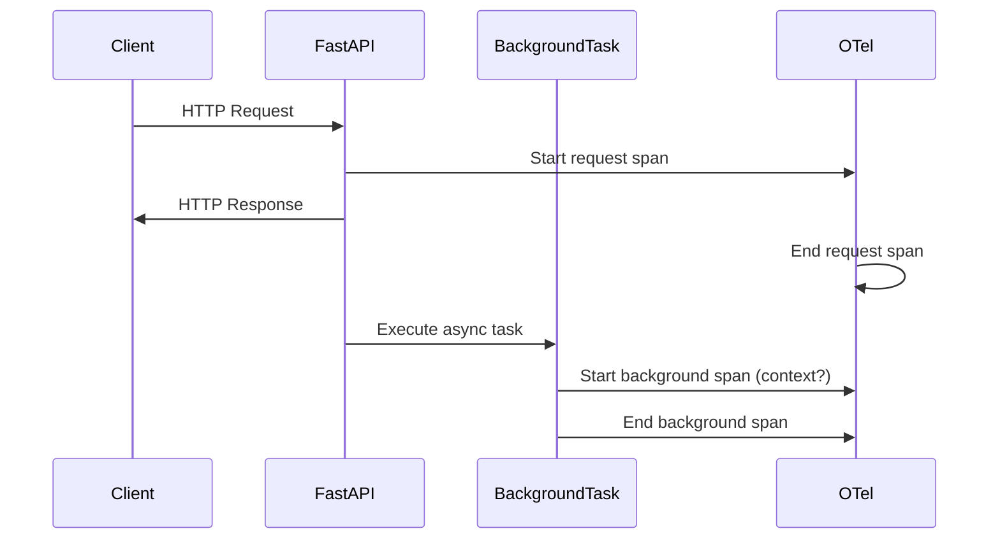
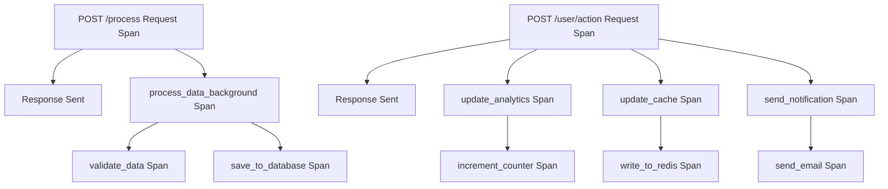

# How to Trace FastAPI Background Tasks with OpenTelemetry Spans

Author: [nawazdhandala](https://www.github.com/nawazdhandala)

Tags: OpenTelemetry, FastAPI, Background Tasks, Python, Async, Spans

Description: Learn how to properly instrument FastAPI background tasks with OpenTelemetry spans to maintain trace context and track async operations that run after response completion.

FastAPI's background tasks are a powerful feature for executing code after returning a response to the client. However, tracing these tasks presents unique challenges because they run asynchronously after the main request span has already ended. Without proper instrumentation, you lose visibility into what happens after the response is sent, making it difficult to debug issues or monitor performance.

The core challenge is maintaining trace context across the boundary between the request handler and the background task. When a background task executes, it runs in a different execution context, and without explicit propagation, the OpenTelemetry context gets lost. This results in orphaned spans that can't be correlated back to the original request.

## Understanding the Context Problem

When FastAPI executes a background task, it happens after the response has been sent. The request context might have already been cleaned up, and the OpenTelemetry SDK needs explicit help to maintain the trace relationship.



## Setting Up OpenTelemetry with FastAPI

First, install the required packages. You'll need the OpenTelemetry SDK, API, and FastAPI instrumentation.

```bash
pip install opentelemetry-api \
    opentelemetry-sdk \
    opentelemetry-instrumentation-fastapi \
    opentelemetry-exporter-otlp \
    fastapi \
    uvicorn
```

Basic OpenTelemetry configuration for FastAPI creates automatic instrumentation for HTTP requests, but background tasks require additional work.

```python
from opentelemetry import trace
from opentelemetry.sdk.trace import TracerProvider
from opentelemetry.sdk.trace.export import BatchSpanProcessor
from opentelemetry.exporter.otlp.proto.grpc.trace_exporter import OTLPSpanExporter
from opentelemetry.instrumentation.fastapi import FastAPIInstrumentor
from fastapi import FastAPI

# Initialize the tracer provider
provider = TracerProvider()
processor = BatchSpanProcessor(OTLPSpanExporter(
    endpoint="http://localhost:4317",
    insecure=True
))
provider.add_span_processor(processor)
trace.set_tracer_provider(provider)

# Create FastAPI app
app = FastAPI()

# Instrument FastAPI - this handles HTTP request spans automatically
FastAPIInstrumentor.instrument_app(app)

# Get a tracer for manual instrumentation
tracer = trace.get_tracer(__name__)
```

## Capturing Context for Background Tasks

The key to tracing background tasks is capturing the current context before the task executes and then attaching that context when the task runs.

```python
from fastapi import BackgroundTasks
from opentelemetry import context
from opentelemetry.trace import SpanKind
import time

# This function will run as a background task
def process_data_task(user_id: str, data: dict, ctx: context.Context):
    """
    Background task that processes user data.
    The ctx parameter contains the OpenTelemetry context from the request.
    """
    # Attach the context so spans created here link to the parent request
    token = context.attach(ctx)

    try:
        # Create a span for this background task
        with tracer.start_as_current_span(
            "process_data_background",
            kind=SpanKind.INTERNAL
        ) as span:
            span.set_attribute("user.id", user_id)
            span.set_attribute("task.type", "data_processing")

            # Simulate processing work
            time.sleep(2)

            # You can create child spans for sub-operations
            with tracer.start_as_current_span("validate_data") as child_span:
                child_span.set_attribute("data.keys", len(data))
                time.sleep(0.5)

            with tracer.start_as_current_span("save_to_database") as child_span:
                child_span.set_attribute("db.operation", "insert")
                time.sleep(1)

            span.set_attribute("task.status", "completed")

    finally:
        # Always detach the context
        context.detach(token)


@app.post("/process")
async def process_user_data(user_id: str, data: dict, background_tasks: BackgroundTasks):
    """
    Endpoint that triggers background processing.
    The response is sent immediately, but processing continues.
    """
    # Get the current OpenTelemetry context
    # This context contains the trace ID and span information
    current_context = context.get_current()

    # Add the background task with the captured context
    background_tasks.add_task(
        process_data_task,
        user_id=user_id,
        data=data,
        ctx=current_context  # Pass context explicitly
    )

    return {
        "status": "accepted",
        "message": "Processing started in background"
    }
```

## Creating a Reusable Context Wrapper

Rather than passing context manually to every background task, you can create a wrapper function that handles context propagation automatically.

```python
from functools import wraps
from typing import Callable, Any

def traced_background_task(task_name: str):
    """
    Decorator that automatically handles context propagation for background tasks.

    Usage:
        @traced_background_task("my_task")
        def my_task(arg1, arg2):
            # Task implementation
            pass
    """
    def decorator(func: Callable) -> Callable:
        @wraps(func)
        def wrapper(*args, **kwargs):
            # Context should be passed as 'otel_context' kwarg
            ctx = kwargs.pop('otel_context', None)

            if ctx is None:
                # No context provided, execute without tracing
                return func(*args, **kwargs)

            token = context.attach(ctx)
            try:
                with tracer.start_as_current_span(
                    task_name,
                    kind=SpanKind.INTERNAL
                ) as span:
                    span.set_attribute("task.function", func.__name__)
                    result = func(*args, **kwargs)
                    span.set_attribute("task.result", "success")
                    return result
            except Exception as e:
                span = trace.get_current_span()
                span.set_attribute("task.result", "error")
                span.set_attribute("error.type", type(e).__name__)
                span.set_attribute("error.message", str(e))
                span.record_exception(e)
                raise
            finally:
                context.detach(token)

        return wrapper
    return decorator


# Now use the decorator for clean background task definitions
@traced_background_task("send_notification")
def send_notification(user_id: str, notification_type: str):
    """Send a notification to the user."""
    with tracer.start_as_current_span("prepare_message") as span:
        span.set_attribute("notification.type", notification_type)
        message = f"Notification for user {user_id}"

    with tracer.start_as_current_span("send_email") as span:
        span.set_attribute("email.provider", "sendgrid")
        time.sleep(1)  # Simulate sending


@app.post("/notify")
async def notify_user(user_id: str, notification_type: str, background_tasks: BackgroundTasks):
    """Endpoint that sends notification in background."""
    current_context = context.get_current()

    background_tasks.add_task(
        send_notification,
        user_id=user_id,
        notification_type=notification_type,
        otel_context=current_context  # Pass as keyword argument
    )

    return {"status": "notification_queued"}
```

## Handling Multiple Background Tasks

When you have multiple background tasks triggered by a single request, each should be traced as a separate child span of the original request.

```python
@traced_background_task("update_analytics")
def update_analytics(user_id: str, action: str):
    """Update analytics data."""
    with tracer.start_as_current_span("increment_counter") as span:
        span.set_attribute("action", action)
        time.sleep(0.3)


@traced_background_task("update_cache")
def update_cache(user_id: str, data: dict):
    """Update cached user data."""
    with tracer.start_as_current_span("write_to_redis") as span:
        span.set_attribute("cache.keys", len(data))
        time.sleep(0.5)


@app.post("/user/action")
async def user_action(user_id: str, action: str, data: dict, background_tasks: BackgroundTasks):
    """
    Endpoint that triggers multiple background tasks.
    All tasks will be traced as children of the request span.
    """
    current_context = context.get_current()

    # Add multiple background tasks
    background_tasks.add_task(
        update_analytics,
        user_id=user_id,
        action=action,
        otel_context=current_context
    )

    background_tasks.add_task(
        update_cache,
        user_id=user_id,
        data=data,
        otel_context=current_context
    )

    background_tasks.add_task(
        send_notification,
        user_id=user_id,
        notification_type="action_completed",
        otel_context=current_context
    )

    return {"status": "action_completed", "background_tasks": 3}
```

## Error Handling and Observability

Background tasks can fail silently if not properly monitored. OpenTelemetry helps by recording exceptions and task status.

```python
from opentelemetry.trace import Status, StatusCode

@traced_background_task("risky_operation")
def risky_operation(operation_id: str, retry_count: int = 0):
    """Operation that might fail and needs proper error tracking."""
    span = trace.get_current_span()
    span.set_attribute("operation.id", operation_id)
    span.set_attribute("retry.count", retry_count)

    try:
        # Simulate operation that might fail
        if operation_id == "fail":
            raise ValueError("Operation failed due to invalid data")

        time.sleep(1)
        span.set_status(Status(StatusCode.OK))
        return True

    except Exception as e:
        # Record the exception in the span
        span.record_exception(e)
        span.set_status(Status(StatusCode.ERROR, str(e)))
        span.set_attribute("error.handled", True)

        # You could trigger a retry here
        if retry_count < 3:
            span.set_attribute("retry.scheduled", True)
            # Schedule retry (simplified)
            pass

        raise


@app.post("/operation/{operation_id}")
async def trigger_operation(operation_id: str, background_tasks: BackgroundTasks):
    """Trigger an operation that might fail."""
    current_context = context.get_current()

    background_tasks.add_task(
        risky_operation,
        operation_id=operation_id,
        retry_count=0,
        otel_context=current_context
    )

    return {"status": "operation_started", "operation_id": operation_id}
```

## Visualizing the Trace Structure

When properly instrumented, your traces will show the complete picture of request handling and background processing.



## Best Practices

Always capture context before adding background tasks. The context must be captured in the request handler while the request span is still active.

Pass context explicitly to background tasks. While there are ways to use context variables, explicit passing is more reliable and easier to debug.

Use meaningful span names and attributes. Background tasks often fail silently, so good observability is critical for debugging.

Handle exceptions properly within background tasks. Record exceptions in spans and set appropriate status codes to make failures visible.

Consider timeout spans for long-running tasks. Add attributes that track expected vs actual duration to identify slow tasks.

## Conclusion

Tracing FastAPI background tasks with OpenTelemetry requires explicit context propagation but provides invaluable visibility into async operations. By capturing context before task execution and attaching it when the task runs, you maintain the trace relationship and can debug issues across the request-response boundary. The decorator pattern makes this approach scalable across your application, and proper error handling ensures failures are visible in your observability platform.
