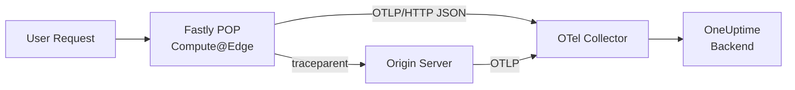

# How to Trace Fastly Compute@Edge with OpenTelemetry

Author: [nawazdhandala](https://www.github.com/nawazdhandala)

Tags: OpenTelemetry, Fastly, Compute@Edge, Tracing, WebAssembly, Edge Computing, Observability

Description: Learn how to implement OpenTelemetry tracing in Fastly Compute@Edge services using Rust and JavaScript for full request visibility at the edge.

---

Fastly Compute@Edge runs your code on Fastly's global edge network using WebAssembly. Your application compiles to a Wasm module and executes in an isolated sandbox at whichever Fastly POP is closest to the requesting user. This gives you sub-millisecond startup times and worldwide distribution, but it also means your code runs in a constrained environment where traditional observability tools do not work out of the box.

OpenTelemetry can still work here. The key is to manually construct spans during request handling and export them via HTTP to a collector before the request completes. This guide covers how to do that in both Rust and JavaScript, the two primary languages supported by Compute@Edge.

## How Compute@Edge Differs from Other Edge Platforms

Compute@Edge has specific constraints that affect how you approach instrumentation:

- Code compiles to WebAssembly (no native library linking)
- Each request gets its own isolated execution context
- No persistent state between requests
- All external communication happens through Fastly backend definitions
- Execution time is limited (typically under 50ms for most use cases)

These constraints mean you cannot use the standard OpenTelemetry SDK directly. Instead, you build spans manually using the OpenTelemetry API primitives and export them via HTTP through a declared Fastly backend.

## Setting Up a Fastly Backend for the Collector

Before writing any instrumentation code, you need to declare an OpenTelemetry Collector as a Fastly backend. This is done in your `fastly.toml` configuration:

```toml
# fastly.toml
# Service configuration for Compute@Edge with an OTel collector backend

name = "my-edge-service"
language = "rust"
manifest_version = 3

[local_server]
  [local_server.backends]
    [local_server.backends.otel_collector]
      url = "https://collector.example.com"

[setup]
  [setup.backends]
    [setup.backends.otel_collector]
      address = "collector.example.com"
      port = 443
      ssl_cert_hostname = "collector.example.com"
      use_ssl = true
```

This tells Fastly to allow your Compute@Edge code to make requests to the collector. Without this backend declaration, outbound HTTP calls to the collector would be blocked.

## Rust Implementation: Building Spans Manually

Rust is the most mature language for Compute@Edge development. Here is how to build a tracing layer that constructs OpenTelemetry-compatible spans and exports them via OTLP/HTTP:

```rust
// src/tracing.rs
// Lightweight OpenTelemetry span builder for Fastly Compute@Edge
// Constructs OTLP-compatible JSON payloads without the full SDK

use fastly::http::StatusCode;
use fastly::{Backend, Request, Response};
use serde::Serialize;
use std::time::{SystemTime, UNIX_EPOCH};

// Span representation matching OTLP JSON format
#[derive(Serialize)]
pub struct OtelSpan {
    // W3C trace ID as 32 hex characters
    pub trace_id: String,
    // Span ID as 16 hex characters
    pub span_id: String,
    // Parent span ID (empty string for root spans)
    pub parent_span_id: String,
    // Human-readable span name
    pub name: String,
    // Span kind: 1=Internal, 2=Server, 3=Client
    pub kind: u32,
    // Start time in nanoseconds since epoch
    pub start_time_unix_nano: u64,
    // End time in nanoseconds since epoch
    pub end_time_unix_nano: u64,
    // Key-value attributes
    pub attributes: Vec<OtelAttribute>,
    // Status: 0=Unset, 1=Ok, 2=Error
    pub status: OtelStatus,
}

#[derive(Serialize)]
pub struct OtelAttribute {
    pub key: String,
    pub value: OtelValue,
}

#[derive(Serialize)]
pub struct OtelValue {
    #[serde(rename = "stringValue")]
    pub string_value: Option<String>,
    #[serde(rename = "intValue")]
    pub int_value: Option<i64>,
}

#[derive(Serialize)]
pub struct OtelStatus {
    pub code: u32,
    pub message: String,
}

// Generate a random hex string for trace and span IDs
fn random_hex(len: usize) -> String {
    // Use Fastly's random number generation
    let bytes: Vec<u8> = (0..len / 2)
        .map(|_| fastly::handle::dictionary_open("random")
            .map(|_| rand::random::<u8>())
            .unwrap_or(0))
        .collect();
    bytes.iter().map(|b| format!("{:02x}", b)).collect()
}

fn now_nanos() -> u64 {
    SystemTime::now()
        .duration_since(UNIX_EPOCH)
        .unwrap()
        .as_nanos() as u64
}

// Collect spans during request processing and export them at the end
pub struct SpanCollector {
    trace_id: String,
    spans: Vec<OtelSpan>,
}

impl SpanCollector {
    pub fn new() -> Self {
        SpanCollector {
            trace_id: random_hex(32),
            spans: Vec::new(),
        }
    }

    // Extract trace context from incoming request if present
    pub fn from_request(req: &Request) -> Self {
        if let Some(traceparent) = req.get_header_str("traceparent") {
            // Parse W3C traceparent: version-traceid-parentid-flags
            let parts: Vec<&str> = traceparent.split('-').collect();
            if parts.len() == 4 {
                return SpanCollector {
                    trace_id: parts[1].to_string(),
                    spans: Vec::new(),
                };
            }
        }
        SpanCollector::new()
    }

    // Start a new span and return its ID
    pub fn start_span(&mut self, name: &str, parent_id: &str, kind: u32) -> String {
        let span_id = random_hex(16);
        let span = OtelSpan {
            trace_id: self.trace_id.clone(),
            span_id: span_id.clone(),
            parent_span_id: parent_id.to_string(),
            name: name.to_string(),
            kind,
            start_time_unix_nano: now_nanos(),
            end_time_unix_nano: 0, // Set when span ends
            attributes: Vec::new(),
            status: OtelStatus {
                code: 0,
                message: String::new(),
            },
        };
        self.spans.push(span);
        span_id
    }

    // End a span by setting its end time
    pub fn end_span(&mut self, span_id: &str) {
        if let Some(span) = self.spans.iter_mut().find(|s| s.span_id == *span_id) {
            span.end_time_unix_nano = now_nanos();
        }
    }

    // Add an attribute to a span
    pub fn set_attribute(&mut self, span_id: &str, key: &str, value: &str) {
        if let Some(span) = self.spans.iter_mut().find(|s| s.span_id == *span_id) {
            span.attributes.push(OtelAttribute {
                key: key.to_string(),
                value: OtelValue {
                    string_value: Some(value.to_string()),
                    int_value: None,
                },
            });
        }
    }

    // Export all collected spans to the OTel collector
    pub fn export(&self) -> Result<(), fastly::Error> {
        // Build the OTLP JSON payload
        let payload = serde_json::json!({
            "resourceSpans": [{
                "resource": {
                    "attributes": [
                        {"key": "service.name", "value": {"stringValue": "fastly-edge-service"}},
                        {"key": "cloud.provider", "value": {"stringValue": "fastly"}},
                        {"key": "cloud.platform", "value": {"stringValue": "fastly_compute"}}
                    ]
                },
                "scopeSpans": [{
                    "scope": {"name": "fastly-compute-edge"},
                    "spans": self.spans
                }]
            }]
        });

        // Send to the collector backend declared in fastly.toml
        let collector_req = Request::post("https://collector.example.com/v1/traces")
            .with_header("Content-Type", "application/json")
            .with_body(payload.to_string());

        // Send asynchronously so it does not block the response
        let _resp = collector_req.send("otel_collector")?;
        Ok(())
    }
}
```

This is more code than you would write with a standard SDK, but it gives you full control over the span lifecycle in a WebAssembly environment. The key design decision is collecting all spans in memory during request processing and exporting them in a single HTTP call at the end.

## Using the Span Collector in Your Request Handler

Here is how the SpanCollector integrates into a typical Compute@Edge request handler:

```rust
// src/main.rs
// Main entry point for the Fastly Compute@Edge service

use fastly::{Error, Request, Response};
mod tracing;
use tracing::SpanCollector;

#[fastly::main]
fn main(req: Request) -> Result<Response, Error> {
    // Initialize span collector, extracting trace context from incoming request
    let mut collector = SpanCollector::from_request(&req);

    // Start the root server span
    let root_id = collector.start_span("handle-request", "", 2); // 2 = Server
    collector.set_attribute(&root_id, "http.method", req.get_method_str());
    collector.set_attribute(&root_id, "http.url", &req.get_url_str().to_string());
    collector.set_attribute(&root_id, "fastly.pop", &std::env::var("FASTLY_POP").unwrap_or_default());

    // Route the request
    let response = match req.get_path() {
        "/api/data" => {
            // Trace the backend fetch as a child span
            let fetch_id = collector.start_span("fetch-origin", &root_id, 3); // 3 = Client

            let mut backend_req = Request::get("https://origin.example.com/api/data");
            // Propagate trace context to the origin
            backend_req.set_header(
                "traceparent",
                format!("00-{}-{}-01", collector.trace_id, fetch_id),
            );

            let backend_resp = backend_req.send("origin_backend")?;
            collector.set_attribute(&fetch_id, "http.status_code",
                &backend_resp.get_status().as_u16().to_string());
            collector.end_span(&fetch_id);

            backend_resp
        }
        _ => Response::from_status(404).with_body("Not Found"),
    };

    // Finish the root span with response details
    collector.set_attribute(&root_id, "http.status_code",
        &response.get_status().as_u16().to_string());
    collector.end_span(&root_id);

    // Export all spans to the collector
    if let Err(e) = collector.export() {
        // Log but do not fail the request if export fails
        eprintln!("Failed to export traces: {}", e);
    }

    Ok(response)
}
```

The trace context propagation through the `traceparent` header is important. When the origin server also has OpenTelemetry instrumentation, the spans from both the edge and the origin will be linked in a single distributed trace.

## JavaScript Implementation

If you are using JavaScript for Compute@Edge, the approach is similar but uses the Fastly JS SDK:

```javascript
// src/index.js
// Fastly Compute@Edge service with OpenTelemetry tracing in JavaScript

addEventListener("fetch", (event) => event.respondWith(handleRequest(event)));

async function handleRequest(event) {
  const req = event.request;
  const collector = new SpanCollector(req);

  // Root span for the entire request
  const rootId = collector.startSpan("handle-request", "", 2);
  collector.setAttribute(rootId, "http.method", req.method);
  collector.setAttribute(rootId, "http.url", req.url);

  let response;
  try {
    // Create a child span for origin fetch
    const fetchId = collector.startSpan("origin-fetch", rootId, 3);

    const originResp = await fetch("https://origin.example.com/api", {
      backend: "origin_backend",
      headers: {
        // Propagate trace context
        "traceparent": `00-${collector.traceId}-${fetchId}-01`,
      },
    });

    collector.setAttribute(fetchId, "http.status_code", String(originResp.status));
    collector.endSpan(fetchId);

    response = new Response(originResp.body, {
      status: originResp.status,
      headers: originResp.headers,
    });
  } catch (err) {
    collector.setAttribute(rootId, "error", "true");
    collector.setAttribute(rootId, "error.message", err.message);
    response = new Response("Error", { status: 500 });
  }

  collector.setAttribute(rootId, "http.status_code", String(response.status));
  collector.endSpan(rootId);

  // Export traces (fire and forget to avoid blocking the response)
  await collector.export();

  return response;
}

// Lightweight span collector for Compute@Edge JavaScript
class SpanCollector {
  constructor(req) {
    this.spans = [];
    this.spanCounter = 0;
    // Extract trace ID from incoming traceparent header or generate new one
    const traceparent = req.headers.get("traceparent");
    if (traceparent) {
      const parts = traceparent.split("-");
      this.traceId = parts[1] || this.generateId(32);
    } else {
      this.traceId = this.generateId(32);
    }
  }

  generateId(length) {
    const chars = "0123456789abcdef";
    let result = "";
    for (let i = 0; i < length; i++) {
      result += chars[Math.floor(Math.random() * chars.length)];
    }
    return result;
  }

  startSpan(name, parentId, kind) {
    const spanId = this.generateId(16);
    this.spans.push({
      traceId: this.traceId,
      spanId,
      parentSpanId: parentId || "",
      name,
      kind,
      startTimeUnixNano: String(Date.now() * 1_000_000),
      endTimeUnixNano: "0",
      attributes: [],
      status: { code: 0 },
    });
    return spanId;
  }

  setAttribute(spanId, key, value) {
    const span = this.spans.find((s) => s.spanId === spanId);
    if (span) {
      span.attributes.push({ key, value: { stringValue: value } });
    }
  }

  endSpan(spanId) {
    const span = this.spans.find((s) => s.spanId === spanId);
    if (span) {
      span.endTimeUnixNano = String(Date.now() * 1_000_000);
    }
  }

  async export() {
    const payload = {
      resourceSpans: [{
        resource: {
          attributes: [
            { key: "service.name", value: { stringValue: "fastly-edge-js" } },
            { key: "cloud.provider", value: { stringValue: "fastly" } },
          ],
        },
        scopeSpans: [{
          scope: { name: "fastly-compute-edge-js" },
          spans: this.spans,
        }],
      }],
    };

    try {
      await fetch("https://collector.example.com/v1/traces", {
        method: "POST",
        backend: "otel_collector",
        headers: { "Content-Type": "application/json" },
        body: JSON.stringify(payload),
      });
    } catch (err) {
      console.error("Failed to export traces:", err.message);
    }
  }
}
```

The JavaScript version follows the same pattern: collect spans in memory, build an OTLP-compatible JSON payload, and send it to the collector backend before the response is returned.

## Trace Flow Architecture



## Summary

Tracing Fastly Compute@Edge requires working outside the standard OpenTelemetry SDK because of the WebAssembly execution environment. By manually constructing OTLP-compatible span payloads and exporting them through declared Fastly backends, you get the same distributed tracing capabilities as any other instrumented service. The spans link together through W3C Trace Context propagation, giving you end-to-end visibility from the edge through your origin servers. The overhead is minimal since you collect spans in memory and export once per request, keeping the impact on response latency as low as possible.
