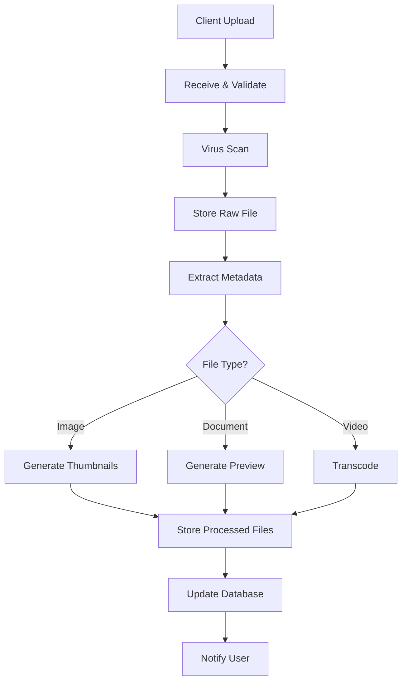

# How to Trace File Upload and Processing Workflows with OpenTelemetry

Author: [nawazdhandala](https://www.github.com/nawazdhandala)

Tags: OpenTelemetry, File Upload, File Processing, Tracing, Observability, Distributed Systems

Description: Learn how to trace file upload and processing workflows with OpenTelemetry for visibility into upload, validation, transformation, and storage stages.

---

File upload and processing workflows are deceptively complex. What looks like a simple "upload a file" feature from the user's perspective often involves receiving multipart form data, validating file types and sizes, scanning for malware, generating thumbnails or previews, extracting metadata, and storing the file across multiple storage tiers. When a user says their upload failed or their file is stuck "processing," you need visibility into every step of that pipeline.

OpenTelemetry lets you trace the complete lifecycle of a file from the moment it hits your server through every processing stage until it is available for download. This guide shows you how to instrument each step of a file upload and processing workflow.

## File Processing Pipeline Overview

A real-world file processing pipeline typically looks something like this:



## Setting Up OpenTelemetry for the Upload Service

Let's start with the tracer and metric setup. Since file processing often involves both synchronous (the upload itself) and asynchronous (background processing) parts, we need to make sure context propagation works across both.

```python
# upload_tracing.py - OpenTelemetry setup for file processing service
from opentelemetry import trace, metrics
from opentelemetry.sdk.trace import TracerProvider
from opentelemetry.sdk.trace.export import BatchSpanProcessor
from opentelemetry.exporter.otlp.proto.grpc.trace_exporter import OTLPSpanExporter
from opentelemetry.sdk.metrics import MeterProvider
from opentelemetry.sdk.metrics.export import PeriodicExportingMetricReader
from opentelemetry.exporter.otlp.proto.grpc.metric_exporter import OTLPMetricExporter
from opentelemetry.sdk.resources import Resource

resource = Resource.create({
    "service.name": "file-processing-service",
    "service.version": "1.5.0",
    "deployment.environment": "production",
})

# Tracing setup
trace_provider = TracerProvider(resource=resource)
trace_provider.add_span_processor(
    BatchSpanProcessor(OTLPSpanExporter(endpoint="grpc://otel-collector:4317"))
)
trace.set_tracer_provider(trace_provider)

# Metrics setup
meter_provider = MeterProvider(
    resource=resource,
    metric_readers=[PeriodicExportingMetricReader(OTLPMetricExporter())],
)
metrics.set_meter_provider(meter_provider)

tracer = trace.get_tracer("file-processing-service", "1.5.0")
meter = metrics.get_meter("file-processing-service", "1.5.0")

# File processing metrics
upload_size = meter.create_histogram(
    "file.upload_size_bytes",
    description="Size of uploaded files",
    unit="bytes",
)

upload_duration = meter.create_histogram(
    "file.upload_duration_ms",
    description="Time to receive and store an uploaded file",
    unit="ms",
)

processing_duration = meter.create_histogram(
    "file.processing_duration_ms",
    description="Time to process an uploaded file",
    unit="ms",
)

files_processed = meter.create_counter(
    "file.processed_total",
    description="Total files processed by outcome",
)
```

## Tracing the Upload Endpoint

The upload endpoint is the entry point for files. This is where you capture the initial file metadata and create the root span that all subsequent processing spans will be children of.

```python
import time
import hashlib
from flask import Flask, request, jsonify

app = Flask(__name__)

@app.route("/api/files/upload", methods=["POST"])
def upload_file():
    with tracer.start_as_current_span("file.upload") as span:
        start_time = time.monotonic()

        # Extract file from the multipart request
        uploaded_file = request.files.get("file")
        if not uploaded_file:
            span.set_attribute("file.upload.status", "no_file")
            return jsonify({"error": "No file provided"}), 400

        # Read the file content
        file_content = uploaded_file.read()
        file_size = len(file_content)

        # Capture file metadata as span attributes
        span.set_attribute("file.name", uploaded_file.filename)
        span.set_attribute("file.size_bytes", file_size)
        span.set_attribute("file.content_type", uploaded_file.content_type or "unknown")
        span.set_attribute("file.upload.user_id", request.headers.get("X-User-Id", "anonymous"))

        # Generate a unique file ID
        file_id = generate_file_id()
        file_hash = hashlib.sha256(file_content).hexdigest()
        span.set_attribute("file.id", file_id)
        span.set_attribute("file.hash_sha256", file_hash)

        # Step 1: Validate the file
        validation_result = validate_file(file_content, uploaded_file.filename, uploaded_file.content_type)
        if not validation_result.valid:
            span.set_attribute("file.upload.status", "validation_failed")
            span.set_attribute("file.upload.rejection_reason", validation_result.reason)
            files_processed.add(1, {
                "file.status": "rejected",
                "file.rejection_reason": validation_result.reason,
            })
            return jsonify({"error": validation_result.reason}), 422

        # Step 2: Virus scan
        scan_result = scan_for_malware(file_content, file_id)
        if not scan_result.clean:
            span.set_attribute("file.upload.status", "malware_detected")
            files_processed.add(1, {"file.status": "malware_blocked"})
            return jsonify({"error": "File failed security scan"}), 422

        # Step 3: Store the raw file
        storage_result = store_raw_file(file_content, file_id, uploaded_file.content_type)

        # Step 4: Queue background processing
        queue_file_processing(file_id, uploaded_file.content_type, file_size)

        duration_ms = (time.monotonic() - start_time) * 1000
        span.set_attribute("file.upload.status", "accepted")
        span.set_attribute("file.upload.duration_ms", duration_ms)

        upload_size.record(file_size, {"file.content_type": uploaded_file.content_type})
        upload_duration.record(duration_ms, {"file.content_type": uploaded_file.content_type})
        files_processed.add(1, {"file.status": "accepted"})

        return jsonify({
            "file_id": file_id,
            "status": "processing",
        }), 202
```

The endpoint returns a 202 Accepted because the actual file processing happens asynchronously. The file ID lets the client poll for processing status. Notice that we record both the file size and duration as histogram metrics, which lets us analyze upload performance distributions over time.

## Tracing File Validation

File validation catches problems early. You want to check file type, size limits, and content integrity before doing any expensive processing.

```python
def validate_file(content, filename, content_type):
    """Validate an uploaded file with detailed tracing."""
    with tracer.start_as_current_span("file.validate") as span:
        span.set_attribute("file.name", filename)
        span.set_attribute("file.claimed_content_type", content_type)

        # Check file size limits
        max_size = get_max_size_for_type(content_type)
        span.set_attribute("file.max_allowed_size", max_size)

        if len(content) > max_size:
            span.set_attribute("file.validation.result", "too_large")
            return ValidationResult(valid=False, reason="File exceeds size limit")

        # Verify actual content type matches claimed type using magic bytes
        detected_type = detect_content_type(content)
        span.set_attribute("file.detected_content_type", detected_type)

        if detected_type != content_type:
            span.add_event("content_type_mismatch", {
                "file.claimed_type": content_type,
                "file.detected_type": detected_type,
            })
            # Some mismatches are harmless, others are suspicious
            if not is_allowed_mismatch(content_type, detected_type):
                span.set_attribute("file.validation.result", "type_mismatch")
                return ValidationResult(valid=False, reason="Content type mismatch")

        # Check for allowed file extensions
        extension = filename.rsplit(".", 1)[-1].lower() if "." in filename else ""
        span.set_attribute("file.extension", extension)

        if extension not in get_allowed_extensions():
            span.set_attribute("file.validation.result", "blocked_extension")
            return ValidationResult(valid=False, reason=f"Extension .{extension} not allowed")

        span.set_attribute("file.validation.result", "passed")
        return ValidationResult(valid=True)
```

The magic bytes check is an important security measure. Users can rename a `.exe` to `.jpg`, but the file's actual content type is determined by its header bytes. Recording both the claimed and detected content types as span attributes helps you identify potential security probing attempts.

## Tracing Malware Scanning

Malware scanning can be slow, especially for large files. Tracing this step helps you understand its impact on overall upload latency.

```python
def scan_for_malware(content, file_id):
    """Scan file content for malware with performance tracking."""
    with tracer.start_as_current_span("file.malware_scan", kind=trace.SpanKind.CLIENT) as span:
        span.set_attribute("file.id", file_id)
        span.set_attribute("file.size_bytes", len(content))
        span.set_attribute("scanner.name", "clamav")

        start_time = time.monotonic()

        try:
            result = antivirus_client.scan_bytes(content)

            duration_ms = (time.monotonic() - start_time) * 1000
            span.set_attribute("scanner.duration_ms", duration_ms)
            span.set_attribute("scanner.result", "clean" if result.clean else "infected")

            if not result.clean:
                span.add_event("malware_detected", {
                    "scanner.threat_name": result.threat_name,
                    "scanner.threat_category": result.threat_category,
                })

            return result

        except Exception as e:
            duration_ms = (time.monotonic() - start_time) * 1000
            span.set_attribute("scanner.duration_ms", duration_ms)
            span.record_exception(e)
            # Fail closed: if scanning fails, reject the file
            span.set_attribute("scanner.result", "error")
            return ScanResult(clean=False, error=str(e))
```

Note the "fail closed" approach: if the scanner itself fails, we treat the file as potentially dangerous. The span makes this behavior visible in traces, so you can distinguish between files that were actually infected and files that were rejected because the scanner was unavailable.

## Tracing Asynchronous File Processing

After the upload is accepted, background workers pick up the file for processing. The key challenge here is propagating the trace context from the upload request to the background worker.

```python
from opentelemetry.context import attach, detach
from opentelemetry.trace.propagation import get_current_span
import json

def queue_file_processing(file_id, content_type, file_size):
    """Queue a file for background processing with trace context."""
    with tracer.start_as_current_span("file.queue_processing") as span:
        span.set_attribute("file.id", file_id)

        # Serialize the current trace context into the message
        carrier = {}
        from opentelemetry.propagators import inject
        inject(carrier)

        message = {
            "file_id": file_id,
            "content_type": content_type,
            "file_size": file_size,
            "trace_context": carrier,  # Propagate trace context through the queue
        }

        queue_client.publish("file-processing", json.dumps(message))
        span.set_attribute("file.queue.topic", "file-processing")


async def process_file_worker(message):
    """Background worker that processes uploaded files."""
    data = json.loads(message.body)
    file_id = data["file_id"]

    # Restore trace context from the message
    from opentelemetry.propagators import extract
    ctx = extract(data.get("trace_context", {}))
    token = attach(ctx)

    try:
        with tracer.start_as_current_span("file.process", context=ctx) as span:
            span.set_attribute("file.id", file_id)
            span.set_attribute("file.content_type", data["content_type"])

            start_time = time.monotonic()

            # Fetch the raw file from storage
            file_content = await storage.get(file_id)

            # Extract metadata
            metadata = await extract_metadata(file_content, file_id, data["content_type"])

            # Process based on file type
            content_type = data["content_type"]
            if content_type.startswith("image/"):
                await process_image(file_content, file_id, metadata)
            elif content_type in ("application/pdf", "application/msword"):
                await process_document(file_content, file_id, metadata)
            elif content_type.startswith("video/"):
                await process_video(file_content, file_id, metadata)
            else:
                span.add_event("no_specialized_processing", {
                    "file.content_type": content_type,
                })

            # Mark file as ready
            await update_file_status(file_id, "ready")

            duration_ms = (time.monotonic() - start_time) * 1000
            span.set_attribute("file.processing.duration_ms", duration_ms)
            span.set_attribute("file.processing.status", "complete")

            processing_duration.record(duration_ms, {
                "file.content_type": content_type,
            })

    finally:
        detach(token)
```

The trace context serialization through the message queue is the critical piece here. Without it, the background processing would start a new trace, and you would lose the connection between the upload request and the processing work. With context propagation, the entire lifecycle shows up as a single trace.

## Tracing Image Processing

Image processing is one of the most common file processing tasks. Generating thumbnails, converting formats, and extracting EXIF data all take time and can fail in interesting ways.

```python
async def process_image(content, file_id, metadata):
    """Process an image file with thumbnail generation and format conversion."""
    with tracer.start_as_current_span("file.process_image") as span:
        span.set_attribute("file.id", file_id)
        span.set_attribute("image.width", metadata.get("width", 0))
        span.set_attribute("image.height", metadata.get("height", 0))
        span.set_attribute("image.format", metadata.get("format", "unknown"))

        # Generate thumbnails at multiple sizes
        thumbnail_sizes = [(150, 150), (300, 300), (600, 600)]

        for width, height in thumbnail_sizes:
            with tracer.start_as_current_span("file.generate_thumbnail") as thumb_span:
                thumb_span.set_attribute("thumbnail.target_width", width)
                thumb_span.set_attribute("thumbnail.target_height", height)

                start = time.monotonic()
                thumbnail = image_processor.resize(content, width, height)
                duration_ms = (time.monotonic() - start) * 1000

                thumb_span.set_attribute("thumbnail.output_size_bytes", len(thumbnail))
                thumb_span.set_attribute("thumbnail.generation_ms", duration_ms)

                # Store the thumbnail
                thumb_key = f"{file_id}/thumb_{width}x{height}"
                await storage.put(thumb_key, thumbnail, content_type="image/webp")
                thumb_span.set_attribute("thumbnail.storage_key", thumb_key)

        span.set_attribute("image.thumbnails_generated", len(thumbnail_sizes))

        # Strip EXIF data for privacy (but log that we did)
        if metadata.get("has_exif"):
            span.add_event("exif_stripped", {
                "image.had_gps": metadata.get("has_gps", False),
                "image.exif_fields_removed": metadata.get("exif_field_count", 0),
            })
```

Each thumbnail generation gets its own span, so you can see exactly how long each size takes. If the 600x600 thumbnail takes 10 times longer than the 150x150 one, that is visible in the trace waterfall. The EXIF stripping event is useful for privacy compliance auditing.

## Tracking File Processing Status

Users need to know when their file is ready. A status tracking system with tracing lets you monitor the complete lifecycle.

```python
async def get_file_status(file_id, user_id):
    """Check file processing status with tracing."""
    with tracer.start_as_current_span("file.get_status") as span:
        span.set_attribute("file.id", file_id)
        span.set_attribute("file.requester_user_id", user_id)

        status = await file_db.get_status(file_id)

        span.set_attribute("file.status", status.state)
        span.set_attribute("file.status.updated_at", status.updated_at.isoformat())

        if status.state == "processing":
            span.set_attribute("file.status.current_step", status.current_step)
            span.set_attribute("file.status.progress_percent", status.progress)

        elif status.state == "failed":
            span.set_attribute("file.status.error", status.error_message)
            span.set_attribute("file.status.failed_step", status.failed_step)

        return status
```

## Key Metrics for File Processing Health

Beyond tracing individual files, track aggregate metrics that tell you about overall system health. The most useful metrics for file processing are upload size distribution (helps with capacity planning), processing time by file type (identifies bottlenecks), failure rate by processing stage (pinpoints problem areas), queue depth for pending files (shows if workers are keeping up), and malware detection rate (tracks security threats over time).

```python
# Queue depth gauge for monitoring worker capacity
processing_queue_depth = meter.create_observable_gauge(
    "file.processing_queue_depth",
    description="Number of files waiting to be processed",
    callbacks=[lambda options: [
        metrics.Observation(queue_client.get_depth("file-processing"))
    ]],
)
```

## Wrapping Up

File upload and processing workflows involve many moving parts, from receiving the initial upload through validation, security scanning, storage, and asynchronous processing. By tracing each stage with OpenTelemetry, you get complete visibility into the lifecycle of every file that flows through your system. When a user reports that their upload is stuck or their file looks wrong, you can pull up the trace by file ID and see exactly what happened at each step. The combination of per-file traces and aggregate processing metrics gives you both the debugging capability and the operational overview you need to keep file processing running reliably.
