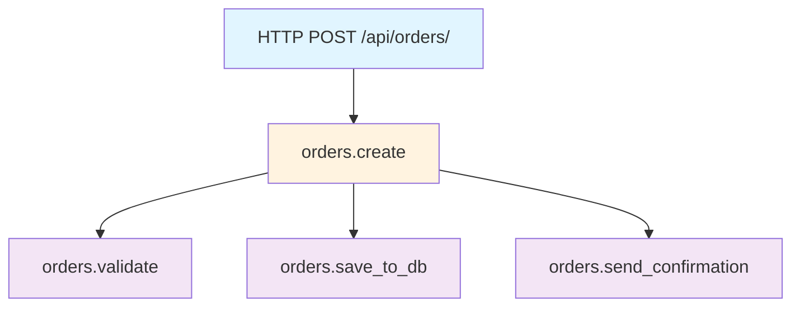

# How to Trace Flask Blueprint Routes with OpenTelemetry Custom Spans

Author: [nawazdhandala](https://www.github.com/nawazdhandala)

Tags: OpenTelemetry, Flask, Blueprints, Custom Spans, Python, Routing

Description: Master custom span creation for Flask Blueprint routes using OpenTelemetry to gain detailed visibility into modular application architectures.

Flask Blueprints provide a way to organize large applications into modular components. Each Blueprint typically represents a logical domain like user management, order processing, or payment handling. While FlaskInstrumentor automatically traces HTTP requests, it doesn't capture the internal structure and business logic within your Blueprints. Custom spans fill this gap, revealing how requests flow through different modules and where time gets spent in your application's architecture.

## Understanding Flask Blueprints and Tracing

Blueprints act as mini-applications within Flask. A typical e-commerce application might have separate Blueprints for products, cart, checkout, and admin functions. Each Blueprint contains routes, templates, and business logic for its domain.

Without custom spans, automatic instrumentation only shows the HTTP request level. You see that `GET /api/products/123` took 200ms, but you don't know if that time was spent in database queries, cache lookups, or external API calls. Custom spans break down the execution into meaningful segments.

## Basic Blueprint Structure with Tracing

Start with a simple Blueprint and add custom spans to trace internal operations.

```python
from flask import Blueprint, jsonify
from opentelemetry import trace

# Create a tracer for this module
tracer = trace.get_tracer(__name__)

# Define a Blueprint for product operations
products_bp = Blueprint('products', __name__, url_prefix='/api/products')

@products_bp.route('/<int:product_id>')
def get_product(product_id):
    """Get a single product by ID"""
    # The HTTP request span is created automatically by FlaskInstrumentor

    # Add a custom span for database lookup
    with tracer.start_as_current_span("products.fetch_from_db") as db_span:
        db_span.set_attribute("product.id", product_id)
        db_span.set_attribute("db.operation", "SELECT")
        product = fetch_product_from_database(product_id)

    # Add a custom span for enrichment
    with tracer.start_as_current_span("products.enrich_data") as enrich_span:
        enrich_span.set_attribute("product.id", product_id)
        enriched_product = enrich_product_data(product)

    return jsonify(enriched_product)

def fetch_product_from_database(product_id):
    """Simulate database fetch"""
    return {
        "id": product_id,
        "name": f"Product {product_id}",
        "price": 29.99
    }

def enrich_product_data(product):
    """Add additional data to product"""
    product["in_stock"] = True
    product["rating"] = 4.5
    return product
```

The resulting trace shows a hierarchy: the HTTP request span contains the database fetch span and enrichment span as children.

## Complete Application with Multiple Blueprints

Here's a full application demonstrating tracing across multiple Blueprints:

```python
from flask import Flask, jsonify
from opentelemetry import trace
from opentelemetry.sdk.trace import TracerProvider
from opentelemetry.sdk.trace.export import BatchSpanProcessor
from opentelemetry.exporter.otlp.proto.grpc.trace_exporter import OTLPSpanExporter
from opentelemetry.instrumentation.flask import FlaskInstrumentor
from opentelemetry.sdk.resources import Resource

# Initialize OpenTelemetry
resource = Resource(attributes={"service.name": "ecommerce-api"})
provider = TracerProvider(resource=resource)
trace.set_tracer_provider(provider)

otlp_exporter = OTLPSpanExporter(endpoint="http://localhost:4317", insecure=True)
provider.add_span_processor(BatchSpanProcessor(otlp_exporter))

# Create Flask app
app = Flask(__name__)

# Create tracers for each module
products_tracer = trace.get_tracer("products.blueprint")
cart_tracer = trace.get_tracer("cart.blueprint")
orders_tracer = trace.get_tracer("orders.blueprint")

# Products Blueprint
products_bp = Blueprint('products', __name__, url_prefix='/api/products')

@products_bp.route('/')
def list_products():
    with products_tracer.start_as_current_span("products.list") as span:
        span.set_attribute("operation.type", "list")

        with products_tracer.start_as_current_span("products.db.query"):
            products = get_all_products()

        with products_tracer.start_as_current_span("products.filter"):
            filtered = filter_available_products(products)

        return jsonify(filtered)

@products_bp.route('/<int:product_id>')
def get_product(product_id):
    with products_tracer.start_as_current_span("products.get") as span:
        span.set_attribute("product.id", product_id)

        with products_tracer.start_as_current_span("products.db.fetch"):
            product = fetch_product(product_id)

        if not product:
            span.set_attribute("product.found", False)
            return jsonify({"error": "Not found"}), 404

        span.set_attribute("product.found", True)
        return jsonify(product)

# Cart Blueprint
cart_bp = Blueprint('cart', __name__, url_prefix='/api/cart')

@cart_bp.route('/<int:user_id>')
def get_cart(user_id):
    with cart_tracer.start_as_current_span("cart.get") as span:
        span.set_attribute("user.id", user_id)

        with cart_tracer.start_as_current_span("cart.fetch_items"):
            cart_items = fetch_cart_items(user_id)

        with cart_tracer.start_as_current_span("cart.calculate_total"):
            total = calculate_cart_total(cart_items)

        return jsonify({"items": cart_items, "total": total})

# Orders Blueprint
orders_bp = Blueprint('orders', __name__, url_prefix='/api/orders')

@orders_bp.route('/', methods=['POST'])
def create_order():
    with orders_tracer.start_as_current_span("orders.create") as span:
        span.set_attribute("operation.type", "create")

        with orders_tracer.start_as_current_span("orders.validate"):
            validation_result = validate_order_data()

        if not validation_result:
            return jsonify({"error": "Invalid order"}), 400

        with orders_tracer.start_as_current_span("orders.save_to_db"):
            order_id = save_order()

        with orders_tracer.start_as_current_span("orders.send_confirmation"):
            send_confirmation_email(order_id)

        span.set_attribute("order.id", order_id)
        return jsonify({"order_id": order_id}), 201

# Register blueprints
app.register_blueprint(products_bp)
app.register_blueprint(cart_bp)
app.register_blueprint(orders_bp)

# Instrument Flask
FlaskInstrumentor().instrument_app(app)

# Stub functions
def get_all_products():
    return [{"id": 1, "name": "Product 1"}, {"id": 2, "name": "Product 2"}]

def filter_available_products(products):
    return [p for p in products if p.get("id") % 2 == 1]

def fetch_product(product_id):
    return {"id": product_id, "name": f"Product {product_id}"}

def fetch_cart_items(user_id):
    return [{"product_id": 1, "quantity": 2}]

def calculate_cart_total(items):
    return sum(item.get("quantity", 0) * 10 for item in items)

def validate_order_data():
    return True

def save_order():
    return 12345

def send_confirmation_email(order_id):
    pass

if __name__ == '__main__':
    app.run(debug=True, port=5000)
```

## Trace Visualization

Here's how the trace hierarchy looks for a request to create an order:



## Tracing Cross-Blueprint Operations

Real applications often have operations that span multiple Blueprints. For example, creating an order might need to interact with cart and inventory Blueprints.

```python
from flask import Blueprint, jsonify, request
from opentelemetry import trace

tracer = trace.get_tracer(__name__)

orders_bp = Blueprint('orders', __name__, url_prefix='/api/orders')
cart_bp = Blueprint('cart', __name__, url_prefix='/api/cart')
inventory_bp = Blueprint('inventory', __name__, url_prefix='/api/inventory')

@orders_bp.route('/', methods=['POST'])
def create_order():
    """Create an order from cart items"""
    user_id = request.json.get('user_id')

    with tracer.start_as_current_span("orders.create") as order_span:
        order_span.set_attribute("user.id", user_id)

        # Fetch cart items (calls into cart blueprint logic)
        with tracer.start_as_current_span("orders.fetch_cart") as cart_span:
            cart_span.set_attribute("user.id", user_id)
            cart_items = get_user_cart(user_id)
            cart_span.set_attribute("cart.item_count", len(cart_items))

        # Check inventory for each item (calls into inventory blueprint logic)
        with tracer.start_as_current_span("orders.check_inventory") as inv_span:
            for item in cart_items:
                with tracer.start_as_current_span("orders.check_item_stock") as item_span:
                    item_span.set_attribute("product.id", item['product_id'])
                    stock = check_stock(item['product_id'])
                    item_span.set_attribute("stock.available", stock)

                    if stock < item['quantity']:
                        order_span.set_attribute("order.status", "insufficient_stock")
                        return jsonify({"error": "Insufficient stock"}), 400

        # Reserve inventory
        with tracer.start_as_current_span("orders.reserve_inventory"):
            reserve_items(cart_items)

        # Create order record
        with tracer.start_as_current_span("orders.save"):
            order_id = save_order_to_db(user_id, cart_items)

        # Clear cart
        with tracer.start_as_current_span("orders.clear_cart"):
            clear_user_cart(user_id)

        order_span.set_attribute("order.id", order_id)
        order_span.set_attribute("order.status", "success")

        return jsonify({"order_id": order_id}), 201

# Cart blueprint helper functions
def get_user_cart(user_id):
    """Get cart items for a user"""
    return [
        {"product_id": 1, "quantity": 2},
        {"product_id": 2, "quantity": 1}
    ]

def clear_user_cart(user_id):
    """Clear user's cart after order creation"""
    pass

# Inventory blueprint helper functions
def check_stock(product_id):
    """Check available stock for a product"""
    return 10

def reserve_items(items):
    """Reserve inventory for items"""
    pass

# Order blueprint helper functions
def save_order_to_db(user_id, items):
    """Save order to database"""
    return 98765
```

This creates a detailed trace showing the order creation flow through multiple domain boundaries.

## Adding Contextual Attributes

Enrich spans with attributes that help you understand application behavior and debug issues.

```python
from flask import Blueprint, jsonify, request
from opentelemetry import trace
from opentelemetry.trace import Status, StatusCode

tracer = trace.get_tracer(__name__)

products_bp = Blueprint('products', __name__, url_prefix='/api/products')

@products_bp.route('/search')
def search_products():
    """Search products with detailed tracing"""
    query = request.args.get('q', '')
    category = request.args.get('category', 'all')
    page = int(request.args.get('page', 1))

    with tracer.start_as_current_span("products.search") as search_span:
        # Add search parameters as attributes
        search_span.set_attribute("search.query", query)
        search_span.set_attribute("search.category", category)
        search_span.set_attribute("search.page", page)

        # Database query span
        with tracer.start_as_current_span("products.db.search") as db_span:
            db_span.set_attribute("db.system", "postgresql")
            db_span.set_attribute("db.operation", "SELECT")

            results = search_database(query, category, page)

            db_span.set_attribute("db.result_count", len(results))
            db_span.set_attribute("db.query_time_ms", 45)

        # If no results, add that information
        if not results:
            search_span.set_attribute("search.results_found", False)
            return jsonify([])

        search_span.set_attribute("search.results_found", True)
        search_span.set_attribute("search.result_count", len(results))

        # Apply filters
        with tracer.start_as_current_span("products.filter_results") as filter_span:
            min_price = request.args.get('min_price')
            if min_price:
                filter_span.set_attribute("filter.min_price", float(min_price))
                results = [r for r in results if r['price'] >= float(min_price)]

            filter_span.set_attribute("filter.result_count", len(results))

        # Sort results
        with tracer.start_as_current_span("products.sort_results") as sort_span:
            sort_by = request.args.get('sort', 'relevance')
            sort_span.set_attribute("sort.field", sort_by)
            results = sort_results(results, sort_by)

        return jsonify(results)

def search_database(query, category, page):
    """Simulate database search"""
    return [
        {"id": 1, "name": "Product 1", "price": 29.99},
        {"id": 2, "name": "Product 2", "price": 49.99}
    ]

def sort_results(results, sort_by):
    """Sort results by specified field"""
    if sort_by == 'price':
        return sorted(results, key=lambda x: x['price'])
    return results
```

## Error Handling with Spans

Properly recording errors in spans helps with debugging and alerting.

```python
from flask import Blueprint, jsonify
from opentelemetry import trace
from opentelemetry.trace import Status, StatusCode

tracer = trace.get_tracer(__name__)

payments_bp = Blueprint('payments', __name__, url_prefix='/api/payments')

@payments_bp.route('/charge', methods=['POST'])
def process_payment():
    """Process a payment with error tracking"""

    with tracer.start_as_current_span("payments.process") as payment_span:
        payment_span.set_attribute("payment.method", "credit_card")

        try:
            # Validate payment data
            with tracer.start_as_current_span("payments.validate") as validate_span:
                validate_span.set_attribute("validation.step", "card_details")
                validate_payment_data()

            # Call payment gateway
            with tracer.start_as_current_span("payments.gateway.charge") as gateway_span:
                gateway_span.set_attribute("gateway.provider", "stripe")
                result = charge_payment_gateway()
                gateway_span.set_attribute("gateway.transaction_id", result['id'])

            # Record transaction
            with tracer.start_as_current_span("payments.record_transaction"):
                record_transaction(result)

            payment_span.set_attribute("payment.status", "success")
            return jsonify(result), 200

        except ValueError as e:
            # Validation error
            payment_span.record_exception(e)
            payment_span.set_status(Status(StatusCode.ERROR, "Validation failed"))
            payment_span.set_attribute("payment.status", "validation_error")
            payment_span.set_attribute("error.type", "ValueError")
            return jsonify({"error": str(e)}), 400

        except PaymentGatewayError as e:
            # Gateway error
            payment_span.record_exception(e)
            payment_span.set_status(Status(StatusCode.ERROR, "Gateway error"))
            payment_span.set_attribute("payment.status", "gateway_error")
            payment_span.set_attribute("error.type", "PaymentGatewayError")
            return jsonify({"error": "Payment processing failed"}), 502

        except Exception as e:
            # Unexpected error
            payment_span.record_exception(e)
            payment_span.set_status(Status(StatusCode.ERROR, str(e)))
            payment_span.set_attribute("payment.status", "error")
            return jsonify({"error": "Internal error"}), 500

class PaymentGatewayError(Exception):
    pass

def validate_payment_data():
    """Validate payment data"""
    import random
    if random.random() < 0.1:
        raise ValueError("Invalid card number")

def charge_payment_gateway():
    """Call external payment gateway"""
    import random
    if random.random() < 0.05:
        raise PaymentGatewayError("Gateway timeout")
    return {"id": "txn_123456", "status": "success"}

def record_transaction(result):
    """Record transaction in database"""
    pass
```

## Blueprint-Specific Before and After Request Hooks

Flask Blueprints support before_request and after_request decorators. Use these to add automatic span creation for all routes in a Blueprint.

```python
from flask import Blueprint, jsonify, g
from opentelemetry import trace
import time

tracer = trace.get_tracer(__name__)

admin_bp = Blueprint('admin', __name__, url_prefix='/admin')

@admin_bp.before_request
def before_admin_request():
    """Start a span before any admin route handler"""
    span = tracer.start_span("admin.request")
    span.set_attribute("blueprint.name", "admin")
    g.admin_span = span
    g.request_start_time = time.time()

@admin_bp.after_request
def after_admin_request(response):
    """End the span after admin route completes"""
    if hasattr(g, 'admin_span'):
        duration = time.time() - g.request_start_time
        g.admin_span.set_attribute("request.duration_ms", duration * 1000)
        g.admin_span.set_attribute("response.status_code", response.status_code)
        g.admin_span.end()
    return response

@admin_bp.route('/users')
def list_users():
    # Admin span is automatically created
    with tracer.start_as_current_span("admin.list_users"):
        users = get_all_users()
        return jsonify(users)

@admin_bp.route('/settings')
def get_settings():
    # Admin span is automatically created
    with tracer.start_as_current_span("admin.get_settings"):
        settings = fetch_settings()
        return jsonify(settings)

def get_all_users():
    return [{"id": 1, "name": "User 1"}]

def fetch_settings():
    return {"theme": "dark", "notifications": True}
```

## Testing Blueprint Traces

Verify your custom spans are created correctly with tests.

```python
from flask import Flask, Blueprint
from opentelemetry import trace
from opentelemetry.sdk.trace import TracerProvider
from opentelemetry.sdk.trace.export import SimpleSpanProcessor
from opentelemetry.sdk.trace.export.in_memory_span_exporter import InMemorySpanExporter
from opentelemetry.instrumentation.flask import FlaskInstrumentor
import unittest

# Set up in-memory exporter
exporter = InMemorySpanExporter()
provider = TracerProvider()
provider.add_span_processor(SimpleSpanProcessor(exporter))
trace.set_tracer_provider(provider)

tracer = trace.get_tracer(__name__)

# Create blueprint
products_bp = Blueprint('products', __name__, url_prefix='/api/products')

@products_bp.route('/<int:product_id>')
def get_product(product_id):
    with tracer.start_as_current_span("products.fetch") as span:
        span.set_attribute("product.id", product_id)
        product = {"id": product_id, "name": f"Product {product_id}"}

    with tracer.start_as_current_span("products.enrich"):
        product["enriched"] = True

    return product

# Create app and register blueprint
app = Flask(__name__)
app.register_blueprint(products_bp)
FlaskInstrumentor().instrument_app(app)

class TestBlueprintTracing(unittest.TestCase):
    def setUp(self):
        self.client = app.test_client()
        exporter.clear()

    def test_custom_spans_created(self):
        """Test that custom spans are created for blueprint routes"""
        response = self.client.get('/api/products/123')
        self.assertEqual(response.status_code, 200)

        spans = exporter.get_finished_spans()

        # Should have HTTP span + two custom spans
        self.assertEqual(len(spans), 3)

        # Check span names
        span_names = [span.name for span in spans]
        self.assertIn("products.fetch", span_names)
        self.assertIn("products.enrich", span_names)

        # Check attributes
        fetch_span = next(s for s in spans if s.name == "products.fetch")
        self.assertEqual(fetch_span.attributes.get("product.id"), 123)

if __name__ == '__main__':
    unittest.main()
```

Custom spans transform automatic instrumentation from basic HTTP metrics into detailed application insights. By strategically adding spans around business logic, database calls, and external integrations within your Flask Blueprints, you create traces that reveal not just what requests occurred, but how your application processed them. This visibility becomes invaluable when debugging production issues, optimizing performance, and understanding complex application behavior.
