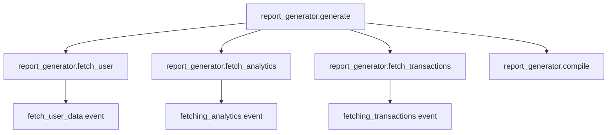

# How to Trace GenServer and Task Processes with OpenTelemetry in Elixir

Author: [nawazdhandala](https://www.github.com/nawazdhandala)

Tags: OpenTelemetry, Elixir, GenServer, Task, OTP, Tracing

Description: Learn how to instrument GenServer callbacks and Task processes with OpenTelemetry to gain visibility into your concurrent Elixir applications.

GenServers and Tasks are the workhorses of concurrent Elixir applications. GenServers manage state and handle synchronous and asynchronous calls, while Tasks provide a simple abstraction for executing work concurrently. When these processes interact in complex systems, understanding their behavior and performance becomes critical. OpenTelemetry provides the observability layer needed to trace these interactions.

## Why Trace OTP Processes

Elixir applications typically spawn hundreds or thousands of processes that communicate through message passing. Without proper instrumentation, debugging performance issues or understanding message flow becomes nearly impossible. Traditional logging misses the context of how processes interact, when they block, and where time is spent waiting for responses.

OpenTelemetry's distributed tracing captures the full lifecycle of GenServer calls and Task execution, including parent-child relationships between processes. This visibility helps identify bottlenecks, understand supervision tree behavior, and optimize concurrent workflows.

## Setting Up OpenTelemetry in Your Elixir Project

First, add the required dependencies to your `mix.exs` file:

```elixir
defp deps do
  [
    {:opentelemetry, "~> 1.3"},
    {:opentelemetry_api, "~> 1.2"},
    {:opentelemetry_exporter, "~> 1.6"},
    {:opentelemetry_telemetry, "~> 1.0"}
  ]
end
```

Configure the OpenTelemetry exporter in your `config/config.exs`:

```elixir
# Configure OTLP exporter to send traces to your backend
config :opentelemetry, :resource,
  service: [
    name: "my_elixir_app",
    namespace: "production"
  ]

config :opentelemetry_exporter,
  otlp_protocol: :http_protobuf,
  otlp_endpoint: "http://localhost:4318"
```

Initialize OpenTelemetry in your application supervision tree:

```elixir
defmodule MyApp.Application do
  use Application

  def start(_type, _args) do
    # Configure the tracer for your application
    OpentelemetryTelemetry.register_application_tracer(:my_app)

    children = [
      # Your other supervisors and workers
    ]

    opts = [strategy: :one_for_one, name: MyApp.Supervisor]
    Supervisor.start_link(children, opts)
  end
end
```

## Tracing GenServer Callbacks

GenServers have well-defined lifecycle callbacks that make excellent span boundaries. Here's how to instrument a typical GenServer:

```elixir
defmodule MyApp.UserCache do
  use GenServer
  require OpenTelemetry.Tracer, as: Tracer

  # Client API with tracing
  def start_link(opts) do
    GenServer.start_link(__MODULE__, opts, name: __MODULE__)
  end

  def get_user(user_id) do
    # Start a span for the synchronous call
    Tracer.with_span "user_cache.get_user" do
      Tracer.set_attributes([
        {"user_id", user_id},
        {"call_type", "sync"}
      ])

      GenServer.call(__MODULE__, {:get_user, user_id})
    end
  end

  def refresh_user(user_id) do
    # Async calls should also be traced
    Tracer.with_span "user_cache.refresh_user" do
      Tracer.set_attributes([
        {"user_id", user_id},
        {"call_type", "async"}
      ])

      GenServer.cast(__MODULE__, {:refresh, user_id})
    end
  end

  # Server callbacks with tracing
  @impl true
  def init(opts) do
    Tracer.with_span "user_cache.init" do
      initial_state = %{users: %{}, ttl: opts[:ttl] || 3600}
      {:ok, initial_state}
    end
  end

  @impl true
  def handle_call({:get_user, user_id}, _from, state) do
    # Trace the actual work being done inside the callback
    Tracer.with_span "user_cache.handle_call.get_user" do
      Tracer.set_attributes([
        {"user_id", user_id},
        {"cache_size", map_size(state.users)}
      ])

      case Map.get(state.users, user_id) do
        nil ->
          Tracer.add_event("cache_miss", %{user_id: user_id})
          user = fetch_user_from_db(user_id)
          new_state = put_in(state.users[user_id], user)
          {:reply, user, new_state}

        user ->
          Tracer.add_event("cache_hit", %{user_id: user_id})
          {:reply, user, state}
      end
    end
  end

  @impl true
  def handle_cast({:refresh, user_id}, state) do
    Tracer.with_span "user_cache.handle_cast.refresh" do
      Tracer.set_attributes([{"user_id", user_id}])

      user = fetch_user_from_db(user_id)
      new_state = put_in(state.users[user_id], user)
      {:noreply, new_state}
    end
  end

  defp fetch_user_from_db(user_id) do
    # This would be traced separately if using Ecto with OpenTelemetry
    Tracer.with_span "user_cache.fetch_from_db" do
      Tracer.set_attributes([{"user_id", user_id}])
      # Simulate database fetch
      Process.sleep(10)
      %{id: user_id, name: "User #{user_id}"}
    end
  end
end
```

This instrumentation captures several important aspects:

- The client API calls show when code requests data from the GenServer
- Server callbacks show the actual processing time inside the GenServer
- Cache hit/miss events provide insight into cache effectiveness
- Attributes like cache size help correlate performance with state growth

## Tracing Task Processes

Tasks are commonly used for concurrent operations and background work. Tracing them requires capturing the context from the parent process and propagating it to the Task:

```elixir
defmodule MyApp.DataProcessor do
  require OpenTelemetry.Tracer, as: Tracer
  alias OpenTelemetry.Ctx

  def process_batch(items) do
    Tracer.with_span "data_processor.process_batch" do
      Tracer.set_attributes([{"batch_size", length(items)}])

      # Process items concurrently with Tasks
      items
      |> Enum.map(&spawn_processing_task/1)
      |> Enum.map(&Task.await(&1, 30_000))
    end
  end

  defp spawn_processing_task(item) do
    # Capture the current trace context before spawning the Task
    parent_ctx = Ctx.get_current()

    Task.async(fn ->
      # Attach the parent context in the new process
      Ctx.attach(parent_ctx)

      # Create a child span for this Task's work
      Tracer.with_span "data_processor.process_item" do
        Tracer.set_attributes([
          {"item_id", item.id},
          {"item_type", item.type}
        ])

        process_item(item)
      end
    end)
  end

  defp process_item(item) do
    Tracer.with_span "data_processor.transform" do
      transformed = transform_data(item)

      Tracer.with_span "data_processor.validate" do
        case validate_data(transformed) do
          :ok ->
            Tracer.set_status(:ok)
            transformed

          {:error, reason} ->
            Tracer.set_status(:error, inspect(reason))
            Tracer.record_exception(reason)
            raise "Validation failed: #{inspect(reason)}"
        end
      end
    end
  end

  defp transform_data(item) do
    # Transformation logic
    Map.update!(item, :value, &(&1 * 2))
  end

  defp validate_data(item) do
    if item.value > 0, do: :ok, else: {:error, :invalid_value}
  end
end
```

The key to Task tracing is context propagation. The parent context must be captured before spawning the Task and attached inside the Task's function. Without this, the Task's spans would be orphaned and not connected to the parent operation.

## Tracing Supervised Task Workflows

For more complex scenarios using `Task.Supervisor`, you need to handle context propagation carefully:

```elixir
defmodule MyApp.ReportGenerator do
  require OpenTelemetry.Tracer, as: Tracer
  alias OpenTelemetry.Ctx

  def generate_report(user_id, report_type) do
    Tracer.with_span "report_generator.generate" do
      Tracer.set_attributes([
        {"user_id", user_id},
        {"report_type", report_type}
      ])

      # Start multiple supervised tasks for parallel data fetching
      parent_ctx = Ctx.get_current()

      tasks = [
        start_supervised_task(parent_ctx, fn -> fetch_user_data(user_id) end, "fetch_user"),
        start_supervised_task(parent_ctx, fn -> fetch_analytics(user_id) end, "fetch_analytics"),
        start_supervised_task(parent_ctx, fn -> fetch_transactions(user_id) end, "fetch_transactions")
      ]

      # Wait for all tasks and combine results
      [user_data, analytics, transactions] =
        Enum.map(tasks, &Task.await(&1, 10_000))

      Tracer.with_span "report_generator.compile" do
        compile_report(user_data, analytics, transactions)
      end
    end
  end

  defp start_supervised_task(parent_ctx, fun, span_name) do
    Task.Supervisor.async(MyApp.TaskSupervisor, fn ->
      Ctx.attach(parent_ctx)

      Tracer.with_span "report_generator.#{span_name}" do
        fun.()
      end
    end)
  end

  defp fetch_user_data(user_id) do
    Tracer.add_event("fetching_user_data", %{user_id: user_id})
    Process.sleep(50)
    %{id: user_id, name: "User #{user_id}"}
  end

  defp fetch_analytics(user_id) do
    Tracer.add_event("fetching_analytics", %{user_id: user_id})
    Process.sleep(100)
    %{page_views: 1000, sessions: 50}
  end

  defp fetch_transactions(user_id) do
    Tracer.add_event("fetching_transactions", %{user_id: user_id})
    Process.sleep(75)
    [%{amount: 100}, %{amount: 200}]
  end

  defp compile_report(user_data, analytics, transactions) do
    Tracer.set_attributes([
      {"transaction_count", length(transactions)},
      {"total_page_views", analytics.page_views}
    ])

    %{
      user: user_data,
      analytics: analytics,
      transactions: transactions,
      generated_at: DateTime.utc_now()
    }
  end
end
```

## Visualizing Process Relationships

The trace hierarchy for the report generation would look like this:



This structure makes it easy to see which tasks ran in parallel and how long each took, helping identify opportunities for optimization.

## Handling Errors and Timeouts

Proper error tracking in traces helps diagnose issues quickly:

```elixir
defmodule MyApp.ExternalService do
  require OpenTelemetry.Tracer, as: Tracer

  def call_api(endpoint, params) do
    Tracer.with_span "external_service.call_api" do
      Tracer.set_attributes([
        {"endpoint", endpoint},
        {"method", "POST"}
      ])

      try do
        response = make_http_request(endpoint, params)

        Tracer.set_attributes([
          {"http.status_code", response.status},
          {"http.response_size", byte_size(response.body)}
        ])

        if response.status >= 400 do
          Tracer.set_status(:error, "HTTP #{response.status}")
        else
          Tracer.set_status(:ok)
        end

        response
      rescue
        error ->
          Tracer.set_status(:error, Exception.message(error))
          Tracer.record_exception(error, __STACKTRACE__)
          reraise error, __STACKTRACE__
      end
    end
  end

  defp make_http_request(_endpoint, _params) do
    # Simulate API call
    Process.sleep(100)
    %{status: 200, body: ~s({"result": "success"})}
  end
end
```

## Best Practices for GenServer and Task Tracing

Keep these guidelines in mind when instrumenting your processes:

**Span Granularity**: Create spans for meaningful units of work. Every GenServer callback should have a span, but not every internal function call needs one.

**Context Propagation**: Always capture and attach context when crossing process boundaries. This is non-negotiable for Tasks, GenServers called from other processes, and any async operations.

**Attribute Selection**: Include attributes that help filter and aggregate traces. User IDs, resource identifiers, and operation types are usually valuable. Avoid high-cardinality attributes like timestamps or random tokens.

**Event Usage**: Use events for significant occurrences within a span, like cache hits/misses, retry attempts, or state transitions. Events are lighter weight than creating new spans.

**Error Handling**: Always record exceptions and set error status on spans. This makes it easy to filter for failed operations in your observability backend.

## Performance Considerations

OpenTelemetry instrumentation adds overhead to your application. For high-throughput GenServers processing thousands of messages per second, consider sampling:

```elixir
defmodule MyApp.HighThroughputWorker do
  require OpenTelemetry.Tracer, as: Tracer

  @sample_rate 0.1  # Trace 10% of operations

  def handle_call({:process, data}, _from, state) do
    if should_trace?() do
      Tracer.with_span "worker.process" do
        do_process(data, state)
      end
    else
      do_process(data, state)
    end
  end

  defp should_trace? do
    :rand.uniform() < @sample_rate
  end

  defp do_process(data, state) do
    # Actual processing logic
    {:reply, :ok, state}
  end
end
```

Sampling trades complete visibility for acceptable performance. Choose sample rates based on your traffic volume and observability requirements.

## Monitoring the Full Process Lifecycle

For critical GenServers, you might want to trace the entire lifecycle including initialization and termination:

```elixir
defmodule MyApp.CriticalService do
  use GenServer
  require OpenTelemetry.Tracer, as: Tracer

  @impl true
  def init(opts) do
    Tracer.with_span "critical_service.init" do
      Tracer.set_attributes([{"opts", inspect(opts)}])

      case setup_resources(opts) do
        {:ok, state} ->
          Tracer.set_status(:ok)
          {:ok, state}

        {:error, reason} ->
          Tracer.set_status(:error, inspect(reason))
          {:stop, reason}
      end
    end
  end

  @impl true
  def terminate(reason, state) do
    Tracer.with_span "critical_service.terminate" do
      Tracer.set_attributes([
        {"reason", inspect(reason)},
        {"state", inspect(state)}
      ])

      cleanup_resources(state)
      :ok
    end
  end

  defp setup_resources(_opts), do: {:ok, %{}}
  defp cleanup_resources(_state), do: :ok
end
```

Tracing GenServers and Tasks gives you the observability needed to understand and optimize concurrent Elixir applications. The combination of OpenTelemetry's distributed tracing and the BEAM's process model provides unprecedented insight into how your application behaves under load, where bottlenecks exist, and how to improve performance.
